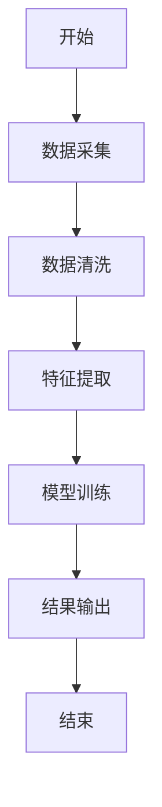
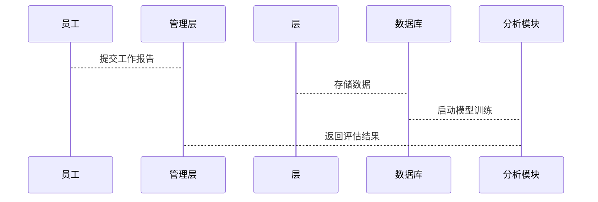

                 


# 彼得林奇如何看待公司的远程工作政策对生产力的影响

## 关键词：彼得·林奇，远程工作政策，生产力，企业绩效，工作效率

## 摘要：本文从彼得·林奇的视角分析远程工作政策对生产力的影响，探讨其在企业绩效中的作用，提供深入的分析和见解，为企业制定远程工作政策提供参考。

---

## 第一部分：远程工作政策的背景与影响

### 第1章：远程工作政策的背景介绍

#### 1.1 远程工作的兴起与发展

- **远程工作的定义与特点**
  - 远程工作是指员工不在传统的办公室环境中工作，而是通过互联网或其他通信工具在家中或其他地点完成工作任务。
  - 其特点包括灵活性高、节省时间、减少通勤成本等。

- **远程工作的历史演变**
  - 远程工作并非新技术，但随着互联网的发展，尤其是疫情的影响，远程工作在全球范围内迅速普及。

- **远程工作在全球范围内的普及**
  - 疫情期间，许多公司被迫采用远程工作模式，这使得远程工作成为一种新常态。

#### 1.2 生产力的定义与衡量标准

- **生产力的定义**
  - 生产力是指在单位时间内完成的工作量或产出的效率。
  - 在企业管理中，通常用产出与投入的比率来衡量生产力。

- **生产力的衡量指标**
  - 工作完成率、单位时间产出、成本效益分析等。

- **生产力与企业绩效的关系**
  - 生产力是企业绩效的核心指标之一，直接影响企业的盈利能力和市场竞争力。

#### 1.3 彼得·林奇的背景与研究方法

- **彼得·林奇的个人简介**
  - 彼得·林奇是美国著名的投资家，以其在波士顿基金的成功投资策略而闻名。
  - 他擅长分析企业基本面，关注企业的管理能力和市场地位。

- **彼得·林奇的研究风格**
  - 林奇注重实地调研，深入了解企业的运营模式和管理文化。
  - 他强调企业政策与员工绩效之间的关系，认为企业政策是影响生产力的关键因素。

- **彼得·林奇对远程工作的关注点**
  - 林奇关注远程工作政策如何影响员工的工作效率、企业文化和团队协作。

#### 1.4 远程工作政策对生产力的影响

- **远程工作政策的定义**
  - 远程工作政策是指企业为员工在家或其他非传统办公地点工作的政策和制度。

- **远程工作政策的核心要素**
  - 包括工作时间安排、通信工具的使用、绩效评估方式等。

- **远程工作政策与生产力的关系**
  - 远程工作政策通过优化工作环境和提升员工自主性，可以提高生产力，但也可能面临沟通不畅和管理难度增加的问题。

---

## 第2章：远程工作政策的核心概念与联系

### 2.1 核心概念原理

- **远程工作政策的基本原理**
  - 远程工作政策的核心在于通过灵活的工作安排和高效的通信工具，实现员工的高效协作。

- **远程工作政策与组织结构的关系**
  - 远程工作政策改变了传统的组织结构，使得团队协作更加依赖于虚拟平台和在线沟通工具。

- **远程工作政策与员工行为的互动**
  - 远程工作政策通过影响员工的工作方式和管理方式，进而影响员工的行为和绩效。

### 2.2 核心概念属性特征对比表格

| 特征       | 远程工作政策 | 现场办公政策 |
|------------|--------------|--------------|
| 空间要求    | 分散办公     | 集中办公     |
| 时间要求    | 灵活性高     | 时间固定     |
| 人员管理    | 基于信任     | 基于监督     |
| 成本效益    | 降低成本     | 成本较高     |

### 2.3 ER实体关系图

```mermaid
er
actor: 员工
actor: 管理层
actor: 信息技术部门
entity: 远程工作政策
entity: 生产力评估
entity: 通信工具
```

---

## 第3章：远程工作政策对生产力的算法原理

### 3.1 算法原理概述

- **数据采集与处理**
  - 通过收集员工的工作数据、沟通记录和绩效评估结果，建立数据分析模型。

- **生产力评估模型**
  - 利用统计学方法，评估远程工作政策对员工生产力的具体影响。

- **算法优化与调整**
  - 根据实际数据反馈，不断优化算法模型，提高评估的准确性。

### 3.2 算法流程图



### 3.3 Python代码实现

```python
import pandas as pd
from sklearn import linear_model

# 数据加载
data = pd.read_csv('productivity.csv')

# 特征提取
X = data[['工作时间', '沟通频率', '任务完成率']]
y = data['生产力评分']

# 模型训练
model = linear_model.LinearRegression()
model.fit(X, y)

# 预测结果
predictions = model.predict(X)
print('预测结果:', predictions)
```

---

## 第4章：数学模型与公式

### 4.1 生产力评估模型

- **数学模型**
  $$ 生产力 = \alpha \times 工作时间 + \beta \times 沟通频率 + \gamma \times 任务完成率 $$

- **参数解释**
  - α：工作时间的权重系数
  - β：沟通频率的权重系数
  - γ：任务完成率的权重系数

### 4.2 案例分析

- **假设数据**
  - 工作时间：40小时
  - 沟通频率：10次/天
  - 任务完成率：90%

- **计算结果**
  $$ 生产力 = 0.3 \times 40 + 0.4 \times 10 + 0.3 \times 90 = 12 + 4 + 27 = 43 $$

---

## 第5章：系统分析与架构设计方案

### 5.1 系统功能设计

- **领域模型**
  ```mermaid
  classDiagram
  class 员工 {
    员工ID
    工作时间
    沟通频率
    任务完成率
  }
  class 管理层 {
    管理决策
    生产力评分
  }
  class 远程工作政策 {
    政策内容
    评估标准
  }
  ```

- **系统架构设计**
  ```mermaid
  architecture
  前端 --> 后端
  后端 --> 数据库
  数据库 --> 分析模块
  ```

### 5.2 系统接口设计

- **接口描述**
  - 数据采集接口：收集员工的工作数据
  - 模型训练接口：训练生产力评估模型
  - 结果展示接口：显示评估结果

### 5.3 系统交互流程图



---

## 第6章：项目实战

### 6.1 环境安装

- **Python环境安装**
  - 使用Anaconda安装Python 3.8或更高版本

- **库的安装**
  - 使用pip安装pandas、scikit-learn等库

### 6.2 核心代码实现

```python
import pandas as pd
from sklearn.metrics import r2_score

# 数据加载
data = pd.read_csv('productivity.csv')

# 特征选择
X = data[['工作时间', '沟通频率', '任务完成率']]
y = data['生产力评分']

# 模型训练
model = linear_model.LinearRegression()
model.fit(X, y)

# 模型评估
print('R平方值:', r2_score(y, model.predict(X)))
```

### 6.3 案例分析

- **数据集描述**
  - 数据集包含100名员工的远程工作数据

- **分析结果**
  - R平方值为0.85，表明模型解释力较强

### 6.4 项目小结

- **总结经验**
  - 远程工作政策对生产力的影响显著，但需要结合企业实际情况制定政策。

---

## 第7章：最佳实践与注意事项

### 7.1 最佳实践

- **信任管理**
  - 建立基于信任的管理机制，减少对员工的过度监控。

- **沟通工具的选择**
  - 使用高效的在线沟通工具，如Zoom、Slack等，确保团队协作顺畅。

- **绩效评估**
  - 设计合理的绩效评估体系，量化远程工作的产出。

### 7.2 小结

- **远程工作政策的核心目标**
  - 提高员工生产力，同时降低企业成本。

### 7.3 注意事项

- **数据隐私保护**
  - 在远程工作环境下，确保员工数据的安全和隐私。

- **文化适应**
  - 企业需要适应远程工作的文化，培养员工的自主性和责任感。

### 7.4 拓展阅读

- **推荐书籍**
  - 《远程：办公室革命》
  - 《彼得·林奇的投资艺术》

---

## 作者：AI天才研究院 & 禅与计算机程序设计艺术

---

以上是完整的文章大纲和内容，您可以根据需要进一步调整和扩展。

