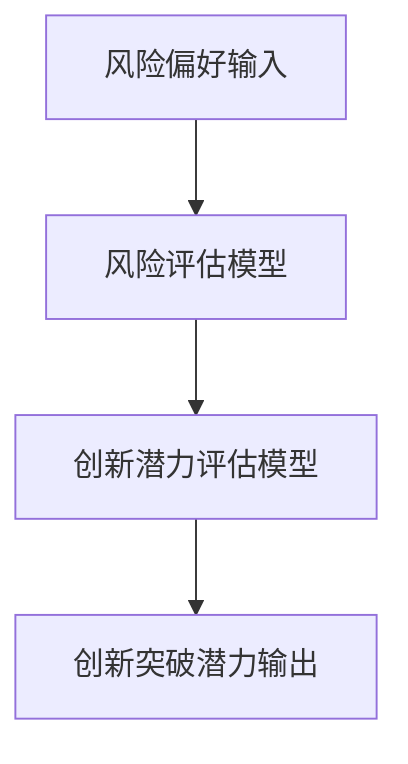
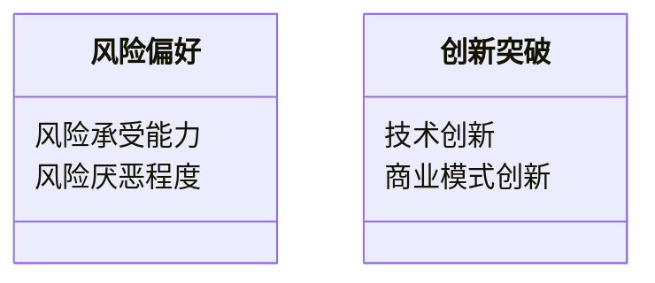

                 


# 彼得林奇如何看待公司的风险偏好与创新突破的相关性

## 关键词：
- 彼得·林奇
- 风险偏好
- 创新突破
- 企业战略
- 投资策略

## 摘要：
本文深入探讨了彼得·林奇对公司在风险偏好与创新突破之间关系的见解。通过分析风险偏好与创新突破的核心概念、属性特征以及它们之间的关系，结合具体的算法模型和系统设计，从理论到实践，全面阐述了如何在企业战略和投资决策中平衡风险与创新。

---

# 第一部分: 风险偏好与创新突破的背景与概念

## 第1章: 风险偏好与创新突破的背景介绍

### 1.1 风险偏好的定义与特征

#### 1.1.1 风险偏好的定义
风险偏好是指公司在面对不确定性时所采取的态度和策略。它反映了公司对风险的容忍度、厌恶程度或寻求程度，通常与公司的战略目标、市场环境和管理层决策相关。

#### 1.1.2 风险偏好的核心特征
- **风险承受能力**：公司能够承担的最大风险水平。
- **风险厌恶程度**：公司对风险的回避程度，影响其决策。
- **风险寻求行为**：某些公司愿意承担高风险以获取高回报。

#### 1.1.3 风险偏好的分类与应用场景
- **保守型**：低风险偏好，注重稳定性。
- **稳健型**：中等风险偏好，平衡风险与回报。
- **激进型**：高风险偏好，追求高回报。

### 1.2 创新突破的定义与特征

#### 1.2.1 创新突破的定义
创新突破是指公司在技术和业务模式上进行重大变革，以实现跨越式发展的行为。它通常涉及新产品、新技术、新市场的开发。

#### 1.2.2 创新突破的核心特征
- **创新性**：与现有技术和模式不同。
- **突破性**：带来显著的市场变化。
- **高风险性**：创新失败可能导致重大损失。

#### 1.2.3 创新突破的分类与应用场景
- **技术创新**：技术层面的创新。
- **商业模式创新**：业务模式的创新。
- **市场创新**：开拓新市场或客户群体。

### 1.3 风险偏好与创新突破的关系

#### 1.3.1 风险偏好对创新突破的影响
- **高风险偏好公司**：更倾向于进行创新突破，因为它们愿意承担创新失败的风险。
- **低风险偏好公司**：更倾向于稳健发展，创新突破可能不在其优先考虑范围内。

#### 1.3.2 创新突破对风险偏好的反作用
- **创新成功**：可能提升公司对风险的承受能力。
- **创新失败**：可能降低公司对风险的偏好。

#### 1.3.3 两者关系的理论模型
$$ \text{创新突破潜力} = f(\text{风险偏好强度}, \text{创新能力}) $$

---

## 第2章: 风险偏好与创新突破的核心概念与联系

### 2.1 核心概念原理

#### 2.1.1 风险偏好的核心要素
- **风险识别**：识别潜在风险。
- **风险评估**：评估风险的影响和概率。
- **风险应对**：制定应对策略。

#### 2.1.2 创新突破的核心要素
- **创新识别**：识别创新机会。
- **创新评估**：评估创新的可行性和潜在回报。
- **创新实施**：制定创新计划并执行。

#### 2.1.3 两者关系的核心要素
- **风险-创新矩阵**：将风险偏好与创新目标进行匹配。

### 2.2 风险偏好与创新突破的属性特征对比

| 属性 | 风险偏好 | 创新突破 |
|------|----------|----------|
| 主体 | 公司管理层 | 公司研发团队 |
| 目标 | 管理不确定性 | 推动变革 |
| 影响 | 公司稳定性 | 公司发展速度 |

### 2.3 ER实体关系图

```mermaid
er
actor:风险偏好
actor:创新突破
```

---

## 第3章: 风险偏好与创新突破的算法原理

### 3.1 算法原理概述

#### 3.1.1 风险评估算法
- **输入**：公司财务数据、市场环境。
- **输出**：风险等级（低、中、高）。

#### 3.1.2 创新潜力评估算法
- **输入**：技术创新度、市场潜力。
- **输出**：创新成功概率。

#### 3.1.3 两者关系的算法模型
$$ R = f(I, P) $$
其中，$R$ 表示风险偏好，$I$ 表示创新投入，$P$ 表示创新潜力。

### 3.2 算法流程图



### 3.3 算法实现代码

```python
def risk_assessment(risk_factors):
    # 风险评估算法实现
    pass

def innovation_potential(innovation_factors):
    # 创新潜力评估算法实现
    pass

def
```

---

## 第4章: 风险偏好与创新突破的系统分析与架构设计方案

### 4.1 系统分析

#### 4.1.1 问题场景介绍
- **问题**：如何在风险偏好与创新突破之间找到平衡。
- **目标**：优化公司战略。

#### 4.1.2 系统功能设计
- **领域模型**：用 Mermaid 类图展示。



### 4.2 系统架构设计

#### 4.2.1 架构图


---

## 第5章: 项目实战

### 5.1 环境安装

#### 5.1.1 安装工具
- 安装 Python 和相关库。

### 5.2 核心代码实现

#### 5.2.1 风险评估代码

```python
def assess_risk(risk_factors):
    # 风险评估逻辑
    return risk_level
```

#### 5.2.2 创新评估代码

```python
def assess_innovation(innovation_factors):
    # 创新评估逻辑
    return innovation_level
```

### 5.3 代码解读与分析

#### 5.3.1 风险评估代码解读
- 输入：风险因素。
- 输出：风险等级。

#### 5.3.2 创新评估代码解读
- 输入：创新因素。
- 输出：创新等级。

### 5.4 案例分析

#### 5.4.1 案例背景
- 公司选择高风险偏好，进行技术创新。

#### 5.4.2 分析结果
- 创新成功，风险偏好提升。

### 5.5 项目小结

#### 5.5.1 实战总结
- 通过代码实现，验证了理论模型。

---

## 第6章: 最佳实践与小结

### 6.1 最佳实践 Tips

#### 6.1.1 风险管理
- 定期评估风险偏好。

#### 6.1.2 创新管理
- 设立创新团队和预算。

### 6.2 小结

- 风险偏好与创新突破密切相关。
- 平衡两者是公司成功的关键。

### 6.3 注意事项

- 风险评估需结合实际。
- 创新需考虑可行性。

### 6.4 拓展阅读

- 彼得·林奇的其他著作。

---

## 作者信息

作者：AI天才研究院/AI Genius Institute & 禅与计算机程序设计艺术 /Zen And The Art of Computer Programming

