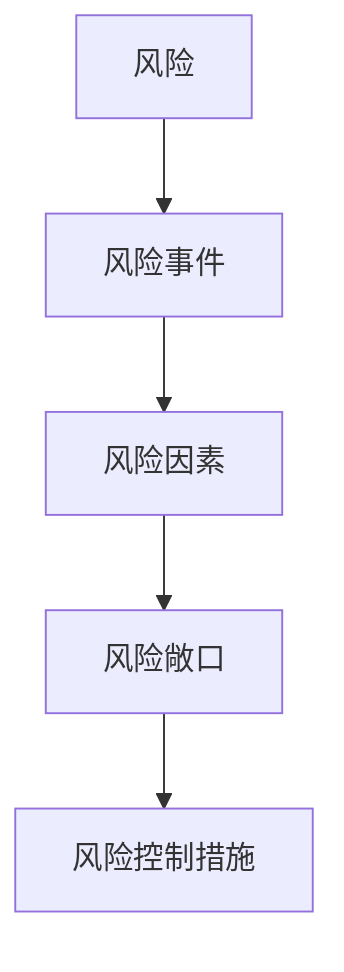
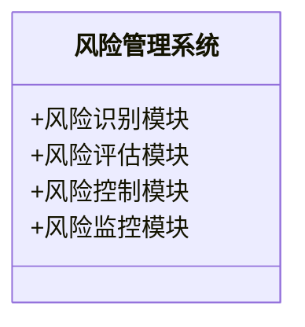
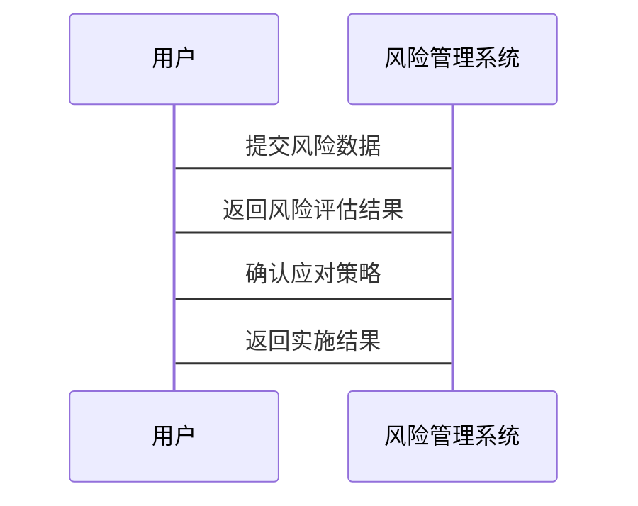

                 


# 彼得·林奇如何看待公司的风险管理

> 关键词：风险管理，彼得·林奇，公司治理，投资策略，风险管理框架

> 摘要：本文深入探讨了彼得·林奇在公司风险管理方面的独特见解，结合风险管理的核心概念、系统分析、算法原理和项目实战，详细分析了如何将风险管理融入公司战略和日常运营，提供了实用的策略和最佳实践。

---

# 第1章 风险管理的背景与核心概念

## 1.1 风险管理的定义与背景

### 1.1.1 风险的定义与特征

风险是指在特定条件下，某一事件或行为可能导致的不确定性结果。在公司管理中，风险可以是财务损失、声誉损害、法律纠纷等。彼得·林奇曾强调，风险不是敌人，而是投资过程中必须面对的挑战。

### 1.1.2 风险管理的重要性

风险管理是公司治理的核心部分。有效的风险管理能够帮助公司避免重大损失，抓住潜在机会，并增强投资者信心。林奇认为，成功的投资与风险管理密不可分。

### 1.1.3 风险管理的核心目标

风险管理的核心目标是通过识别、评估和控制风险，降低其对公司的影响。林奇提出，公司应关注关键风险点，制定应对策略，而非试图消除所有风险。

## 1.2 彼得·林奇与风险管理的关联

### 1.2.1 彼得·林奇的背景介绍

彼得·林奇是美国著名投资经理人，以其在富达投资的长期成功而闻名。他的投资策略强调风险控制，认为风险管理是投资决策的关键。

### 1.2.2 投资与风险管理的关系

林奇认为，投资不仅是对市场的分析，更是对风险的管理。他将风险管理视为投资组合的核心，强调分散投资以降低风险。

### 1.2.3 彼得·林奇的风险管理理念

林奇提出，公司应定期评估风险，制定应对策略，并建立风险管理框架。他强调，风险管理不仅是高管的责任，而是公司全体员工的职责。

## 1.3 风险管理的核心要素

### 1.3.1 风险的来源与分类

风险的来源包括市场风险、信用风险、操作风险等。林奇特别关注市场风险，认为这是投资中最不可预测的因素。

### 1.3.2 风险管理的框架与流程

风险管理的框架通常包括识别、评估、应对和监控四个阶段。林奇强调，每个阶段都需要细致分析，确保风险得到有效控制。

### 1.3.3 风险管理的关键指标

关键指标如VaR（风险价值）和波动率是衡量风险的重要工具。林奇认为，这些指标可以帮助公司量化风险，制定有效的管理策略。

---

# 第2章 风险管理的核心概念与联系

## 2.1 风险管理的核心原理

### 2.1.1 风险识别的原理

风险识别是风险管理的第一步。林奇建议公司使用SWOT分析法，识别内部和外部风险因素。

### 2.1.2 风险评估的原理

风险评估需要考虑风险发生的概率和影响程度。林奇提出，公司应使用概率和影响矩阵来量化风险。

### 2.1.3 风险控制的原理

风险控制包括规避、减轻、转移和接受四种策略。林奇认为，每种策略都有其适用场景，公司应根据具体情况选择合适的方法。

## 2.2 风险管理的核心概念对比

### 2.2.1 风险与收益的对比

风险与收益通常呈正相关关系，但林奇认为，公司应寻找收益与风险匹配的投资机会。

### 2.2.2 风险与概率的对比

概率高的风险事件更可能影响公司，林奇建议公司优先管理高概率风险。

### 2.2.3 风险与损失的对比

风险是潜在的损失，而损失是实际发生的后果。林奇强调，公司应通过保险和备用计划来减少损失。

## 2.3 风险管理的ER实体关系图



---

# 第3章 风险管理的系统分析与架构设计

## 3.1 系统分析与功能设计

### 3.1.1 风险管理系统的功能模块

- 风险识别模块：自动识别潜在风险。
- 风险评估模块：量化风险影响。
- 风险控制模块：制定应对策略。
- 风险监控模块：实时监控风险变化。

### 3.1.2 风险管理的领域模型



### 3.1.3 系统架构设计

采用分层架构，包括数据层、业务逻辑层和用户界面层。使用微服务架构，确保系统的可扩展性和灵活性。

## 3.2 系统架构设计

### 3.2.1 系统架构的组成

- 数据层：存储风险相关数据。
- 业务逻辑层：处理风险评估和控制逻辑。
- 用户界面层：提供用户交互界面。

### 3.2.2 系统架构的优缺点

分层架构的优点是清晰的职责划分，缺点是可能增加系统的复杂性。微服务架构的优点是可扩展性，缺点是需要处理服务间的通信问题。

## 3.3 系统接口设计

### 3.3.1 接口设计

使用RESTful API，定义清晰的接口规范。例如，风险识别模块提供`POST /api/risk/identify`接口，用于接收风险数据。

### 3.3.2 接口实现

使用JSON格式传递数据，确保接口的兼容性和易用性。例如：

```json
{
    "risk_type": "市场风险",
    "risk_level": "高"
}
```

## 3.4 系统交互设计

### 3.4.1 交互流程

用户提交风险数据，系统识别并评估风险，生成应对策略，用户确认后实施。

### 3.4.2 交互流程图



---

# 第4章 风险管理的算法原理与数学模型

## 4.1 风险管理的算法原理

### 4.1.1 风险评估算法

使用VaR模型计算潜在损失。VaR公式为：

$$ VaR = \alpha \times \sigma $$

其中，$\alpha$是置信水平，$\sigma$是资产的收益率标准差。

### 4.1.2 风险控制算法

采用马科维茨的有效组合模型，优化投资组合的风险收益比。

### 4.1.3 算法实现

使用Python编写VaR计算代码：

```python
import numpy as np

def calculate VaR(returns, confidence_level):
    sorted_returns = np.sort(returns)
    position = int(len(sorted_returns) * confidence_level)
    VaR = -sorted_returns[position]
    return VaR
```

## 4.2 风险管理的数学模型

### 4.2.1 VaR模型

$$ VaR = \mu + z \times \sigma $$

其中，$\mu$是平均收益率，$z$是标准正态分布的分位数，$\sigma$是收益率的标准差。

### 4.2.2 CVaR模型

条件在险值模型用于度量尾部风险：

$$ CVaR = \frac{1}{1-\alpha} \int_{\alpha}^{1} VaR(d) dd $$

---

# 第5章 风险管理的项目实战

## 5.1 项目介绍

### 5.1.1 项目背景

某金融公司面临市场波动带来的投资风险，希望通过风险管理系统降低潜在损失。

### 5.1.2 项目目标

开发一个基于VaR模型的风险管理系统，实现风险识别、评估和控制。

## 5.2 核心实现

### 5.2.1 系统核心代码

```python
class RiskManager:
    def __init__(self, data):
        self.data = data

    def identify_risk(self):
        # 风险识别逻辑
        pass

    def assess_risk(self):
        # 风险评估逻辑
        pass

    def control_risk(self):
        # 风险控制逻辑
        pass

    def monitor_risk(self):
        # 风险监控逻辑
        pass
```

### 5.2.2 代码解读

- `identify_risk`方法用于识别潜在风险。
- `assess_risk`方法使用VaR模型评估风险。
- `control_risk`方法制定风险控制策略。
- `monitor_risk`方法实时监控风险变化。

## 5.3 案例分析

### 5.3.1 风险识别

假设市场波动率突然上升，系统识别出市场风险。

### 5.3.2 风险评估

使用VaR模型计算潜在损失，得出VaR值为1000万美元。

### 5.3.3 风险控制

制定分散投资策略，降低市场风险敞口。

## 5.4 项目总结

通过风险管理系统的实施，公司成功降低了投资风险，提高了投资收益。林奇的投资理念在项目中得到了有效应用。

---

# 第6章 风险管理的最佳实践与注意事项

## 6.1 最佳实践

### 6.1.1 定期风险评估

公司应定期评估风险，及时调整管理策略。

### 6.1.2 建立风险管理文化

将风险管理融入公司文化，鼓励员工积极参与。

## 6.2 注意事项

### 6.2.1 风险管理的局限性

风险管理无法完全消除风险，只能降低其影响。

### 6.2.2 风险管理的动态性

市场环境不断变化，公司需要动态调整风险管理策略。

## 6.3 拓展阅读

推荐阅读彼得·林奇的《投资之道》和风险管理相关的书籍。

---

# 第7章 总结

## 7.1 核心内容回顾

本文深入探讨了彼得·林奇在公司风险管理方面的见解，结合风险管理的核心概念、系统分析、算法原理和项目实战，提供了实用的策略和最佳实践。

## 7.2 未来展望

随着市场环境的变化，风险管理将变得更加复杂。公司需要不断优化风险管理框架，利用新技术提升风险管理能力。

---

# 附录

## 附录A 风险管理相关术语表

- VaR：风险价值
- CVaR：条件在险值
- SWOT分析：优势、劣势、机会、威胁分析

## 附录B 参考文献

1. 彼得·林奇，《投资之道》
2. 风险管理相关学术论文

---

# 作者信息

作者：AI天才研究院/AI Genius Institute & 禅与计算机程序设计艺术/Zen And The Art of Computer Programming

---

通过以上详细结构，文章将全面覆盖风险管理的核心概念、系统设计、算法原理和项目实战，结合彼得·林奇的见解，为读者提供深刻的分析和实用的指导。

