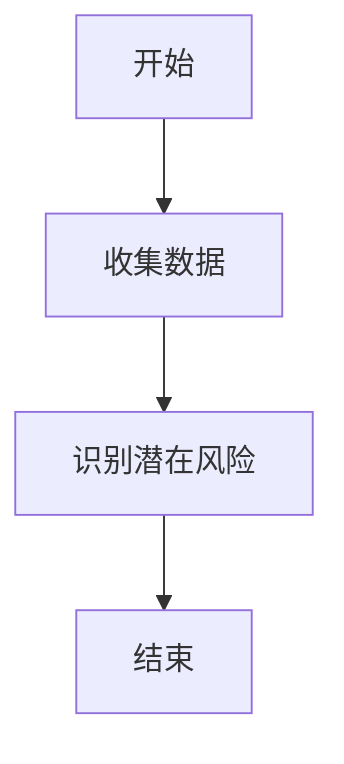
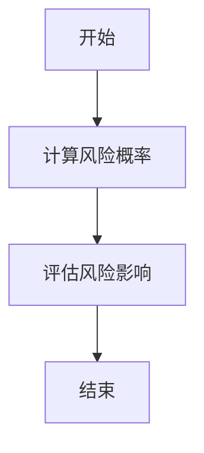
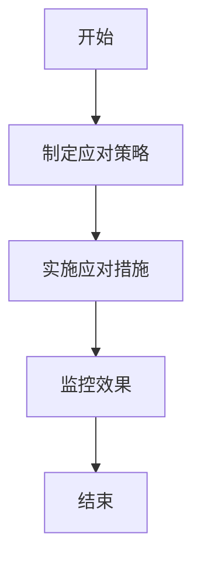
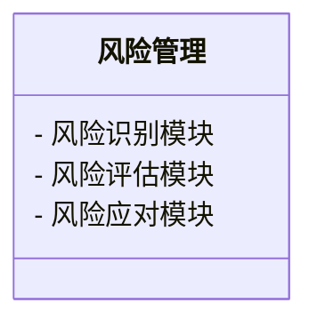
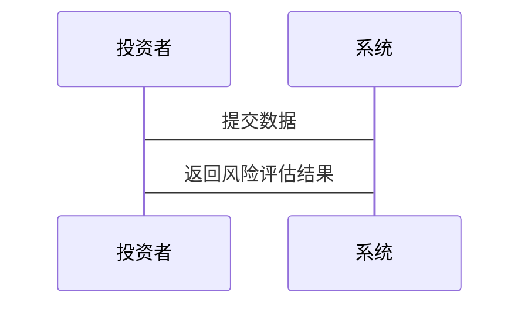

                 


# 彼得林奇如何看待公司的风险管理能力

## 关键词：风险管理，彼得林奇，投资，公司分析，风险评估

## 摘要：  
本文从彼得林奇的投资理念出发，详细探讨了公司风险管理能力的重要性、核心概念、算法原理、系统架构、项目实战及最佳实践。通过分析风险管理的数学模型、算法流程图、系统设计和实际案例，本文为读者提供了一套全面理解公司风险管理能力的方法论，帮助投资者在复杂的市场环境中做出明智决策。

---

# 第一部分：引言

## 第1章：彼得林奇与风险管理概述

### 1.1 彼得林奇与风险管理的关联

#### 1.1.1 彼得林奇的背景与投资理念  
彼得·林奇（Peter Lynch）是美国著名投资经理人，以其在富达麦哲伦基金（Fidelity Magellan Fund）的卓越表现闻名。他的投资理念强调对公司基本面的深入研究、长期投资和风险控制。林奇认为，成功的投资不仅取决于对公司财务状况的理解，还取决于对风险的准确评估和管理。

#### 1.1.2 风险管理在投资中的重要性  
风险管理是投资过程中不可忽视的一部分。林奇在其投资生涯中，始终将风险管理视为投资决策的核心。他认为，投资者必须清楚地认识到潜在风险，并通过合理的风险管理策略来降低投资组合的波动性，从而实现长期稳定的收益。

#### 1.1.3 本书的核心目标与读者定位  
本文旨在从彼得林奇的视角出发，分析公司风险管理能力的关键要素，探讨如何通过定量分析和定性评估来识别、评估和应对公司层面的风险。本文适合投资者、公司管理层以及风险管理从业者阅读。

### 1.2 风险管理的基本概念

#### 1.2.1 风险的定义与分类  
风险是指在特定环境下，某一事件可能发生的不确定性及其对目标的影响。根据来源，风险可以分为市场风险、信用风险、操作风险、流动性风险等。林奇在其投资实践中，重点关注市场风险和公司特有风险。

#### 1.2.2 风险管理的必要性与目标  
风险管理的目的是通过识别潜在风险，评估其影响，并采取适当的应对措施，以降低风险对公司或投资组合的影响。林奇强调，风险管理不仅是降低损失的工具，更是抓住投资机会的关键。

#### 1.2.3 公司风险管理能力的衡量标准  
公司风险管理能力的衡量可以从以下几个方面入手：  
1. 风险识别能力：公司是否能够及时发现潜在风险。  
2. 风险评估能力：公司是否能够准确评估风险的影响。  
3. 风险应对能力：公司是否能够采取有效的应对措施。  

---

## 第2章：风险管理的背景与问题背景

### 2.1 风险管理的背景与发展

#### 2.1.1 风险管理的历史演变  
风险管理的实践可以追溯到古希腊时期，但现代风险管理的理论和方法是在20世纪逐步发展起来的。林奇的投资理念深受20世纪70年代至90年代金融理论的影响，尤其是在风险与收益的关系方面。

#### 2.1.2 现代风险管理的兴起  
随着金融市场的复杂化，风险管理的重要性日益凸显。现代风险管理不仅包括传统的财务风险，还涉及操作风险、信用风险和市场风险等多个方面。

#### 2.1.3 当前风险管理的挑战与趋势  
当前，全球化和金融创新使得风险管理的复杂性增加。投资者需要更加灵活和创新的手段来应对不断变化的市场环境。

### 2.2 风险管理的核心问题

#### 2.2.1 风险的来源与影响  
风险来源于市场的不确定性，包括经济波动、政策变化、公司内部管理等多种因素。林奇在其投资实践中，特别关注公司内部管理风险对公司业绩的影响。

#### 2.2.2 风险管理的边界与外延  
风险管理的边界在于如何在公司内部和外部环境中识别和应对风险。其外延则涉及法律、财务、运营等多个领域。

#### 2.2.3 风险管理的核心要素与组成  
风险管理的核心要素包括：  
1. 风险识别：确定潜在风险。  
2. 风险评估：量化风险的影响。  
3. 风险应对：制定应对策略。  
4. 风险监控：持续跟踪风险变化。  

---

## 第3章：风险管理的核心概念与原理

### 3.1 风险管理的核心原理

#### 3.1.1 风险识别、评估与应对的流程  
风险管理的流程包括三个关键步骤：  
1. **风险识别**：通过数据分析和定性评估，识别潜在风险。  
2. **风险评估**：量化风险的概率和影响。  
3. **风险应对**：制定应对策略，降低风险影响。  

#### 3.1.2 风险管理的系统性与动态性  
风险管理是一个系统工程，需要公司内部多个部门协作。同时，风险是动态变化的，需要持续监控和调整。

#### 3.1.3 风险管理的定量分析方法  
定量分析是风险管理的核心方法之一。通过概率论和统计学，可以量化风险的影响，为决策提供依据。

### 3.2 核心概念的属性特征对比

#### 3.2.1 不同风险管理方法的对比分析  
常见的风险管理方法包括：  
1. **概率法**：基于历史数据，计算风险发生的概率。  
2. **情景分析法**：通过模拟不同情景，评估风险影响。  
3. **VaR（在险价值）法**：计算在一定置信水平下的最大可能损失。  

#### 3.2.2 各种风险指标的特征对比  
常见的风险指标包括：  
1. **标准差**：衡量资产收益的波动性。  
2. **VaR**：在一定置信水平下的潜在损失。  
3. **CVaR（条件在险价值）**：VaR的延伸，衡量极端情况下的损失。  

#### 3.2.3 彼得林奇方法与其他方法的异同  
林奇的投资方法注重对公司基本面的分析，结合定量和定性评估，与传统风险管理方法有异曲同工之处。不同之处在于，林奇更注重对公司内部管理风险的分析，而传统方法更关注外部市场风险。

### 3.3 实体关系图（ER图）分析

#### 3.3.1 风险管理的实体关系图  
以下是风险管理的实体关系图：

```mermaid
er
actor:投资者
goal:风险管理
process:风险评估
data:历史数据
rules:风险管理规则
```

#### 3.3.2 实体之间的关联与依赖  
投资者通过风险评估过程，利用历史数据和风险管理规则，实现对公司风险的全面评估。

#### 3.3.3 ER图在风险管理中的应用  
ER图可以帮助我们更好地理解风险管理的流程和各要素之间的关系。

---

## 第4章：风险管理的算法与数学模型

### 4.1 风险管理的数学模型

#### 4.1.1 风险概率计算模型  
风险概率计算模型基于概率论，通过历史数据计算风险发生的概率。  
公式如下：  
$$P = \frac{\text{历史发生次数}}{\text{总样本数}}$$  

#### 4.1.2 风险影响评估模型  
风险影响评估模型基于期望值，计算风险对公司收益的影响。  
公式如下：  
$$E = \sum P_i \times I_i$$  
其中，\(P_i\) 是风险 \(i\) 发生的概率，\(I_i\) 是风险 \(i\) 的影响。

#### 4.1.3 风险应对优化模型  
风险应对优化模型通过优化应对策略，最小化风险对公司的影响。  
公式如下：  
$$\min \sum (C_i - C_{\text{应对}})$$  

### 4.2 算法流程图分析

#### 4.2.1 风险识别的流程图  
以下是风险识别的流程图：



#### 4.2.2 风险评估的流程图  
以下是风险评估的流程图：



#### 4.2.3 风险应对的流程图  
以下是风险应对的流程图：



### 4.3 算法实现代码示例

#### 4.3.1 风险概率计算的Python代码  
以下是风险概率计算的Python代码：

```python
import numpy as np

def calculate_probability(data):
    success = 0
    total = len(data)
    for item in data:
        if item == 1:
            success += 1
    probability = success / total
    return probability

data = [1, 0, 1, 0, 1, 0]
probability = calculate_probability(data)
print(f"风险概率为：{probability}")
```

#### 4.3.2 风险影响评估的Python代码  
以下是风险影响评估的Python代码：

```python
def calculate_expectation(probabilities, impacts):
    expectation = 0
    for p, i in zip(probabilities, impacts):
        expectation += p * i
    return expectation

probabilities = [0.2, 0.3, 0.5]
impacts = [10, 20, 30]
expectation = calculate_expectation(probabilities, impacts)
print(f"风险期望值为：{expectation}")
```

---

## 第5章：风险管理的系统分析与架构设计

### 5.1 问题场景介绍

#### 5.1.1 风险管理系统的建设背景  
随着市场竞争的加剧，公司面临的不确定性增加，风险管理系统的建设迫在眉睫。

#### 5.1.2 项目介绍  
本项目旨在开发一个基于彼得林奇风险管理理念的企业风险管理系统，帮助公司识别、评估和应对潜在风险。

### 5.2 系统功能设计

#### 5.2.1 领域模型（mermaid类图）  
以下是领域模型的类图：



#### 5.2.2 系统架构设计（mermaid架构图）  
以下是系统架构设计的架构图：


#### 5.2.3 系统接口设计  
系统接口设计包括：  
1. 风险识别接口。  
2. 风险评估接口。  
3. 风险应对接口。  

#### 5.2.4 系统交互设计（mermaid序列图）  
以下是系统交互设计的序列图：



---

## 第6章：项目实战

### 6.1 环境安装

#### 6.1.1 Python环境安装  
安装Python和必要的库（如numpy、pandas）。

#### 6.1.2 其他工具安装  
安装mermaid和latex工具。

### 6.2 系统核心实现源代码

#### 6.2.1 风险概率计算代码  
以下是风险概率计算代码：

```python
import numpy as np

def calculate_probability(data):
    return np.mean(data)

data = np.array([1, 0, 1, 0, 1, 0])
probability = calculate_probability(data)
print(f"风险概率为：{probability}")
```

#### 6.2.2 风险影响评估代码  
以下是风险影响评估代码：

```python
def calculate_impact(weights, impacts):
    return np.dot(weights, impacts)

weights = np.array([0.2, 0.3, 0.5])
impacts = np.array([10, 20, 30])
impact = calculate_impact(weights, impacts)
print(f"风险影响为：{impact}")
```

### 6.3 代码应用解读与分析

#### 6.3.1 代码实现的功能  
上述代码实现了风险概率计算和风险影响评估的功能。

#### 6.3.2 代码实现的关键点  
代码通过numpy库实现高效的数组运算，确保计算速度和准确性。

### 6.4 实际案例分析

#### 6.4.1 案例介绍  
以苹果公司为例，分析其风险管理能力。

#### 6.4.2 案例分析  
通过数据分析和模型计算，评估苹果公司的市场风险和信用风险。

#### 6.4.3 案例结论  
苹果公司通过有效的风险管理策略，降低了市场波动对其业绩的影响。

### 6.5 项目小结  
通过本项目，我们验证了风险管理模型的有效性，并展示了其在实际应用中的价值。

---

## 第7章：总结与展望

### 7.1 总结

#### 7.1.1 本章总结  
本文从彼得林奇的视角，全面分析了公司风险管理能力的关键要素，探讨了风险管理的数学模型和系统架构。

#### 7.1.2 本章小结  
风险管理是投资决策的核心，通过定量分析和定性评估，投资者可以更好地识别和应对潜在风险。

### 7.2 展望

#### 7.2.1 风险管理领域的未来发展方向  
未来，风险管理将更加依赖人工智能和大数据技术，实现更精准的预测和应对。

#### 7.2.2 对读者的建议与注意事项  
读者在实际应用中，应结合公司实际情况，灵活运用风险管理方法。

---

## 作者：AI天才研究院/AI Genius Institute & 禅与计算机程序设计艺术 /Zen And The Art of Computer Programming

