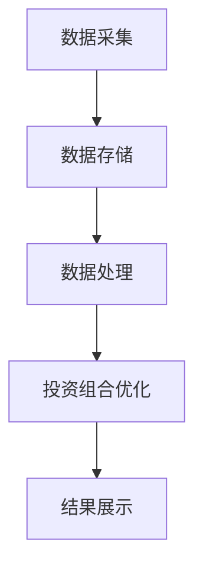
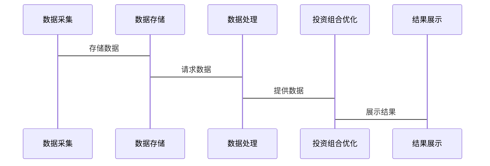

                 


# 彼得林奇如何看待分散投资

> 关键词：分散投资，彼得·林奇，投资组合管理，风险管理，现代投资组合理论

> 摘要：本文探讨了彼得·林奇对分散投资的看法，分析了分散投资的核心概念、数学模型、系统架构设计以及项目实战。通过详细讲解分散投资的理论与实践，帮助读者理解如何通过分散投资降低风险、提高收益。

---

## 第1章: 分散投资的背景与重要性

### 1.1 投资的基本概念

#### 1.1.1 投资的定义与分类

投资是指将资金投入某种资产或项目，以期望在未来获得收益的行为。根据资产类型，投资可以分为股票、债券、房地产、黄金等多种形式。每种资产都有其独特的风险和收益特征。

#### 1.1.2 投资的基本原则

投资的核心原则包括分散投资、长期持有、定期调整和风险管理。其中，分散投资是降低风险的重要策略，而长期持有则是实现复利效应的关键。

#### 1.1.3 投资与风险管理的关系

投资的本质是在风险与收益之间找到平衡点。通过有效的风险管理，投资者可以在承受可接受风险的同时，追求最大化的收益。

### 1.2 分散投资的起源与发展

#### 1.2.1 分散投资的历史背景

分散投资的理念可以追溯到古代的巴比伦商人，但真正成为系统化理论则始于20世纪。1952年，哈里·马科维茨提出了现代投资组合理论（MPT），奠定了分散投资的理论基础。

#### 1.2.2 现代投资组合理论的提出

马科维茨的MPT理论指出，通过合理配置不同资产，可以实现投资组合的风险最小化，同时最大化收益。这一理论为分散投资提供了科学依据。

#### 1.2.3 分散投资在实践中的应用

随着金融市场的不断发展，分散投资策略在实际操作中得到了广泛应用。投资者通过购买多种资产，降低了单一资产波动带来的风险。

### 1.3 分散投资的核心理念

#### 1.3.1 降低风险的重要性

分散投资的核心在于通过持有不同类型的资产，降低特定资产或市场波动带来的风险。这被称为“不要把所有鸡蛋放在一个篮子里”。

#### 1.3.2 非相关资产的概念

非相关资产是指在价格波动上不完全相关的资产。通过持有非相关资产，投资者可以有效降低投资组合的整体风险。

#### 1.3.3 投资组合的多样化策略

多样化策略是指通过投资不同资产类别、行业或地区，分散投资风险。这种策略能够帮助投资者在市场波动中保持稳定的投资回报。

---

## 第2章: 分散投资的核心概念与原理

### 2.1 投资组合管理

#### 2.1.1 投资组合的构建与优化

投资组合的构建需要考虑资产配置、风险偏好和投资目标。优化投资组合的关键在于找到风险与收益的最佳平衡点。

#### 2.1.2 如何选择资产类别

选择资产类别时，投资者需要考虑各类资产的历史表现、波动性和相关性。多样化的资产配置能够有效分散风险。

#### 2.1.3 资产配置的动态调整

市场环境和投资者的财务状况会不断变化，因此需要定期调整投资组合，以保持最优配置。

### 2.2 现代投资组合理论（MPT）

#### 2.2.1 MPT的基本假设

MPT假设市场是有效的，投资者是理性的，并且资产的收益服从正态分布。这些假设为分散投资提供了理论基础。

#### 2.2.2 马科维茨的有效前沿

有效前沿是指在给定风险水平下，能够提供最高收益的投资组合的集合。投资者可以通过优化算法找到位于有效前沿上的投资组合。

#### 2.2.3 风险与收益的平衡

MPT强调风险和收益的权衡。通过分散投资，投资者可以在承受较低风险的同时，获得较高的收益。

### 2.3 分散投资的数学模型

#### 2.3.1 投资组合的方差计算

投资组合的总风险可以用方差来衡量。方差的计算公式为：

$$\sigma^2 = \sum_{i=1}^n \sum_{j=1}^n w_i w_j \sigma_{i,j}$$

其中，$w_i$和$w_j$是资产i和资产j的投资权重，$\sigma_{i,j}$是资产i和资产j的协方差。

#### 2.3.2 协方差矩阵的构建

协方差矩阵描述了资产之间风险的相互影响。通过计算协方差矩阵，可以更好地理解资产之间的相关性。

#### 2.3.3 最优化问题的求解

通过求解优化问题，可以找到最优投资组合。目标是最小化投资组合的方差，同时满足收益约束。

$$\text{minimize } \sum_{i=1}^n \sum_{j=1}^n w_i w_j \sigma_{i,j}$$
$$\text{subject to } \sum_{i=1}^n w_i = 1$$

---

## 第3章: 分散投资的算法与实践

### 3.1 基于均值-方差模型的优化

#### 3.1.1 算法的输入与输出

输入包括资产的预期收益、协方差矩阵和投资权重约束。输出是最优投资组合的权重和风险收益比。

#### 3.1.2 线性规划的数学表达

通过线性规划求解器，可以找到最优的投资组合。以下是线性规划的数学表达：

$$\text{minimize } \sum_{i=1}^n w_i \mu_i$$
$$\text{subject to } \sum_{i=1}^n w_i \sigma_i^2 = \text{最小化方差}$$
$$\text{和} \sum_{i=1}^n w_i = 1$$

#### 3.1.3 代码实现示例

以下是使用Python和scipy.optimize模块实现均值-方差优化的代码示例：

```python
import numpy as np
from scipy.optimize import minimize

# 定义目标函数
def portfolio_variance(weights, covariance_matrix):
    return np.dot(weights.T, np.dot(covariance_matrix, weights))

# 定义约束条件
def weight_sum(weights):
    return np.sum(weights) - 1.0

# 初始化权重（假设等权重）
weights_initial = np.array([1.0/len(covariance_matrix),]*len(covariance_matrix))

# 使用scipy.optimize.minimize进行优化
result = minimize(portfolio_variance, weights_initial, args=covariance_matrix, 
                 method='SLSQP', constraints={'type': 'eq', 'fun': weight_sum})

print("最优权重：", result.x)
print("最小方差：", result.fun)
```

### 3.2 随机优化方法

#### 3.2.1 蒙特卡洛模拟的基本原理

蒙特卡洛模拟通过随机采样，模拟不同市场条件下投资组合的表现。这种方法适用于复杂的投资环境。

#### 3.2.2 投资组合风险的模拟计算

通过模拟不同市场情景，可以估计投资组合的潜在风险和收益。

#### 3.2.3 算法的优缺点分析

蒙特卡洛模拟的优点是简单易懂，缺点是计算量大，且依赖于输入数据的准确性。

### 3.3 基于现代优化技术的改进

#### 3.3.1 使用遗传算法优化投资组合

遗传算法是一种强大的优化工具，可以通过模拟自然选择过程，找到最优的投资组合。

#### 3.3.2 其他优化方法的比较

比较不同优化方法的优缺点，选择最适合实际场景的方法。

---

## 第4章: 系统分析与架构设计

### 4.1 系统功能设计

#### 4.1.1 数据采集模块

数据采集模块负责获取市场数据，包括股票价格、债券收益率等。

#### 4.1.2 风险评估模块

风险评估模块计算投资组合的总体风险，包括波动率和最大回撤。

#### 4.1.3 投资组合优化模块

优化模块基于输入数据和目标函数，生成最优投资组合。

### 4.2 系统架构设计

#### 4.2.1 分层架构图

以下是系统的分层架构图：



#### 4.2.2 模块间的交互关系

模块之间的交互关系可以用以下序列图表示：



#### 4.2.3 系统的可扩展性设计

系统设计时需要考虑未来的扩展性，例如增加新的资产类型或优化算法。

### 4.3 接口与交互设计

#### 4.3.1 数据接口规范

定义数据接口的输入输出格式和调用方式。

#### 4.3.2 用户界面设计

设计直观的用户界面，方便用户输入参数和查看结果。

#### 4.3.3 系统监控与报警

建立监控机制，及时发现和处理系统异常。

---

## 第5章: 项目实战与案例分析

### 5.1 环境搭建与数据准备

#### 5.1.1 Python环境的安装与配置

安装Python和必要的库，如numpy、pandas、scipy等。

#### 5.1.2 数据来源与预处理

数据可以从Yahoo Finance等来源获取，并进行清洗和标准化。

#### 5.1.3 数据清洗与标准化

清洗数据，处理缺失值和异常值，标准化数据格式。

### 5.2 核心算法实现

#### 5.2.1 均值-方差模型的代码实现

如前所述，使用scipy.optimize模块实现投资组合优化。

#### 5.2.2 蒙特卡洛模拟的代码实现

以下是蒙特卡洛模拟的代码示例：

```python
import numpy as np

# 假设我们有三个资产，协方差矩阵如下
covariance_matrix = np.array([
    [0.02, 0.01, 0.01],
    [0.01, 0.03, 0.02],
    [0.01, 0.02, 0.03]
])

# 蒙特卡洛模拟次数
n_simulation = 10000

# 生成随机权重
weights = np.random.dirichlet([1,1,1], n_simulation)

# 计算每个模拟的方差
variances = [np.dot(w.T, np.dot(covariance_matrix, w)) for w in weights]

# 计算平均方差和标准差
average_variance = np.mean(variances)
std_deviation = np.std(variances)

print("平均方差：", average_variance)
print("标准差：", std_deviation)
```

#### 5.2.3 算法的性能测试与优化

测试算法的计算效率和准确性，根据需要进行优化。

### 5.3 系统测试与部署

#### 5.3.1 功能测试与用户反馈

测试系统的各项功能，并根据用户反馈进行改进。

#### 5.3.2 系统的部署与维护

将系统部署到生产环境，并建立维护机制。

#### 5.3.3 性能监控与优化

持续监控系统性能，及时发现和解决问题。

---

## 第6章: 最佳实践与小结

### 6.1 分散投资的最佳实践

#### 6.1.1 投资策略的选择

根据市场环境和个人风险承受能力，选择合适的分散投资策略。

#### 6.1.2 定期调整投资组合

定期重新评估投资组合，并根据市场变化进行调整。

#### 6.1.3 监控与风险管理

持续监控投资组合的表现，并及时应对潜在风险。

### 6.2 小结

分散投资是降低风险、提高收益的重要策略。通过科学的系统设计和算法实现，投资者可以更好地管理投资组合，实现长期稳健的投资回报。

### 6.3 注意事项

分散投资虽然能够降低风险，但并不能完全消除风险。投资者需要根据自身情况，选择合适的投资策略。

### 6.4 拓展阅读

推荐进一步阅读《投资学》（作者：彼得·林奇）和其他相关书籍，以深入理解分散投资的理论与实践。

---

# 作者：AI天才研究院/AI Genius Institute & 禅与计算机程序设计艺术 /Zen And The Art of Computer Programming

