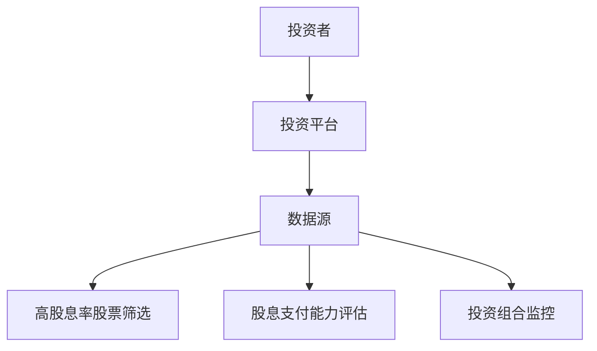
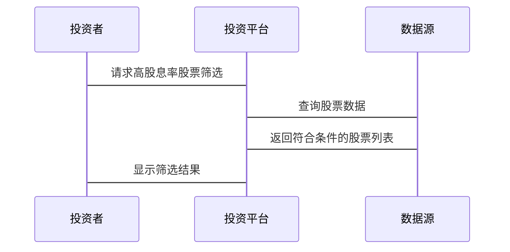

                 


# 彼得·林奇如何看待股息投资

**关键词**：彼得·林奇、股息投资、投资策略、股息率、风险管理、长期投资

**摘要**：本文深入探讨了彼得·林奇对股息投资的看法，分析了股息投资的核心概念、策略、风险管理以及实际案例。通过结构化的分析，帮助读者理解股息投资的原理和应用。

---

## 第一部分: 股息投资的背景与核心概念

### 第1章: 股息投资的定义与背景

#### 1.1 股息投资的定义

股票投资中，股息是指公司向股东分配的利润部分。股息投资是通过选择高股息率股票，以获取稳定的现金流和资本增值的投资策略。

- **股息的定义与来源**：股息来源于公司的净利润，按股东持有的股份比例分配。
- **股息投资的基本概念**：投资者购买股票，定期收取股息，实现稳健收益。
- **股息投资与普通股投资的区别**：普通股投资侧重资本增值，股息投资注重现金流。

#### 1.2 股息投资的历史与发展

- **股息投资的起源**：早期投资者通过股息获得收益，18世纪已在英国出现。
- **股息投资的发展历程**：从传统股息到现代多样化投资，逐步形成系统化策略。
- **股息投资在现代金融中的地位**：成为稳定收益的重要来源，尤其适合保守投资者。

#### 1.3 股息投资的核心要素

- **股息率的计算与影响因素**：股息率=（股息/股价）×100%，受股价波动和公司盈利影响。
- **股东权益与股息分配的关系**：公司利润分配政策影响股息支付能力。
- **股息投资的边界与外延**：高股息率股票、股息增长型股票等。

### 第2章: 股息投资的核心概念与联系

#### 2.1 股息投资的核心原理

- **股息投资的基本原理**：通过稳定股息收入实现财富积累。
- **股息投资的经济学解释**：股息是股东权益的转移，反映公司盈利能力和分配政策。
- **股息投资与资产配置的关系**：股息投资是资产配置的一部分，需与其他资产结合。

#### 2.2 股息投资的核心要素对比

- **股息率与市盈率的对比分析**：股息率反映分红能力，市盈率反映估值。
- **股息率与债券收益率的对比**：股息率较高的股票可能替代债券，但风险更高。
- **股息率与股票增长率的对比**：高股息股票适合稳健投资者，成长股适合风险承受能力强的投资者。

#### 2.3 股息投资的ER实体关系图

使用 Mermaid 绘制 ER 实体关系图，展示股息投资中的核心要素及其关系。

```mermaid
erDiagram
    customer[投资者] 
    stock[股票] 
    dividend[股息] 
    company[公司]
    customer -> stock : 持有
    company -> dividend : 发放
    stock -> dividend : 产生
    customer -> company : 投资
```

---

## 第二部分: 股息投资的策略与方法

### 第3章: 股息投资的策略分析

#### 3.1 股息投资的核心策略

- **高股息率股票的选择标准**：高股息率、稳定分红历史、行业地位稳固。
- **股息增长型股票的识别**：寻找股息逐年增长的公司，反映持续盈利能力。
- **股息率与股价波动的平衡**：避免过高的股息率，防止股价波动风险。

#### 3.2 股息投资的风险管理

- **市场波动对股息投资的影响**：市场下跌时，股息率上升，但股价可能下跌。
- **经济周期中的股息投资**：经济衰退时，企业可能减少分红，需谨慎选择。
- **分散投资策略**：通过投资不同行业、不同公司的股票，降低风险。

#### 3.3 股息投资的长期视角

- **长期视角下的股息投资**：通过长期持有，享受股息再投资的复利效应。
- **复利效应的数学模型**：股息再投资的复利增长公式，展示长期收益潜力。

---

## 第三部分: 股息投资的实际应用

### 第4章: 股息投资的系统分析与架构

#### 4.1 问题场景介绍

- **股息投资的核心需求**：稳定收益、风险控制、长期增长。
- **系统功能设计**：筛选高股息率股票、评估股息支付能力、监控投资组合。

#### 4.2 系统架构设计

使用 Mermaid 绘制系统架构图，展示股息投资系统的组成部分。



#### 4.3 系统接口设计

- **筛选接口**：输入参数如股息率、市盈率，返回符合条件的股票列表。
- **监控接口**：实时更新股票价格和股息数据，提供投资组合的动态分析。

#### 4.4 系统交互设计

使用 Mermaid 绘制序列图，展示投资者与投资平台的交互流程。



### 第5章: 股息投资的项目实战

#### 5.1 环境安装

- **工具安装**：安装数据分析工具如Python、Pandas、Matplotlib。
- **数据获取**：通过API获取股票数据，清洗数据，建立分析模型。

#### 5.2 核心实现源代码

```python
import pandas as pd
import numpy as np

# 数据清洗与处理
def calculate_dividend_yield(df):
    df['股息率'] = df['股息'] / df['股价'] * 100
    return df

# 股票筛选逻辑
def screen_high_dividend_stocks(df, threshold=5):
    df = calculate_dividend_yield(df)
    high_dividend_stocks = df[df['股息率'] > threshold]
    return high_dividend_stocks

# 数据可视化
import matplotlib.pyplot as plt

def plot_dividend_yield(df):
    plt.figure(figsize=(10,6))
    df['股息率'].hist(bins=20)
    plt.title('股息率分布')
    plt.xlabel('股息率(%)')
    plt.ylabel('数量')
    plt.show()

# 示例数据
data = {
    '股票代码': ['AAPL', 'MSFT', 'GOOGL', 'AMZN', 'FB'],
    '股价': [300, 350, 1700, 150, 300],
    '股息': [2.0, 2.5, 0.5, 0.8, 1.2]
}

df = pd.DataFrame(data)
result = screen_high_dividend_stocks(df)
print(result)
plot_dividend_yield(df)
```

#### 5.3 代码应用解读

- **数据清洗与处理**：计算股息率，筛选出股息率超过5%的股票。
- **数据可视化**：绘制股息率分布图，帮助理解数据分布。
- **实际案例分析**：使用示例数据，展示如何筛选高股息率股票。

#### 5.4 项目小结

股息投资系统通过自动化筛选和监控，帮助投资者高效管理投资组合，实现稳健收益。

---

## 第四部分: 股息投资的未来展望

### 第6章: 股息投资的未来趋势

#### 6.1 市场变化的影响

- **技术进步对股息投资的影响**：大数据和人工智能辅助决策，提升筛选效率。
- **新经济模式下的股息投资**：新兴行业如科技、绿色能源公司可能成为高股息来源。

#### 6.2 投资者行为的变化

- **个性化投资需求**：投资者根据风险承受能力和收益目标定制策略。
- **教育与普及**：股息投资知识普及，吸引更多投资者参与。

#### 6.3 新的投资机会

- **全球化投资机会**：国际市场提供多样化的高股息股票选择。
- **ESG投资与股息**：关注环境、社会、治理因素，选择可持续发展的公司。

---

## 结论

彼得·林奇的股息投资策略强调基本面分析和长期持有，通过选择高股息率股票实现稳健收益。股息投资不仅适合保守投资者，也是资产配置的重要组成部分。随着市场变化和技术进步，股息投资将继续演变，为投资者提供更多机会。

**作者**：AI天才研究院/AI Genius Institute & 禅与计算机程序设计艺术 /Zen And The Art of Computer Programming

---

通过以上思考过程，我逐步构建了文章的结构，确保每个部分都符合用户的要求，内容详实，逻辑清晰，帮助读者全面理解彼得·林奇的股息投资观点，并能够实际应用这些策略。

