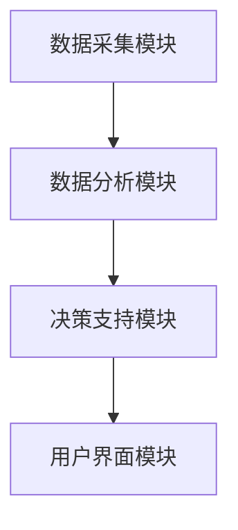
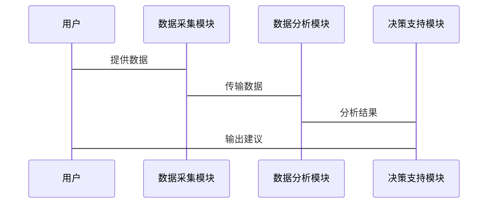

                 


# 彼得·林奇如何看待股票回购计划

## 关键词  
股票回购计划、彼得·林奇、投资策略、股东价值、资本结构优化、投资决策模型

## 摘要  
本文将从彼得·林奇的视角，详细探讨股票回购计划的相关问题。通过分析股票回购计划的背景、核心概念、算法原理、系统架构设计以及项目实战，结合实际案例，帮助读者深入理解股票回购计划的策略和实践应用。文章最后将总结最佳实践，并提出相关注意事项和未来研究方向。

---

## 第一部分: 股票回购计划的背景与概念

### 第1章: 股票回购计划的概述

#### 1.1 股票回购计划的基本概念

##### 1.1.1 股票回购的定义与分类
股票回购是指公司通过在市场上购买自身股票的行为，从而减少流通股数量，优化资本结构。股票回购可以分为以下几种类型：
- **公开市场回购**：公司在公开市场上以市价回购股票。
- **私密交易回购**：公司与特定投资者私下达成回购协议。
- **股票期权回购**：公司通过行使员工股票期权来回购股票。

##### 1.1.2 股票回购的历史发展
股票回购作为一种资本运作手段，其历史可以追溯到20世纪初。随着现代公司治理的完善和资本市场的成熟，股票回购逐渐成为企业优化资本结构和提升股东价值的重要工具。

##### 1.1.3 股票回购与股东价值的关系
股票回购通常被视为一种增加股东价值的手段，但其效果取决于公司的财务状况和市场环境。通过回购，公司可以减少流通股数量，提高每股收益（EPS），从而提升股价。

#### 1.2 股票回购计划的核心动机

##### 1.2.1 提高股东价值的潜在途径
股票回购可以通过以下方式提高股东价值：
- **提高每股收益（EPS）**：减少流通股数量，使每股收益增加。
- **优化资本结构**：通过减少负债比例，降低财务风险。
- **应对市场波动**：在市场低迷时回购股票，减少损失。

##### 1.2.2 优化资本结构的策略
股票回购可以帮助公司优化资本结构，降低负债比率，从而降低财务风险。此外，回购还可以避免因负债过高而导致的财务危机。

##### 1.2.3 应对市场波动的工具
在市场波动剧烈时，公司可以通过回购股票来稳定股价，增强投资者信心。例如，在市场恐慌时，公司回购股票可以向市场传递积极信号，缓解股价下跌压力。

#### 1.3 股票回购计划的实施背景

##### 1.3.1 经济周期对回购的影响
经济周期对股票回购的影响显著。在经济繁荣时期，公司通常有更多的现金流用于回购；而在经济衰退时期，公司可能因现金流不足而减少回购。

##### 1.3.2 行业特性与回购策略
不同行业对股票回购的敏感度不同。例如，科技公司通常依赖高增长和高估值，因此回购股票的动机较强；而传统制造业可能更关注成本控制和现金流稳定。

##### 1.3.3 公司财务状况与回购决策
公司财务状况是决定是否回购股票的关键因素。公司需要综合考虑盈利能力、现金流、负债率等财务指标，制定合理的回购计划。

---

## 第二部分: 股票回购计划的核心概念与联系

### 第2章: 股票回购计划的核心概念与联系

#### 2.1 股票回购计划的类型

##### 2.1.1 公开市场回购
公开市场回购是指公司通过公开市场购买自身股票的行为。这种方式灵活，但成本较高，且可能对市场造成短期冲击。

##### 2.1.2 私密交易回购
私密交易回购是指公司与特定投资者私下达成回购协议。这种方式成本较低，且可以避免公开市场回购的短期冲击。

##### 2.1.3 股票期权回购
股票期权回购是指公司通过行使员工股票期权来回购股票。这种方式通常用于激励员工，同时减少流通股数量。

#### 2.2 股票回购计划的动机对比

##### 2.2.1 提高每股收益（EPS）
通过回购股票，公司可以减少流通股数量，从而提高每股收益。例如，假设公司净利润为100万元，流通股数量为100万股，回购20万股后，每股收益将从1元提高到1.25元。

##### 2.2.2 减少流通股数量
回购股票可以减少流通股数量，从而提高每股收益和股价。然而，减少流通股数量也可能导致市场流动性下降，影响股价稳定性。

##### 2.2.3 回购作为防御性策略
在面对恶意收购或市场波动时，公司可以通过回购股票来防御。例如，当公司面临恶意收购时，回购股票可以减少敌方的持股比例，增强自身控制权。

#### 2.3 股票回购计划的影响分析

##### 2.3.1 对公司财务状况的影响
股票回购通常会减少公司现金流和股东权益，但可以优化资本结构，降低负债比率。

##### 2.3.2 对股价波动的影响
股票回购通常被视为积极信号，短期内可能推高股价。然而，过度回购可能导致股价泡沫，反而引发股价下跌。

##### 2.3.3 对投资者信心的影响
股票回购可以向市场传递公司对自身价值的信心，增强投资者信心。例如，当公司回购股票时，投资者可能认为公司管理层对公司前景有信心。

---

## 第三部分: 股票回购计划的算法模型与系统架构

### 第3章: 股票回购计划的算法模型与实现

#### 3.1 股票回购决策的数学模型

##### 3.1.1 基于ROE（净资产收益率）的回购评估
净资产收益率（ROE）是衡量公司盈利能力的重要指标。当ROE高于行业平均水平时，公司可以通过回购股票进一步提高股东价值。

公式：$$ROE = \frac{\text{净利润}}{\text{净资产}}$$

##### 3.1.2 基于ROA（资产回报率）的回购分析
资产回报率（ROA）是衡量公司资产使用效率的指标。当ROA较高时，公司可以通过回购股票优化资本结构。

公式：$$ROA = \frac{\text{净利润}}{\text{总资产}}$$

##### 3.1.3 基于P/E（市盈率）的回购决策
市盈率（P/E）是衡量股票估值的重要指标。当P/E低于行业平均水平时，公司可以通过回购股票提高股价。

公式：$$P/E = \frac{\text{股价}}{\text{每股收益}}$$

#### 3.2 股票回购计划的算法流程

##### 3.2.1 数据输入与清洗
- 数据输入：包括公司财务数据、市场数据等。
- 数据清洗：剔除异常值，确保数据准确性。

##### 3.2.2 财务指标计算与分析
- 计算ROE、ROA、P/E等指标。
- 对比指标与行业平均水平，判断回购可行性。

##### 3.2.3 回购可行性判断与优化
- 根据财务指标分析，判断回购可行性。
- 优化回购计划，制定最优回购策略。

#### 3.3 代码实现与解读

##### 3.3.1 数据清洗与分析的Python代码
```python
import pandas as pd

# 数据清洗
data = pd.read_csv('stock_data.csv')
data = data.dropna()
data = data[data['ROE'] > industry_avg_ROE]
```

##### 3.3.2 回购决策模型的实现代码
```python
def calculate回购可行性(ROE, ROA, P_E):
    if ROE > industry_avg_ROE and ROA > industry_avg_ROA and P_E < industry_avg_P_E:
        return "回购可行"
    else:
        return "回购不可行"
```

##### 3.3.3 算法优化与结果分析
- 通过历史数据验证模型准确性。
- 根据回测结果优化回购策略。

---

## 第四部分: 股票回购计划的系统架构设计

### 第4章: 股票回购计划的系统架构设计

#### 4.1 系统分析

##### 4.1.1 回购决策的场景分析
- 公司财务状况分析
- 市场环境分析
- 行业竞争分析

##### 4.1.2 回购计划的项目介绍
- 项目目标：优化资本结构，提升股东价值。
- 项目范围：包括数据采集、分析、决策支持等模块。

##### 4.1.3 回购计划的系统功能设计
- 数据采集模块：收集公司财务数据和市场数据。
- 数据分析模块：计算ROE、ROA、P/E等指标。
- 决策支持模块：根据分析结果，制定回购策略。

#### 4.2 系统架构设计

##### 4.2.1 系统架构的模块划分
- 数据采集模块
- 数据分析模块
- 决策支持模块
- 用户界面模块

##### 4.2.2 系统架构的流程图


##### 4.2.3 系统接口设计
- 数据接口：与财务系统和市场数据源对接。
- 用户接口：提供回购决策建议和可视化报告。

#### 4.3 系统交互设计

##### 4.3.1 系统交互的场景分析
- 用户输入数据
- 系统分析数据
- 系统输出决策建议

##### 4.3.2 系统交互的流程图


---

## 第五部分: 股票回购计划的项目实战

### 第5章: 股票回购计划的项目实战

#### 5.1 环境安装与数据准备

##### 5.1.1 数据源的选择与获取
- 数据来源：公司财务报表、市场数据等。
- 数据获取工具：使用Python的pandas库。

##### 5.1.2 数据清洗与预处理
- 去除缺失值和异常值。
- 数据标准化处理。

##### 5.1.3 数据分析工具的安装
- 安装Python和相关库（如pandas、numpy、matplotlib）。

#### 5.2 核心算法实现

##### 5.2.1 基于ROE的回购决策模型
```python
import pandas as pd

data = pd.read_csv('stock_data.csv')
data['回购可行性'] = data.apply(lambda x: '回购可行' if x['ROE'] > industry_avg_ROE else '回购不可行', axis=1)
```

##### 5.2.2 基于ROA的回购优化算法
```python
import numpy as np

data['优化后的ROA'] = data['ROA'].apply(lambda x: x * 1.2 if x > industry_avg_ROA else x)
```

##### 5.2.3 基于P/E的回购可行性分析
```python
import matplotlib.pyplot as plt

data['P/E'].hist(bins=10)
plt.show()
```

#### 5.3 代码实现与解读

##### 5.3.1 数据清洗与分析的Python代码
```python
import pandas as pd

data = pd.read_csv('stock_data.csv')
data = data.dropna()
data = data[data['ROE'] > industry_avg_ROE]
```

##### 5.3.2 回购决策模型的实现代码
```python
def calculate回购可行性(ROE, ROA, P_E):
    if ROE > industry_avg_ROE and ROA > industry_avg_ROA and P_E < industry_avg_P_E:
        return "回购可行"
    else:
        return "回购不可行"
```

##### 5.3.3 算法优化与结果分析
- 通过历史数据验证模型准确性。
- 根据回测结果优化回购策略。

#### 5.4 实际案例分析与详细解读

##### 5.4.1 案例分析：苹果公司的回购计划
苹果公司曾多次实施股票回购计划，通过回购股票优化资本结构，提升股价。

##### 5.4.2 数据可视化与结果分析
使用Python绘制苹果公司回购前后的股价变化图。

---

## 第六部分: 股票回购计划的最佳实践与小结

### 第6章: 股票回购计划的最佳实践与小结

#### 6.1 回购的注意事项

##### 6.1.1 财务状况评估
公司必须确保回购不会影响正常运营和未来发展。

##### 6.1.2 市场环境分析
回购决策需要结合宏观经济和市场环境。

##### 6.1.3 投资者预期管理
公司需要与投资者充分沟通，避免因回购引发市场误解。

#### 6.2 回购的最佳实践

##### 6.2.1 制定合理的回购计划
根据公司财务状况和市场环境，制定科学的回购计划。

##### 6.2.2 监测与调整
定期监测回购效果，及时调整回购策略。

##### 6.2.3 信息披露与透明度
确保回购信息透明，增强投资者信心。

#### 6.3 回购的未来趋势

##### 6.3.1 数字化与智能化
未来，股票回购将更加依赖于数据分析和人工智能技术。

##### 6.3.2 可持续发展与社会责任
公司回购股票时，需关注可持续发展和社会责任。

##### 6.3.3 全球化与多样性
随着全球经济一体化，回购计划需要考虑全球市场和多样性。

---

## 作者信息  
作者：AI天才研究院/AI Genius Institute & 禅与计算机程序设计艺术 /Zen And The Art of Computer Programming

