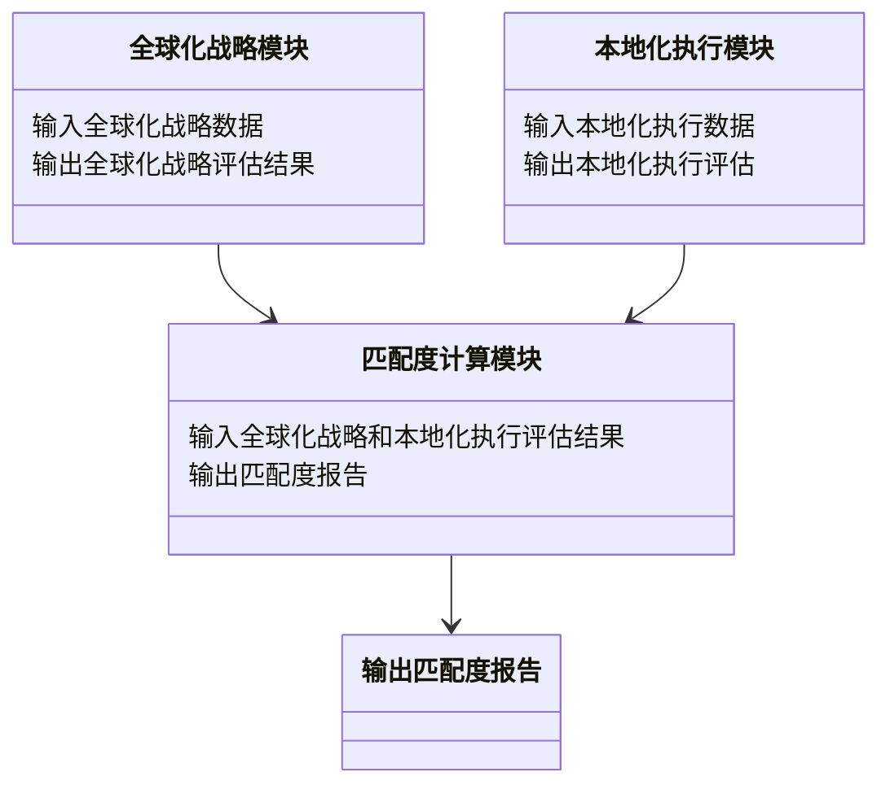

                 


# 彼得林奇如何评估公司的全球化人才战略与本地化执行的匹配度

> 关键词：彼得林奇, 全球化人才战略, 本地化执行, 匹配度评估, 算法模型, 系统架构, 项目实战

> 摘要：本文深入分析了彼得林奇在全球化人才战略与本地化执行匹配度评估方面的独特见解。通过详细阐述全球化与本地化的核心概念、匹配度评估的数学模型与算法、系统架构设计、项目实战案例以及最佳实践，为读者提供了一套完整的评估方法论。

---

# 第一部分: 全球化人才战略与本地化执行的背景与核心概念

## 第1章: 全球化与本地化的定义与特点

### 1.1 全球化人才战略的定义与特点
#### 1.1.1 全球化人才战略的定义
全球化人才战略是指企业在全球范围内配置和管理人才资源的战略，旨在通过跨国协作、跨文化整合和全球化思维来实现企业的长期发展目标。

#### 1.1.2 全球化人才战略的核心特点
- **跨国性**：人才来源于全球多个国家和地区。
- **多样性**：团队成员具有不同的文化背景和技能。
- **协调性**：需要在全球范围内进行高效的协调和资源配置。

#### 1.1.3 全球化与本地化的区别与联系
| 特性 | 全球化 | 本地化 |
|------|--------|--------|
| 范围 | 全球范围 | 单一地区 |
| 文化适应性 | 较低 | 较高 |
| 管理复杂度 | 高 | 中 |

### 1.2 彼得林奇的背景与方法论
#### 1.2.1 彼得林奇的个人背景
彼得林奇是美国著名的投资专家，以其在全球范围内配置和管理投资组合的能力而闻名。他的方法论强调对目标市场的深入研究和本地化执行。

#### 1.2.2 彼得林奇的投资哲学与管理风格
彼得林奇的投资哲学强调长期视角、风险控制和对目标市场的深入理解。他的管理风格以简洁高效、注重细节著称。

#### 1.2.3 彼得林奇在人才战略中的独特见解
彼得林奇认为，全球化人才战略的成功取决于对本地市场的深刻理解以及对全球资源的高效配置。

---

## 第2章: 全球化人才战略与本地化执行的核心概念

### 2.1 全球化人才战略的结构与要素
#### 2.1.1 全球化战略的层次划分
- **战略层**：全球范围内的资源配置和战略规划。
- **战术层**：跨国团队的协作与管理。
- **执行层**：本地化的人才招聘与培养。

#### 2.1.2 全球化人才战略的核心要素
- **人才池**：全球范围内的人才储备。
- **文化适应性**：团队成员对本地文化的适应能力。
- **协作机制**：跨国团队的沟通与协作机制。

#### 2.1.3 全球化与本地化的匹配度定义
全球化与本地化的匹配度是指全球化战略与本地化执行在目标、资源、文化和绩效上的高度契合程度。

---

### 2.2 本地化执行的挑战与关键点
#### 2.2.1 本地化执行的主要挑战
- **文化差异**：不同国家和地区的文化差异可能影响团队协作。
- **法律与政策**：各地的劳动法规和政策差异增加了本地化执行的复杂性。
- **沟通障碍**：跨国团队之间的语言和沟通问题。

#### 2.2.2 本地化执行的关键成功要素
- **本地化领导力**：具备跨文化管理能力的领导者。
- **本地化团队**：熟悉本地市场的专业团队。
- **本地化策略**：根据本地市场特点制定的差异化策略。

#### 2.2.3 本地化执行与全球化战略的关系
本地化执行是全球化战略落地的关键，而全球化战略为本地化执行提供了资源和方向。

---

# 第二部分: 全球化人才战略与本地化执行的匹配度评估模型

## 第3章: 全球化人才战略与本地化执行的匹配度分析

### 3.1 匹配度评估的维度与指标
#### 3.1.1 战略一致性
- 全球化战略与本地化执行的目标是否一致。
- 全球化战略与本地化执行的资源分配是否合理。

#### 3.1.2 执行可行性
- 本地化团队的协作能力。
- 本地化执行的效率和效果。

#### 3.1.3 绩效表现
- 全球化战略与本地化执行的综合绩效。
- 本地化执行对全球化战略的贡献。

---

### 3.2 彼得林奇的评估方法论
#### 3.2.1 从战略到执行的映射
- 全球化战略的分解与本地化执行的对接。
- 全球化战略目标与本地化执行目标的对齐。

#### 3.2.2 本地化执行的多维度评估
- 本地化执行的效率评估。
- 本地化执行的效果评估。
- 本地化执行的持续改进。

#### 3.2.3 匹配度的动态调整与优化
- 定期评估匹配度。
- 根据评估结果优化匹配度。

---

## 第4章: 全球化与本地化匹配度的数学模型与算法

### 4.1 匹配度评估的数学模型
#### 4.1.1 模型的构建与假设
- 假设：全球化战略与本地化执行之间的关系是线性的。
- 变量定义：设 $G$ 为全球化战略的指标，$L$ 为本地化执行的指标，匹配度 $M = G \times L$。

#### 4.1.2 模型的公式推导
$$ M = \alpha G + \beta L $$
其中，$\alpha$ 和 $\beta$ 是权重系数，$G$ 和 $L$ 是标准化后的指标值。

---

### 4.2 算法实现与流程图
#### 4.2.1 算法实现步骤
1. 收集全球化战略和本地化执行的指标数据。
2. 对指标数据进行标准化处理。
3. 计算匹配度 $M$。
4. 输出匹配度报告。

#### 4.2.2 算法流程图（使用 Mermaid）


---

## 第5章: 全球化与本地化匹配度的系统架构设计

### 5.1 系统功能设计
#### 5.1.1 功能模块划分
- 数据输入模块：接收全球化战略和本地化执行的指标数据。
- 数据处理模块：对数据进行标准化处理。
- 匹配度计算模块：根据公式计算匹配度。
- 报告生成模块：输出匹配度报告。

#### 5.1.2 模块之间的关系
- 数据输入模块与数据处理模块相连。
- 数据处理模块与匹配度计算模块相连。
- 匹配度计算模块与报告生成模块相连。

#### 5.1.3 系统的输入输出设计
- 输入：全球化战略和本地化执行的指标数据。
- 输出：匹配度报告。

---

### 5.2 系统架构图（使用 Mermaid）


---

# 第三部分: 全球化与本地化匹配度评估的项目实战

## 第6章: 项目实战与案例分析

### 6.1 项目背景介绍
- 某跨国公司的人才战略调整。
- 全球化与本地化匹配度的评估需求。

---

### 6.2 系统核心实现源代码
```python
def calculate_match_degree(global_strategy, local_execution):
    alpha = 0.7
    beta = 0.3
    # 标准化处理
    g_normalized = (global_strategy - min(global_strategy)) / (max(global_strategy) - min(global_strategy))
    l_normalized = (local_execution - min(local_execution)) / (max(local_execution) - min(local_execution))
    # 计算匹配度
    match_degree = alpha * g_normalized + beta * l_normalized
    return match_degree

# 示例数据
global_strategy = [0.8, 0.6, 0.9]
local_execution = [0.7, 0.8, 0.6]
result = calculate_match_degree(global_strategy, local_execution)
print(result)
```

---

### 6.3 代码应用解读与分析
- 代码实现了全球化战略与本地化执行匹配度的计算。
- 通过标准化处理，确保数据的可比性。
- 根据权重系数 $\alpha$ 和 $\beta$ 计算匹配度。

---

## 第7章: 总结与展望

### 7.1 总结
- 彼得林奇的全球化人才战略与本地化执行匹配度评估方法论。
- 数学模型与算法的应用。
- 系统架构设计与项目实战。

### 7.2 展望
- 匹配度评估的未来研究方向。
- 全球化与本地化匹配度的动态优化。
- 人工智能在匹配度评估中的应用。

---

# 结语

通过本文的分析与实践，我们可以看到，全球化人才战略与本地化执行的匹配度评估是一个复杂但具有重要价值的课题。彼得林奇的方法论为我们提供了一个全新的视角，而数学模型与系统架构设计则为实际应用提供了有力的支持。

---

**作者：AI天才研究院/AI Genius Institute & 禅与计算机程序设计艺术 /Zen And The Art of Computer Programming**

