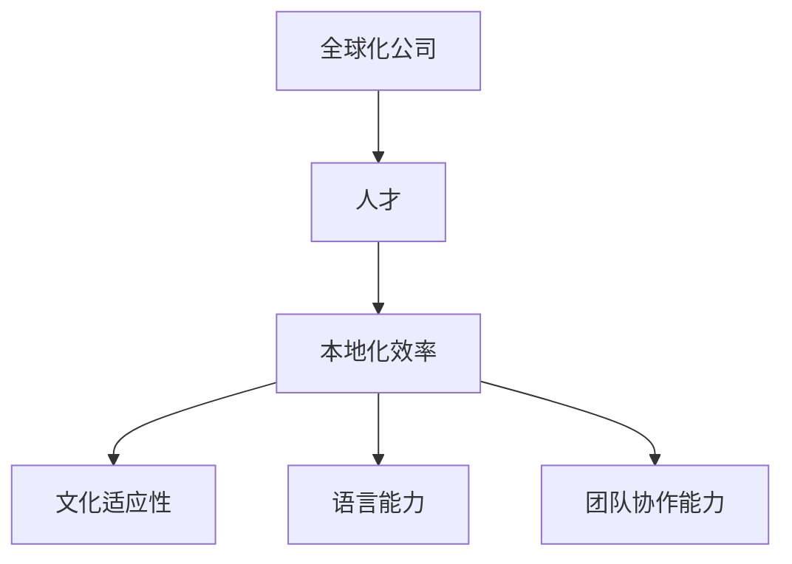
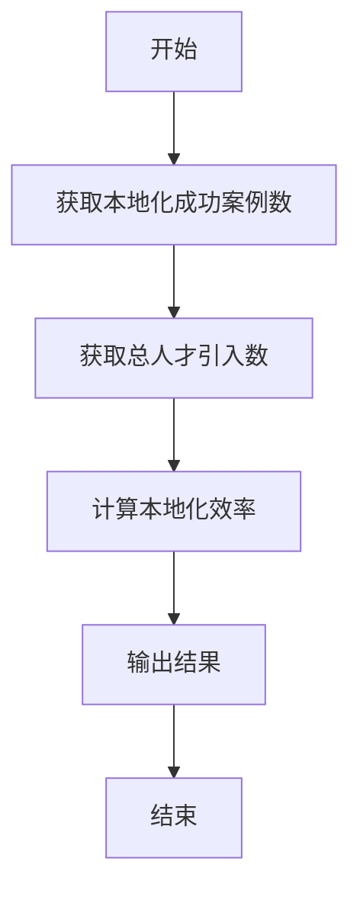
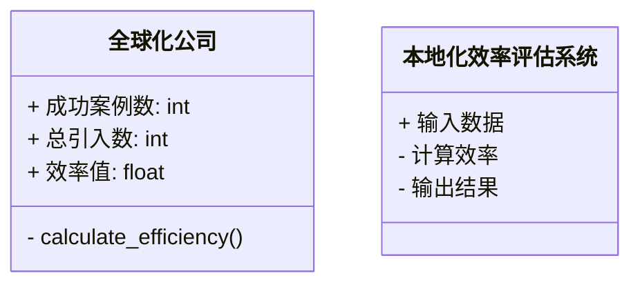
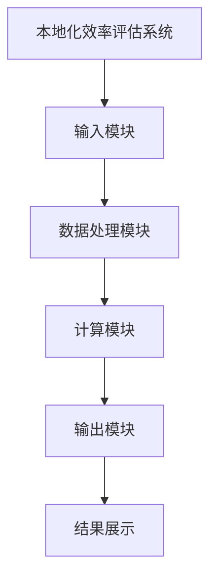
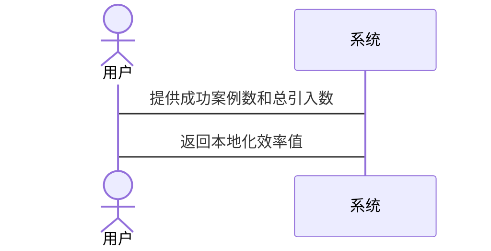

                 


# 彼得林奇如何评估公司的全球化人才本地化效率

> 关键词：彼得林奇，全球化人才，本地化效率，人才评估，投资策略

> 摘要：本文将详细介绍彼得林奇在评估全球化公司人才本地化效率方面的方法和策略。通过系统的分析和案例研究，探讨如何利用彼得林奇的评估模型来优化公司的人才管理效率，实现全球化业务的高效运作。

---

## 第一部分：引言

### 第1章：彼得林奇与全球化人才本地化效率

#### 1.1 彼得林奇的背景与投资理念
彼得·林奇（Peter Lynch）是全球著名的投资专家，曾任富达投资集团（Fidelity Investments）的基金经理，创造了卓越的投资业绩。他的投资理念强调对公司的深入了解，关注公司的基本面和长期发展潜力。彼得林奇的成功不仅在于他的投资策略，更在于他对公司内部管理的关注，尤其是对人才的本地化管理。

#### 1.2 全球化人才本地化效率的定义与重要性
在全球化背景下，公司需要在全球范围内吸引和管理人才。然而，人才的本地化效率直接影响公司的全球化战略执行。本地化效率是指公司在跨国经营中，将引入的人才快速融入当地文化、语言和市场环境的能力。高效率的本地化管理能够提升团队协作能力，降低管理成本，并增强公司的市场竞争力。

---

## 第二部分：全球化人才本地化效率的核心概念

### 第2章：全球化人才本地化效率的核心要素

#### 2.1 本地化效率的核心概念
- **文化适应性**：人才是否能够快速适应目标市场的文化差异。
- **语言能力**：人才是否具备目标市场的语言能力。
- **团队协作能力**：人才是否能够与本地团队高效协作。

#### 2.2 核心概念的属性特征对比
| 核心要素       | 特性描述                     |
|----------------|------------------------------|
| 文化适应性     | 是否具备跨文化敏感性         |
| 语言能力       | 是否掌握目标市场语言         |
| 团队协作能力   | 是否能够融入团队并高效合作   |

#### 2.3 实体关系图


---

## 第三部分：全球化人才本地化效率的评估模型

### 第3章：彼得林奇的评估方法

#### 3.1 本地化效率的数学模型与公式
彼得林奇提出的本地化效率计算公式为：
$$
\text{本地化效率} = \frac{\text{本地化成功案例数}}{\text{总人才引入数}}
$$
其中，本地化成功案例数是指引入的人才在目标市场成功融入并表现出色的数量，总人才引入数是公司引入的总人数。

#### 3.2 评估模型的属性特征
| 模型参数       | 描述                     |
|----------------|--------------------------|
| 成功案例数     | 本地化成功的人才数量     |
| 总引入数       | 公司引入的总人才数量     |
| 效率值         | 本地化效率计算结果       |

#### 3.3 评估模型的流程图


#### 3.4 代码实现
以下是一个简单的Python代码示例，用于计算本地化效率：
```python
def calculate_localization_efficiency(success_cases, total_cases):
    if total_cases == 0:
        return 0.0
    return success_cases / total_cases

# 示例数据
success_cases = 85
total_cases = 100
efficiency = calculate_localization_efficiency(success_cases, total_cases)
print(f"本地化效率为：{efficiency}")
```

---

## 第四部分：全球化人才本地化效率的系统架构

### 第4章：系统架构与实现

#### 4.1 系统功能设计


#### 4.2 系统架构设计


#### 4.3 系统接口设计
- 输入接口：接收成功案例数和总引入数。
- 输出接口：返回本地化效率值。

#### 4.4 系统交互设计


---

## 第五部分：项目实战

### 第5章：全球化人才本地化效率评估的实战案例

#### 5.1 项目背景与目标
某跨国公司希望评估其在全球市场的本地化效率，以优化人才管理策略。

#### 5.2 环境安装与数据准备
- 数据来源：公司内部员工数据库。
- 数据清洗：去除无效数据，确保数据准确性。

#### 5.3 核心代码实现
```python
def calculate_localization_efficiency(success_cases, total_cases):
    if total_cases == 0:
        return 0.0
    return success_cases / total_cases

# 示例数据
success_cases = 85
total_cases = 100
efficiency = calculate_localization_efficiency(success_cases, total_cases)
print(f"本地化效率为：{efficiency}")
```

#### 5.4 案例分析
通过代码实现，我们得出该公司的本地化效率为85%。这表明公司在人才本地化方面表现良好，但仍需进一步优化。

---

## 第六部分：总结与展望

### 第6章：总结与展望

#### 6.1 最佳实践
- 定期评估本地化效率，及时调整管理策略。
- 提供跨文化培训，提升人才的适应能力。

#### 6.2 小结
通过彼得林奇的评估方法和系统的本地化效率管理，公司能够更高效地在全球市场中运作，实现可持续发展。

#### 6.3 注意事项
- 数据准确性是评估的基础，需确保数据来源可靠。
- 需根据实际情况调整评估模型，避免一刀切。

#### 6.4 拓展阅读
- 《彼得·林奇的成功投资策略》
- 《全球化人才管理的实践与创新》

---

## 作者信息

作者：AI天才研究院/AI Genius Institute & 禅与计算机程序设计艺术 /Zen And The Art of Computer Programming

---

以上是《彼得林奇如何评估公司的全球化人才本地化效率》的完整目录和文章内容，希望对您有所帮助！

