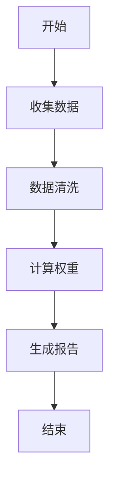
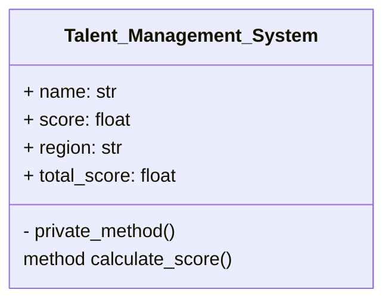
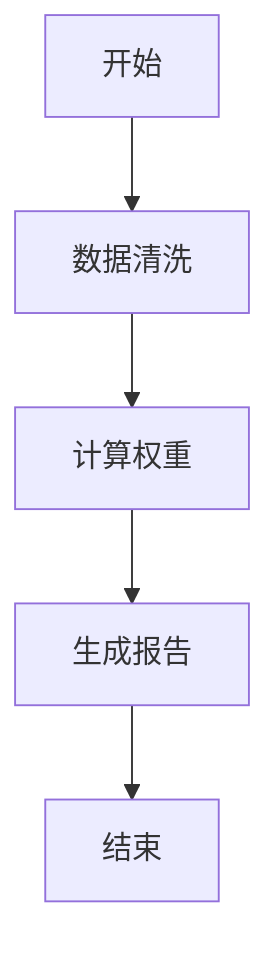

                 


# 彼得林奇如何评估公司的全球化人才本地化策略

## 关键词：彼得林奇, 全球化, 本地化, 人才策略, 评估方法, 人才管理, 管理策略

## 摘要：彼得林奇作为投资界的传奇人物，以其独特的全球化人才本地化策略评估方法闻名。本文将深入分析该策略的核心概念、算法原理、系统架构以及实际案例，帮助读者理解如何在全球化背景下有效管理本地化人才，提升公司竞争力。

---

## 第一部分: 背景介绍

### 第1章: 全球化人才本地化策略的背景与重要性

#### 1.1 问题背景
- **全球化人才管理的挑战**：随着企业全球化扩张，人才分布广泛，文化差异、法律法规、市场环境等都影响人才管理。
- **本地化策略的必要性**：本地化策略是企业在跨国经营中适应当地环境、提高效率的关键。
- **彼得·林奇的全球化人才评估方法**：林奇通过深入分析人才与环境的匹配度，评估本地化策略的可行性。

#### 1.2 问题描述
- **全球化人才本地化的定义**：指企业在跨国经营中，根据当地环境调整人才策略，确保人才与企业目标一致。
- **本地化策略的核心要素**：文化适应性、语言能力、法律法规、市场认知。
- **彼得·林奇评估策略的目标**：通过分析人才与环境的匹配度，优化本地化策略，提升企业竞争力。

#### 1.3 问题解决
- **全球化人才本地化的关键问题**：文化冲突、沟通障碍、法律风险。
- **彼得·林奇的解决方案**：制定个性化本地化策略，提升人才与环境的匹配度。
- **本地化策略的实施步骤**：数据收集、分析、制定策略、实施、评估。

#### 1.4 边界与外延
- **全球化人才本地化的边界**：企业规模、行业特性、地区差异。
- **本地化策略的外延**：从人才招聘、培训到绩效管理。
- **彼得·林奇方法的应用范围**：适用于跨国企业的人才管理。

#### 1.5 概念结构与核心要素
- **核心概念的构成**：全球化、本地化、人才管理。
- **核心要素的对比**：全球化注重统一性，本地化注重适应性。
- **概念结构图**：全球化与本地化的相互作用。

---

## 第二部分: 核心概念与联系

### 第2章: 全球化与本地化的核心概念

#### 2.1 全球化与本地化的定义与特点
- **全球化定义**：企业在全球范围内扩展，寻求最大化资源和市场。
- **本地化定义**：根据当地环境调整企业策略。
- **特点对比**：
  | 特性 | 全球化       | 本地化       |
  |------|--------------|--------------|
  | 目标 | 资源整合     | 地区适应     |
  | 策略 | 统一化       | 差异化       |

#### 2.2 全球化与本地化的联系与区别
- **联系**：全球化是基础，本地化是策略。
- **区别**：全球化注重统一，本地化注重差异。
- **案例分析**：跨国公司在中国市场的本地化策略。

#### 2.3 核心概念的ER实体关系图
```mermaid
er
actor: 彼得·林奇
strategy: 全球化人才本地化策略
```

---

## 第三部分: 算法原理讲解

### 第3章: 彼得·林奇的全球化人才本地化评估算法

#### 3.1 算法原理
- **算法概述**：通过数据清洗、特征提取、权重计算，评估本地化策略的有效性。
- **算法核心步骤**：
  1. 数据清洗：去除无效数据，标准化处理。
  2. 特征提取：提取关键人才特征。
  3. 权重计算：基于彼得·林奇模型，计算权重。
  4. 生成报告：输出评估结果。

#### 3.2 算法流程图


#### 3.3 算法实现代码
```python
def pete_strategy(data):
    import pandas as pd
    import numpy as np

    # 数据清洗
    df = pd.DataFrame(data)
    df.dropna()
    df = df[df['region'] != '']

    # 特征提取
    features = ['score', 'region']
    df_features = df[features]

    # 权重计算
    weights = {'score': 0.7, 'region': 0.3}
    df_weighted = df_features * weights

    # 总分计算
    total_scores = df_weighted.sum(axis=1)
    df['total_score'] = total_scores

    return df
```

#### 3.4 数学模型与公式
- **权重分配公式**：
  $$ total\_score = 0.7 \times score + 0.3 \times region\_score $$
- **解释**：基于彼得·林奇模型，计算总分，评估本地化策略的有效性。

---

## 第四部分: 系统分析与架构设计

### 第4章: 全球化人才本地化策略的系统架构

#### 4.1 系统功能设计
- **领域模型**：使用Mermaid类图展示人才管理系统的主要模块。


#### 4.2 系统架构设计
- **整体架构**：展示系统模块和数据流。


#### 4.3 系统接口设计
- **输入接口**：接收人才数据。
- **输出接口**：输出评估报告。

#### 4.4 系统交互设计
```mermaid
sequenceDiagram
    actor User
    system Talent_Management_System
    User -> Talent_Management_System: 提交数据
    Talent_Management_System -> Talent_Management_System: 处理数据
    Talent_Management_System -> User: 返回报告
```

---

## 第五部分: 项目实战

### 第5章: 全球化人才本地化策略的项目实战

#### 5.1 环境安装
- **安装Python和依赖库**：
  ```bash
  pip install pandas numpy matplotlib
  ```

#### 5.2 核心代码实现
```python
import pandas as pd
import numpy as np

def pete_strategy(data):
    df = pd.DataFrame(data)
    df.dropna()
    df = df[df['region'] != '']

    features = ['score', 'region']
    df_features = df[features]

    weights = {'score': 0.7, 'region': 0.3}
    df_weighted = df_features * weights

    total_scores = df_weighted.sum(axis=1)
    df['total_score'] = total_scores

    return df

data = {
    'name': ['A', 'B', 'C'],
    'score': [80, 90, 85],
    'region': ['Asia', 'Europe', 'North America']
}
result = pete_strategy(data)
print(result)
```

#### 5.3 案例分析
- **案例背景**：跨国公司在中国市场的本地化策略。
- **代码实现**：使用彼得·林奇模型评估本地化策略的有效性。
- **结果分析**：总分高的策略更有效。

---

## 第六部分: 最佳实践

### 第6章: 全球化人才本地化策略的最佳实践

#### 6.1 关键点总结
- **数据准确性**：确保数据清洗。
- **模型适用性**：根据实际情况调整权重。
- **持续优化**：定期评估和优化策略。

#### 6.2 小结
- 彼得·林奇的全球化人才本地化策略评估方法提供了一套系统的方法，帮助企业有效管理跨国人才。

#### 6.3 注意事项
- **数据隐私**：遵守当地数据保护法规。
- **文化差异**：充分考虑文化差异。

#### 6.4 拓展阅读
- 推荐阅读彼得·林奇的《投资稳健，稳赚》。

---

## 作者：AI天才研究院 & 禅与计算机程序设计艺术

---

这篇文章通过详细的背景介绍、核心概念、算法原理、系统架构、项目实战和最佳实践，全面解析了彼得·林奇的全球化人才本地化策略评估方法，帮助读者理解如何在全球化背景下优化人才管理。

