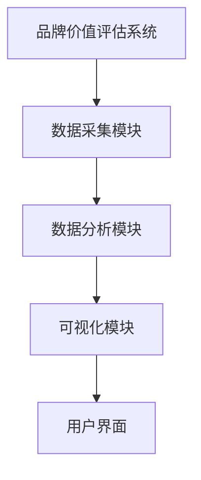
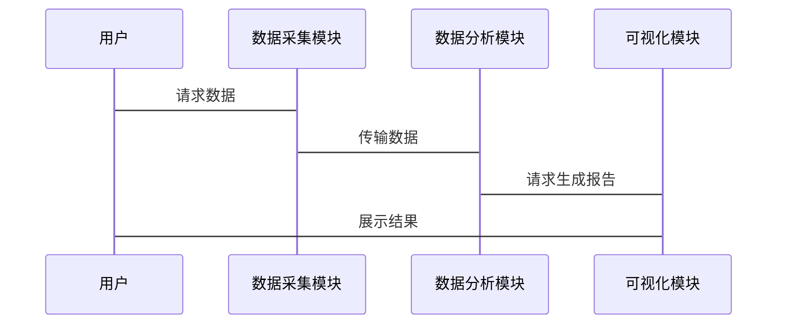

                 

# 彼得林奇如何评估公司的品牌价值

## 关键词
品牌价值, 彼得林奇, 投资分析, 品牌评估方法, 企业价值

## 摘要
本文将详细探讨彼得·林奇如何评估公司的品牌价值。通过分析品牌价值的定义、构成要素、评估指标、评估方法论、定量评估模型、系统架构设计和项目实战案例，结合数学模型和实际案例分析，全面解析彼得·林奇的品牌价值评估体系。文章末尾将给出最佳实践和未来展望。

---

# 第一部分: 引言

## 第1章: 什么是品牌价值

### 1.1 品牌价值的定义与重要性
#### 1.1.1 品牌价值的定义
品牌价值是指品牌在市场中所代表的经济价值，它反映了消费者对品牌的认知、信任和忠诚度。品牌价值不仅仅是品牌知名度的体现，还包括品牌在市场中的竞争力和盈利能力。

#### 1.1.2 品牌价值的重要性
品牌价值是企业核心竞争力的重要组成部分。高品牌价值意味着企业能够在市场中获得更高的市场份额、更强的议价能力和更稳定的客户群体。品牌价值也是企业估值的重要指标，尤其是在并购和上市过程中。

#### 1.1.3 品牌价值与企业价值的关系
品牌价值与企业价值密切相关。品牌价值的提升能够显著提高企业的市场价值，尤其是在消费品、科技和金融等行业。品牌价值的评估是企业战略规划和投资决策的重要依据。

## 第2章: 彼得·林奇的投资理念

### 2.1 彼得·林奇的背景介绍
#### 2.1.1 彼得·林奇的生平
彼得·林奇（Peter Lynch）是美国著名的投资专家，曾任富达麦哲伦基金的经理。他以卓越的投资业绩和独特的投资理念闻名，被誉为“股票投资的传奇”。

#### 2.1.2 彼得·林奇的投资风格
彼得·林奇的投资风格注重基本面分析和长期投资。他认为，成功的投资取决于对企业基本面的深入研究和对行业趋势的准确判断。

#### 2.1.3 彼得·林奇的核心投资理念
彼得·林奇强调，投资者应该选择那些具有强大品牌价值、良好财务状况和竞争优势的企业进行投资。他认为，品牌价值是企业长期盈利能力的重要保障。

### 2.2 彼得·林奇的品牌价值评估方法
#### 2.2.1 品牌价值评估的核心思想
彼得·林奇认为，品牌价值是企业市场地位和消费者认知的综合体现。品牌价值的评估需要结合企业的财务数据、市场表现和行业竞争环境。

#### 2.2.2 彼得·林奇的品牌价值评估框架
彼得·林奇的品牌价值评估框架包括以下几个步骤：
1. 品牌知名度分析
2. 品牌美誉度分析
3. 市场定位与竞争对手分析
4. 财务数据与盈利能力分析
5. 品牌忠诚度与客户保留率分析

#### 2.2.3 品牌价值评估的误区与注意事项
彼得·林奇提醒投资者，品牌价值评估需要注意以下几点：
- 避免仅关注品牌知名度，忽视品牌忠诚度
- 避免过度依赖市场数据，忽略消费者实际体验
- 避免忽略行业竞争环境的变化

---

# 第二部分: 品牌价值评估的核心概念与联系

## 第3章: 品牌价值的构成要素

### 3.1 品牌的核心要素
#### 3.1.1 品牌知名度
品牌知名度是指品牌在市场中的认知程度。高知名度意味着品牌更容易被消费者识别和选择。

#### 3.1.2 品牌美誉度
品牌美誉度是指消费者对品牌的信任和满意度。高美誉度意味着品牌更容易获得消费者的忠诚。

#### 3.1.3 品牌忠诚度
品牌忠诚度是指消费者在面对竞争对手时，仍然选择该品牌产品的程度。高忠诚度意味着品牌具有强大的市场竞争力。

### 3.2 品牌价值的影响因素
#### 3.2.1 市场定位
市场定位是指企业在市场中所占据的位置和目标客户群体。清晰的市场定位能够帮助企业更好地满足客户需求，提高品牌价值。

#### 3.2.2 产品特性
产品特性是指产品的质量、功能和创新性。优质的产品特性是品牌价值的重要保障。

#### 3.2.3 财务表现
财务表现是指企业的盈利能力、资产负债状况和现金流情况。良好的财务表现能够提高企业的市场价值和品牌价值。

#### 3.2.4 竞争环境
竞争环境是指行业内的竞争状况和市场趋势。竞争优势是品牌价值的重要来源。

### 3.3 品牌价值的评估指标
#### 3.3.1 品牌强度指数
品牌强度指数是衡量品牌竞争力的重要指标，包括品牌知名度、美誉度和忠诚度的综合评估。

#### 3.3.2 市场占有率
市场占有率是指企业在市场中的销售比例。高市场占有率意味着品牌具有强大的市场影响力。

#### 3.3.3 品牌溢价能力
品牌溢价能力是指品牌产品在价格上能够高于竞争对手的能力。强大的品牌溢价能力是品牌价值的重要体现。

## 第4章: 品牌价值评估的核心模型

### 4.1 品牌价值评估的数学模型
#### 4.1.1 品牌价值公式
$$ 品牌价值 = 品牌强度 \times 市场潜力 $$

#### 4.1.2 品牌强度的计算公式
$$ 品牌强度 = 品牌知名度 \times 品牌忠诚度 \times 品牌美誉度 $$

#### 4.1.3 市场潜力的评估公式
$$ 市场潜力 = 市场规模 \times 市场增长率 \times 市场竞争地位 $$

---

# 第三部分: 品牌价值评估的方法论

## 第5章: 评估方法论

### 5.1 基础面分析
#### 5.1.1 品牌知名度分析
通过市场调研和数据分析，评估品牌在目标市场中的认知程度。

#### 5.1.2 品牌美誉度分析
通过消费者调查和社交媒体分析，评估消费者对品牌的信任和满意度。

#### 5.1.3 品牌忠诚度分析
通过客户保留率和复购率分析，评估消费者对品牌的忠诚程度。

### 5.2 市场定位与竞争对手分析
#### 5.2.1 市场定位分析
通过分析企业的目标市场和竞争对手，确定品牌在市场中的定位。

#### 5.2.2 竞争对手分析
通过分析竞争对手的品牌价值、市场表现和财务状况，评估企业的竞争优势。

### 5.3 财务数据分析
#### 5.3.1 财务数据收集
收集企业的财务报表，包括收入、利润、资产负债表等。

#### 5.3.2 财务数据分析
通过财务数据分析，评估企业的盈利能力、现金流和资产负债状况。

### 5.4 定量评估模型
#### 5.4.1 品牌强度指数计算
通过品牌知名度、美誉度和忠诚度的综合评估，计算品牌强度指数。

#### 5.4.2 市场潜力评估
通过市场规模、增长率和竞争地位分析，评估市场潜力。

---

# 第四部分: 系统架构设计

## 第6章: 系统架构设计

### 6.1 系统功能设计
#### 6.1.1 数据采集模块
负责收集品牌相关的市场数据、财务数据和消费者反馈。

#### 6.1.2 数据分析模块
负责对数据进行清洗、建模和分析，计算品牌强度指数和市场潜力。

#### 6.1.3 可视化模块
负责将分析结果以图表和报告的形式展示，便于用户理解和决策。

### 6.2 系统架构设计

### 6.3 系统接口设计
系统接口设计包括数据接口和用户接口。数据接口用于与其他系统的数据交换，用户接口用于用户的交互和结果展示。

### 6.4 系统交互设计

---

# 第五部分: 项目实战

## 第7章: 项目实战

### 7.1 案例分析
#### 7.1.1 可口可乐公司
通过分析可口可乐的品牌价值，展示如何应用彼得·林奇的方法进行评估。

#### 7.1.2 苹果公司
通过分析苹果公司的品牌价值，展示如何应用彼得·林奇的方法进行评估。

### 7.2 数据收集与分析
#### 7.2.1 数据来源
包括市场调研数据、财务报表和消费者反馈。

#### 7.2.2 数据分析
通过数据分析模块，计算品牌强度指数和市场潜力。

### 7.3 分析结果解读
#### 7.3.1 品牌强度指数
展示品牌强度指数的计算结果及其对品牌价值的影响。

#### 7.3.2 市场潜力评估
展示市场潜力的评估结果及其对品牌价值的影响。

---

# 第六部分: 总结与展望

## 第8章: 总结与展望

### 8.1 总结
总结彼得·林奇品牌价值评估方法的核心思想和实际应用。

### 8.2 未来展望
展望品牌价值评估的未来发展方向，包括人工智能和大数据技术的应用。

---

## 最佳实践 tips
- 在品牌价值评估中，数据的准确性和完整性至关重要。
- 建议结合定量和定性分析，全面评估品牌价值。
- 定期更新品牌价值评估体系，以适应市场变化。

## 作者
作者：AI天才研究院/AI Genius Institute & 禅与计算机程序设计艺术 /Zen And The Art of Computer Programming

