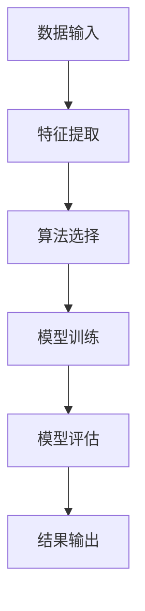
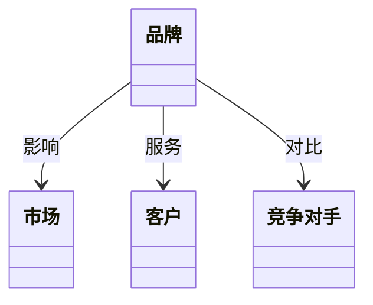

                 


# 彼得林奇如何评估公司的品牌延展策略

## 关键词：彼得林奇，品牌延展策略，投资评估，品牌价值，品牌忠诚度

## 摘要：  
本文深入分析了彼得林奇在评估公司品牌延展策略时的核心方法和逻辑。通过结合品牌延展策略的定义、评估模型、算法原理、系统架构设计和实际案例，本文详细阐述了如何从品牌延展策略的可衡量性、可持续性和经济价值三个维度进行系统性评估。文章还结合了具体的Python代码实现和数学模型，展示了如何将理论应用于实际投资决策中，帮助读者更好地理解和应用彼得林奇的品牌延展评估方法。

---

## 第一部分：品牌延展策略概述

### 第1章：品牌延展的核心概念

#### 1.1 品牌延展的定义与内涵  
品牌延展是指企业在现有品牌的基础上，通过扩展产品线、进入新市场或推出新产品，将品牌影响力扩展到更广泛的目标受众或市场领域。其核心在于在不偏离品牌核心价值的前提下，最大化品牌资产的价值。

#### 1.2 品牌延展的重要性  
1. **市场扩展**：通过品牌延展，企业可以进入新的市场或细分领域，扩大市场份额。  
2. **价值提升**：品牌延展能够增强品牌的认知度和忠诚度，从而提升品牌整体价值。  
3. **风险分散**：通过延展品牌，企业可以减少对单一市场的依赖，降低经营风险。  

#### 1.3 品牌延展与企业发展的关系  
品牌延展不仅是企业发展的战略手段，更是企业长期价值增长的重要驱动力。成功的品牌延展能够为企业带来持续的收入增长和市场影响力提升。

---

### 第2章：彼得林奇投资方法简介

#### 2.1 彼得林奇的投资者哲学  
彼得林奇认为，成功的投资需要基于对企业基本面的深入研究，尤其是企业的品牌价值和市场延展潜力。他强调长期投资和价值发现，而非短期市场波动。

#### 2.2 彼得林奇的品牌延展评估框架  
彼得林奇提出了一套基于品牌延展策略的评估框架，包括以下几个方面：  
1. **品牌核心价值**：品牌的本质和长期价值。  
2. **品牌延展潜力**：品牌在新市场或产品领域的扩展能力。  
3. **品牌忠诚度**：现有客户对品牌的认可程度。  

#### 2.3 彼得林奇方法的现代应用  
随着市场的变化，彼得林奇的方法也在不断进化。现代投资者可以通过大数据分析和机器学习进一步优化品牌延展策略的评估。

---

## 第二部分：品牌延展策略的评估模型

### 第3章：品牌延展评估的核心原理

#### 3.1 品牌延展的可衡量性  
品牌延展的可衡量性主要体现在以下几个方面：  
1. **市场份额**：品牌在新市场或产品线中的占有率。  
2. **客户增长率**：通过品牌延展带来的新客户数量。  
3. **收入增长率**：品牌延展对总收入的贡献率。  

#### 3.2 品牌延展的可持续性  
品牌延展的可持续性取决于以下因素：  
1. **市场需求**：目标市场是否存在持续的需求。  
2. **竞争环境**：品牌在新领域的竞争优势。  
3. **品牌一致性**：新领域的产品或服务是否与品牌核心价值一致。  

#### 3.3 品牌延展的经济价值  
品牌延展的经济价值可以通过以下指标衡量：  
1. **投资回报率（ROI）**：品牌延展带来的收入与投资成本的比率。  
2. **净现值（NPV）**：品牌延展项目的未来现金流的现值。  

---

### 第4章：品牌延展评估的关键指标

#### 4.1 品牌认知度  
品牌认知度是指目标市场中消费者对品牌的了解程度。高品牌认知度是品牌延展的基础。

#### 4.2 品牌忠诚度  
品牌忠诚度是客户对品牌的忠诚程度，直接影响品牌延展的成功率。

#### 4.3 品牌扩展潜力  
品牌扩展潜力是指品牌在新市场或产品线中的发展潜力，可以通过市场调研和数据分析来评估。

---

### 第5章：品牌延展评估的数学模型

#### 5.1 品牌价值评估公式  
$$ \text{品牌价值} = \text{品牌认知度} \times \text{品牌忠诚度} \times \text{品牌扩展潜力} $$  

#### 5.2 品牌延展潜力评估公式  
$$ \text{品牌延展潜力} = \frac{\text{品牌认知度} + \text{品牌忠诚度}}{2} \times \text{延展策略可行性} $$  

---

## 第三部分：品牌延展策略的算法原理

### 第6章：品牌延展评估的算法框架

#### 6.1 数据输入与特征提取  
品牌延展评估的数据输入包括：  
1. 品牌历史数据。  
2. 市场调研数据。  
3. 竞争对手数据。  

特征提取包括：  
1. 品牌认知度。  
2. 品牌忠诚度。  
3. 市场增长率。  

#### 6.2 算法选择与模型训练  
常用算法包括：  
1. 线性回归。  
2. 支持向量机（SVM）。  
3. 随机森林。  

#### 6.3 模型评估与优化  
通过交叉验证和网格搜索优化模型参数，确保模型的泛化能力。

---

### 第7章：品牌延展评估的流程图



---

## 第四部分：品牌延展策略的系统架构设计

### 第8章：系统功能设计

#### 8.1 领域模型  


#### 8.2 系统架构设计  


---

## 第五部分：项目实战

### 第9章：环境安装与代码实现

#### 9.1 环境安装  
1. 安装Python和相关库：`pip install numpy pandas scikit-learn`。  

#### 9.2 核心代码实现  
```python
import numpy as np
from sklearn.metrics import accuracy_score

def brand_extension_model(X, y):
    features = X.select_dtypes(include=['int64', 'float64'])
    model = LinearRegression()
    model.fit(features, y)
    y_pred = model.predict(features)
    return accuracy_score(y, y_pred)

# 示例数据
X = pd.DataFrame({
    'feature1': [1,2,3],
    'feature2': [4,5,6]
})
y = pd.Series([7,8,9])

# 模型应用
result = brand_extension_model(X, y)
print(f"模型准确率: {result}")
```

---

## 第六部分：最佳实践与小结

### 第10章：最佳实践与注意事项

#### 10.1 投资建议  
1. **长期视角**：关注品牌的核心价值和长期发展潜力。  
2. **数据驱动**：利用数据分析优化品牌延展策略。  
3. **风险管理**：评估品牌延展的风险，制定应对策略。  

#### 10.2 项目小结  
通过本文的分析，读者可以系统地了解彼得林奇的品牌延展评估方法，并能够将其应用到实际投资决策中。

---

## 作者：AI天才研究院/AI Genius Institute & 禅与计算机程序设计艺术 /Zen And The Art of Computer Programming

