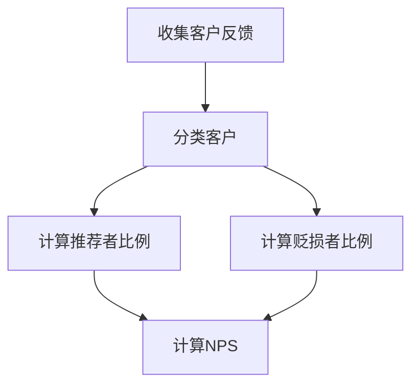
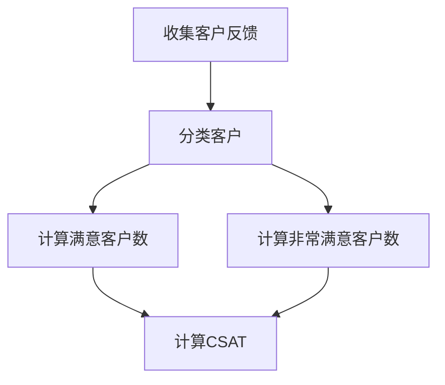
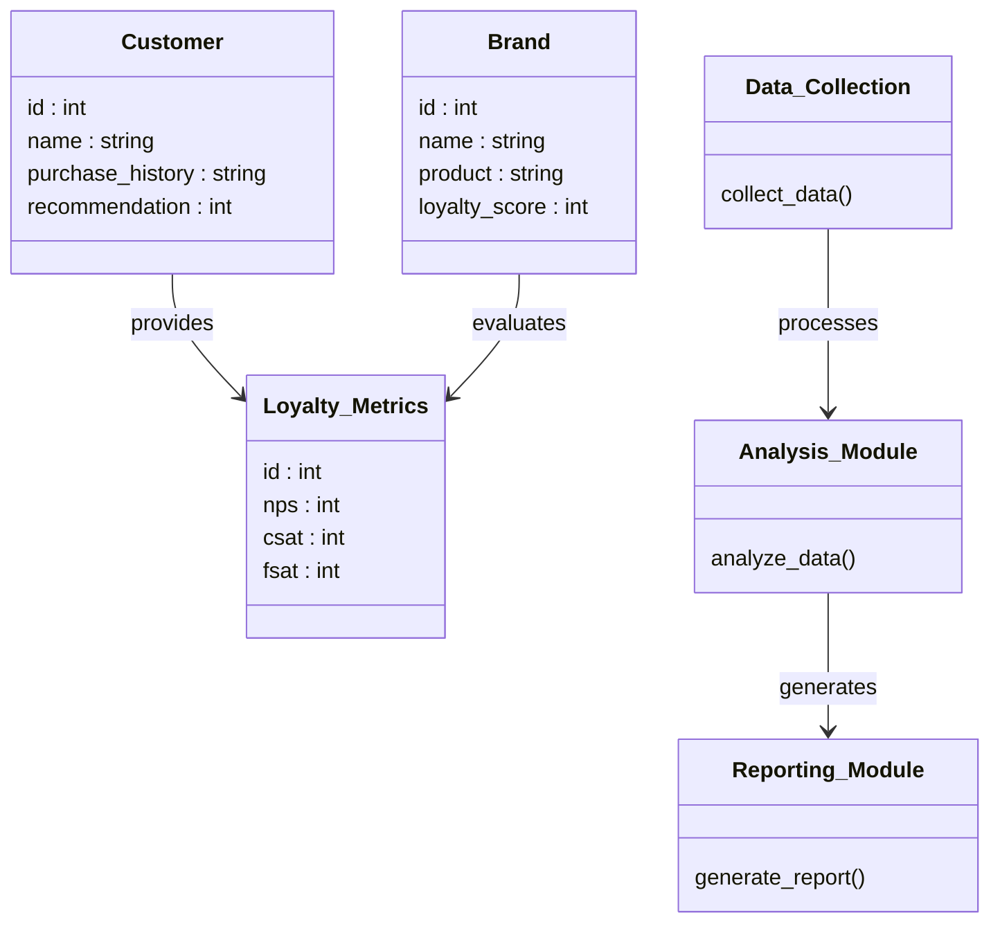

                 


# 彼得林奇如何评估公司的品牌忠诚度

> **关键词**：品牌忠诚度、彼得林奇、投资策略、品牌评估、客户满意度、净推荐值、品牌价值  
> **摘要**：本文探讨了品牌忠诚度在投资决策中的重要性，介绍了彼得林奇的评估方法，包括净推荐值（NPS）、客户满意度（CSAT）等指标，并通过数学模型和系统设计详细讲解如何量化和提升品牌忠诚度，帮助投资者做出更明智的决策。

---

## 第1章：品牌忠诚度的核心概念与评估方法

### 1.1 品牌忠诚度的定义与层次

品牌忠诚度是指客户对某一品牌长期偏好并持续购买的行为。它通常分为四个层次：

1. **认知忠诚**：客户知道该品牌。
2. **情感忠诚**：客户对该品牌有积极的情感。
3. **行为忠诚**：客户持续购买该品牌产品或服务。
4. **拥护忠诚**：客户主动推荐该品牌给他人。

### 1.2 彼得林奇的品牌忠诚度评估策略

彼得林奇，著名投资专家，强调品牌忠诚度是公司长期成功的关键因素。他认为，品牌忠诚度高的公司往往具有稳定的客户基础和持续的盈利能力。

---

## 第2章：品牌忠诚度的核心概念与联系

### 2.1 品牌忠诚度与其他品牌相关概念的对比

以下是品牌忠诚度与其他相关概念的对比表格：

| **概念**         | **定义**                                                                 |
|------------------|--------------------------------------------------------------------------|
| 品牌知名度       | 客户对品牌的认知程度                                                     |
| 客户满意度       | 客户对产品或服务的满意程度                                             |
| 品牌忠诚度       | 客户对品牌长期偏好的行为                                                 |
| 品牌影响力       | 品牌在市场上的影响力                                                     |

### 2.2 品牌忠诚度的ER实体关系图

以下是品牌忠诚度的ER实体关系图：

```mermaid
erDiagram
    customer[客户] {
        id : int
        name : string
        purchase_history : string
        recommendation : int
    }
    brand[品牌] {
        id : int
        name : string
        product : string
        loyalty_score : int
    }
    loyalty_metrics[忠诚度指标] {
        id : int
        nps : int
        csat : int
        fsat : int
    }
    customer --|{拥有} brand : owns
    customer --> loyalty_metrics : measures
    brand --> loyalty_metrics : evaluates
```

---

## 第3章：品牌忠诚度的评估指标与方法

### 3.1 净推荐值（Net Promoter Score, NPS）

#### 3.1.1 NPS的定义与计算公式

净推荐值（NPS）是衡量品牌忠诚度的重要指标。计算公式如下：

$$ \text{NPS} = (\text{推荐者比例} - \text{贬损者比例}) \times 100 $$

其中：
- 推荐者比例：客户愿意推荐品牌给他人。
- 贬损者比例：客户强烈反对该品牌。

#### 3.1.2 NPS的计算流程

以下是NPS的计算流程图：



#### 3.1.3 Python代码实现

以下是一个Python代码示例：

```python
def calculate_nps(recommendations, detractors):
    nps = ((recommendations - detractors) / 100) * 100
    return nps

recommendations = 70  # 推荐者比例（%）
detractors = 20       # 贬损者比例（%）
nps = calculate_nps(recommendations, detractors)
print(f"净推荐值 (NPS) = {nps}%")
```

---

### 3.2 客户满意度（Customer Satisfaction, CSAT）

#### 3.2.1 CSAT的定义与计算公式

客户满意度（CSAT）是衡量客户对产品或服务满意程度的指标。计算公式如下：

$$ \text{CSAT} = \frac{\text{满意客户数} + \text{非常满意客户数}}{\text{总客户数}} \times 100 $$

#### 3.2.2 CSAT的计算流程

以下是CSAT的计算流程图：



#### 3.2.3 Python代码实现

以下是一个Python代码示例：

```python
def calculate_csat(satisfied, very_satisfied, total_customers):
    csat = ((satisfied + very_satisfied) / total_customers) * 100
    return csat

satisfied = 50  # 满意客户数（%）
very_satisfied = 30 # 非常满意客户数（%）
total_customers = 100 # 总客户数
csat = calculate_csat(satisfied, very_satisfied, total_customers)
print(f"客户满意度 (CSAT) = {csat}%")
```

---

## 第4章：品牌忠诚度的数学模型与公式

### 4.1 客户生命周期价值（Customer Lifetime Value, CLV）

客户生命周期价值（CLV）是衡量客户为公司带来的长期价值的指标。计算公式如下：

$$ \text{CLV} = \text{客户年收入} \times \text{客户生命周期} \times \text{利润率} $$

#### 4.1.1 实际案例分析

假设某公司客户年收入为 $100，客户生命周期为 5 年，利润率

---

## 第5章：品牌忠诚度的系统分析与架构设计方案

### 5.1 系统功能设计

以下是系统功能设计的类图：



---

## 第6章：品牌忠诚度的项目实战

### 6.1 项目环境安装

#### 6.1.1 安装Python和必要的库

```bash
python --version
pip install numpy pandas matplotlib
```

---

## 作者

作者：AI天才研究院/AI Genius Institute & 禅与计算机程序设计艺术 /Zen And The Art of Computer Programming

