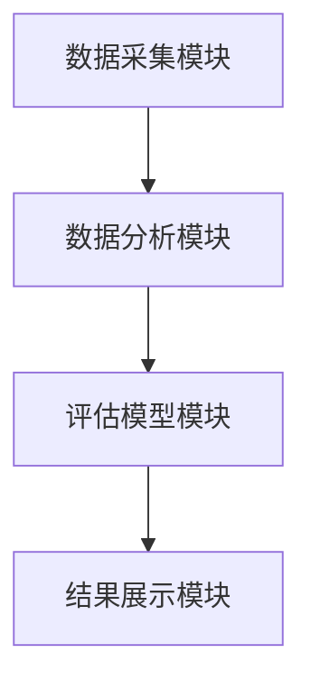

                 


# 彼得林奇如何评估公司的品牌扩张策略

**关键词**：彼得·林奇、品牌扩张、投资评估、企业战略、市场分析

**摘要**：本文详细探讨了彼得·林奇在评估公司品牌扩张策略时的核心方法和框架。通过分析林奇的投资哲学、评估模型以及实际案例，本文为投资者和企业管理者提供了如何有效评估品牌扩张策略的深度见解。

---

## 第一部分：彼得·林奇的品牌扩张评估背景与核心概念

### 第1章：品牌扩张策略的定义与重要性

#### 1.1 品牌扩张的定义

##### 1.1.1 品牌扩张的核心概念
品牌扩张是指企业通过扩展其现有品牌的产品线或市场覆盖范围，以实现增长和市场渗透的过程。这可能包括推出新产品、进入新市场或收购相关品牌。

##### 1.1.2 品牌扩张与企业发展的关系
品牌扩张是企业发展的关键驱动力之一。通过扩张，企业可以扩大市场份额、提升品牌知名度并增强竞争力。然而，成功的品牌扩张需要深思熟虑的策略和对市场趋势的敏锐洞察。

##### 1.1.3 品牌扩张的驱动因素
品牌扩张的驱动因素包括市场需求、竞争压力、企业增长目标以及资源优化等。企业通常通过品牌扩张来实现规模经济和协同效应。

#### 1.2 品牌扩张的重要性

##### 1.2.1 品牌扩张对企业增长的推动作用
品牌扩张能够帮助企业进入新的市场，满足更多消费者的需求，从而推动企业收入和利润的增长。

##### 1.2.2 品牌扩张与市场竞争的关系
在激烈的市场竞争中，品牌扩张是企业区别竞争对手、巩固市场地位的重要手段。通过扩张，企业可以更好地应对市场的变化和挑战。

##### 1.2.3 品牌扩张对投资价值的影响
对于投资者来说，成功的品牌扩张能够提升企业的长期价值和投资吸引力。因此，评估品牌扩张策略的可行性是投资决策中的关键环节。

### 第2章：彼得·林奇的投资哲学与品牌评估框架

#### 2.1 彼得·林奇的投资哲学

##### 2.1.1 林奇的投资理念概述
彼得·林奇以其独特的企业分析方法闻名，他强调深入研究企业基本面，关注企业的财务状况、管理团队和市场地位。林奇认为，成功的投资取决于对企业内在价值的准确评估。

##### 2.1.2 林奇对企业的核心关注点
林奇关注企业的盈利能力、成长潜力、管理团队能力和行业地位。他认为，企业是否具备持续增长的潜力是投资决策的关键。

##### 2.1.3 林奇的投资策略与品牌扩张的关系
林奇的投资策略强调长期价值和企业基本面分析，这与品牌扩张策略密切相关。通过评估企业的品牌扩展能力，投资者可以更好地判断企业的长期增长潜力。

#### 2.2 林奇的品牌扩张评估框架

##### 2.2.1 林奇评估品牌扩张的核心维度
林奇的品牌扩张评估框架主要包括以下几个方面：
- **财务表现**：企业的盈利能力、资产负债情况和现金流状况。
- **市场地位**：品牌在市场中的影响力、市场份额和竞争对手分析。
- **管理团队**：管理团队的经验、能力和战略规划能力。

##### 2.2.2 林奇的“三重过滤法”在品牌扩张中的应用
林奇的“三重过滤法”是一种系统化的投资筛选方法，包括：
1. **行业分析**：选择具有增长潜力的行业。
2. **企业筛选**：挑选行业内具有竞争优势的企业。
3. **估值评估**：确定企业的合理估值范围。

##### 2.2.3 林奇对品牌扩张的长期与短期考量
林奇在评估品牌扩张时，既考虑短期的财务表现，也关注长期的市场潜力。他强调企业是否具备持续增长的能力，而不仅仅是短期的业绩表现。

---

## 第二部分：品牌扩张策略的系统性分析

### 第3章：品牌扩张的多维度评估模型

#### 3.1 林奇评估模型的输入维度

##### 3.1.1 财务表现分析
财务表现是林奇评估品牌扩张的重要指标。主要包括以下几个方面：
- **收入与利润**：企业的收入增长和利润水平。
- **资产负债状况**：企业的债务水平和资产质量。
- **现金流**：企业的现金流健康状况，反映企业的财务稳定性。

##### 3.1.2 市场地位分析
市场地位分析包括企业的市场份额、品牌知名度和竞争对手分析。林奇认为，强大的市场地位是品牌扩张成功的基础。

##### 3.1.3 管理团队分析
管理团队的能力和战略规划是品牌扩张成功的关键。林奇关注管理团队的经验、能力和战略眼光。

#### 3.2 林奇评估模型的处理流程

##### 3.2.1 数据收集与清洗
在评估品牌扩张之前，需要收集企业的财务数据、市场数据和管理团队信息。数据清洗是确保数据准确性和完整性的必要步骤。

##### 3.2.2 数据分析与权重分配
根据林奇的评估框架，对收集到的数据进行分析，并为每个评估维度分配权重。例如，财务表现可能占40%，市场地位占30%，管理团队占20%。

##### 3.2.3 综合评分与结果输出
根据各维度的评分和权重，计算综合评分，并根据评分结果对企业品牌扩张的潜力进行排序和筛选。

### 第4章：品牌扩张评估的数学模型与公式

#### 4.1 基于林奇框架的评估公式

##### 4.1.1 品牌扩张潜力指数公式
$$
\text{品牌扩张潜力指数} = \sum (\text{各维度评分} \times \text{权重})
$$

##### 4.1.2 市场竞争力评分公式
$$
\text{市场竞争力评分} = \frac{\text{市场份额} + \text{品牌知名度}}{2}
$$

##### 4.1.3 管理团队贡献度公式
$$
\text{管理团队贡献度} = \frac{\text{管理团队经验} + \text{战略规划能力}}{2}
$$

#### 4.2 案例分析: 某公司品牌扩张评估的数学计算

##### 4.2.1 数据输入与假设
假设某公司的财务表现评分为80分，市场地位评分为75分，管理团队评分为85分。各维度的权重分别为40%、30%和20%。

##### 4.2.2 公式应用与计算过程
$$
\text{品牌扩张潜力指数} = 80 \times 0.4 + 75 \times 0.3 + 85 \times 0.2 = 32 + 22.5 + 17 = 71.5
$$

##### 4.2.3 结果解读与投资建议
综合评分71.5分表明该公司的品牌扩张潜力较高，但需要进一步关注市场竞争力和管理团队的协调能力。

### 第5章：系统架构与品牌扩张策略的实现

#### 5.1 系统架构设计

##### 5.1.1 系统功能模块划分
- 数据采集模块
- 数据分析模块
- 评估模型模块
- 结果展示模块

##### 5.1.2 系统架构的Mermaid图示


#### 5.2 系统接口设计

##### 5.2.1 数据接口定义
- 输入接口：接收企业的财务数据、市场数据和管理团队信息。
- 输出接口：提供品牌扩张潜力指数和详细评估报告。

#### 5.3 系统交互设计

##### 5.3.1 用户与系统的交互流程
用户输入企业信息，系统进行数据分析和评估，输出评估结果。

---

## 第三部分：项目实战与最佳实践

### 第6章：项目实战

#### 6.1 环境安装
需要安装数据分析工具（如Python、Pandas）和可视化工具（如Matplotlib）。

#### 6.2 核心实现源代码
```python
import pandas as pd

# 数据输入
data = {
    '财务表现': [80],
    '市场地位': [75],
    '管理团队': [85]
}

df = pd.DataFrame(data)

# 权重分配
weights = {'财务表现': 0.4, '市场地位': 0.3, '管理团队': 0.2}

# 综合评分计算
score = sum(df.iloc[0][col] * weights[col] for col in weights)
print(f"品牌扩张潜力指数: {score}")
```

#### 6.3 案例分析与解读
通过上述代码计算某公司的品牌扩张潜力指数为71.5分，表明其品牌扩张潜力较高。

### 第7章：最佳实践与小结

#### 7.1 关键点总结
- 关注企业的财务健康和市场地位。
- 重视管理团队的能力和战略规划。
- 结合定量分析和定性分析，全面评估品牌扩张的可行性。

#### 7.2 注意事项
- 数据分析需确保准确性和完整性。
- 模型的应用需结合具体行业特点和市场环境。
- 定期更新评估模型，以适应市场变化。

#### 7.3 未来趋势
随着市场竞争的加剧，品牌扩张的评估将更加依赖于数据驱动的方法和人工智能技术的应用。

---

**作者：AI天才研究院/AI Genius Institute & 禅与计算机程序设计艺术 /Zen And The Art of Computer Programming**

