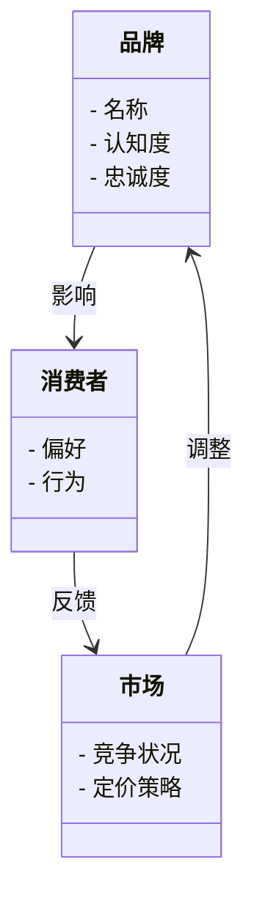

                 


# 彼得·林奇如何评估公司的品牌溢价能力

> 关键词：彼得·林奇，品牌溢价能力，投资分析，品牌价值，品牌忠诚度

> 摘要：本文探讨了彼得·林奇在评估公司品牌溢价能力方面的方法，分析了品牌溢价的核心概念、影响因素、评估方法及数学模型，并通过案例展示了如何应用这些方法进行实际分析。

---

## 第一部分：品牌溢价能力的背景与概念

### 第1章：品牌溢价能力的定义与背景

#### 1.1 品牌溢价能力的定义
- **品牌溢价**是指消费者对某一品牌的产品或服务愿意支付的额外价格，反映了品牌在市场上的影响力和消费者的信任度。
- **核心要素**包括品牌认知度、品牌忠诚度和品牌关联性。

#### 1.2 品牌溢价能力的重要性
- 品牌溢价能力直接影响企业的盈利能力，是企业在市场竞争中保持优势的关键因素。
- 彼得·林奇认为，品牌溢价能力是评估企业长期价值的重要指标，能够反映企业的市场地位和消费者的忠诚度。

#### 1.3 彼得·林奇与品牌溢价能力
- 彼得·林奇的投资理念强调长期价值和竞争优势，他特别关注那些具有强大品牌溢价能力的企业。
- 他通过分析品牌溢价能力来评估企业的长期增长潜力。

---

### 第2章：品牌溢价能力的核心概念

#### 2.1 品牌溢价能力的核心要素
- **品牌认知度**：品牌在市场中的知名度和被认知的程度。
- **品牌忠诚度**：消费者对品牌产品的偏好和忠诚程度。
- **品牌关联性**：品牌与消费者需求的相关性。

#### 2.2 品牌溢价能力的影响因素
- **品牌历史与文化**：历史悠久的品牌更容易建立消费者的信任和忠诚。
- **产品差异化**：独特的产品设计和功能能够提高品牌溢价能力。
- **市场定位与定价策略**：合理的价格策略和精准的市场定位是品牌溢价的基础。

#### 2.3 品牌溢价能力与企业价值的关系
- 品牌溢价能力直接影响企业的利润和市场地位。
- 强大的品牌溢价能力能够提高企业的议价能力和市场竞争优势。

---

### 第3章：品牌溢价能力的评估方法

#### 3.1 品牌溢价能力的定性评估
- **品牌竞争力分析**：评估品牌在市场中的竞争力，包括市场份额和竞争对手分析。
- **市场地位分析**：评估企业在市场中的地位，包括品牌影响力和市场占有率。
- **品牌影响力评估**：通过媒体曝光、口碑传播等指标评估品牌影响力。

#### 3.2 品牌溢价能力的定量评估
- **品牌价值的计算方法**：使用品牌价值评估模型，如Interbrand的品牌价值模型。
- **品牌溢价率的计算公式**：品牌溢价率 = （品牌产品价格 / 同类普通产品价格） - 1。
- **品牌忠诚度的量化指标**：通过消费者调查和数据分析，量化品牌忠诚度。

#### 3.3 彼得·林奇的品牌溢价评估模型
- **模型的构建与原理**：结合定量和定性分析，评估品牌溢价能力。
- **模型的输入变量与输出结果**：输入包括品牌认知度、忠诚度等，输出是品牌溢价能力的评估结果。
- **模型的优缺点与适用场景**：适用于成熟企业和知名品牌。

---

### 第4章：品牌溢价能力的数学模型与公式

#### 4.1 品牌价值计算公式
- 品牌价值 = 营业收入 × 品牌溢价率
- 示例：假设某品牌营业收入为1000万元，品牌溢价率为20%，则品牌价值为200万元。

#### 4.2 品牌溢价率的计算
- 品牌溢价率 = （品牌产品价格 / 同类普通产品价格） - 1
- 示例：品牌产品价格为100元，同类普通产品价格为80元，品牌溢价率为25%。

#### 4.3 品牌忠诚度的量化指标
- 品牌忠诚度指数 = （重复购买率 + 推荐率） / 2
- 示例：重复购买率为80%，推荐率为70%，则品牌忠诚度指数为75%。

---

## 第二部分：品牌溢价能力的系统分析与架构设计

### 第5章：系统分析与架构设计方案

#### 5.1 问题场景介绍
- 分析一个具体品牌（如可口可乐）的品牌溢价能力，从数据收集、模型构建到结果分析。

#### 5.2 系统功能设计
- **领域模型**：使用Mermaid类图展示品牌、消费者、市场等因素的关系。



---

### 第6章：项目实战

#### 6.1 实战环境安装
- **工具选择**：使用Python的Pandas和Scikit-learn库进行数据分析和建模。
- **数据收集**：收集品牌相关数据，包括市场份额、消费者调查等。

#### 6.2 系统核心实现源代码
- 示例代码：计算品牌溢价率。

```python
import pandas as pd

# 假设数据集为brand_data.csv，包含品牌溢价率和市场份额
df = pd.read_csv('brand_data.csv')

# 计算品牌溢价率
df['品牌溢价率'] = df['品牌产品价格'] / df['同类产品价格'] - 1

# 输出结果
print(df.head())
```

---

### 第7章：总结与展望

#### 7.1 小结
- 彼得·林奇的品牌溢价能力评估方法结合了定性和定量分析，能够有效评估企业的品牌价值和市场竞争力。
- 品牌溢价能力是企业长期发展的关键因素，投资者应重视这一指标。

#### 7.2 注意事项
- 数据的准确性和完整性对评估结果至关重要。
- 模型的应用需结合实际情况，避免过于依赖单一指标。

#### 7.3 未来展望
- 随着市场环境的变化，品牌溢价能力的评估方法将不断创新。
- 投资者应持续关注品牌动态，灵活调整评估策略。

---

## 作者：AI天才研究院/AI Genius Institute & 禅与计算机程序设计艺术/Zen And The Art of Computer Programming

---

本文通过详细分析彼得·林奇的品牌溢价能力评估方法，结合实际案例和系统设计，为读者提供了全面的指导和实用的工具。希望本文能帮助读者更好地理解和应用品牌溢价能力的评估方法。

