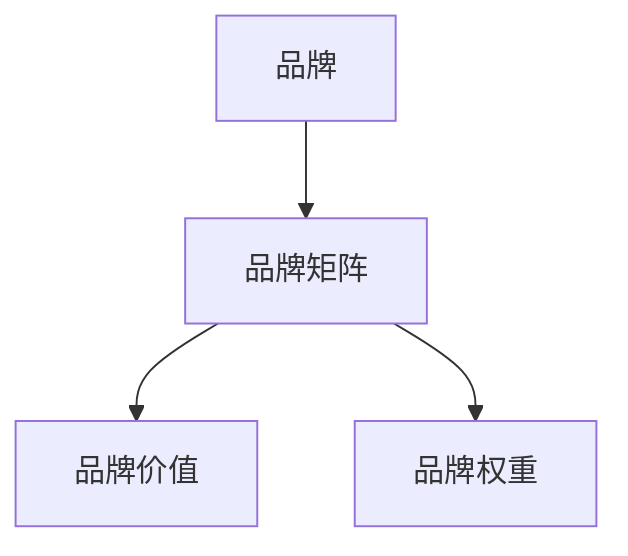
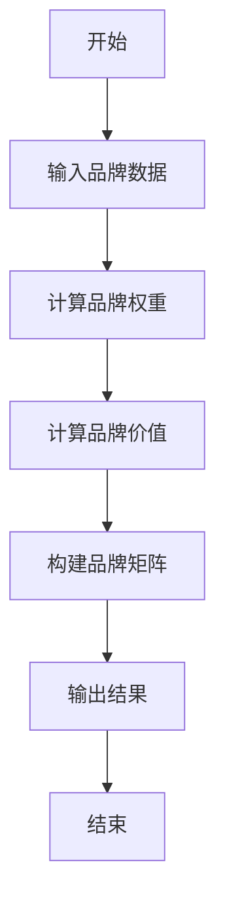
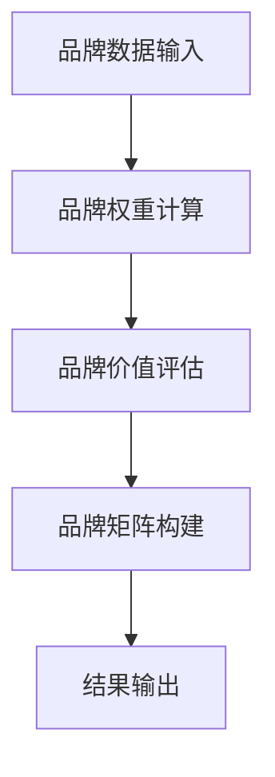

                 


# 彼得林奇如何评估公司的品牌矩阵管理

> 关键词：彼得·林奇，品牌矩阵，矩阵管理，品牌评估，投资策略

> 摘要：本文详细探讨了彼得·林奇在评估公司品牌矩阵管理中的方法和策略。通过分析品牌矩阵的核心概念、算法原理、系统架构以及实际案例，本文为读者提供了从理论到实践的全面指导。

---

# 第一部分: 品牌矩阵管理的背景与意义

## 第1章: 品牌矩阵管理的背景与意义

### 1.1 品牌矩阵管理的核心概念

#### 1.1.1 品牌矩阵的定义与内涵

品牌矩阵管理是一种通过构建和优化品牌组合来实现企业价值最大化的管理方法。它将品牌视为一个整体系统中的组成部分，通过量化分析和策略调整，提升品牌组合的竞争力。

#### 1.1.2 彼得·林奇的品牌矩阵管理方法

彼得·林奇是美国著名投资家，他在品牌矩阵管理方面提出了一套独特的评估方法。他认为，品牌矩阵的评估应基于市场表现、财务数据和品牌潜力的综合分析。

#### 1.1.3 品牌矩阵管理的背景与意义

随着市场竞争的加剧，品牌矩阵管理的重要性日益凸显。它不仅帮助企业优化资源配置，还能通过科学的评估方法提升品牌价值和市场地位。

### 1.2 品牌矩阵管理的必要性

#### 1.2.1 企业品牌管理的现状分析

许多企业在品牌管理中缺乏系统性和科学性，导致品牌组合混乱，资源浪费严重。

#### 1.2.2 品牌矩阵管理的优势与价值

品牌矩阵管理通过量化分析和优化策略，帮助企业实现品牌组合的最优配置。

#### 1.2.3 品牌矩阵管理的边界与外延

品牌矩阵管理的边界包括品牌组合的范围和管理的深度，而其外延则涉及市场、财务、运营等多个方面。

### 1.3 品牌矩阵管理的核心要素

#### 1.3.1 品牌矩阵的构成要素

品牌矩阵由品牌组合、品牌权重、品牌价值等要素构成。

#### 1.3.2 品牌矩阵的属性特征对比

通过对比品牌矩阵的属性特征，帮助企业识别品牌组合中的优劣势。

#### 1.3.3 品牌矩阵的ER实体关系图



---

## 第2章: 品牌矩阵管理的核心概念与联系

### 2.1 品牌矩阵管理的原理

#### 2.1.1 品牌矩阵的构建逻辑

品牌矩阵的构建逻辑基于企业战略目标和市场环境，通过量化分析确定品牌组合的最优配置。

#### 2.1.2 品牌矩阵的评估方法

林奇提出的品牌矩阵评估方法包括市场表现分析、财务数据评估和品牌潜力预测。

#### 2.1.3 品牌矩阵的优化策略

通过不断优化品牌组合，提升品牌矩阵的整体价值。

### 2.2 品牌矩阵管理的数学模型

#### 2.2.1 品牌矩阵的评估公式

$$ 品牌价值 = \sum_{i=1}^{n} (w_i \cdot v_i) $$

其中，\( w_i \) 为品牌 \( i \) 的权重，\( v_i \) 为品牌 \( i \) 的价值。

#### 2.2.2 品牌矩阵的优化算法

$$ 最优化目标 = \min_{x} \sum_{i=1}^{n} (c_i \cdot x_i) $$

其中，\( c_i \) 为品牌 \( i \) 的成本，\( x_i \) 为品牌 \( i \) 的投入比例。

### 2.3 品牌矩阵管理的ER实体关系图


---

## 第3章: 品牌矩阵管理的算法原理

### 3.1 品牌矩阵管理的算法流程



### 3.2 品牌矩阵管理的Python实现

```python
import numpy as np

def brand_matrix_management(brands, weights):
    brand_values = []
    for i in range(len(brands)):
        value = weights[i] * brands[i]
        brand_values.append(value)
    return np.array(brand_values)

# 示例代码
brands = [10, 20, 30]
weights = [0.2, 0.3, 0.5]
result = brand_matrix_management(brands, weights)
print(result)
```

---

## 第4章: 品牌矩阵管理的系统架构设计

### 4.1 系统功能设计

#### 4.1.1 品牌数据输入模块

用于输入品牌名称、市场表现等数据。

#### 4.1.2 品牌权重计算模块

通过算法计算各品牌的权重。

#### 4.1.3 品牌价值评估模块

根据权重和市场表现评估品牌价值。

### 4.2 系统架构设计



---

## 第5章: 品牌矩阵管理的项目实战

### 5.1 环境安装与配置

安装必要的Python库，如numpy和pandas。

### 5.2 核心代码实现

```python
import numpy as np

def brand_matrix_management(brands, weights):
    brand_values = []
    for i in range(len(brands)):
        value = weights[i] * brands[i]
        brand_values.append(value)
    return np.array(brand_values)
```

### 5.3 代码解读与分析

解释代码的功能和实现逻辑。

### 5.4 实际案例分析

以具体企业为例，展示品牌矩阵管理的实际应用。

---

## 第6章: 品牌矩阵管理的最佳实践

### 6.1 小结

总结品牌矩阵管理的核心要点和实际应用。

### 6.2 注意事项

提醒读者在实际操作中需要注意的事项。

### 6.3 拓展阅读

推荐相关书籍和资源，供读者进一步学习。

---

# 作者：AI天才研究院/AI Genius Institute & 禅与计算机程序设计艺术 /Zen And The Art of Computer Programming

---

以上是《彼得林奇如何评估公司的品牌矩阵管理》的技术博客文章的完整目录大纲和部分内容。

