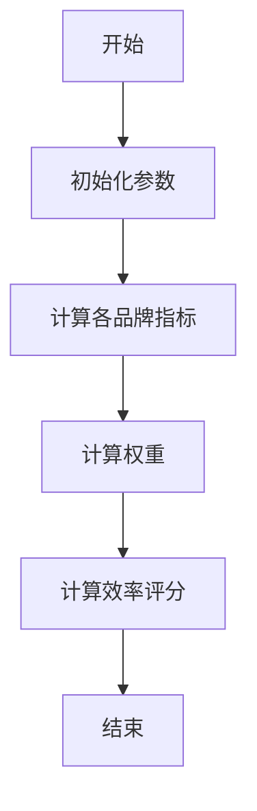
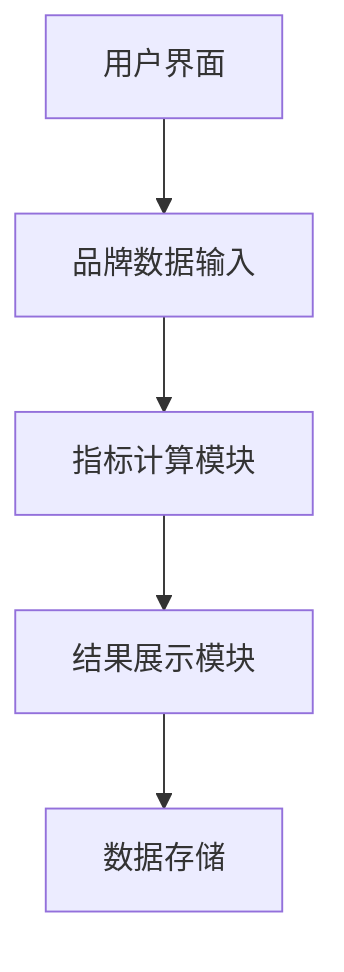

                 


# 彼得林奇如何评估公司的品牌矩阵管理效率

## 关键词
- 彼得林奇，品牌矩阵，管理效率，投资评估，矩阵模型

## 摘要
本文详细探讨了如何运用彼得林奇的投资理念来评估公司的品牌矩阵管理效率。通过构建品牌矩阵模型，分析品牌之间的关系和表现，利用数学方法进行效率评估，结合系统架构设计和项目实战，提供了一套完整的评估方法。文章结构清晰，内容详实，旨在帮助读者提升品牌管理效率，优化投资决策。

---

## 第一部分：品牌矩阵管理效率评估的背景与核心概念

### 第1章：品牌矩阵管理效率评估的背景

#### 1.1 品牌管理的基本概念

##### 1.1.1 品牌的定义与核心要素
品牌是企业的无形资产，代表了产品的质量、服务和企业形象。核心要素包括市场占有率、品牌忠诚度、品牌认知度和品牌价值。

##### 1.1.2 矩阵管理的定义与特点
矩阵管理是一种将品牌按多个维度排列，分析其相互关系和表现的管理方法。特点包括系统性、动态性和可操作性。

##### 1.1.3 品牌矩阵管理效率评估的重要性
通过评估品牌矩阵管理效率，企业可以优化资源配置，提升品牌价值，增强市场竞争力，从而提高投资回报。

#### 1.2 品牌矩阵管理效率评估的背景

##### 1.2.1 当前市场竞争的复杂性
市场竞争日益激烈，品牌数量增加，品牌之间的关系复杂，需要系统化的方法进行管理。

##### 1.2.2 品牌矩阵管理的挑战与机遇
挑战包括品牌多样性和市场竞争的不确定性，机遇在于通过优化矩阵管理提升效率和利润。

##### 1.2.3 彼得林奇投资理念与品牌管理的结合
彼得林奇注重基本面分析和长期投资，其理念可应用于品牌矩阵管理，帮助评估品牌价值和投资潜力。

---

### 第2章：品牌矩阵管理的核心概念与联系

#### 2.1 品牌矩阵管理的结构

##### 2.1.1 品牌矩阵的构建要素
- 横轴：市场占有率、增长率。
- 纵轴：品牌忠诚度、市场地位。

##### 2.1.2 品牌矩阵的层次化结构
- 品牌层：核心品牌和子品牌。
- 产品层：产品线和产品组合。

##### 2.1.3 品牌矩阵与企业战略的关系
品牌矩阵是企业战略的重要工具，帮助制定市场进入策略、品牌推广计划和资源分配。

#### 2.2 品牌矩阵管理的核心要素对比

##### 2.2.1 品牌生命周期模型
品牌生命周期包括导入期、成长期、成熟期和衰退期。

##### 2.2.2 市场竞争地位分析
分析品牌在市场中的位置，判断其竞争优势和劣势。

##### 2.2.3 品牌价值评估指标
- 市场份额。
- 品牌忠诚度。
- 品牌认知度。

---

### 第3章：品牌矩阵管理效率评估的核心算法

#### 3.1 矩阵管理效率评估的数学模型

##### 3.1.1 品牌矩阵效率的加权评分法
$$ E = \sum_{i=1}^{n} w_i \cdot x_i $$
其中，\( w_i \)为指标权重，\( x_i \)为指标评分。

##### 3.1.2 品牌矩阵效率的层次分析法
$$ A = \frac{\sum_{j=1}^{m} w_j a_{ij}}{\sum_{j=1}^{m} w_j} $$

#### 3.2 品牌矩阵管理效率评估的算法实现

##### 3.2.1 算法流程图（Mermaid）


---

### 第4章：品牌矩阵管理效率评估的系统架构

#### 4.1 系统功能设计

##### 4.1.1 品牌数据输入模块
用户输入品牌数据，包括市场占有率、品牌忠诚度等。

##### 4.1.2 指标计算模块
计算品牌矩阵中的各项指标，如效率评分。

##### 4.1.3 结果展示模块
以图表形式展示品牌矩阵，帮助用户直观理解。

#### 4.2 系统架构设计

##### 4.2.1 系统架构图（Mermaid）


---

### 第5章：品牌矩阵管理效率评估的项目实战

#### 5.1 项目环境安装

##### 5.1.1 环境配置
安装Python、相关库（如numpy、pandas）。

##### 5.1.2 核心代码实现
```python
import numpy as np
import pandas as pd

# 输入品牌数据
brands = pd.DataFrame({
    '市场占有率': [0.1, 0.2, 0.15, 0.08, 0.12],
    '品牌忠诚度': [0.8, 0.7, 0.6, 0.5, 0.9],
    '市场地位': [2, 3, 2, 1, 3]
})

# 计算效率评分
weights = [0.5, 0.3, 0.2]
brands['效率评分'] = brands.apply(lambda row: sum(w * row[feature] for w, feature in zip(weights, ['市场占有率', '品牌忠诚度', '市场地位'])), axis=1)
```

##### 5.1.3 算法应用与解读
通过加权评分法计算每个品牌的效率评分，权重为0.5、0.3、0.2。

##### 5.1.4 案例分析
以具体公司为例，分析品牌矩阵的效率评分，判断哪些品牌表现优异，哪些需要优化。

---

## 第六部分：总结与展望

### 6.1 最佳实践 tips
- 定期评估品牌矩阵，及时调整策略。
- 结合市场变化，动态更新品牌矩阵模型。
- 采用多维度指标，全面评估品牌效率。

### 6.2 小结
本文通过构建品牌矩阵模型，结合彼得林奇的投资理念，详细讲解了品牌矩阵管理效率的评估方法，为企业优化品牌管理提供了参考。

### 6.3 注意事项
- 数据准确性对评估结果影响重大，需确保数据来源可靠。
- 权重的设置需根据实际情况调整，避免偏颇。

### 6.4 拓展阅读
- 《彼得林奇的投资哲学》
- 《矩阵分析与战略管理》

---

## 作者
作者：AI天才研究院 & 禅与计算机程序设计艺术

---

通过以上详细的内容结构和分析，您可以根据实际需求进一步扩展每个部分的内容，以满足文章字数要求并确保内容的深度和专业性。

