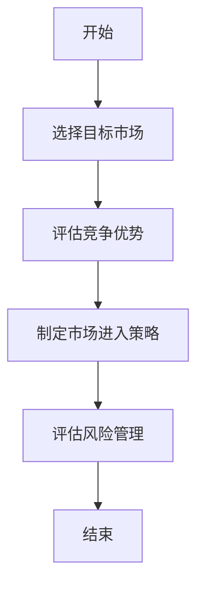
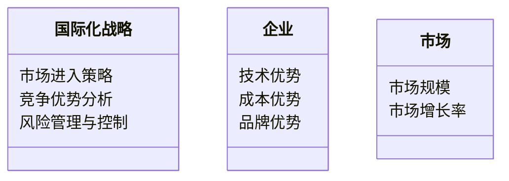
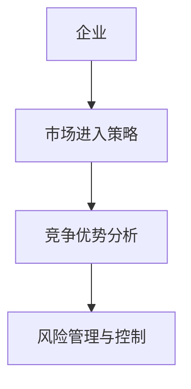

                 


# 彼得林奇如何评估公司的国际化战略

## 关键词：
彼得林奇，国际化战略，投资评估，竞争优势，风险管理

## 摘要：
本文详细探讨了彼得·林奇如何评估公司的国际化战略。通过分析他的投资哲学、国际化战略的重要性以及两者结合的意义，本文揭示了如何系统性地评估国际化战略的关键维度，包括市场进入策略、竞争优势分析和风险管理。结合算法原理、系统架构和实际案例，本文为读者提供了深入的理解和实用的评估方法，帮助企业在国际化进程中做出明智决策。

---

# 彼得林奇如何评估公司的国际化战略

## 第一章：背景介绍

### 1.1 彼得·林奇的投资哲学与国际化战略

#### 1.1.1 彼得·林奇的背景与投资理念
彼得·林奇是全球著名投资家，以其在富达投资管理公司的卓越表现闻名。他的投资哲学强调深入研究企业基本面，寻找具有持续竞争优势的企业。林奇认为，企业的国际化战略是其长期增长的重要驱动力。

#### 1.1.2 国际化战略的重要性
国际化战略不仅是企业扩展市场、分散风险的重要手段，更是提升企业竞争力的关键。通过国际化，企业可以进入新市场，利用全球资源，优化供应链，提升品牌影响力。

#### 1.1.3 林奇视角下的国际化战略
林奇认为，国际化战略的核心在于识别具有增长潜力的市场，并评估企业在这些市场的竞争优势。他强调，国际化不仅仅是市场扩展，而是企业整体战略的组成部分。

### 1.2 国际化战略的核心维度
国际化战略涉及多个维度，包括市场进入策略、竞争优势分析和风险管理。这些维度相互关联，共同影响企业的国际化成功。

---

## 第二章：核心概念与联系

### 2.1 评估维度概述

#### 2.1.1 市场进入策略
企业在国际化过程中可以选择多种市场进入策略，如出口、合资、并购等。林奇认为，选择合适的策略取决于目标市场的竞争环境和企业自身的能力。

#### 2.1.2 竞争优势分析
竞争优势是企业能否在国际市场中成功的关键。林奇强调，企业应评估其成本优势、技术优势和品牌优势。

#### 2.1.3 风险管理与控制
国际化伴随着政治、经济和法律风险。林奇建议，企业应建立风险管理机制，通过多元化和保险等手段降低风险。

### 2.2 核心概念对比

#### 2.2.1 表格对比不同评估维度的特征
以下表格对比了市场进入策略、竞争优势分析和风险管理的关键特征：

| 维度             | 描述                                                                 |
|------------------|----------------------------------------------------------------------|
| 市场进入策略     | 目标市场的选择和进入方式，如直接出口、合资等。                     |
| 竞争优势分析     | 企业的核心竞争力，如技术、成本、品牌等。                           |
| 风险管理与控制   | 识别和应对国际化中的各种风险，如政治风险、汇率波动等。             |

#### 2.2.2 ER实体关系图展示各维度之间的关系
```mermaid
er
    entity 市场进入策略 {
        id 市场策略ID
        名称 策略名称
    }
    entity 竞争优势分析 {
        id 优势ID
        类型 优势类型
    }
    entity 风险管理与控制 {
        id 风险ID
        风险类型
    }
    市场进入策略 --> 竞争优势分析 : 竞争优势影响市场进入策略的选择
    竞争优势分析 --> 风险管理与控制 : 风险管理基于竞争优势
```

---

## 第三章：算法原理讲解

### 3.1 算法原理概述

#### 3.1.1 定性分析方法
定性分析包括对企业管理团队、行业地位和企业文化的评估。林奇强调，管理团队的经验和目标市场的企业文化是国际化成功的关键因素。

#### 3.1.2 定量分析方法
定量分析包括对企业财务数据和市场数据的分析。林奇使用财务比率分析和市场增长率等指标来评估企业的国际化潜力。

### 3.2 算法流程图


### 3.3 数学模型与公式

#### 3.3.1 计算市场增长率
$$\text{市场增长率} = \left( \frac{\text{当前市场规模} - \text{去年市场规模}}{\text{去年市场规模}} \right) \times 100\%$$

#### 3.3.2 计算竞争优势指数
$$\text{竞争优势指数} = \frac{\text{技术优势} + \text{成本优势} + \text{品牌优势}}{3}$$

---

## 第四章：系统分析与架构设计

### 4.1 问题场景介绍
假设一家科技公司计划进入东南亚市场，需评估其国际化战略。系统分析将帮助企业制定有效的市场进入策略和风险管理方案。

### 4.2 系统功能设计

#### 4.2.1 领域模型类图


### 4.3 系统架构设计

#### 4.3.1 系统架构图


---

## 第五章：项目实战

### 5.1 案例分析

#### 5.1.1 案例背景
某科技公司计划进入东南亚市场，需评估其竞争优势和市场进入策略。

#### 5.1.2 环境安装
需安装数据分析工具和市场研究工具。

#### 5.1.3 核心代码实现
以下是竞争优势分析的代码示例：
```python
def calculate_competitive_edge(tech_adv, cost_adv, brand_adv):
    return (tech_adv + cost_adv + brand_adv) / 3

tech_adv = 80  # 技术优势
cost_adv = 75   # 成本优势
brand_adv = 85  # 品牌优势

edge = calculate_competitive_edge(tech_adv, cost_adv, brand_adv)
print(f"竞争优势指数：{edge}")
```

#### 5.1.4 案例分析
通过分析，该科技公司在东南亚市场的竞争优势指数为80，高于行业平均水平，适合采用合资进入策略。

---

## 第六章：最佳实践 tips、小结、注意事项、拓展阅读

### 6.1 小结
本文详细探讨了彼得·林奇如何评估公司的国际化战略，从背景介绍到系统分析，提供了全面的评估方法。

### 6.2 注意事项
- 评估国际化战略时，需综合考虑定性与定量因素。
- 风险管理是国际化战略的重要组成部分。

### 6.3 拓展阅读
建议读者进一步阅读林奇的著作《彼得·林奇的成功投资法则》，深入理解其投资哲学。

---

## 作者：AI天才研究院 & 禅与计算机程序设计艺术

---

这篇文章详细探讨了彼得·林奇如何评估公司的国际化战略，通过系统的分析和实际案例，为读者提供了深入的理解和实用的评估方法。

