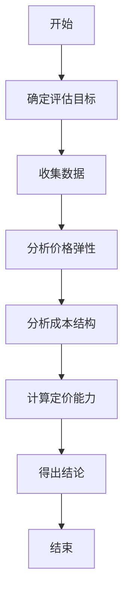

                 

# 彼得林奇如何评估公司的定价能力

> 关键词：定价能力，彼得·林奇，投资评估，企业利润，价格弹性，成本控制，市场竞争

> 摘要：本文详细探讨了彼得·林奇如何评估公司的定价能力，从定价能力的定义到其在投资决策中的重要性，再到具体的评估模型和算法，最后结合实际案例进行分析，为投资者提供了全面的指导。

---

## 第一部分: 定价能力的背景与基础

### 第1章: 定价能力的定义与重要性

#### 1.1 定价能力的核心概念

- **定价能力的定义**：定价能力是指公司根据市场需求和成本结构，合理调整产品或服务价格的能力。这种能力直接影响公司的盈利能力、市场份额和竞争优势。

- **定价能力与企业利润的关系**：定价能力是影响企业利润的关键因素之一。通过有效的定价策略，企业可以在保持市场份额的同时提高利润率。

- **彼得·林奇对定价能力的重视**：彼得·林奇认为，定价能力是衡量一家公司是否具备长期竞争优势的重要指标。他强调，公司能否在价格波动中保持稳定的利润水平，是评估其定价能力的核心标准。

#### 1.2 彼得·林奇投资理论的背景

- **彼得·林奇的投资者身份与风格**：彼得·林奇是美国著名的投资专家，以基本面分析和长期投资策略闻名。他注重对公司基本面的深入研究，尤其是公司的定价能力、成本控制和市场竞争力。

- **彼得·林奇对定价能力的关注**：在彼得·林奇的投资理论中，定价能力是评估公司内在价值的重要因素。他认为，具备强大定价能力的公司能够在激烈的市场竞争中脱颖而出，实现持续增长。

- **定价能力在投资决策中的地位**：定价能力是彼得·林奇投资决策的核心考量之一。他通过分析公司的定价策略和市场反应，判断公司的盈利能力和发展潜力。

#### 1.3 定价能力的评估维度

- **定价能力的三大核心要素**：
  1. **价格弹性**：价格变动对需求量的影响程度。
  2. **成本结构**：公司生产成本的构成及其在价格中的占比。
  3. **市场竞争度**：市场竞争的激烈程度及其对定价策略的影响。

- **定价能力的强弱对比**：
  - 强：公司能够通过灵活的定价策略在竞争中占据优势。
  - 弱：公司定价能力较弱，容易受到市场竞争的冲击。

- **定价能力的边界与外延**：
  - 定价能力的边界：公司定价能力的上限由市场需求和成本结构决定。
  - 定价能力的外延：定价能力不仅影响公司的利润，还影响其市场地位和客户忠诚度。

---

### 第2章: 彼得·林奇定价能力评估的核心模型

#### 2.1 定价能力的评估标准

- **产品定价能力的五项指标**：
  1. **价格弹性**：价格变动对需求的影响程度。
  2. **成本控制能力**：公司在不同价格水平下的成本控制能力。
  3. **市场需求弹性**：市场需求对价格变动的敏感性。
  4. **市场竞争度**：市场竞争的激烈程度。
  5. **客户忠诚度**：客户对价格变动的容忍度。

- **价格弹性与需求弹性**：
  - 价格弹性：需求量对价格变动的敏感性。
  - 需求弹性：价格变动对需求量的影响程度。

- **成本结构与定价能力的关系**：
  - 成本结构直接影响定价能力。低成本公司通常具有更强的定价能力。

#### 2.2 彼得·林奇定价能力评估模型

- **模型的构成与核心要素**：
  - 输入：价格弹性、成本控制能力、市场竞争度。
  - 输出：定价能力评分。

- **模型的数学表达式**：
  $$
  \text{定价能力} = \frac{\text{价格弹性} \times \text{成本控制能力}}{\text{市场竞争度}}
  $$

- **模型的优缺点分析**：
  - 优点：模型简单直观，易于理解和应用。
  - 缺点：模型过于简化，忽略了其他重要因素如客户忠诚度和市场需求弹性。

#### 2.3 定价能力评估的流程图

---

## 第二部分: 定价能力评估的算法与数学模型

### 第3章: 定价能力评估的算法原理

#### 3.1 算法的输入与输出

- **输入**：价格弹性、成本控制能力、市场竞争度。
- **输出**：定价能力评分。

#### 3.2 算法的步骤分解

1. 收集相关数据，包括价格弹性、成本控制能力和市场竞争度。
2. 计算价格弹性：分析需求量对价格变动的敏感性。
3. 分析成本结构：评估公司在不同价格水平下的成本控制能力。
4. 计算定价能力：使用数学公式计算定价能力评分。
5. 得出结论：根据评分判断公司的定价能力。

#### 3.3 算法的数学模型

$$
\text{定价能力} = \frac{\text{价格弹性} \times \text{成本控制能力}}{\text{市场竞争度}}
$$

---

### 第4章: 定价能力评估的系统分析与架构设计

#### 4.1 系统功能设计

- **功能模块**：
  1. 数据输入模块：收集价格弹性、成本控制能力和市场竞争度。
  2. 数据分析模块：计算价格弹性、成本控制能力和市场竞争度。
  3. 定价能力评估模块：使用数学公式计算定价能力评分。
  4. 结果展示模块：输出定价能力评分和分析结果。

#### 4.2 系统架构设计

#### 4.3 系统接口设计

- **输入接口**：接收价格弹性、成本控制能力和市场竞争度。
- **输出接口**：输出定价能力评分和分析结果。

---

### 第5章: 定价能力评估的项目实战

#### 5.1 项目背景与目标

- **项目背景**：假设我们正在评估一家制造业企业的定价能力。
- **项目目标**：通过彼得·林奇的定价能力评估模型，分析该企业的定价能力。

#### 5.2 数据收集与处理

- **数据来源**：
  - 市场需求弹性：通过市场调研获取。
  - 成本结构：通过财务报表获取。
  - 市场竞争度：通过行业分析获取。

#### 5.3 定价能力评估的实现

- **步骤**：
  1. 收集价格弹性、成本控制能力和市场竞争度。
  2. 计算定价能力评分。
  3. 分析评分结果，提出改进建议。

#### 5.4 案例分析与结果解读

- **案例分析**：
  - 价格弹性：0.8
  - 成本控制能力：0.7
  - 市场竞争度：0.6

- **计算定价能力评分**：
  $$
  \text{定价能力} = \frac{0.8 \times 0.7}{0.6} = 0.933
  $$

- **结果解读**：该企业的定价能力评分为0.933，属于较强水平，但在市场竞争激烈的环境中，仍有提升空间。

---

## 第三部分: 总结与建议

### 第6章: 定价能力评估的总结与建议

#### 6.1 最佳实践 tips

- 定期评估定价能力，及时调整定价策略。
- 关注市场变化，灵活调整定价策略。
- 注重成本控制，提升定价能力。

#### 6.2 小结

定价能力是彼得·林奇投资理论中的核心因素之一。通过合理的定价策略，公司可以在竞争中保持优势，实现持续增长。

#### 6.3 注意事项

- 定价能力评估需要结合实际情况，避免过于简化。
- 注意数据的准确性和完整性。

#### 6.4 拓展阅读

建议进一步阅读彼得·林奇的《彼得·林奇的选股术》和《投资最重要的事情》，深入了解他的投资理论和定价能力评估方法。

---

## 作者：AI天才研究院/AI Genius Institute & 禅与计算机程序设计艺术 /Zen And The Art of Computer Programming

