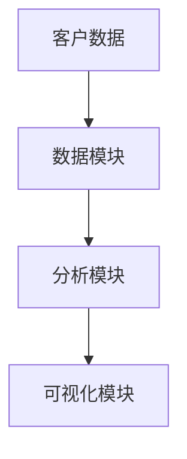

                 

# 彼得林奇如何评估公司的客户多样性

## 关键词：客户多样性，彼得林奇，投资评估，企业价值，风险管理

## 摘要：  
本文深入探讨了彼得·林奇如何通过评估公司的客户多样性来分析和投资企业。通过分析客户多样性对企业价值的影响，构建客户多样性评估框架，并结合实际案例，详细讲解了客户多样性评估的方法和应用。文章从理论到实践，系统性地介绍了客户多样性评估的背景、核心概念、算法原理、系统架构、项目实战以及最佳实践，为投资者和企业管理者提供了实用的指导和启示。

---

## 第一章：客户多样性评估的背景与意义

### 1.1 客户多样性评估的重要性

客户多样性评估是指对客户群体的多样性进行分析，包括客户规模、行业分布、地理区域和产品使用等多个维度。多样化的客户群体能够降低企业对单一客户的依赖风险，提升企业的抗风险能力和增长潜力。在投资领域，客户多样性评估是评估企业价值的重要指标之一，帮助投资者识别企业的稳定性和发展潜力。

### 1.2 彼得·林奇的背景与投资理念

彼得·林奇是美国著名的投资专家，被誉为“最伟大的股票基金经理”。他的投资理念强调长期投资、基本面分析和对公司管理层的信任。林奇认为，客户多样性是企业稳健发展的关键因素之一，能够帮助企业分散风险并抓住不同市场的机会。

### 1.3 客户多样性评估的意义

客户多样性评估的意义在于：

1. **降低企业风险**：通过分散客户群体，企业能够减少对单一客户或行业的依赖，降低经营风险。
2. **提升企业价值**：多样化的客户群体意味着企业能够从多个市场中获取收益，提升整体价值。
3. **指导投资决策**：投资者通过评估客户多样性，能够更准确地判断企业的投资价值和风险水平。

---

## 第二章：客户多样性评估的核心概念与联系

### 2.1 客户多样性与企业价值的关系

客户多样性与企业价值密切相关。多样化的客户群体能够带来更多的收入来源，提升企业的盈利能力和市场适应能力。然而，客户多样性过高可能会增加管理复杂性和成本，因此需要在多样性和效率之间找到平衡。

### 2.2 客户多样性评估的维度

客户多样性评估可以从以下几个维度进行：

1. **客户规模**：客户数量和规模的分布，包括个体客户和大客户。
2. **行业分布**：客户所处的行业是否多元化。
3. **地理分布**：客户分布的地理范围，包括国内外市场。
4. **产品/服务使用**：客户对产品或服务的使用是否多样化。

### 2.3 客户多样性评估框架的构建

为了系统地评估客户多样性，我们需要构建一个综合性的框架。以下是框架的组成部分：

1. **数据收集**：收集客户的规模、行业、地理和产品使用数据。
2. **数据处理**：对数据进行清洗和标准化处理。
3. **指标计算**：计算客户多样性指数。
4. **结果分析**：分析结果并提出优化建议。

---

## 第三章：客户多样性评估的算法与数学模型

### 3.1 熵值法

熵值法是一种常用的客户多样性评估方法，通过计算客户在各个维度上的分布熵值来衡量多样性。熵值法的公式如下：

$$
H = -\sum_{i=1}^{n} p_i \log_2 p_i
$$

其中，\( p_i \) 是第 \( i \) 个客户的权重，\( n \) 是客户总数。

### 3.2 RFM模型

RFM模型是一种客户细分方法，通过客户的近期购买频率、购买间隔和购买金额来评估客户的多样性。以下是RFM模型的步骤：

1. **数据收集**：收集客户的购买记录。
2. **数据处理**：计算客户的购买频率、间隔和金额。
3. **客户分类**：根据RFM指标将客户分为不同的类别。

### 3.3 客户多样性指数

客户多样性指数（CDI）是一种衡量客户多样性程度的指标，计算公式如下：

$$
CDI = \frac{\sum_{i=1}^{n} w_i}{\sum_{i=1}^{n} 1}
$$

其中，\( w_i \) 是第 \( i \) 个客户的权重。

---

## 第四章：客户多样性评估的系统分析与架构设计

### 4.1 问题场景介绍

我们假设一家零售企业需要评估其客户多样性，以优化其市场策略和投资决策。

### 4.2 系统功能设计

以下是系统的功能模块：

1. **数据模块**：收集和处理客户数据。
2. **分析模块**：计算客户多样性指数。
3. **可视化模块**：生成多样化的报告和图表。

### 4.3 系统架构设计

以下是系统的架构图：

### 4.4 系统接口设计

系统接口包括数据接口、分析接口和可视化接口。

---

## 第五章：客户多样性评估的项目实战

### 5.1 项目背景

我们以一家零售企业为例，评估其客户多样性。

### 5.2 数据收集与预处理

收集客户数据并进行清洗和标准化处理。

### 5.3 数据分析与计算

计算客户多样性指数，并分析结果。

### 5.4 数据可视化

生成可视化报告，展示客户多样性分布。

---

## 第六章：客户多样性评估的最佳实践与小结

### 6.1 最佳实践

1. **数据质量**：确保数据的准确性和完整性。
2. **模型选择**：根据企业特点选择合适的评估方法。
3. **结果验证**：通过实际案例验证模型的准确性。

### 6.2 小结

客户多样性评估是企业管理和投资决策的重要工具。通过合理评估客户多样性，企业能够优化市场策略，降低风险，提升价值。

---

## 作者：AI天才研究院/AI Genius Institute & 禅与计算机程序设计艺术 /Zen And The Art of Computer Programming

---

**附录**  
- 附录A：客户多样性评估公式汇总  
- 附录B：客户多样性评估案例分析  
- 附录C：相关工具与资源

