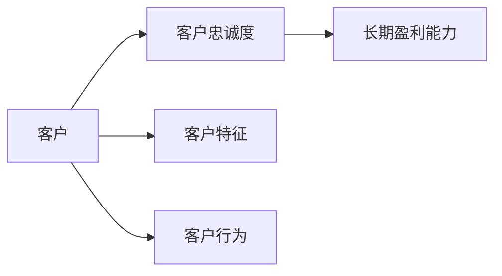
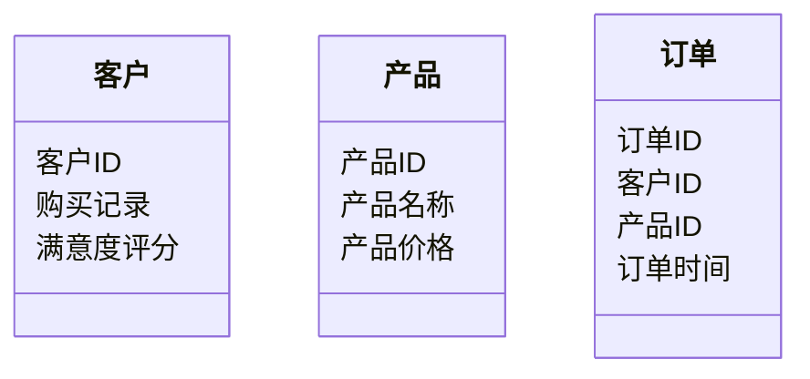
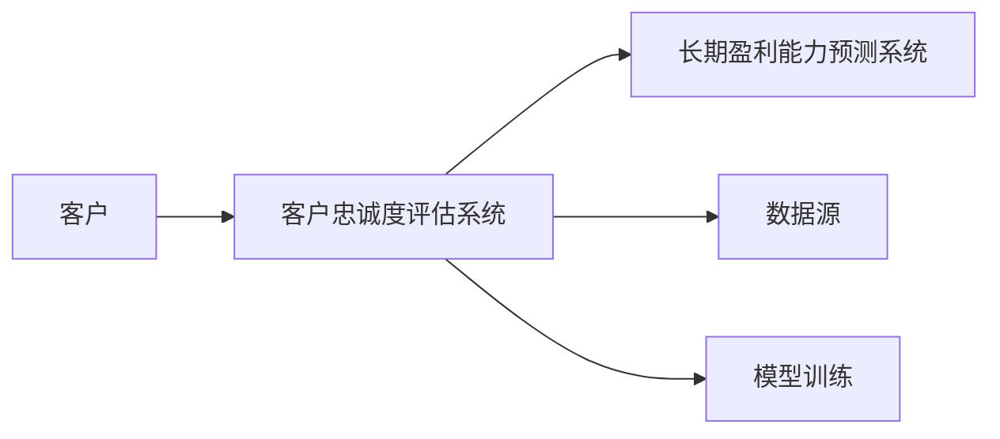
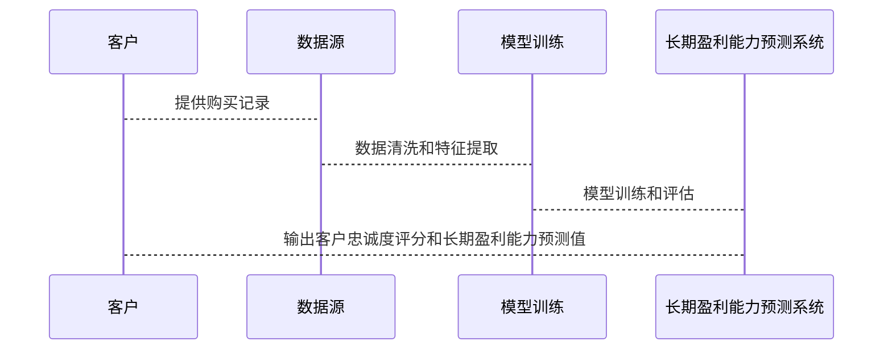

                 


# 彼得·林奇如何评估公司的客户忠诚度对长期盈利的影响

## 关键词：客户忠诚度，长期盈利能力，彼得·林奇，投资策略，客户分析

## 摘要：  
本文深入探讨了彼得·林奇如何通过客户忠诚度评估来预测和提升公司的长期盈利能力。通过分析客户忠诚度的核心概念、评估方法、数学模型和系统设计，本文揭示了客户忠诚度对投资决策的深远影响，并提供了实际案例和最佳实践。

---

# 第一部分: 客户忠诚度与长期盈利能力的背景介绍

## 第1章: 客户忠诚度的核心概念

### 1.1 问题背景与问题描述
#### 1.1.1 什么是客户忠诚度  
客户忠诚度是指客户对公司产品或服务的持续购买和使用意愿。它不仅体现在客户的重复购买行为上，还反映在客户对品牌的信任和情感投入上。

#### 1.1.2 长期盈利能力的定义  
长期盈利能力是指公司在未来较长一段时间内的持续盈利能力，通常与客户忠诚度、市场占有率和成本控制密切相关。

#### 1.1.3 彼得·林奇与客户忠诚度的关联  
彼得·林奇是美国著名的投资经理，他在投资中非常重视客户忠诚度，认为客户忠诚度高的公司更可能实现长期盈利。

### 1.2 问题解决与边界
#### 1.2.1 客户忠诚度的衡量标准  
客户忠诚度可以通过客户保留率、净推荐值（NPS）、客户生命周期价值（CLV）等指标来衡量。

#### 1.2.2 长期盈利能力的边界条件  
长期盈利能力受到市场需求、竞争环境、公司战略和客户行为等多种因素的影响。

#### 1.2.3 客户忠诚度与盈利能力的外延  
客户忠诚度不仅影响公司的收入，还影响公司的品牌价值和市场地位，从而间接影响长期盈利能力。

### 1.3 核心概念结构
#### 1.3.1 客户忠诚度的核心要素  
- 客户满意度：客户对产品或服务的满意程度。
- 客户保留率：客户持续购买产品或服务的比例。
- 客户忠诚度指数：通过数学模型计算得出的客户忠诚度量化指标。

#### 1.3.2 长期盈利能力的关键因素  
- 收入增长：客户忠诚度高的公司通常收入增长稳定。
- 成本控制：客户忠诚度高的公司可以通过规模经济降低成本。
- 市场地位：客户忠诚度高的公司更容易占据市场主导地位。

#### 1.3.3 两者之间的关系结构图  


---

# 第二部分: 客户忠诚度评估的核心概念与联系

## 第2章: 客户忠诚度的评估指标与模型

### 2.1 核心概念原理
#### 2.1.1 客户生命周期理论  
客户生命周期包括获取、成长、成熟、衰退和流失五个阶段，客户忠诚度在每个阶段的表现不同。

#### 2.1.2 客户满意度与忠诚度的关系  
客户满意度是客户忠诚度的基础，但高满意度并不一定意味着高忠诚度。

#### 2.1.3 彼得·林奇的客户忠诚度评估模型  
彼得·林奇提出了基于客户保留率和净推荐值的客户忠诚度评估模型。

### 2.2 概念属性对比表格
| 概念 | 属性 |
|------|------|
| 客户忠诚度 | 指标化、动态性、可测量性 |
| 长期盈利能力 | 可持续性、可预测性、可优化性 |

### 2.3 实体关系图


---

## 第3章: 客户忠诚度评估的数学模型

### 3.1 算法原理
#### 3.1.1 RFM模型  
RFM模型基于客户的最近一次购买时间（Recency）、购买频率（Frequency）和购买金额（Monetary）来评估客户忠诚度。

#### 3.1.2 关联规则分析  
通过关联规则分析，可以发现客户购买行为中的关联模式，从而评估客户忠诚度。

### 3.2 算法实现
#### 3.2.1 RFM模型的实现步骤  
1. 数据收集：收集客户的购买记录。
2. 数据清洗：处理缺失值和异常值。
3. 特征提取：提取客户的购买频率、购买间隔和购买金额。
4. 模型训练：使用RFM模型对客户进行分类。
5. 模型评估：根据客户保留率验证模型的准确性。

#### 3.2.2 关联规则分析的实现步骤  
1. 数据预处理：将数据转换为事务格式。
2. 算法选择：选择Apriori算法进行关联规则挖掘。
3. 模型训练：计算频繁项集和关联规则。
4. 模型评估：根据支持度和置信度筛选重要规则。

### 3.3 数学模型与公式
#### 3.3.1 RFM模型的数学公式  
购买频率（F）= (客户在一段时间内的购买次数) / (客户总数)  
购买间隔（R）= (两次购买之间的天数)  
购买金额（M）= (客户的平均购买金额)  

#### 3.3.2 关联规则分析的数学公式  
支持度（Support）= 频繁项集在数据集中出现的频率  
置信度（Confidence）= 在A出现的情况下，B出现的概率  

---

# 第三部分: 客户忠诚度评估的系统分析与架构设计

## 第4章: 客户忠诚度评估系统的架构设计

### 4.1 问题场景介绍  
本文将构建一个基于客户忠诚度评估的长期盈利能力预测系统。

### 4.2 系统功能设计
#### 4.2.1 领域模型  


#### 4.2.2 系统架构  


#### 4.2.3 系统接口设计  
- 输入接口：客户购买记录、产品信息、订单信息。
- 输出接口：客户忠诚度评分、长期盈利能力预测值。

#### 4.2.4 系统交互流程  


---

## 第5章: 客户忠诚度评估系统的实现与案例分析

### 5.1 项目实战
#### 5.1.1 环境安装  
安装Python、Pandas、Scikit-learn、Mermaid等工具。

#### 5.1.2 核心代码实现
```python
import pandas as pd
from sklearn.cluster import KMeans

# 数据清洗
df = pd.read_csv('customer_data.csv')
df.dropna(inplace=True)

# 特征提取
features = df[['购买频率', '购买间隔', '满意度']]
scaler = StandardScaler()
scaled_features = scaler.fit_transform(features)

# 模型训练
kmeans = KMeans(n_clusters=3)
kmeans.fit(scaled_features)

# 模型评估
labels = kmeans.labels_
print("客户忠诚度评分：", labels)
```

#### 5.1.3 案例分析
以某零售公司为例，分析客户忠诚度评分与长期盈利能力的关系。

---

## 第6章: 最佳实践与项目总结

### 6.1 最佳实践
- 定期收集客户反馈，及时调整产品和服务策略。
- 使用数学模型和工具进行客户忠诚度评估和预测。
- 重视客户体验，提升客户满意度和忠诚度。

### 6.2 项目小结
本文通过理论分析、模型构建和案例实践，详细探讨了彼得·林奇如何通过客户忠诚度评估来实现长期盈利能力预测。

### 6.3 注意事项
- 数据质量和完整性对模型准确性至关重要。
- 模型选择和调优需要结合具体业务场景。
- 客户忠诚度评估应与公司战略目标相结合。

### 6.4 拓展阅读
建议阅读《彼得·林奇的成功投资法则》和《客户忠诚度管理》等相关书籍。

---

# 作者：AI天才研究院 & 禅与计算机程序设计艺术

