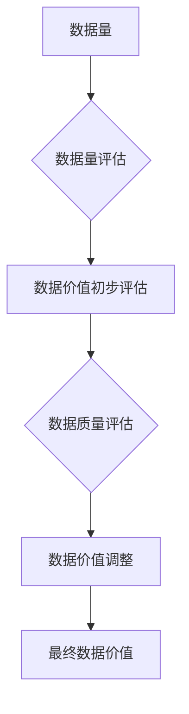
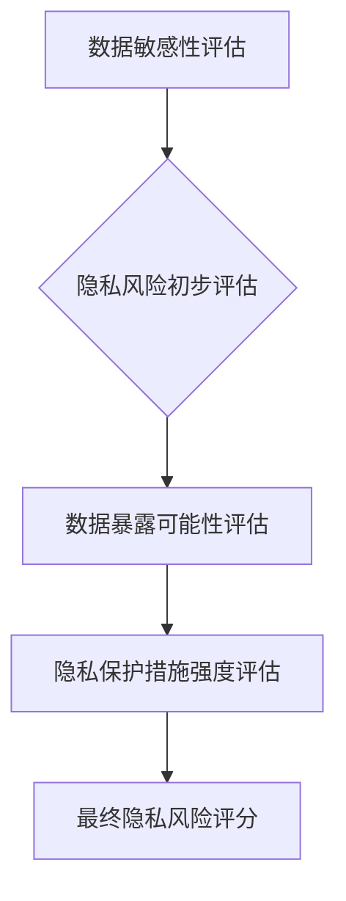

                 


# 《彼得林奇如何评估公司的客户数据变现能力与隐私保护平衡》

## 关键词：数据变现，隐私保护，客户数据，彼得林奇，数据资产

## 摘要：本文深入探讨了彼得·林奇评估公司客户数据变现能力与隐私保护平衡的方法。通过分析数据价值、隐私保护技术、算法模型及系统架构，结合实际案例，展示了如何在数据利用与隐私保护之间找到最佳平衡点，为数据驱动型企业的投资决策提供指导。

---

# 第三部分: 数据变现与隐私保护的算法原理与数学模型

## 第4章: 数据变现的算法原理

### 4.1 数据价值评估算法

#### 4.1.1 数据价值评估的数学模型
数据价值的评估公式如下：

$$ Value = f(Quantity, Quality, Utility) $$

其中：
- Quantity 表示数据的量级，通常与数据的规模（如数据点数量）相关。
- Quality 表示数据的质量，包括数据的完整性、准确性、一致性等。
- Utility 表示数据的使用价值，即数据对业务目标的贡献能力。

#### 4.1.2 数据价值评估的流程图


#### 4.1.3 数据价值评估的Python代码示例
```python
def calculate_data_value(quantity, quality, utility):
    # 数据量的权重
    weight_quantity = 0.4
    # 数据质量的权重
    weight_quality = 0.3
    # 数据使用价值的权重
    weight_utility = 0.3

    value = (quantity * weight_quantity) + (quality * weight_quality) + (utility * weight_utility)
    return value

# 示例数据
quantity = 1000000  # 数据点数量
quality = 0.85       # 数据质量评分（0-1之间）
utility = 0.70        # 数据使用价值评分（0-1之间）

data_value = calculate_data_value(quantity, quality, utility)
print(f"数据价值：{data_value}")
```

---

## 第5章: 隐私保护的算法原理

### 5.1 隐私风险评估算法

#### 5.1.1 隐私风险评估的数学模型
隐私风险的评估公式如下：

$$ Risk = f(PrivacySensitivity, DataExposure, MitigationEfforts) $$

其中：
- PrivacySensitivity 表示数据的敏感性。
- DataExposure 表示数据暴露的可能性。
- MitigationEfforts 表示隐私保护措施的强度。

#### 5.1.2 隐私风险评估的流程图


---

## 第6章: 数据变现与隐私保护的平衡策略

### 6.1 平衡策略的数学模型
平衡数据变现与隐私保护的策略可以表示为：

$$ Balance = \alpha \times DataValue + \beta \times PrivacyProtection $$

其中：
- α 和 β 是权重系数，表示数据变现和隐私保护的优先级。
- DataValue 是数据的变现价值。
- PrivacyProtection 是隐私保护的强度。

### 6.2 平衡策略的Python代码示例
```python
def balance_strategy(data_value, privacy_protection, alpha, beta):
    balance = (data_value * alpha) + (privacy_protection * beta)
    return balance

# 示例数据
data_value = 0.8  # 数据价值评分（0-1之间）
privacy_protection = 0.6  # 隐私保护强度评分（0-1之间）
alpha = 0.6  # 数据变现的权重
beta = 0.4   # 隐私保护的权重

balanced_score = balance_strategy(data_value, privacy_protection, alpha, beta)
print(f"平衡策略得分：{balanced_score}")
```

---

## 第7章: 技术与法律的结合

### 7.1 数据隐私保护的技术手段
- 数据加密（如AES、RSA）
- 数据匿名化处理（如k-anonymity）
- 数据访问控制（如RBAC）

### 7.2 数据隐私保护的法律框架
- 《通用数据保护条例》（GDPR）
- 《加州消费者隐私法案》（CCPA）

---

## 第8章: 总结与展望

### 8.1 核心总结
- 数据变现与隐私保护需要在技术、法律和商业目标之间找到平衡。
- 彼得·林奇的投资理念强调了数据资产的长期价值，同时也关注隐私保护的合规性。

### 8.2 未来展望
- 数据隐私保护的技术创新，如联邦学习（Federated Learning）
- 数据变现模式的多样化，如数据市场和数据信托

---

## 作者信息

作者：AI天才研究院/AI Genius Institute & 禅与计算机程序设计艺术 /Zen And The Art of Computer Programming

---

以上是文章的详细目录和部分章节内容。接下来的章节将根据上述结构逐步展开，结合实际案例和详细的技术分析，为读者提供深入的指导和见解。

