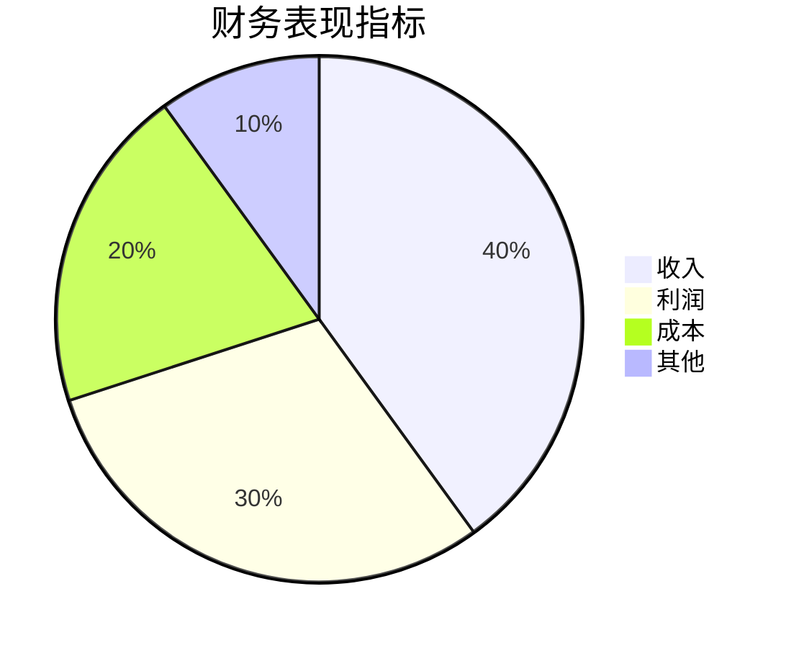
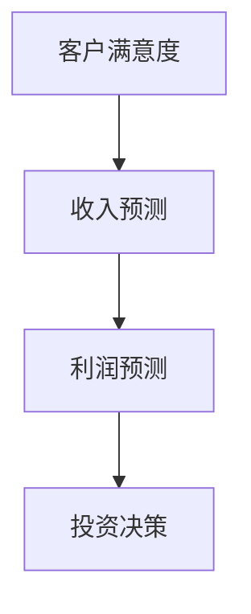
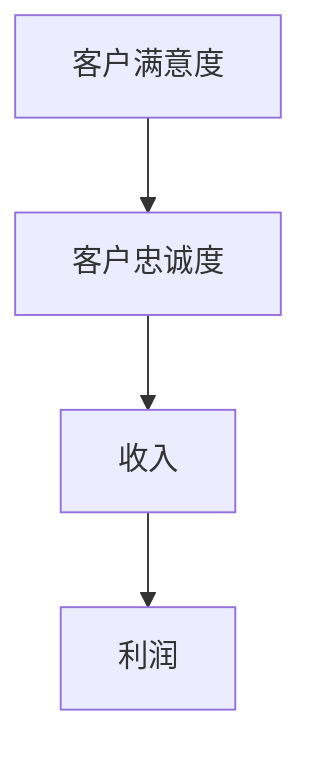
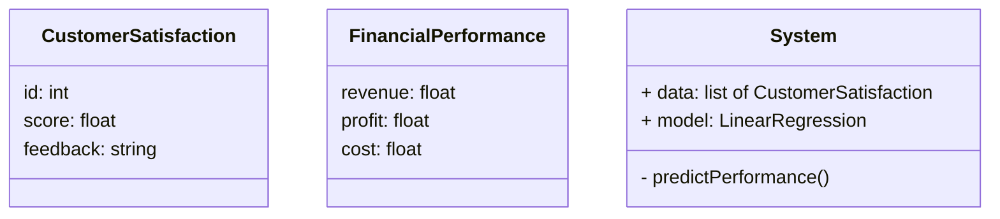
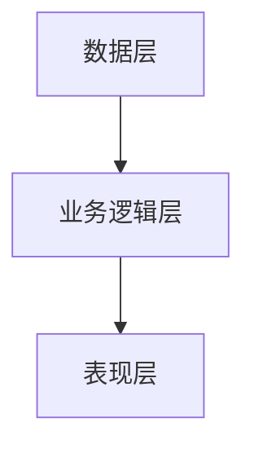
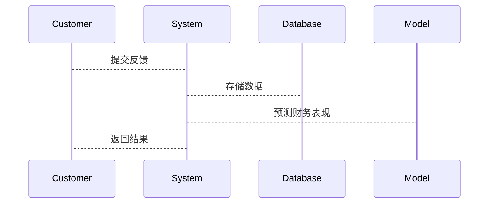

                 


---

# 彼得林奇如何评估公司的客户满意度与财务表现关系

> 关键词：彼得林奇，客户满意度，财务表现，投资评估，企业分析

> 摘要：本文将探讨彼得林奇如何通过客户满意度评估公司的财务表现。首先，我们分析客户满意度的核心概念和其对财务表现的影响机制。然后，我们详细介绍彼得林奇的客户满意度评估模型，包括其数学模型和算法原理。接下来，我们通过实际案例展示如何在系统中实现客户满意度与财务表现的关联分析。最后，我们总结彼得林奇方法的优势和实际应用中的注意事项，为读者提供有价值的参考。

---

## 第一部分: 引言

### 1.1 问题背景与目标
客户满意度是衡量企业服务质量的重要指标，而财务表现则是企业经营成果的核心反映。彼得林奇作为投资大师，以其独特的客户满意度评估方法闻名。本文旨在探讨客户满意度与财务表现之间的关系，并分析彼得林奇的方法如何帮助企业优化财务表现。

### 1.2 问题描述与解决路径
客户满意度与财务表现之间的关系复杂且多维。彼得林奇通过量化客户满意度，预测企业的财务表现，从而做出投资决策。本文将从理论到实践，系统地分析这一过程。

### 1.3 本书结构与内容概览
本文分为六个主要部分：客户满意度评估方法、财务表现评估方法、两者的关系、评估模型构建、系统架构设计和项目实战。每一部分都将深入探讨相关概念和方法。

---

## 第二部分: 客户满意度评估方法

### 2.1 客户满意度的定义与重要性
客户满意度是指客户对企业产品或服务的满意程度。它不仅影响客户忠诚度，还直接影响企业的财务表现。

#### 表格：客户满意度与财务表现的对比

| 属性          | 客户满意度       | 财务表现       |
|---------------|------------------|---------------|
| 定义          | 客户对服务的满意程度 | 企业的财务成果 |
| 影响因素      | 服务质量、响应速度 | 收入、利润、成本 |
| 测量方法      | 调查问卷、NPS     | 财务报表分析   |

### 2.2 客户满意度的评估模型
彼得林奇提出了一种基于客户反馈的模型，将客户满意度量化为分数，用于预测财务表现。

#### 图：客户满意度模型的ER图

```mermaid
erd
    Customer
    --
    id: int
    name: string
    feedback: string
    score: int
    --
    has-feedback
    Customer -[1,n] Feedback
```

### 2.3 客户满意度数据的收集与分析
通过调查问卷收集数据，并使用统计方法进行分析。彼得林奇强调实时数据的重要性。

---

## 第三部分: 财务表现评估方法

### 3.1 财务表现的定义与关键指标
财务表现包括收入、利润和成本等指标。这些指标反映了企业的经营状况。

#### 图：财务表现指标的分类



### 3.2 财务表现评估模型
彼得林奇的模型将客户满意度与财务指标结合，预测企业的盈利能力。

#### 图：财务表现模型的流程图



### 3.3 财务数据的收集与分析
通过财务报表收集数据，并使用回归分析等方法进行预测。

---

## 第四部分: 客户满意度与财务表现的关系

### 4.1 影响机制
客户满意度直接影响客户忠诚度和市场份额，进而影响收入和利润。

#### 图：客户满意度与财务表现的关系



### 4.2 彼得林奇的客户满意度与财务表现关联分析
通过统计分析，发现高客户满意度企业通常具有较高的财务表现。

---

## 第五部分: 客户满意度与财务表现关系的评估模型构建

### 5.1 数据准备
收集客户满意度和财务表现数据，清洗和预处理。

#### 代码示例：数据清洗

```python
import pandas as pd

data = pd.read_csv('data.csv')
data.dropna(inplace=True)
```

### 5.2 模型选择
使用线性回归模型预测财务表现。

#### 图：线性回归模型

$$ y = \beta_0 + \beta_1 x + \epsilon $$

### 5.3 模型构建与优化
训练模型并验证其准确性。

#### 代码示例：模型训练

```python
from sklearn.linear_model import LinearRegression

model = LinearRegression()
model.fit(X_train, y_train)
```

---

## 第六部分: 系统架构设计

### 6.1 系统功能设计
系统包括数据采集、分析和预测模块。

#### 图：系统功能设计类图



### 6.2 系统架构设计
采用分层架构，包括数据层、业务逻辑层和表现层。

#### 图：系统架构图



### 6.3 接口与交互设计
定义API接口，实现数据传输和模型调用。

#### 图：系统交互流程



---

## 第七部分: 项目实战

### 7.1 环境安装
安装必要的库，如Pandas、Scikit-learn。

### 7.2 数据收集与处理
收集客户满意度数据，并进行清洗。

### 7.3 模型实现
训练模型并进行预测。

### 7.4 案例分析
分析某公司数据，展示模型的应用效果。

---

## 第八部分: 总结与展望

### 8.1 关键结论
客户满意度与财务表现密切相关，彼得林奇的方法提供了有效的评估工具。

### 8.2 实施建议
企业应重视客户满意度，定期评估财务表现。

### 8.3 未来展望
进一步研究客户满意度的动态变化对财务表现的影响。

---

作者：AI天才研究院/AI Genius Institute & 禅与计算机程序设计艺术 /Zen And The Art of Computer Programming

---

