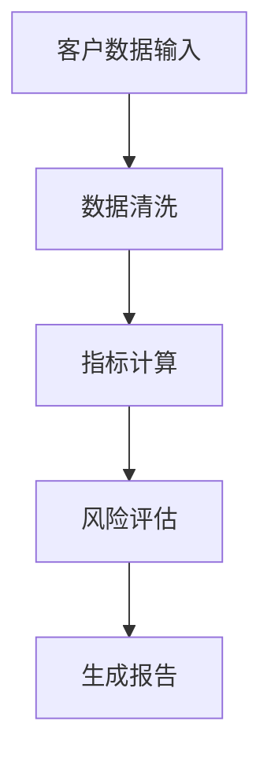

                 


# 彼得林奇如何评估公司的客户集中度风险

> 关键词：客户集中度风险，彼得·林奇，投资评估，风险管理系统，客户风险评估

> 摘要：本文详细探讨了彼得·林奇如何评估公司的客户集中度风险，从定义、指标、模型到系统设计和项目实战，全面解析客户集中度风险的评估方法和管理策略。

---

## 第一部分: 客户集中度风险概述

### 第1章: 客户集中度风险的定义与重要性

#### 1.1 客户集中度风险的定义

客户集中度风险是指一家公司对其主要客户的依赖程度过高，导致潜在的经营风险。这种风险可能会影响公司的收入稳定性、市场竞争力和财务健康状况。

- **客户集中度**：衡量客户分布的集中程度。客户分布越集中，风险越高。
- **风险定义**：客户集中度高可能导致单一客户流失对公司造成重大影响。

#### 1.2 客户集中度风险的重要性

- **对企业的影响**：客户依赖性强，收入波动大，经营稳定性差。
- **对行业的影响**：可能导致行业垄断，抑制竞争，影响市场健康发展。
- **对投资者的影响**：投资者面临更高的投资风险，影响投资决策。

### 第2章: 彼得·林奇与客户集中度风险

#### 2.1 彼得·林奇的背景介绍

- **生平简介**：彼得·林奇是美国著名投资者，以其成功的投资策略闻名。
- **投资理念**：注重基本面分析，寻找具有持续增长潜力的企业。
- **著作与影响力**：《彼得·林奇的投资哲学》等书籍，影响了无数投资者。

#### 2.2 彼得·林奇对客户集中度风险的研究

- **关注点**：林奇关注客户集中度对公司风险的影响，认为高集中度意味着高风险。
- **经典案例**：分析一些因客户集中度过高而失败的企业案例。
- **评价**：林奇强调分散客户风险的重要性，建议企业避免过度依赖单一客户。

---

## 第二部分: 客户集中度风险的评估方法

### 第3章: 客户集中度风险的评估指标

#### 3.1 客户集中度的主要指标

- **客户集中度指数（CR）**：衡量前几名客户占总销售额的比例。
  - CR4：前四大客户占总销售额的比例。
  - CR8：前八大客户占总销售额的比例。
- **市场集中度指数（HHI）**：衡量市场垄断程度，值越高，垄断程度越高。

#### 3.2 客户集中度指数的计算方法

- **CR4计算公式**：
  $$ CR4 = \frac{\sum_{i=1}^{4} s_i}{Total\ Sales} $$
  其中，\( s_i \) 是前四个客户的销售额。

- **HHI指数计算公式**：
  $$ HHI = \sum_{i=1}^{n} (\frac{s_i}{Total\ Sales})^2 $$
  \( n \) 是客户总数。

### 第4章: 彼得·林奇的客户集中度风险评估方法

#### 4.1 彼得·林奇的核心评估模型

- **模型输入**：客户销售额数据、行业基准。
- **模型输出**：客户集中度风险评分（低、中、高）。

#### 4.2 模型的数学公式与解释

- **风险评分公式**：
  $$ Risk\ Score = \alpha \times CR4 + \beta \times HHI + \gamma \times Industry\ Benchmark $$
  其中，\( \alpha, \beta, \gamma \) 是权重系数，根据行业不同调整。

### 第5章: 客户集中度风险的系统分析

#### 5.1 系统分析的步骤

- **问题定义**：明确目标，如评估客户集中度风险。
- **数据收集**：收集客户销售额、行业数据。
- **模型构建**：选择合适的评估指标和方法。

#### 5.2 系统架构设计

- **功能模块**：
  - 数据输入与处理。
  - 指标计算。
  - 风险评估与报告。
- **系统架构图**（使用Mermaid）：



### 第6章: 项目实战——客户集中度风险评估系统

#### 6.1 项目背景与目标

- **背景**：某零售公司面临客户集中度过高的风险。
- **目标**：评估客户集中度风险，制定优化策略。

#### 6.2 项目实施步骤

- **数据收集**：收集过去三年的客户销售额数据。
- **模型构建**：应用CR4和HHI指数计算。
- **风险评估**：生成风险评分，制定分散策略。

#### 6.3 项目核心代码实现

```python
import pandas as pd

# 数据加载
sales_data = pd.read_csv('client_sales.csv')

# 计算CR4和CR8
cr4 = sales_data.nlargest(4, 'sales')['sales'].sum() / sales_data['sales'].sum()
cr8 = sales_data.nlargest(8, 'sales')['sales'].sum() / sales_data['sales'].sum()

# 计算HHI指数
hhi = (sales_data['sales'] / sales_data['sales'].sum()) ** 2
hhi_index = hhi.sum()

# 风险评分计算
alpha = 0.5
beta = 0.3
gamma = 0.2
risk_score = alpha * cr4 + beta * cr8 + gamma * hhi_index

print(f"CR4: {cr4:.2f}, CR8: {cr8:.2f}, HHI: {hhi_index:.2f}")
print(f"Risk Score: {risk_score:.1f}")
```

---

## 第三部分: 总结与展望

### 6.1 最佳实践 tips

- 定期监控客户集中度，及时调整。
- 多元化客户结构，降低风险。

### 6.2 小结

本文详细介绍了彼得·林奇的客户集中度风险评估方法，从理论到实践，帮助读者理解和应用。

### 6.3 注意事项

- 数据准确性影响评估结果，确保数据可靠。
- 权重系数需根据行业调整，避免一刀切。

### 6.4 拓展阅读

- 推荐书籍：《彼得·林奇的投资哲学》。
- 相关工具：Python的Pandas和Matplotlib用于数据分析和可视化。

---

**作者：AI天才研究院 & 禅与计算机程序设计艺术**

