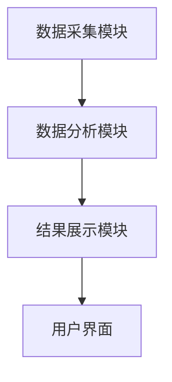

                 


# 彼得林奇如何评估公司的市场份额

---

## 关键词：
- 彼得林奇
- 市场份额
- 投资评估
- 行业分析
- 企业竞争力

---

## 摘要：
本文详细探讨了彼得·林奇如何评估公司的市场份额，从定义和重要性入手，结合定量和定性分析方法，通过数学模型和实际案例，系统地讲解了市场份额评估的核心概念、方法和应用场景。文章最后总结了最佳实践和注意事项，帮助读者更好地理解和应用这些评估方法。

---

## 第一部分：背景介绍

### 第1章：什么是市场份额

#### 1.1 市场份额的定义与重要性
- 什么是市场份额？
- 市场份额对企业的重要性
- 彼得林奇对市场份额的重视

#### 1.2 彼得林奇的背景与投资理念
- 彼得林奇的投资者背景
- 彼得林奇的投资理念
- 彼得林奇对市场份额的关注

#### 1.3 市场份额评估的核心概念
- 市场份额的核心要素
- 市场份额的边界与外延
- 市场份额与企业竞争力的关系

---

## 第二部分：市场份额评估的核心概念与联系

### 第2章：核心概念原理

#### 2.1 市场份额的核心要素
- 行业规模
- 市场增长率
- 企业产品优势

#### 2.2 市场份额与企业利润的关系
- 市场份额对利润的影响
- 市场份额与成本的关系

#### 2.3 市场份额与行业竞争的关系
- 市场份额与行业集中度
- 市场份额与竞争策略

---

### 第3章：数学模型与公式

#### 3.1 市场份额计算公式
- 市场份额计算公式
$$市场份额 = \frac{公司销量}{行业总销量}$$
- 市场份额增长率公式
$$市场份额增长率 = \frac{当前市场份额 - 上期市场份额}{上期市场份额} \times 100\%$$

#### 3.2 市场份额与利润的关系
- 利润计算公式
$$利润 = 价格 \times 销量 - 成本$$
- 市场份额对利润的影响
$$利润 = 价格 \times (市场份额 \times 行业总销量) - 成本$$

#### 3.3 举例说明
- 例子1：假设行业规模为100万，公司销量为20万，市场份额为20%
- 例子2：上期市场份额为15%，当前市场份额为20%，市场份额增长率为33.33%

---

## 第三部分：系统分析与架构设计

### 第4章：系统分析

#### 4.1 问题场景介绍
- 如何通过市场份额评估企业竞争力
- 如何通过市场份额预测企业未来表现

#### 4.2 系统功能设计
- 数据采集模块
- 数据分析模块
- 结果展示模块

#### 4.3 系统架构设计
- 使用Mermaid绘制系统架构图


#### 4.4 系统接口设计
- 数据接口定义
- API调用示例

---

### 第5章：项目实战

#### 5.1 环境安装
- 安装Python和必要的库
- 安装Mermaid和相关工具

#### 5.2 核心实现
- 使用Python代码实现市场份额计算
```python
def calculate_market_share(company_sales, industry_sales):
    return company_sales / industry_sales

def calculate_growth_rate(current_share, previous_share):
    return ((current_share - previous_share) / previous_share) * 100
```

#### 5.3 案例分析
- 实际案例分析
- 代码实现与结果解读

---

## 第四部分：总结与展望

### 第6章：总结

#### 6.1 最佳实践
- 定期更新数据
- 结合其他指标进行综合评估

#### 6.2 小结
- 通过市场份额评估企业竞争力的重要性
- 如何系统地进行市场份额分析

#### 6.3 注意事项
- 数据的准确性和及时性
- 方法的适用性和局限性

---

## 第五部分：拓展阅读

### 7.1 相关书籍
- 彼得林奇的其他著作
- 其他投资评估方法的书籍

### 7.2 在线资源
- 相关投资分析网站
- 数据分析工具推荐

---

## 作者：AI天才研究院/AI Genius Institute & 禅与计算机程序设计艺术 /Zen And The Art of Computer Programming

---

通过本文的详细讲解，读者可以全面理解彼得林奇如何评估公司的市场份额，并能够将这些方法应用到实际的投资分析中。

