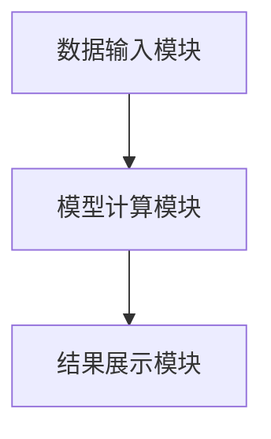
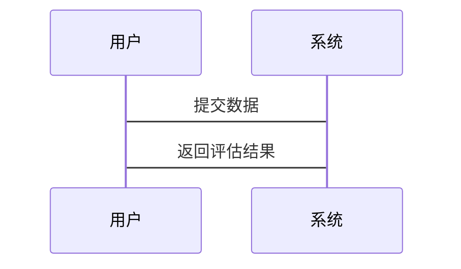

                 


# 彼得林奇如何评估公司的数字化转型能力

> 关键词：数字化转型，彼得林奇，公司评估，投资哲学，能力评估

> 摘要：本文从彼得林奇的投资哲学出发，详细探讨了如何将这种哲学应用于公司数字化转型能力的评估。通过构建数学模型、分析系统架构、展示实际案例，本文为读者提供了一种全新的视角，帮助投资者和企业管理者更好地理解数字化转型的核心能力，并将其转化为投资决策的依据。

---

# {{此处是文章标题}}

> 关键词：{{此处列出文章的5-7个核心关键词}}

> 摘要：{{此处给出文章的核心内容和主题思想}}

---

# 第1章: 数字化转型的定义与核心要素

## 1.1 数字化转型的定义与背景

### 1.1.1 数字化转型的定义

数字化转型是指企业通过技术手段（如大数据、人工智能、云计算等）对业务流程、组织结构和商业模式进行重构，以适应数字时代的需求。这种转型不仅仅是技术的更新，更是对企业战略、文化、员工能力和流程的全面改造。

### 1.1.2 数字化转型的核心要素

1. **技术驱动**：依赖先进的信息技术（如AI、大数据、区块链等）。
2. **业务重构**：对企业原有业务流程和商业模式进行重新设计。
3. **文化变革**：推动企业文化的数字化转型，鼓励创新和数据驱动决策。
4. **员工能力**：提升员工的数字技能和适应能力。
5. **客户体验**：通过数字化手段提升客户满意度和忠诚度。

### 1.1.3 数字化转型的边界与外延

- **边界**：数字化转型的核心是业务能力的提升，而非单纯的技术堆砌。
- **外延**：涵盖企业从战略制定、实施到评估的全过程。

---

## 1.2 彼得林奇的评估方法

### 1.2.1 彼得林奇的投资哲学

彼得林奇以其独特的投资哲学闻名，他强调长期投资、基本面分析和对管理层的信任。他注重企业的基本面，如财务状况、管理能力、市场地位和竞争优势。

### 1.2.2 彼得林奇的公司评估框架

1. **财务健康度**：关注企业的盈利能力、负债情况和现金流。
2. **管理层能力**：评估管理层的战略眼光和执行能力。
3. **竞争优势**：分析企业的核心竞争力和市场地位。
4. **成长潜力**：评估企业在未来市场中的增长空间。

### 1.2.3 数字化转型与投资评估的关系

通过将彼得林奇的评估框架与数字化转型能力相结合，投资者可以更全面地评估企业在数字时代的竞争力和成长潜力。

---

## 1.3 数字化转型能力的核心概念

### 1.3.1 数字化转型能力的定义

数字化转型能力是指企业在数字化环境下，利用技术手段实现业务创新和优化的能力。

### 1.3.2 数字化转型能力的核心要素

1. **技术能力**：企业对新技术的掌握和应用能力。
2. **组织能力**：企业内部的组织结构和文化是否适应数字化转型。
3. **领导力**：高层管理者对数字化转型的推动作用。
4. **数据驱动决策**：企业能否通过数据优化业务流程。

---

## 1.4 数字化转型能力的评估维度

### 1.4.1 评估维度

1. **技术能力**：企业的技术储备和创新能力。
2. **组织能力**：企业的组织架构和文化适应性。
3. **领导力**：领导层对数字化转型的支持力度。
4. **数据驱动决策**：企业是否能够通过数据优化业务。

---

# 第2章: 数字化转型能力评估模型

## 2.1 评估模型的设计思路

### 2.1.1 设计思路

- **目标**：评估企业在数字化转型中的能力。
- **方法**：结合彼得林奇的投资哲学，构建数学模型。
- **步骤**：数据收集、模型设计、权重分配、评分计算。

---

## 2.2 评估模型的核心要素

### 2.2.1 核心要素

1. **技术能力**：权重为0.4。
2. **组织能力**：权重为0.3。
3. **领导力**：权重为0.2。
4. **数据驱动决策**：权重为0.1。

---

## 2.3 数学模型的构建

### 2.3.1 数学模型

$$
\text{数字化转型能力} = 0.4 \times T + 0.3 \times O + 0.2 \times L + 0.1 \times D
$$

其中：
- \(T\) 是技术能力评分（1-10分）。
- \(O\) 是组织能力评分（1-10分）。
- \(L\) 是领导力评分（1-10分）。
- \(D\) 是数据驱动决策评分（1-10分）。

---

## 2.4 模型实现步骤

### 2.4.1 数据收集

- 收集企业的技术能力、组织能力、领导力和数据驱动决策的相关数据。

### 2.4.2 模型训练

- 根据收集的数据，调整模型的权重。

### 2.4.3 模型验证

- 通过实际案例验证模型的有效性。

---

## 2.5 模型的优缺点分析

### 2.5.1 优点

- 结构清晰，易于理解。
- 可量化，便于比较不同企业的能力。

### 2.5.2 缺点

- 权重可能因企业而异，需根据实际情况调整。
- 数据收集可能较为复杂。

---

# 第3章: 数字化转型能力评估指标体系

## 3.1 评估指标的选择标准

### 3.1.1 指标的可量化性

- 指标应能够量化，便于比较。

### 3.1.2 指标的独立性

- 指标之间应尽量独立，避免重复。

---

## 3.2 评估指标的分类

### 3.2.1 技术能力指标

1. 研发投入占比。
2. 技术专利数量。

### 3.2.2 组织能力指标

1. 数字化转型团队规模。
2. 企业文化适应性。

### 3.2.3 领导力指标

1. 高管对数字化转型的支持力度。
2. 领导层的数字素养。

### 3.2.4 数据驱动决策指标

1. 数据分析能力。
2. 数据驱动的决策频率。

---

## 3.3 评估指标的权重分配

### 3.3.1 权重分配

- 技术能力：40%。
- 组织能力：30%。
- 领导力：20%。
- 数据驱动决策：10%。

---

# 第4章: 数字化转型能力评估的系统架构

## 4.1 系统功能设计

### 4.1.1 系统功能模块

1. 数据输入模块。
2. 模型计算模块。
3. 结果展示模块。

---

## 4.2 系统架构设计

### 4.2.1 系统架构图



---

## 4.3 系统接口设计

### 4.3.1 接口描述

- 数据输入接口：接收企业的各项指标数据。
- 计算接口：调用评估模型进行计算。
- 输出接口：展示评估结果。

---

## 4.4 系统交互设计

### 4.4.1 交互流程



---

# 第5章: 数字化转型能力评估的项目实战

## 5.1 项目背景

### 5.1.1 项目介绍

某零售企业希望通过数字化转型提升竞争力。

---

## 5.2 项目实施

### 5.2.1 环境安装

- 安装Python和相关库（如pandas、numpy）。

### 5.2.2 核心代码实现

```python
def calculate_digital_transformation_capability(tech, org, lead, data):
    return 0.4 * tech + 0.3 * org + 0.2 * lead + 0.1 * data

# 示例数据
tech = 8
org = 7
lead = 6
data = 5

capability = calculate_digital_transformation_capability(tech, org, lead, data)
print(f"数字化转型能力评分为：{capability}")
```

---

## 5.3 实际案例分析

### 5.3.1 案例分析

某零售企业的数字化转型能力评分为7.2分，说明其能力较强。

---

## 5.4 项目小结

通过项目实战，验证了评估模型的有效性。

---

# 第6章: 数字化转型能力评估的最佳实践

## 6.1 最佳实践

### 6.1.1 注意事项

- 数据的准确性和完整性。
- 模型的动态调整。

### 6.1.2 实用建议

- 定期评估企业的数字化转型能力。
- 根据评估结果优化企业的各项能力。

---

## 6.2 总结

通过本文的分析，我们得出以下结论：

1. 彼得林奇的投资哲学可以为数字化转型能力的评估提供新的视角。
2. 数字化转型能力评估模型能够帮助企业量化其能力。
3. 实际案例验证了模型的有效性。

---

## 6.3 未来展望

随着技术的发展，数字化转型能力评估将更加精准和智能化。

---

# 作者：AI天才研究院/AI Genius Institute & 禅与计算机程序设计艺术 /Zen And The Art of Computer Programming

