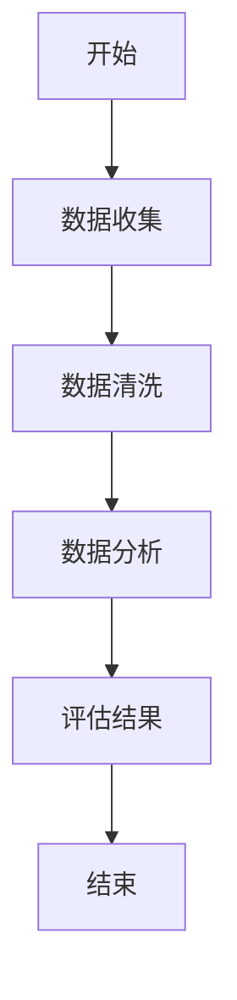

                 

# 彼得林奇如何评估公司的数字化转型速度

> 关键词：数字化转型，彼得林奇，评估指标，转型速度，投资策略

> 摘要：本文结合彼得林奇的投资理念，深入分析企业数字化转型的核心要素、评估指标和成功方法。通过构建彼得林奇评估模型，帮助企业有效评估数字化转型的速度，指导企业在数字化浪潮中稳步前行。

---

# 第一部分: 数字化转型评估的背景与重要性

## 第1章: 数字化转型的背景与核心概念

### 1.1 数字化转型的背景与问题背景

#### 1.1.1 数字化转型的定义与概念
数字化转型（Digital Transformation）是指企业利用数字技术（如大数据、人工智能、云计算等）重新设计或优化业务流程、组织架构、文化模式和客户体验，以实现业务创新和价值提升的过程。它不仅仅是技术的升级，更是对企业商业模式、运营方式和价值创造方式的根本性变革。

#### 1.1.2 数字化转型的核心问题与挑战
- 技术层面：如何选择和应用合适的技术，避免技术选型失误。
- 业务层面：如何将数字化转型与企业战略目标结合，确保业务流程的优化。
- 组织层面：如何推动组织文化变革，培养数字化人才。

#### 1.1.3 数字化转型对企业的影响与价值
- 提升效率：通过自动化和智能化减少人工干预。
- 优化决策：利用数据驱动的洞察提升决策的准确性和及时性。
- 创新业务模式：通过数字化手段开拓新的市场和客户群体。

### 1.2 彼得林奇与投资策略

#### 1.2.1 彼得林奇的投资理念与方法
彼得林奇是美国著名的投资经理人，他强调长期投资、价值投资和深入研究企业的基本面。他认为，一个企业的成功不仅取决于财务数据，还取决于其商业模式、管理团队和市场竞争力。

#### 1.2.2 彼得林奇对企业的评估标准
- 财务表现：关注企业的盈利能力、现金流和资产负债情况。
- 管理团队：考察管理层的决策能力和战略眼光。
- 市场地位：分析企业在行业中的竞争地位和市场份额。

#### 1.2.3 彼得林奇与数字化转型的关联
彼得林奇的投资理念强调对企业基本面的深入分析，这与数字化转型评估的核心方法不谋而合。通过分析企业的技术能力、业务模式和组织文化，可以更好地评估其数字化转型的速度和潜力。

### 1.3 数字化转型评估的核心要素

#### 1.3.1 技术层面的数字化转型
- 技术架构：企业的技术架构是否支持数字化转型。
- 技术成熟度：技术的稳定性和可扩展性。

#### 1.3.2 业务层面的数字化转型
- 业务流程：业务流程是否实现了数字化和自动化。
- 业务模式：是否通过数字化手段实现了新的商业模式。

#### 1.3.3 组织与文化层面的数字化转型
- 组织结构：组织结构是否支持数字化转型。
- 数字化文化：企业是否形成了支持创新和数据驱动决策的文化。

---

## 第2章: 数字化转型的评估指标与模型

### 2.1 数字化转型的评估指标

#### 2.1.1 技术成熟度
- 技术基础设施：企业的IT基础设施是否支持数字化转型。
- 技术创新能力：企业是否具备技术创新能力。

#### 2.1.2 业务流程优化
- 流程自动化：业务流程是否实现了自动化。
- 流程优化效果：流程优化是否带来了效率提升。

#### 2.1.3 数字化文化与组织能力
- 数字化文化：企业是否形成了支持数字化转型的文化。
- 数字化人才：企业是否具备足够的数字化人才。

### 2.2 彼得林奇评估模型的构建

#### 2.2.1 模型的核心要素
- 技术成熟度（T）
- 业务流程优化（B）
- 组织与文化能力（O）

#### 2.2.2 模型的逻辑关系
数字化转型的速度（DTS）是技术、业务和组织能力三者的综合结果。$$DTS = f(T, B, O)$$

#### 2.2.3 模型的应用场景
- 企业自评估：帮助企业了解自身数字化转型的进度。
- 投资决策：投资者可以通过模型评估企业的数字化潜力。

### 2.3 模型的数学表达

#### 2.3.1 数学公式
$$DTS = \alpha T + \beta B + \gamma O$$

其中：
- $\alpha$、$\beta$、$\gamma$ 是各维度的权重系数。
- $T$、$B$、$O$ 分别是技术成熟度、业务流程优化和组织能力的评分。

---

## 第3章: 数字化转型的评估方法论

### 3.1 数据驱动的评估方法

#### 3.1.1 数据收集与分析
- 数据来源：企业内部数据、行业报告、市场调研。
- 数据清洗：剔除无效数据，确保数据质量。

#### 3.1.2 数据可视化与洞察提取
- 数据可视化工具：使用 Tableau、Power BI 等工具进行数据展示。
- 洞察提取：通过数据分析发现关键问题和改进方向。

#### 3.1.3 数据驱动的决策优化
- 数据驱动的决策：基于数据分析结果优化业务流程和组织结构。

### 3.2 彼得林奇评估方法的应用

#### 3.2.1 方法论的核心步骤
1. **数据收集与分析**：收集企业相关的财务数据、业务数据和组织数据。
2. **模型构建**：基于彼得林奇模型构建数字化转型速度评估模型。
3. **评估与优化**：根据评估结果优化企业的数字化转型策略。

#### 3.2.2 方法论的具体实施工具
- 数据分析工具：Python、R。
- 数据可视化工具：Tableau、Power BI。
- 项目管理工具：JIRA、Trello。

#### 3.2.3 方法论的优缺点分析
- 优点：模型简单易懂，操作性强。
- 缺点：模型过于简化，可能忽略一些次要因素。

### 3.3 算法原理与流程图

#### 3.3.1 算法原理
1. 收集企业数据。
2. 构建评估模型。
3. 计算数字化转型速度评分。
4. 根据评分优化策略。

#### 3.3.2 流程图

---

## 第4章: 企业数字化转型的关键成功因素

### 4.1 技术因素

#### 4.1.1 关键技术的选择与应用
- 云计算：提供弹性计算资源。
- 大数据：支持数据驱动的决策。
- AI：实现智能化的业务流程。

#### 4.1.2 技术架构的合理性
- 架构设计：确保技术架构的可扩展性和灵活性。
- 技术更新：及时更新技术以应对新的挑战。

#### 4.1.3 技术创新与持续优化
- 技术创新：通过技术创新提升企业的竞争力。
- 技术优化：持续优化技术实现，提高效率。

### 4.2 业务因素

#### 4.2.1 业务模式的创新
- 数字化产品：开发新的数字化产品和服务。
- 业务流程优化：通过数字化手段优化业务流程。

#### 4.2.2 业务流程的优化
- 流程自动化：实现业务流程的自动化。
- 流程优化：通过数据分析优化业务流程。

#### 4.2.3 业务目标与数字化转型的结合
- 数字化目标：明确数字化转型的目标。
- 目标分解：将目标分解为具体的行动步骤。

### 4.3 组织与文化因素

#### 4.3.1 组织结构的适应性
- 组织架构：确保组织架构支持数字化转型。
- 跨部门协作：促进跨部门的协作，形成合力。

#### 4.3.2 企业文化的影响
- 企业文化：企业文化是否支持创新和数字化转型。
- 员工激励：通过激励措施鼓励员工参与数字化转型。

#### 4.3.3 人才培养与能力提升
- 数字化人才培养：通过培训提升员工的数字化能力。
- 人才引进：引进具有数字化能力的人才。

---

## 第5章: 数字化转型的案例分析与最佳实践

### 5.1 案例分析

#### 5.1.1 某行业领先企业的数字化转型实践
- 案例背景：某零售企业通过数字化转型提升客户体验。
- 实践过程：引入大数据和人工智能技术优化供应链和客户体验。
- 实践结果：客户满意度提升，运营效率提高。

#### 5.1.2 案例分析的启示与经验总结
- 启示：数字化转型需要企业内外部的协同努力。
- 经验总结：成功的数字化转型需要明确的目标、合理的规划和持续的投入。

### 5.2 彼得林奇评估方法的实践应用

#### 5.2.1 实际案例中的评估过程
- 数据收集：收集企业的财务数据、业务数据和组织数据。
- 模型构建：基于彼得林奇模型构建评估模型。
- 评估结果：根据评估结果优化企业的数字化转型策略。

#### 5.2.2 评估结果对企业的影响
- 优化策略：根据评估结果优化企业的数字化转型策略。
- 提高效率：通过优化策略提高企业的运营效率。

---

## 第6章: 数字化转型的总结与展望

### 6.1 本章总结
- 数字化转型是企业应对数字时代挑战的重要手段。
- 彼得林奇评估模型为企业提供了科学的评估方法。
- 成功的数字化转型需要企业的技术、业务和组织能力的综合提升。

### 6.2 未来展望
- 技术发展：随着技术的不断进步，数字化转型将更加深入。
- 行业趋势：更多的行业将加速数字化转型，形成新的竞争优势。
- 挑战与机遇：企业需要在数字化转型中抓住机遇，应对挑战。

---

# 作者：AI天才研究院/AI Genius Institute & 禅与计算机程序设计艺术 /Zen And The Art of Computer Programming

