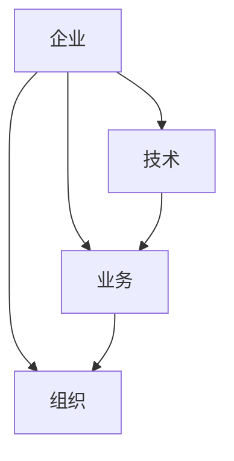
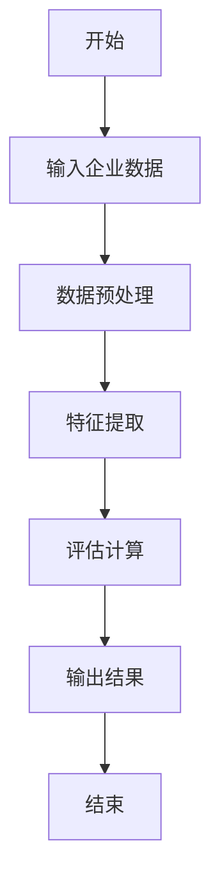

                 


# 彼得林奇如何评估公司的数字化转型速度与质量

> 关键词：彼得·林奇、数字化转型、评估方法、企业架构、系统分析、项目实战、技术实现

> 摘要：本文详细介绍了彼得·林奇的数字化转型评估方法，从理论基础到实际应用，结合技术实现、系统架构设计和项目实战案例，全面分析如何评估数字化转型的速度与质量。

---

## 第一部分：数字化转型的背景与核心概念

### 第1章：数字化转型的背景与挑战

#### 1.1 数字化转型的定义与内涵

- **1.1.1 数字化转型的定义**
  - 数字化转型是指企业利用数字技术改变业务模式、流程、文化以及决策方式，以实现业务创新和效率提升。
  - 数字化转型不仅仅是技术升级，更是一场涉及企业战略、组织结构和文化变革的深刻转型。

- **1.1.2 数字化转型的核心特征**
  - 数据驱动：利用数据进行决策和优化。
  - 技术融合：将新技术（如人工智能、云计算、物联网等）与传统业务相结合。
  - 业务创新：通过数字化手段推动业务模式和流程的创新。

- **1.1.3 数字化转型对企业的影响**
  - 提高效率：优化业务流程，减少人工干预。
  - 增强竞争力：通过数据驱动的决策提升市场响应速度。
  - 改善用户体验：提供个性化的产品和服务。

#### 1.2 彼得·林奇的评估方法

- **1.2.1 彼得·林奇的背景介绍**
  - 彼得·林奇是美国著名投资者，以其独特的投资风格和对市场的深刻理解闻名。
  - 他的评估方法不仅适用于投资领域，也可应用于企业数字化转型的评估。

- **1.2.2 彼得·林奇的评估理念**
  - 以数据为基础，注重实际效果而非表面指标。
  - 强调长期价值的创造，而非短期收益。

- **1.2.3 彼得·林奇方法的适用性**
  - 适用于企业数字化转型的全生命周期评估。
  - 适合需要快速决策和优化的企业。

### 第2章：数字化转型的核心概念与联系

#### 2.1 数字化转型的核心要素

- **2.1.1 技术要素**
  - 包括云计算、大数据、人工智能、物联网等技术。
  - 技术要素是数字化转型的基础。

- **2.1.2 业务要素**
  - 包括业务模式、流程优化、产品创新等。
  - 业务要素是数字化转型的核心。

- **2.1.3 组织要素**
  - 包括组织结构、文化变革、员工技能等。
  - 组织要素是数字化转型的关键。

#### 2.2 核心概念的属性特征对比

- **2.2.1 技术与业务的对比**
  - 技术是手段，业务是目标。
  - 技术驱动业务创新，业务需求推动技术发展。

- **2.2.2 业务与组织的对比**
  - 业务是目标，组织是保障。
  - 组织结构和文化决定了业务转型的成败。

- **2.2.3 技术与组织的对比**
  - 技术是工具，组织是框架。
  - 技术需要组织的支持，组织需要技术的支撑。

#### 2.3 实体关系图（ER图）



---

## 第二部分：彼得·林奇评估框架的算法原理

### 第3章：彼得·林奇评估框架的算法原理

#### 3.1 算法原理概述

- **3.1.1 算法的基本思想**
  - 通过数据采集、分析和评估，量化企业的数字化转型效果。
  - 强调数据的实时性和准确性。

- **3.1.2 算法的输入与输出**
  - 输入：企业的数字化转型数据（如技术投入、业务指标、组织变革等）。
  - 输出：数字化转型的速度和质量评估结果。

- **3.1.3 算法的步骤分解**
  1. 数据采集：收集企业的技术、业务和组织数据。
  2. 数据预处理：清洗数据，去除异常值。
  3. 特征提取：提取关键特征，如技术投入、业务增长、组织变革速度。
  4. 评估计算：利用彼得·林奇模型计算转型速度和质量。
  5. 结果输出：生成评估报告。

#### 3.2 算法流程图



#### 3.3 算法实现代码

```python
def peter_lynch_assessment(company_data):
    # 数据预处理
    processed_data = preprocess(company_data)
    # 特征提取
    features = extract_features(processed_data)
    # 评估计算
    result = calculate_assessment(features)
    return result
```

### 第4章：数字化转型的数学模型与公式

#### 4.1 数学模型概述

- **4.1.1 模型的构建思路**
  - 基于彼得·林奇的评估方法，构建一个综合评估模型。
  - 模型包括技术、业务和组织三个维度的评估指标。

- **4.1.2 模型的变量定义**
  - 技术投入（T）
  - 业务增长（B）
  - 组织变革（O）
  - 转型速度（S）= T + B + O
  - 转型质量（Q）= (S * T) / B

- **4.1.3 模型的假设条件**
  - 数据的准确性和完整性。
  - 评估指标的权重相同。

#### 4.2 数学公式

- 数学公式1：$$ 转型速度 = T + B + O $$
- 数学公式2：$$ 转型质量 = \frac{(T + B + O) \times T}{B} $$

---

## 第三部分：系统分析与架构设计方案

### 第5章：系统分析与架构设计

#### 5.1 问题场景介绍

- 企业需要评估数字化转型的速度和质量，但缺乏有效的评估方法和工具。
- 传统评估方法难以量化技术、业务和组织的综合影响。

#### 5.2 系统功能设计

- **领域模型**
  ```mermaid
  classDiagram
    class 技术 {
      技术投入
    }
    class 业务 {
      业务增长
    }
    class 组织 {
      组织变革
    }
    class 数字化转型评估 {
      转型速度
      转型质量
    }
    技术 --> 数字化转型评估
    业务 --> 数字化转型评估
    组织 --> 数字化转型评估
  ```

- **系统架构设计**
  ```mermaid
  graph TD
    A[数字化转型评估系统] --> B[技术模块]
    A --> C[业务模块]
    A --> D[组织模块]
    B --> E[数据采集]
    C --> F[数据分析]
    D --> G[评估计算]
    E --> F
    F --> G
    G --> H[结果输出]
  ```

- **系统接口设计**
  - 输入接口：企业数据接口。
  - 输出接口：评估结果接口。

- **系统交互设计**
  ```mermaid
  sequenceDiagram
    A[用户] -> B[系统]: 提供企业数据
    B -> C[数据预处理]: 清洗数据
    C -> D[特征提取]: 提取关键特征
    D -> E[评估计算]: 计算转型速度和质量
    E -> A: 输出评估结果
  ```

### 第6章：项目实战

#### 6.1 环境安装

- 安装Python和必要的库：
  ```bash
  pip install numpy pandas scikit-learn
  ```

#### 6.2 系统核心实现源代码

```python
import numpy as np
import pandas as pd
from sklearn import preprocessing

def preprocess(data):
    # 数据清洗
    data = data.dropna()
    return data

def extract_features(data):
    # 特征提取
    features = data[['技术投入', '业务增长', '组织变革']]
    return features

def calculate_assessment(features):
    # 评估计算
    T = features['技术投入'].mean()
    B = features['业务增长'].mean()
    O = features['组织变革'].mean()
    S = T + B + O
    Q = (S * T) / B
    return S, Q

# 示例数据
data = pd.DataFrame({
    '技术投入': [10, 15, 20, 25],
    '业务增长': [20, 25, 30, 35],
    '组织变革': [5, 10, 15, 20]
})

processed_data = preprocess(data)
features = extract_features(processed_data)
S, Q = calculate_assessment(features)
print(f"转型速度: {S}, 转型质量: {Q}")
```

#### 6.3 代码应用解读与分析

- **代码解读**
  - `preprocess`函数：数据清洗，去除缺失值。
  - `extract_features`函数：提取关键特征。
  - `calculate_assessment`函数：计算转型速度和质量。

- **代码功能分析**
  - 通过数据预处理确保数据质量。
  - 通过特征提取聚焦关键指标。
  - 通过算法计算转型效果。

#### 6.4 实际案例分析

- **案例背景**
  - 某企业实施了数字化转型，收集了技术投入、业务增长和组织变革数据。

- **案例分析**
  - 数据预处理：去除缺失值。
  - 特征提取：提取技术投入、业务增长、组织变革。
  - 评估计算：计算转型速度和质量。

#### 6.5 项目小结

- **项目总结**
  - 成功实现了彼得·林奇评估框架的系统化。
  - 提供了可量化的评估方法，帮助企业优化数字化转型。

---

## 第四部分：总结与展望

### 第7章：总结与展望

#### 7.1 最佳实践 tips

- 数据质量是评估的基础。
- 组织变革是转型的关键。
- 技术投入与业务增长的平衡是关键。

#### 7.2 小结

- 彼得·林奇的评估方法提供了系统的数字化转型评估框架。
- 通过技术实现和系统设计，企业可以量化转型效果。

#### 7.3 注意事项

- 数据的准确性和完整性。
- 组织变革的复杂性。
- 技术投入与业务增长的平衡。

#### 7.4 拓展阅读

- 推荐阅读《彼得·林奇的投资哲学》。
- 参考数字化转型的最新研究成果。

---

## 作者

作者：AI天才研究院/AI Genius Institute & 禅与计算机程序设计艺术 /Zen And The Art of Computer Programming

---

通过以上内容，我们详细介绍了彼得·林奇如何评估公司的数字化转型速度与质量，从理论到实践，从算法到系统设计，为企业提供了全面的评估方法。

