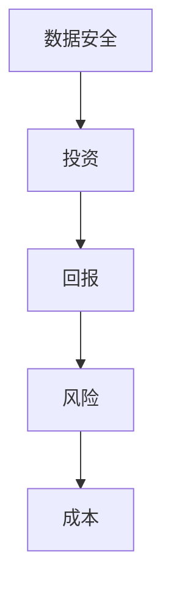
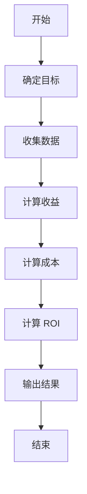
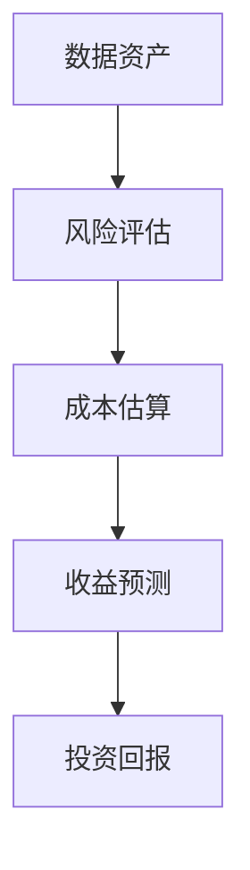
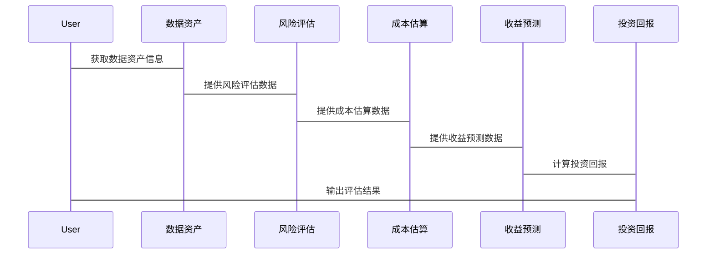

                 


# 彼得林奇如何评估公司的数据安全投资回报

> 关键词：数据安全，投资回报，彼得林奇，安全评估，成本效益分析

> 摘要：本文将探讨如何借鉴彼得林奇的投资理念，评估公司在数据安全方面的投资回报。通过分析数据安全的核心概念、评估方法、系统架构和实际案例，本文为读者提供一套全面的评估框架，帮助企业在保障数据安全的同时，实现投资回报的最大化。

---

# 第一部分：数据安全投资回报评估的背景与基础

## 第1章：数据安全投资回报评估的背景与重要性

### 1.1 数据安全的定义与核心要素

#### 1.1.1 数据安全的定义

数据安全是指通过技术和管理手段，保护数据的机密性、完整性和可用性，防止未经授权的访问、泄露、破坏或篡改。数据是现代企业的核心资产，数据安全是企业运营的基石。

#### 1.1.2 数据安全的核心要素

数据安全的核心要素包括：

1. **机密性（Confidentiality）**：确保数据仅被授权的人员访问。
2. **完整性（Integrity）**：确保数据在存储和传输过程中不被篡改。
3. **可用性（Availability）**：确保数据在需要时可被访问。
4. **可追溯性（Accountability）**：能够追溯数据的来源和操作。
5. **合规性（Compliance）**：符合相关法律法规和行业标准。

#### 1.1.3 数据安全的边界与外延

数据安全的边界包括数据的生命周期（创建、存储、传输、使用、销毁）以及数据的物理和逻辑边界。外延则涉及数据安全的技术手段（如加密、访问控制）、管理措施（如政策、流程）、人员培训等。

### 1.2 投资回报评估的定义与方法

#### 1.2.1 投资回报评估的定义

投资回报评估是对某项投资的收益与成本进行分析，以确定其经济效益的过程。在数据安全领域，投资回报评估旨在量化数据安全投入对业务目标的贡献。

#### 1.2.2 投资回报评估的主要方法

1. **净现值（Net Present Value，NPV）**：计算投资的未来现金流的现值减去初始投资。
2. **内部收益率（Internal Rate of Return，IRR）**：计算投资的收益率，使其净现值为零。
3. **投资回收期（Payback Period）**：计算投资回收成本所需的时间。
4. **成本效益分析（Cost-Benefit Analysis）**：比较成本与收益，评估投资的可行性。

#### 1.2.3 数据安全投资回报评估的独特性

数据安全投资回报评估的独特性在于其目标是降低风险，而非直接创造收益。数据安全的投资回报通常体现在降低数据泄露成本、提升客户信任和维护企业声誉等方面。

### 1.3 数据安全与投资回报的关系

#### 1.3.1 数据安全对企业的价值

数据安全是企业风险管理的重要组成部分。有效的数据安全措施可以降低数据泄露风险，保护企业声誉，维护客户信任，并避免法律罚款和赔偿。

#### 1.3.2 数据安全投资回报评估的必要性

随着数据泄露事件的频发，企业需要量化数据安全投入的经济效益，以合理分配资源，优化投资策略。

#### 1.3.3 数据安全与企业可持续发展的关系

数据安全是企业可持续发展的基础。没有数据安全，企业可能面临业务中断、客户流失和法律风险，进而影响其可持续发展。

### 1.4 本章小结

本章介绍了数据安全的定义、核心要素及其与投资回报的关系。数据安全是企业风险管理的重要组成部分，其投资回报体现在降低风险、保护声誉和实现可持续发展等方面。

---

## 第2章：数据安全投资回报评估的核心概念与联系

### 2.1 核心概念原理

#### 2.1.1 数据安全的核心原理

数据安全的核心原理包括身份验证、访问控制、加密和日志记录等技术手段，以及风险管理、政策制定和人员培训等管理措施。

#### 2.1.2 投资回报评估的数学模型

投资回报评估的数学模型通常包括收益预测、成本估算和风险分析等部分。例如，净现值模型可以表示为：

$$ NPV = \sum_{t=1}^{n} \frac{\text{现金流}_t}{(1 + r)^t} $$

其中，$r$ 是折现率，$t$ 是时间。

#### 2.1.3 数据安全与投资回报的联系

数据安全通过降低风险和减少潜在损失，间接地为企业创造价值，从而影响投资回报。

### 2.2 数据安全与投资回报的对比分析

#### 2.2.1 数据安全的属性特征

数据安全的属性特征包括技术性、管理性、动态性和全员性。

#### 2.2.2 投资回报的属性特征

投资回报的属性特征包括财务性、时间性、风险性和可量化性。

#### 2.2.3 数据安全与投资回报的对比分析表

| 属性 | 数据安全 | 投资回报 |
|------|----------|----------|
| 性质 | 技术与管理 | 财务与经济 |
| 时间 | 长期 | 短期与长期 |
| 风险 | 高 | 中高 |
| 可量化 | 部分可量化 | 完全可量化 |

### 2.3 数据安全与投资回报的ER实体关系图



### 2.4 本章小结

本章通过对比分析，揭示了数据安全与投资回报的联系与区别。数据安全是投资回报的重要影响因素，两者在属性和关系上具有一定的差异性。

---

## 第3章：数据安全投资回报评估的算法原理

### 3.1 算法原理概述

#### 3.1.1 数据安全投资回报评估的数学模型

数据安全投资回报评估的数学模型可以表示为：

$$ ROI = \frac{\text{收益} - \text{成本}}{\text{成本}} $$

其中，收益包括避免的数据泄露损失、提升的客户信任等，成本包括技术投入、人员培训等。

#### 3.1.2 数据安全投资回报评估的步骤

1. **确定目标**：明确评估的目标，如降低数据泄露风险、提升数据安全能力等。
2. **收集数据**：收集相关的收益和成本数据。
3. **计算收益**：预测数据安全投入带来的收益。
4. **计算成本**：估算数据安全投入的成本。
5. **计算 ROI**：使用 ROI 公式计算投资回报。
6. **验证结果**：验证结果的合理性和可行性。

### 3.2 算法流程图



### 3.3 算法实现代码

```python
def calculate_roi(revenue, cost):
    return (revenue - cost) / cost

# 示例
revenue = 1000000  # 收益
cost = 500000      # 成本
roi = calculate_roi(revenue, cost)
print(f"ROI: {roi}")
```

### 3.4 算法原理的详细讲解与举例

#### 3.4.1 净现值计算

净现值（NPV）计算公式为：

$$ NPV = \sum_{t=1}^{n} \frac{\text{现金流}_t}{(1 + r)^t} $$

其中，$r$ 是折现率，$t$ 是时间。例如，如果初始投资为 50 万元，未来三年的现金流分别为 20 万元、30 万元和 40 万元，折现率为 10%，则：

$$ NPV = \frac{20}{1.1} + \frac{30}{(1.1)^2} + \frac{40}{(1.1)^3} - 50 $$

计算结果为正，则投资可行。

#### 3.4.2 内部收益率计算

内部收益率（IRR）是使净现值为零的收益率。例如，某项目初始投资为 100 万元，未来三年的现金流分别为 40 万元、50 万元和 60 万元，则IRR 可通过试算法计算。

---

# 第二部分：数据安全投资回报评估的系统架构与实现

## 第4章：数据安全投资回报评估的系统分析

### 4.1 系统功能设计

#### 4.1.1 领域模型设计

数据安全投资回报评估的领域模型包括数据资产、风险评估、成本估算和收益预测等。


### 4.2 系统架构设计

#### 4.2.1 系统架构图



#### 4.2.2 系统交互设计



## 第5章：数据安全投资回报评估的项目实战

### 5.1 项目背景介绍

某公司面临数据泄露风险，计划投入 100 万元进行数据安全整改，预期减少 30% 的数据泄露损失。

### 5.2 项目实施过程

1. **风险评估**：识别关键数据资产，评估数据泄露风险。
2. **成本估算**：估算技术投入、人员培训等成本。
3. **收益预测**：预测避免的数据泄露损失、提升的客户信任等收益。
4. **投资回报评估**：使用 ROI 公式计算投资回报。

### 5.3 项目成果展示

#### 5.3.1 环境安装

安装数据安全评估系统，配置相关工具和数据。

#### 5.3.2 系统实现

编写数据安全评估代码，实现风险评估、成本估算和收益预测功能。

#### 5.3.3 案例分析

通过实际案例分析，验证数据安全投资回报评估模型的有效性。

### 5.4 项目小结

通过本项目，验证了数据安全投资回报评估模型的有效性，为企业优化数据安全投入提供了参考。

---

## 第6章：数据安全投资回报评估的最佳实践

### 6.1 小结

数据安全投资回报评估是企业风险管理的重要组成部分，通过量化数据安全投入的经济效益，帮助企业优化资源分配。

### 6.2 注意事项

1. 数据安全投资回报评估需要结合企业实际情况。
2. 数据安全投资回报评估需要持续更新和完善。
3. 数据安全投资回报评估需要结合定性和定量分析。

### 6.3 未来趋势

随着数据泄露事件的频发，数据安全投资回报评估将更加受到重视，未来可能引入人工智能和大数据分析技术，提高评估的准确性和效率。

### 6.4 拓展阅读

1. 彼得林奇的《投资最重要的事情》。
2. 数据安全领域的经典著作《 cybersecurity: Managing risk and Compliance》。
3. 投资回报评估的经典教材《Financial Management》。

---

## 第7章：总结与展望

### 7.1 本章总结

通过本文的探讨，我们了解了如何借鉴彼得林奇的投资理念，评估公司数据安全的投资回报。数据安全投资回报评估是企业风险管理的重要组成部分，其核心在于量化数据安全投入的经济效益。

### 7.2 未来展望

未来，随着数据安全威胁的加剧和投资回报评估技术的进步，数据安全投资回报评估将更加精准和高效。企业需要持续关注数据安全领域的新技术和新方法，优化数据安全投入策略。

---

# 作者：AI天才研究院/AI Genius Institute & 禅与计算机程序设计艺术/Zen And The Art of Computer Programming

---

希望这篇文章能够帮助您理解如何将彼得林奇的投资理念应用于数据安全投资回报评估。通过系统的分析和实际案例的探讨，我们相信企业能够更好地优化数据安全投入，实现可持续发展。

