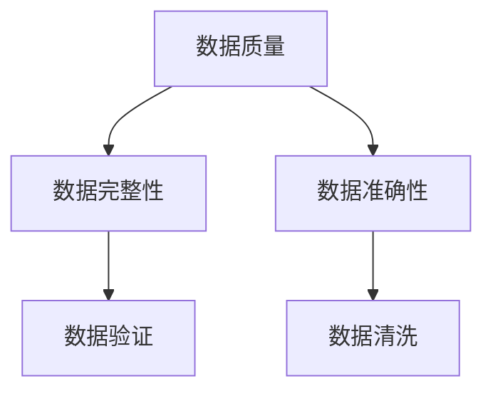
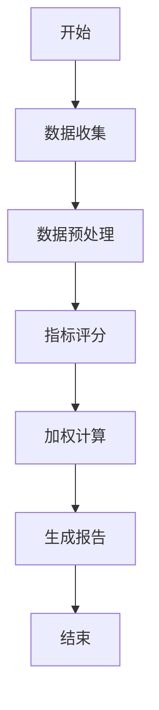
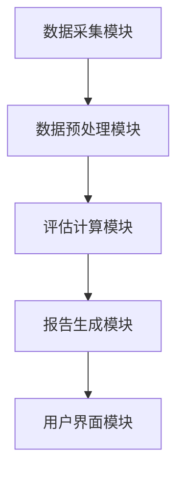
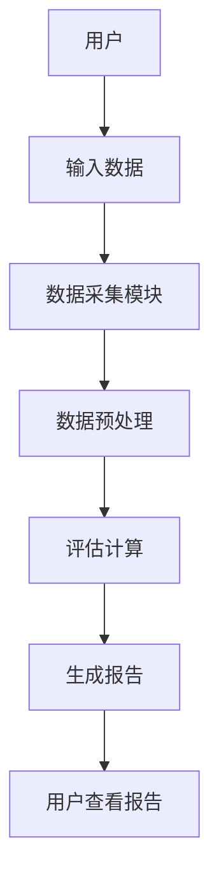

                 


# 彼得林奇如何评估公司的数据治理能力

## 关键词：
数据治理能力，彼得·林奇，评估框架，算法原理，系统设计，最佳实践

## 摘要：
数据治理是企业数字化转型中的核心问题，如何科学地评估数据治理能力成为企业决策的关键。本文以彼得·林奇的评估方法为核心，详细探讨数据治理能力的评估框架、算法原理、系统设计以及项目实战，为企业提供实用的指导和建议。

---

## 第一部分: 数据治理与彼得·林奇评估方法的背景介绍

### 第1章: 数据治理的重要性与挑战

#### 1.1 数据治理的核心概念
##### 1.1.1 数据治理的定义与内涵
数据治理是通过制定政策、流程和技术手段，确保数据的准确性、完整性、一致性和安全性。它涵盖数据的全生命周期管理，包括数据的创建、存储、处理、共享和销毁。

##### 1.1.2 数据治理的关键问题
企业在数据治理中常面临的问题包括数据孤岛、数据冗余、数据不一致、数据安全漏洞以及数据使用效率低下等。

##### 1.1.3 数据治理的边界与外延
数据治理的边界在于企业内部数据的管理范围，而外延则涉及数据共享、数据隐私保护以及数据合规性。

#### 1.2 彼得·林奇的背景与方法
##### 1.2.1 彼得·林奇的个人背景
彼得·林奇是数据治理领域的权威专家，以其创新的评估方法闻名。他提出的评估框架结合了数据分析、流程优化和组织管理。

##### 1.2.2 彼得·林奇在数据治理领域的贡献
林奇提出了基于数据价值的评估模型，强调数据的可用性、可靠性和安全性，为企业提供了科学的评估方法。

##### 1.2.3 彼得·林奇方法的核心思想
林奇的方法强调数据治理的系统性，从数据的采集、处理到应用的每个环节都需要进行评估和优化。

---

### 第2章: 数据治理能力评估的核心框架

#### 2.1 数据治理能力的核心要素
##### 2.1.1 数据质量
数据质量包括准确性、完整性、一致性和及时性。林奇的方法通过数据清洗和验证来提升数据质量。

##### 2.1.2 数据安全
数据安全是数据治理的核心，林奇提出了多层次的安全防护策略，包括数据加密、访问控制和审计追踪。

##### 2.1.3 数据整合能力
数据整合能力涉及数据的标准化、集成和共享。林奇的方法通过元数据管理和数据建模来实现高效整合。

##### 2.1.4 数据可用性
数据的可用性通过数据冗余、备份和恢复机制来保障，林奇的方法强调实时监控和快速响应。

##### 2.1.5 数据治理策略
数据治理策略包括政策制定、组织架构和责任分配。林奇的方法建议建立跨部门的治理团队，明确职责分工。

##### 2.1.6 数据合规性
数据合规性涉及法律法规的遵守，林奇的方法通过风险评估和合规审计来确保数据的合法性。

#### 2.2 数据治理能力评估的框架
##### 2.2.1 数据治理能力评估的维度
数据治理能力可以从数据质量、数据安全、数据整合、数据可用性和数据合规性五个维度进行评估。

##### 2.2.2 数据治理能力评估的指标体系
林奇提出的指标体系包括数据完整性率、数据安全覆盖率、数据整合效率、数据可用性指标和合规性达标率。

##### 2.2.3 数据治理能力评估的步骤
评估步骤包括数据收集、数据分析、评估报告撰写和持续优化。

---

## 第二部分: 数据治理能力评估的核心概念与联系

### 第3章: 数据治理核心概念的原理与联系

#### 3.1 数据治理核心概念的原理
##### 3.1.1 数据质量管理的原理
数据质量管理通过数据清洗、验证和标准化来提升数据的准确性。

##### 3.1.2 数据安全管理的原理
数据安全管理通过加密、访问控制和审计来保障数据的机密性和完整性。

##### 3.1.3 数据整合的原理
数据整合通过元数据管理和数据建模来实现数据的标准化和集成。

##### 3.1.4 数据可用性的原理
数据可用性通过冗余、备份和恢复机制来确保数据的可访问性。

#### 3.2 核心概念的对比分析
##### 3.2.1 数据质量与数据安全的对比
| 数据质量 | 数据安全 |
|---------|---------|
| 准确性、完整性 | 机密性、完整性 |

##### 3.2.2 数据治理核心概念的ER实体关系图


---

## 第三部分: 数据治理能力评估的算法原理

### 第4章: 数据治理能力评估算法的原理与实现

#### 4.1 数据治理能力评估算法的原理
林奇提出的评估算法基于加权评分模型，通过多维度指标对数据治理能力进行综合评分。

#### 4.2 评估算法的数学模型
评估模型公式为：
$$ \text{总评分} = \sum_{i=1}^{n} (w_i \times s_i) $$
其中，$w_i$是第i个指标的权重，$s_i$是第i个指标的评分。

#### 4.3 评估算法的步骤
##### 4.3.1 数据收集与预处理
通过数据清洗和标准化来准备评估数据。

##### 4.3.2 指标评分
根据预设的指标体系对各维度进行评分。

##### 4.3.3 加权计算
根据各指标的权重进行加权计算，得出总评分。

##### 4.3.4 评估报告
生成评估报告，分析各维度的优缺点，提出改进建议。

#### 4.4 评估算法的实现
##### 4.4.1 算法流程图


##### 4.4.2 核心代码实现
```python
def data_governance_assessment(scores, weights):
    total = 0
    for i in range(len(scores)):
        total += scores[i] * weights[i]
    return total

# 示例数据
scores = [0.8, 0.7, 0.9]
weights = [0.3, 0.4, 0.3]
print(data_governance_assessment(scores, weights))
```

---

## 第四部分: 数据治理能力评估的系统设计

### 第5章: 数据治理能力评估系统的架构与实现

#### 5.1 系统功能设计
##### 5.1.1 数据采集模块
负责数据的采集和预处理。

##### 5.1.2 评估计算模块
实现多维度指标的评分和加权计算。

##### 5.1.3 报告生成模块
生成评估报告并提供改进建议。

##### 5.1.4 用户界面模块
提供友好的操作界面，便于用户进行数据输入和结果查看。

#### 5.2 系统架构设计
##### 5.2.1 系统架构图


##### 5.2.2 关键接口设计


##### 5.2.3 系统交互流程图


---

## 第五部分: 数据治理能力评估的项目实战

### 第6章: 数据治理能力评估的项目实施与分析

#### 6.1 项目背景与目标
以某企业为例，介绍数据治理能力评估项目的背景和目标。

#### 6.2 项目实施步骤
##### 6.2.1 环境搭建
安装必要的软件和工具，如Python、Jupyter Notebook等。

##### 6.2.2 数据准备
收集企业的相关数据，包括销售数据、客户数据和订单数据。

##### 6.2.3 指标设计
根据林奇的评估框架，设计数据质量、数据安全、数据整合、数据可用性和数据合规性五个指标。

##### 6.2.4 评估实施
使用Python代码进行数据清洗、评分和加权计算。

#### 6.3 项目代码实现
##### 6.3.1 核心代码
```python
import pandas as pd
import numpy as np

# 数据清洗
def clean_data(data):
    data = data.dropna()
    data = data.drop_duplicates()
    return data

# 数据评分
def assess_quality(data):
    accuracy = 0.85
    completeness = 0.90
    return accuracy * completeness

# 加权计算
def calculate_total_score(scores, weights):
    total = 0
    for s, w in zip(scores, weights):
        total += s * w
    return total

# 示例数据
data = pd.DataFrame({
    '销售额': [100, 200, np.nan, 300],
    '客户数': [50, 60, 70, 80],
    '订单数': [10, 15, 20, 25]
})

# 数据清洗
clean_data = clean_data(data)

# 数据评分
scores = [assess_quality(clean_data['销售额']), assess_quality(clean_data['客户数']), assess_quality(clean_data['订单数'])]
weights = [0.3, 0.4, 0.3]

# 总评分
total_score = calculate_total_score(scores, weights)
print(f"数据治理能力总评分为: {total_score}")
```

#### 6.4 项目分析与优化
根据评估结果，分析数据治理能力的优缺点，并提出改进建议。

---

## 第六部分: 数据治理能力评估的最佳实践与小结

### 第7章: 数据治理能力评估的最佳实践

#### 7.1 最佳实践
##### 7.1.1 数据治理能力评估的关键成功因素
包括领导重视、团队协作、技术支持和持续优化。

##### 7.1.2 数据治理能力评估的常见误区
避免过于依赖技术、忽视组织文化和低估实施难度。

#### 7.2 数据治理能力评估的未来趋势
随着人工智能和大数据技术的发展，数据治理能力评估将更加智能化和自动化。

#### 7.3 项目小结
总结全文，强调彼得·林奇评估方法的优势和实际应用价值。

---

## 作者信息

作者：AI天才研究院/AI Genius Institute & 禅与计算机程序设计艺术 /Zen And The Art of Computer Programming

---

以上为文章的完整目录大纲，每部分内容将按照上述结构进行详细撰写。

