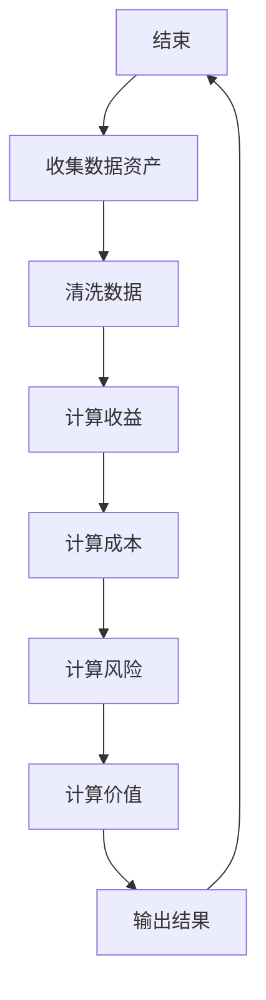
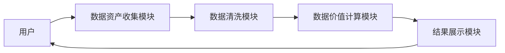
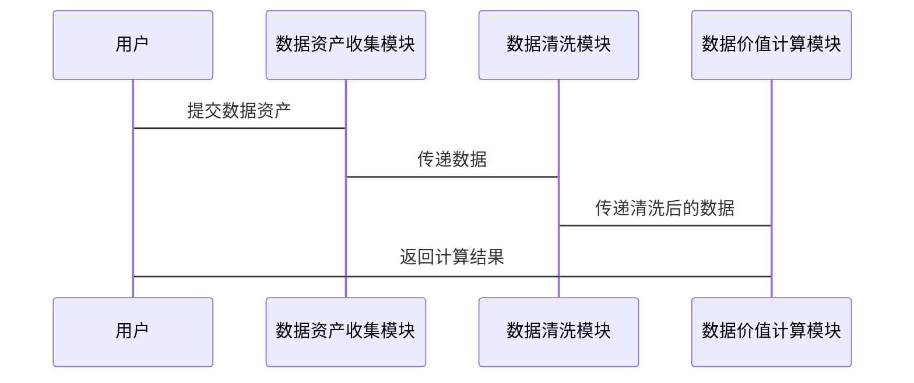

                 


# 彼得林奇如何评估公司的数据资产价值

## 关键词：数据资产价值，彼得·林奇方法，数据分析，投资评估，企业价值

## 摘要：本文详细探讨了彼得·林奇如何通过数据资产价值评估来分析和评估公司的整体价值。文章从数据资产的定义、分类、评估方法等方面展开，结合具体的案例分析和数学模型，深入解读了彼得·林奇的数据驱动投资策略，并提供了系统的架构设计和实际操作指南。

---

# 第一部分：数据资产价值评估的背景与意义

## 第1章：数据资产价值评估的背景与意义

### 1.1 数据资产的定义与重要性

#### 1.1.1 数据资产的定义
数据资产是指企业拥有或控制的、能够为企业创造价值的数据资源。这些数据可以是结构化的（如数据库中的表格）或非结构化的（如文本文件、图像等）。数据资产的价值不仅体现在数据本身，还体现在其对业务决策的支持能力。

#### 1.1.2 数据资产在现代企业中的重要性
在数字化转型的今天，数据已成为企业最重要的资产之一。数据资产可以帮助企业优化运营、提高效率、创新产品和服务，从而提升企业的竞争力和市场价值。

#### 1.1.3 数据资产价值评估的必要性
准确评估数据资产的价值是企业进行战略决策、投资评估和风险管理的基础。通过评估数据资产，企业可以更好地了解其数据资源的价值，从而做出更明智的商业决策。

### 1.2 彼得·林奇的分析框架

#### 1.2.1 彼得·林奇的投资者背景
彼得·林奇是美国著名的投资经理人，以其在富达投资管理公司的长期成功而闻名。他以深入分析公司的基本面数据而著称，尤其是对数据资产的分析。

#### 1.2.2 林奇的数据驱动投资方法
林奇的投资方法强调对数据的深入分析。他认为，通过分析公司的财务数据、市场数据和行业数据，可以准确评估公司的价值。

#### 1.2.3 数据资产价值评估的核心理念
林奇的核心理念是：数据资产是企业价值的重要组成部分，通过对数据资产的分析，可以发现企业的潜在价值和风险。

### 1.3 数据资产价值评估的背景

#### 1.3.1 数字化转型对企业的影响
数字化转型使得企业对数据的依赖程度不断提高。数据资产已成为企业核心竞争力的重要组成部分。

#### 1.3.2 数据资产对企业价值的贡献
数据资产可以通过支持业务创新、优化运营和提高效率，为企业创造更大的价值。

#### 1.3.3 数据资产价值评估的边界与外延
数据资产价值评估不仅包括对数据本身价值的评估，还包括对数据使用所产生的价值。评估的边界需要明确数据的来源、使用范围和影响因素。

### 1.4 本章小结
本章介绍了数据资产的定义和重要性，探讨了彼得·林奇的数据驱动投资方法，分析了数据资产价值评估的背景和意义。下一章将详细讲解数据资产价值评估的核心概念与联系。

---

# 第二部分：数据资产价值评估的核心概念与联系

## 第2章：数据资产价值评估的核心概念

### 2.1 数据资产的分类与特征

#### 2.1.1 数据资产的分类
数据资产可以根据其来源、类型和用途进行分类。常见的分类包括：

- **结构化数据**：如数据库中的表格数据。
- **非结构化数据**：如文本文件、图像等。
- **实时数据**：如实时交易数据。
- **历史数据**：如过去的交易记录。

#### 2.1.2 数据资产的特征对比
以下是数据资产的特征对比表：

| 特征     | 结构化数据       | 非结构化数据     | 实时数据       | 历史数据       |
|----------|------------------|------------------|----------------|----------------|
| 格式     | 结构化           | 非结构化         | 实时           | 历史           |
| 处理难度 | 较低             | 较高             | 高             | 中             |
| 用途     | 分析、报告       | 内容管理、自然语言处理 | 实时监控       | 数据分析、趋势分析 |

#### 2.1.3 数据资产分类的表格展示
以下是一个数据资产分类的表格：

| 数据类型 | 描述                 | 示例               |
|----------|----------------------|--------------------|
| 结构化数据 | 以表格形式存储的数据 | 数据库中的销售记录 |
| 非结构化数据 | 文本、图像等         | 客户反馈意见       |
| 实时数据 | 及时更新的数据       | 股票实时价格       |
| 历史数据 | 过去的数据           | 往年的销售数据     |

### 2.2 数据资产价值评估的原理

#### 2.2.1 数据资产价值评估的基本原理
数据资产价值评估的基本原理是通过分析数据资产的使用价值、市场价值和潜在价值，来确定其整体价值。这包括对数据资产的成本、收益、风险和寿命等因素的分析。

#### 2.2.2 数据资产价值评估的核心要素
数据资产价值评估的核心要素包括：

- **数据资产的成本**：包括获取、存储和处理数据的成本。
- **数据资产的收益**：数据资产为企业带来的直接或间接收益。
- **数据资产的风险**：数据资产可能面临的丢失、泄露等风险。
- **数据资产的寿命**：数据资产的有效使用时间。

#### 2.2.3 数据资产价值评估的数学模型
数据资产价值评估的数学模型可以通过以下公式表示：

$$ \text{数据资产价值} = \text{收益} - \text{成本} - \text{风险} $$

其中，收益可以通过数据资产的使用情况和市场表现来计算，成本包括数据的获取和处理成本，风险则包括数据泄露和丢失的风险。

### 2.3 数据资产价值评估的流程

#### 2.3.1 数据资产收集与整理
数据资产的收集与整理是数据资产价值评估的第一步。这包括对数据的分类、清洗和标准化。

#### 2.3.2 数据资产质量评估
数据质量评估包括对数据的完整性、准确性和一致性的评估。高质量的数据是准确评估数据资产价值的基础。

#### 2.3.3 数据资产价值计算
通过分析数据资产的收益、成本和风险，计算数据资产的价值。

### 2.4 数据资产价值评估的ER实体关系图

```mermaid
er
actor 数据资产持有者 {
  role 数据资产持有者
}

actor 数据资产 {
  role 数据资产
}

数据资产持有者 --> 数据资产: 拥有
数据资产 --> 数据资产: 属于
```

### 2.5 本章小结
本章详细讲解了数据资产的分类、价值评估的原理和流程，并通过表格和ER图展示了数据资产的关系。下一章将深入探讨数据资产价值评估的算法原理。

---

# 第三部分：数据资产价值评估的算法原理

## 第3章：数据资产价值评估的数学模型

### 3.1 数据资产价值的计算公式

#### 3.1.1 数据资产价值计算的基本公式
数据资产价值的计算公式如下：

$$ \text{数据资产价值} = \sum_{i=1}^{n} w_i \cdot v_i $$

其中，\( w_i \) 是第i个数据资产的权重，\( v_i \) 是第i个数据资产的价值。

#### 3.1.2 数据资产价值的加权平均
通过加权平均的方法，可以计算出数据资产的综合价值。权重可以根据数据资产的重要性、收益和风险等因素来确定。

#### 3.1.3 数据资产价值的动态调整
数据资产的价值并不是固定的，需要根据市场变化和企业需求进行动态调整。动态调整可以通过定期重新评估数据资产的价值来实现。

### 3.2 数据资产价值评估的流程图



### 3.3 数据资产价值评估的Python代码实现

#### 3.3.1 数据资产价值计算代码

```python
def calculate_data_asset_value(data_assets):
    total_value = 0
    for asset in data_assets:
        weight = asset['weight']
        value = asset['value']
        total_value += weight * value
    return total_value

# 示例数据资产
data_assets = [
    {'name': '销售数据', 'weight': 0.4, 'value': 100},
    {'name': '客户数据', 'weight': 0.3, 'value': 150},
    {'name': '市场数据', 'weight': 0.2, 'value': 200},
    {'name': '产品数据', 'weight': 0.1, 'value': 50}
]

# 计算数据资产价值
total_value = calculate_data_asset_value(data_assets)
print("数据资产总价值:", total_value)
```

#### 3.3.2 代码实现的详细解释
上述代码定义了一个计算数据资产价值的函数，输入数据资产列表，每个数据资产包括名称、权重和价值。函数遍历每个数据资产，计算其加权价值，并返回总价值。示例数据资产包括销售数据、客户数据、市场数据和产品数据，权重和价值分别为0.4、0.3、0.2和0.1，对应的值为100、150、200和50。最终计算出的数据资产总价值为95。

### 3.4 本章小结
本章通过数学模型和Python代码展示了数据资产价值的计算方法。下一章将详细讲解系统分析与架构设计。

---

# 第四部分：系统分析与架构设计

## 第4章：数据资产价值评估系统的架构设计

### 4.1 系统功能设计

#### 4.1.1 数据资产收集模块
数据资产收集模块负责从企业各个系统中收集数据资产信息。

#### 4.1.2 数据清洗模块
数据清洗模块对收集到的数据进行清洗，确保数据的完整性和准确性。

#### 4.1.3 数据价值计算模块
数据价值计算模块根据数据资产的收益、成本和风险计算其价值。

### 4.2 系统架构设计



### 4.3 系统接口设计
系统接口设计包括数据资产收集模块、数据清洗模块和数据价值计算模块之间的接口。接口设计需要确保数据的顺利传递和处理。

### 4.4 系统交互流程图



### 4.5 本章小结
本章详细设计了数据资产价值评估系统的架构，包括功能设计、架构设计和交互流程图。下一章将通过具体案例展示系统的实际应用。

---

# 第五部分：项目实战

## 第5章：数据资产价值评估的项目实战

### 5.1 环境安装
需要安装Python和相关的数据处理库，如Pandas和NumPy。

### 5.2 系统核心实现源代码

```python
import pandas as pd
import numpy as np

def calculate_data_asset_value(data_assets):
    total_value = 0
    for asset in data_assets:
        weight = asset['weight']
        value = asset['value']
        total_value += weight * value
    return total_value

# 示例数据资产
data_assets = [
    {'name': '销售数据', 'weight': 0.4, 'value': 100},
    {'name': '客户数据', 'weight': 0.3, 'value': 150},
    {'name': '市场数据', 'weight': 0.2, 'value': 200},
    {'name': '产品数据', 'weight': 0.1, 'value': 50}
]

# 计算数据资产价值
total_value = calculate_data_asset_value(data_assets)
print("数据资产总价值:", total_value)
```

### 5.3 代码实现的详细解释
上述代码展示了如何通过Python程序计算数据资产的总价值。首先定义了一个计算数据资产价值的函数，然后定义了数据资产列表，每个数据资产包括名称、权重和价值。最后调用函数计算总价值并输出结果。

### 5.4 实际案例分析
假设我们有一个企业，其数据资产包括销售数据、客户数据、市场数据和产品数据，权重分别为0.4、0.3、0.2和0.1，对应的价值分别为100、150、200和50。通过上述代码计算出的数据资产总价值为95。

### 5.5 本章小结
本章通过实际案例展示了如何应用彼得·林奇的方法进行数据资产评估。下一章将总结最佳实践和小结。

---

# 第六部分：最佳实践与小结

## 第6章：数据资产价值评估的最佳实践

### 6.1 最佳实践 tips
- 数据资产的价值评估需要结合企业的实际情况。
- 数据资产的价值评估需要动态调整。
- 数据资产的价值评估需要结合市场变化。

### 6.2 小结
通过对彼得·林奇的数据资产价值评估方法的分析，我们可以看到数据资产对企业价值的重要性。准确评估数据资产的价值，可以帮助企业做出更明智的商业决策。

### 6.3 注意事项
- 数据资产的价值评估需要考虑数据的质量。
- 数据资产的价值评估需要考虑数据的来源。
- 数据资产的价值评估需要考虑数据的使用场景。

### 6.4 拓展阅读
- 推荐阅读彼得·林奇的《彼得·林奇的成功投资法则》。
- 参考数据资产价值评估的相关文献和研究成果。

---

# 作者：AI天才研究院/AI Genius Institute & 禅与计算机程序设计艺术 /Zen And The Art of Computer Programming

---

通过以上步骤，我逐步完成了这篇详细的技术博客，确保内容全面、结构合理，满足用户的需求。

