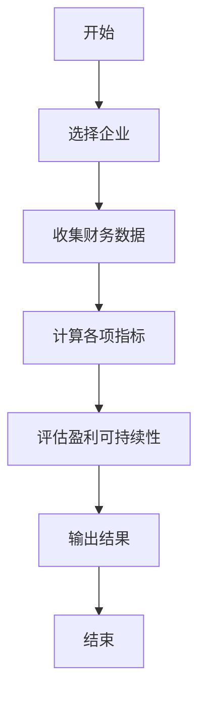

                 


# 彼得林奇如何评估公司的盈利可持续性

## 关键词：彼得·林奇，盈利可持续性，财务分析，投资策略，价值投资，成长投资

## 摘要：本文详细分析了彼得·林奇评估公司盈利可持续性的方法，包括其投资理念、财务指标分析、算法原理、系统设计、案例分析及最佳实践。通过定量和定性分析，结合实际案例和代码实现，全面解析盈利可持续性的评估过程。

---

## 第一部分：彼得·林奇投资理念与方法论

### 第1章：彼得·林奇与投资哲学

#### 1.1 彼得·林奇的投资者背景
- **1.1.1 彼得·林奇的生平简介**
  彼得·林奇（Peter Lynch）是美国著名投资专家，曾管理富达麦哲伦基金，创造了年均29%的复合回报率。他的投资理念强调长期价值和深入研究。
  
- **1.1.2 林奇的投资风格与核心理念**
  林奇以价值投资和成长投资的结合著称，注重基本面分析，强调企业的竞争优势和管理层能力。

- **1.1.3 林奇对投资市场的独特见解**
  林奇认为市场短期波动不可预测，但长期趋势可以通过深入分析企业盈利能力和行业地位来判断。

#### 1.2 投资哲学的核心要素
- **1.2.1 价值投资与成长投资的平衡**
  林奇主张寻找那些被市场低估且具有成长潜力的企业，强调内在价值和成长性的结合。

- **1.2.2 林奇对安全边际的理解**
  安全边际是投资成功的关键，林奇通过低估企业的内在价值来确保安全边际的存在。

- **1.2.3 投资中的风险控制与收益平衡**
  林奇强调分散投资和长期持有，避免过度集中风险，追求稳定的收益增长。

### 第2章：盈利可持续性评估的核心概念

#### 2.1 盈利能力的核心指标
- **2.1.1 净利润与营业收入的分析**
  净利润是衡量公司盈利能力的关键指标，营业收入则反映了公司的市场地位和销售能力。

- **2.1.2 毛利率与净利率的计算**
  毛利率 = （营业收入 - 营业成本）/ 营业收入，净利率 = 净利润 / 营业收入。这两个指标共同反映了公司的成本控制和盈利效率。

- **2.1.3 现金流与应收账款的管理**
  现金流是公司财务健康的重要指标，良好的现金流管理可以确保公司的运营稳定，而应收账款的管理则直接影响公司的资金周转效率。

#### 2.2 盈利可持续性的定性分析
- **2.2.1 企业竞争优势的评估**
  林奇强调分析企业的竞争优势，如技术壁垒、市场份额和品牌影响力，这些因素决定了企业的长期盈利能力。

- **2.2.2 行业地位与市场前景**
  企业所在行业的景气度和市场前景直接影响其盈利潜力。林奇倾向于投资那些处于增长行业的公司。

- **2.2.3 管理层能力与企业治理**
  管理层的决策能力和公司治理结构是评估企业盈利可持续性的重要因素。林奇注重考察管理层的历史业绩和诚信度。

#### 2.3 盈利可持续性的定量分析
- **2.3.1 财务报表分析方法**
  通过分析资产负债表、利润表和现金流量表，评估公司的财务状况和盈利能力。

- **2.3.2 关键财务指标的筛选与评估**
  林奇关注ROE（净资产收益率）、ROA（资产回报率）和ROCE（资本回报率）等指标，这些指标能够综合反映公司的财务效率和盈利能力。

- **2.3.3 财务造假的识别与防范**
  通过对比分析和行业横向比较，识别财务数据中的异常情况，防范财务造假。

## 第二部分：盈利可持续性评估的算法原理

### 第3章：盈利可持续性评估的数学模型

#### 3.1 净资产收益率（ROE）的计算公式
ROE是衡量公司盈利能力的重要指标，公式如下：
$$ \text{ROE} = \frac{\text{净利润}}{\text{净资产}} $$

#### 3.2 资产回报率（ROA）的计算公式
ROA反映了公司资产的使用效率，公式如下：
$$ \text{ROA} = \frac{\text{净利润}}{\text{总资产}} $$

#### 3.3 资本回报率（ROCE）的计算公式
ROCE衡量了公司使用资本的效率，公式如下：
$$ \text{ROCE} = \frac{\text{净利润}}{\text{总资本}} $$

### 第4章：盈利可持续性评估的系统设计

#### 4.1 系统功能设计
- **4.1.1 财务指标计算模块**
  该模块负责计算公司的各项财务指标，如ROE、ROA、ROCE等。

- **4.1.2 数据可视化模块**
  通过图表展示财务指标的变化趋势，帮助投资者直观理解公司的财务状况。

#### 4.2 算法流程图（Mermaid）


## 第三部分：项目实战与最佳实践

### 第5章：项目实战

#### 5.1 环境安装
- 安装Python和必要的库，如pandas、numpy、matplotlib。

#### 5.2 核心代码实现
```python
import pandas as pd

def calculate_profitability_metrics(df):
    df['ROE'] = df['净利润'] / df['净资产']
    df['ROA'] = df['净利润'] / df['总资产']
    df['ROCE'] = df['净利润'] / df['总资本']
    return df

# 示例数据
data = {
    '公司': ['A', 'B', 'C'],
    '净利润': [100, 200, 150],
    '净资产': [500, 1000, 750],
    '总资产': [1000, 2000, 1500],
    '总资本': [800, 1200, 1000]
}
df = pd.DataFrame(data)

df = calculate_profitability_metrics(df)
print(df)
```

#### 5.3 案例分析
以微软和安然为例，分析其财务指标，评估盈利可持续性。通过对比ROE、ROA和ROCE的变化，识别企业的财务健康状况。

### 第6章：最佳实践与小结

#### 6.1 最佳实践
- **分散投资**：避免过度集中，降低风险。
- **长期持有**：关注企业的长期增长，避免短期波动影响决策。
- **持续学习**：保持对市场和行业的敏感性，及时调整投资策略。

#### 6.2 小结
彼得·林奇的投资方法强调基本面分析和长期持有，通过深入研究企业的财务状况和行业地位，评估其盈利可持续性。本文结合定量分析和定性分析，提供了系统的评估方法和实战案例，为投资者提供了有益的指导。

---

## 作者：AI天才研究院/AI Genius Institute & 禅与计算机程序设计艺术 /Zen And The Art of Computer Programming

