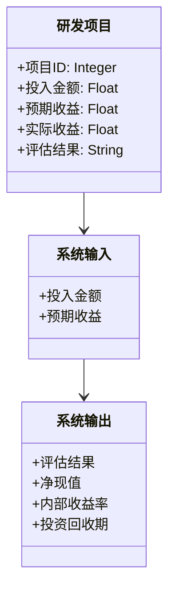

                 


# 彼得林奇如何评估公司的研发投入回报率

---

## 关键词：彼得林奇，研发投入回报率，投资评估，财务指标，技术分析

---

## 摘要：  
本文将详细探讨彼得·林奇如何评估公司的研发投入回报率。通过分析研发投入回报率的核心概念、数学模型、算法原理以及实际案例，我们能够理解彼得·林奇的投资理念，并将其应用于实际的财务分析中。文章还结合技术分析的方法，提出了系统的评估框架和最佳实践，为投资者和公司管理层提供实用的参考。

---

## 第1章：背景介绍

### 1.1 研发投入回报率的定义与背景

#### 1.1.1 研发投入回报率的定义
研发投入回报率（Return on R&D Investment，简称RORD）是指公司将其研发投入转化为实际收益的能力。它是衡量公司技术创新能力和投资效率的重要指标。

#### 1.1.2 研发投入回报率的重要性
- 研发投入是公司未来增长的核心驱动力。
- 高效的回报率意味着公司能够在技术研发上获得更高的收益。
- 通过评估研发投入回报率，投资者可以更好地判断公司的长期发展潜力。

#### 1.1.3 彼得·林奇的投资理念
彼得·林奇是全球著名投资专家，他强调通过基本面分析和长期价值投资来选择优质企业。他提出的研发投入回报率评估方法，为企业和投资者提供了一种全新的视角。

---

### 1.2 研发投入回报率的核心概念

#### 1.2.1 研发投入回报率的计算公式
$$
\text{研发投入回报率} = \frac{\text{研发收益}}{\text{研发投入}} \times 100\%
$$

其中：
- 研发收益 = 新产品研发带来的增量收入
- 研发投入 = 公司在研发上的总支出

#### 1.2.2 研发投入回报率的评估维度
| 维度         | 定义与计算方式                          |
|--------------|---------------------------------------|
| 研发投入     | 公司在研发上的总支出                   |
| 研发收益     | 新产品研发带来的增量收入               |
| 回报周期     | 从研发投入到收益实现的时间间隔         |
| 风险评估     | 研发项目失败的可能性及对回报率的影响   |

#### 1.2.3 研发投入回报率与公司价值的关系
- 高研发投入回报率意味着公司能够通过技术创新实现更高的收益。
- 低回报率可能表明公司在研发管理上存在问题，或者技术研发方向不符合市场需求。

---

## 第2章：研发投入回报率的评估指标

### 2.1 什么是研发投入回报率

#### 2.1.1 研发投入回报率的定义
研发投入回报率是衡量公司研发投入转化为实际收益能力的指标。它不仅关注投入的多少，更关注投入的产出效率。

#### 2.1.2 研发投入回报率的计算公式
$$
\text{研发投入回报率} = \frac{\text{研发收益}}{\text{研发投入}} \times 100\%
$$

#### 2.1.3 研发投入回报率的评估标准
- 行业标准：不同行业的研发投入回报率标准不同，需结合行业特点进行评估。
- 历史表现：对比公司过去几年的回报率，判断其发展趋势。
- 同业对比：与同行业其他公司进行横向对比，找出差异。

---

### 2.2 彼得·林奇的评估方法

#### 2.2.1 投资回报率的计算公式
$$
\text{投资回报率} = \frac{\text{净收益}}{\text{研发投入}} \times 100\%
$$

#### 2.2.2 投资回报率的评估维度
| 维度         | 定义与计算方式                          |
|--------------|---------------------------------------|
| 净收益       | 研发项目带来的净利润                   |
| 研发投入     | 研发项目的总投入                       |
| 投资周期     | 从投资到收益实现的时间间隔             |
| 风险系数     | 项目失败的概率及对回报率的影响         |

#### 2.2.3 投资回报率的动态调整
- 定期评估研发投入回报率的变化。
- 根据市场变化和公司战略调整研发投入方向。
- 对低回报率的项目进行优化或终止。

---

## 第3章：研发投入回报率的评估模型

### 3.1 研发投入回报率的数学模型

#### 3.1.1 净现值法（NPV）
$$
\text{NPV} = \sum_{t=0}^{n} \frac{\text{现金流}}{(1 + r)^t}
$$
其中：
- $r$ 是折现率
- $n$ 是项目周期

#### 3.1.2 内部收益率法（IRR）
$$
\text{IRR} = r \text{ 满足 } \sum_{t=0}^{n} \frac{\text{现金流}}{(1 + r)^t} = 0
$$

#### 3.1.3 投资回收期法（Payback Period）
投资回收期是项目现金流回本所需的时间。

---

### 3.2 研发投入回报率的评估流程

#### 3.2.1 数据收集与整理
- 收集研发项目的投入和收益数据。
- 确保数据的准确性和完整性。

#### 3.2.2 模型构建与验证
- 根据数据构建数学模型。
- 使用历史数据验证模型的准确性。

#### 3.2.3 结果分析与优化
- 分析评估结果，找出问题和改进空间。
- 根据结果优化研发投入策略。

---

## 第4章：系统分析与架构设计

### 4.1 问题场景介绍

#### 4.1.1 问题背景
- 公司希望优化研发投入回报率的评估流程。
- 需要一个高效的系统来支持评估工作。

#### 4.1.2 项目介绍
- 开发一个基于彼得·林奇方法的评估系统。
- 系统功能包括数据输入、模型计算、结果分析和报告生成。

---

### 4.2 系统功能设计

#### 4.2.1 领域模型（mermaid 类图）


---

### 4.3 系统架构设计

#### 4.3.1 系统架构图（mermaid 架构图）
```mermaid
dataclass SystemArchitecture {
    frontend: {
        UI框架: React
        前端服务: Node.js
    }
    backend: {
        后端服务: Python
        数据库: MySQL
        API接口: RESTful
    }
    交互层: {
        用户输入
        系统输出
    }
}
```

---

## 第5章：项目实战

### 5.1 案例分析

#### 5.1.1 案例背景
某公司计划开发新产品，研发投入为1000万元，预期收益为1500万元。

#### 5.1.2 数据计算
- 净现值（NPV）：
  $$
  \text{NPV} = \frac{1500}{(1 + 0.1)^1} - 1000 = 450 \text{万元}
  $$
- 内部收益率（IRR）：
  $$
  \text{IRR} = 50\%
  $$
- 投资回收期：
  $$
  \text{回收期} = 1 \text{年}
  $$

#### 5.1.3 结果分析
- 该项目的净现值为正，内部收益率高于行业平均水平，投资回收期短，具有较高的回报率。

---

### 5.2 系统实现

#### 5.2.1 环境安装
- 前端：React 18.0
- 后端：Python 3.9
- 数据库：MySQL 8.0

#### 5.2.2 核心代码实现
```python
def calculate_npv(cash_flows, discount_rate):
    npv = 0
    for t, cash_flow in enumerate(cash_flows):
        npv += cash_flow / (1 + discount_rate) ** t
    return npv

# 示例计算
cash_flows = [1000, 1500]
discount_rate = 0.1
print(calculate_npv(cash_flows, discount_rate))
```

---

## 第6章：最佳实践与小结

### 6.1 最佳实践

#### 6.1.1 数据质量
- 确保数据的准确性和完整性。
- 数据清洗与预处理。

#### 6.1.2 模型优化
- 根据实际需求调整模型参数。
- 定期更新模型。

#### 6.1.3 风险控制
- 评估模型的敏感性。
- 制定风险管理策略。

---

### 6.2 小结

- 彼得·林奇的投入回报率评估方法为投资者和公司提供了重要的参考。
- 通过系统化的分析和模型构建，可以更准确地评估研发投入的回报率。
- 投资者和公司应根据实际情况，动态调整评估策略。

---

## 第7章：拓展阅读

### 7.1 相关书籍
- 《彼得·林奇的投资哲学》
- 《财务报表分析与股票投资》

### 7.2 相关博客
- 彼得·林奇的官方网站
- 投资分析专业论坛

---

## 作者信息

作者：AI天才研究院/AI Genius Institute & 禅与计算机程序设计艺术 /Zen And The Art of Computer Programming

---

### END

