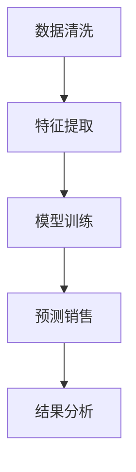
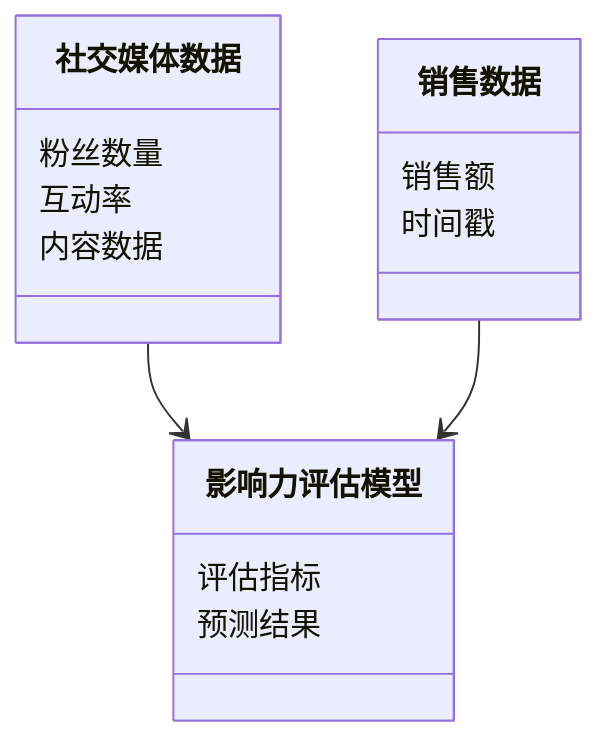

                 


# 彼得林奇如何评估公司的社交媒体影响力转化为销售的能力

## 关键词：社交媒体影响力、销售转化、彼得林奇、影响力评估、销售预测模型

## 摘要：本文探讨如何将公司的社交媒体影响力转化为销售能力，基于彼得林奇的投资理念，结合技术方法，构建数学模型和系统架构，通过案例分析和项目实战，详细讲解如何评估和转化社交媒体影响力。

---

## 第一部分: 背景介绍

### 第1章: 背景介绍与核心概念

#### 1.1 社交媒体的演变与商业应用
- **1.1.1 社交媒体的定义与演变**  
  社交媒体从早期的论坛、博客发展到现在的多平台社交网络，已成为企业推广和用户互动的重要渠道。

- **1.1.2 社交媒体在商业中的应用现状**  
  企业利用社交媒体进行品牌推广、用户互动和销售转化，已成为现代营销的重要组成部分。

- **1.1.3 影响力营销的兴起**  
  影响力营销通过KOL（关键意见领袖）和社交媒体网红，将粉丝影响力转化为商业价值。

#### 1.2 彼得林奇的评估方法
- **1.2.1 彼得林奇的投资理念**  
  彼得林奇注重基本面分析，评估公司的内在价值，寻找被市场低估的投资机会。

- **1.2.2 社交媒体影响力评估的核心要素**  
  包括粉丝数量、互动率、内容质量和传播力。

- **1.2.3 影响力转化为销售的逻辑框架**  
  通过分析社交媒体数据，评估其对销售的潜在贡献。

#### 1.3 本书的核心目标
- **1.3.1 如何评估社交媒体影响力**  
  介绍评估指标和方法，帮助读者量化社交媒体价值。

- **1.3.2 如何将影响力转化为销售能力**  
  结合技术方法，构建预测模型，指导企业优化营销策略。

- **1.3.3 实际案例分析与方法总结**  
  通过案例分析，总结成功经验，提供实用建议。

### 第2章: 社交媒体影响力评估的维度

#### 2.1 影响力的核心维度
- **2.1.1 粉丝数量与质量**  
  粉丝数量多不一定质量高，需考虑活跃度和转化率。

- **2.1.2 互动率与活跃度**  
  包括点赞、评论、分享等互动指标，衡量用户参与程度。

- **2.1.3 内容传播力**  
  内容的分享率和传播速度，反映其吸引力和影响力。

#### 2.2 影响力与销售转化的关系
- **2.2.1 影响力对销售转化的影响机制**  
  高影响力账号能提升品牌知名度和用户信任度，促进销售转化。

- **2.2.2 不同平台的影响力差异**  
  各平台用户属性不同，需根据不同平台特点制定策略。

- **2.2.3 影响力评估的数学模型**  
  使用线性回归模型，将影响力指标与销售额相关联，建立预测模型。

### 第3章: 彼得林奇评估方法的数学模型

#### 3.1 影响力评估的指标体系
- **3.1.1 粉丝数量（Follower Count）**  
  粉丝总数，考虑增长率和活跃度。

- **3.1.2 互动率（Engagement Rate）**  
  包括点赞率、评论率和分享率，反映用户参与程度。

- **3.1.3 内容相关性（Content Relevance）**  
  内容与目标受众的相关性，影响传播效果。

#### 3.2 影响力到销售的转化模型
- **3.2.1 线性回归模型**  
  $$ y = \beta_0 + \beta_1x_1 + \beta_2x_2 + ... + \beta_nx_n + \epsilon $$
  其中，y为销售额，x_i为影响力指标，β系数通过数据拟合确定。

---

## 第二部分: 算法原理与系统架构

### 第4章: 算法原理讲解

#### 4.1 自然语言处理与情感分析
- 使用NLP技术分析社交媒体内容，提取关键词和情感倾向，判断内容对销售的影响。

#### 4.2 机器学习模型构建
- **4.2.1 数据清洗与特征提取**  
  清洗数据，提取粉丝数量、互动率等特征。

- **4.2.2 模型训练与优化**  
  使用线性回归或随机森林模型，训练并优化模型参数。

#### 4.3 算法流程图（Mermaid）


### 第5章: 系统分析与架构设计

#### 5.1 领域模型设计
- **5.1.1 领域模型类图（Mermaid）**


#### 5.2 系统架构设计
- **5.2.1 系统架构图（Mermaid）**


---

## 第三部分: 项目实战

### 第6章: 项目实战

#### 6.1 环境安装与数据准备
- 安装Python和相关库（如pandas、scikit-learn）。
- 数据清洗：处理缺失值和异常值。

#### 6.2 核心代码实现
- 数据处理代码示例：
```python
import pandas as pd
from sklearn.linear_model import LinearRegression

# 加载数据
data = pd.read_csv('social_media.csv')

# 数据清洗
data.dropna(inplace=True)

# 特征提取
X = data[['粉丝数量', '互动率']]
y = data['销售额']

# 模型训练
model = LinearRegression()
model.fit(X, y)

# 预测
predictions = model.predict(X)
```

#### 6.3 案例分析与结果解读
- 分析预测结果，评估模型准确性，调整参数优化性能。

---

## 第四部分: 总结与拓展

### 第7章: 最佳实践与注意事项

#### 7.1 最佳实践
- 定期更新模型，根据市场变化调整评估指标。
- 结合多平台数据，全面评估影响力。

#### 7.2 注意事项
- 数据质量影响模型准确性，需谨慎处理。
- 考虑外部因素，如市场趋势和竞争环境。

### 第8章: 小结与拓展阅读

#### 8.1 小结
- 本文详细讲解了如何评估社交媒体影响力，并转化为销售能力，结合彼得林奇的评估方法，构建了数学模型和系统架构，提供了实战案例和优化建议。

#### 8.2 拓展阅读
- 推荐阅读相关书籍和文献，深入学习影响力评估和机器学习技术。

---

## 作者：AI天才研究院/AI Genius Institute & 禅与计算机程序设计艺术 /Zen And The Art of Computer Programming

---

**全文完**

