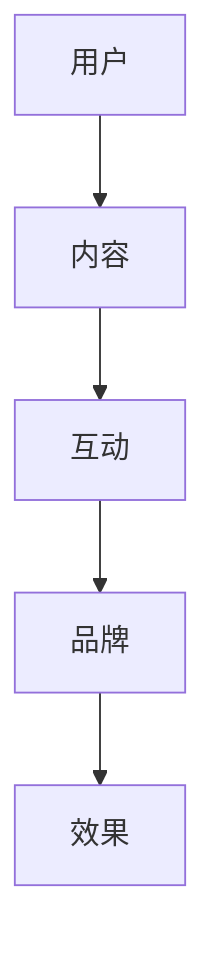
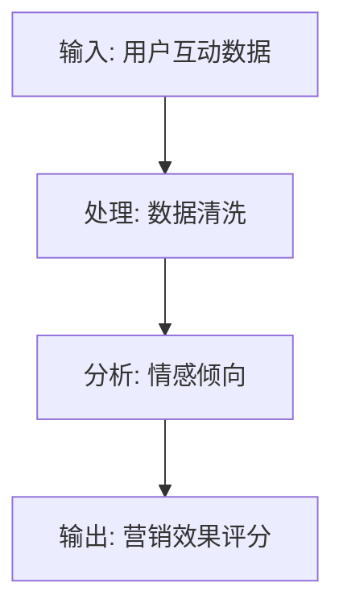
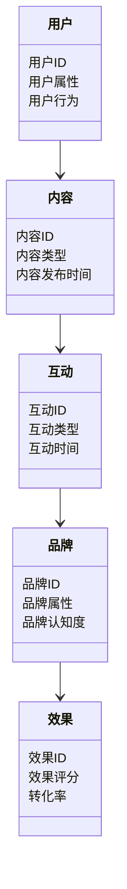
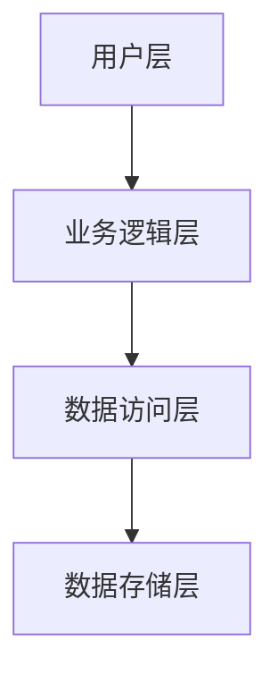
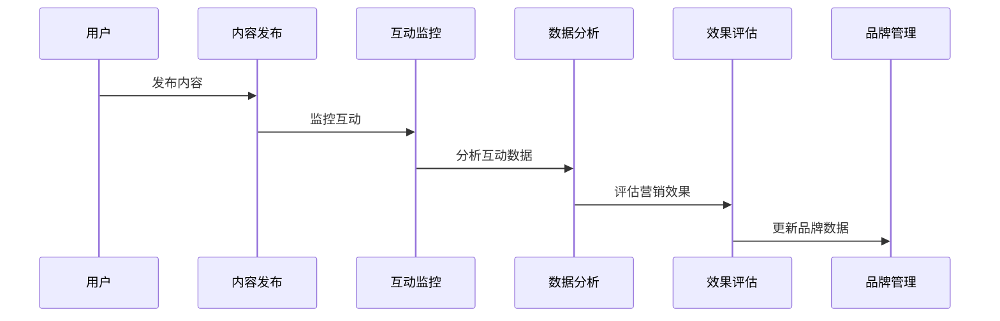

                 


# 彼得林奇如何评估公司的社交媒体营销效果

> 关键词：社交媒体营销、彼得·林奇、营销效果评估、数据分析、内容营销

> 摘要：本文将深入探讨如何评估公司在社交媒体上的营销效果，结合彼得·林奇的营销理念，分析社交媒体营销的核心概念、评估方法及其实现工具与技术。通过实际案例分析，我们将展示如何运用这些策略和工具来优化社交媒体营销效果，为读者提供可操作的指导和建议。

---

## 第一部分: 社交媒体营销的背景与演变

### 第1章: 社交媒体营销的背景与演变

#### 1.1 社交媒体营销的定义与演变

社交媒体营销是一种通过社交媒体平台与目标受众进行互动、推广和传播品牌或产品的营销策略。随着互联网技术的发展，社交媒体营销从简单的信息发布逐步演变为一种复杂的营销体系，涉及用户行为分析、内容创作、数据分析等多个方面。

- **社交媒体营销的定义**：社交媒体营销是通过社交媒体平台，利用用户生成内容、互动和网络影响力来推广品牌、产品或服务的营销活动。
- **发展历程**：
  - **早期阶段**：2000年代初期，社交媒体平台如Friendster、MySpace开始出现，企业开始尝试通过这些平台进行品牌推广。
  - **发展阶段**：随着Facebook、Twitter、LinkedIn等主流平台的崛起，社交媒体营销逐渐成为企业数字化营销的重要组成部分。
  - **现代阶段**：随着算法推荐、大数据分析和人工智能技术的应用，社交媒体营销进入了精准化和个性化的阶段。
- **核心要素**：社交媒体营销的核心要素包括目标受众定位、内容创作、互动管理、数据分析和效果评估。

#### 1.2 彼得·林奇的营销理念

彼得·林奇是美国著名的投资经理人，他在投资领域提出的“彼得·林奇哲学”对社交媒体营销也有着重要的启发。林奇强调长期投资、基本面分析和对市场的深刻理解，这些理念同样适用于社交媒体营销。

- **林奇的营销哲学**：林奇认为，成功的营销需要深入理解目标市场和消费者需求，建立长期的品牌信任和用户忠诚度。
- **投资哲学与营销的结合**：林奇的投资哲学强调对市场的深入研究和长期规划，这与社交媒体营销中的长期品牌建设不谋而合。
- **创新与实践**：林奇在投资中注重分散投资和风险管理，这种思维方式也可以应用于社交媒体营销，通过多种渠道和内容形式来分散风险，提高营销效果。

---

## 第二部分: 社交媒体营销的核心概念与联系

### 第2章: 核心概念的定义与属性

#### 2.1 核心概念的定义与属性

社交媒体营销涉及多个核心概念，每个概念都有其独特的属性和作用。

- **用户**：社交媒体营销的核心是用户。用户的行为、兴趣和需求决定了营销活动的效果。
- **内容**：内容是社交媒体营销的载体，优质的内容能够吸引用户关注和互动。
- **互动**：互动是社交媒体营销的重要组成部分，包括点赞、评论、分享等行为，能够增强用户与品牌之间的联系。
- **品牌**：品牌是社交媒体营销的最终目标，通过营销活动提升品牌知名度和美誉度。
- **效果**：效果是衡量社交媒体营销成功与否的关键指标，包括转化率、参与度等。

**核心概念属性对比表**

| 概念 | 属性 | 描述 |
|------|------|------|
| 用户 | 活跃度 | 用户在平台上的活跃程度，如每天登录次数、发布内容频率 |
| 内容 | 相关性 | 内容与目标受众的相关程度，内容是否吸引人 |
| 互动 | 深度 | 互动的质量，如评论的深度、分享的广度 |
| 品牌 | 认知度 | 用户对品牌的记忆和了解程度 |
| 效果 | 转化率 | 用户从接触内容到采取行动（如购买、注册）的比例 |

#### 2.2 核心概念的联系与模型

核心概念之间的联系可以用ER实体关系图来展示，如下：



该模型展示了用户通过内容与品牌产生互动，互动结果直接影响品牌认知度和营销效果。

---

## 第三部分: 社交媒体营销效果评估的核心算法

### 第3章: 算法原理

#### 3.1 算法的输入与输出

- **输入**：用户互动数据（如点赞、评论、分享）、内容数据（文本、图片、视频）、品牌数据（品牌知名度、美誉度）。
- **输出**：营销效果评分，包括品牌影响力、用户参与度、转化率等指标。

#### 3.2 算法的流程图



#### 3.3 算法的数学模型

$$
\text{评分} = \alpha \times \text{互动量} + \beta \times \text{情感倾向} + \gamma \times \text{品牌认知度}
$$

其中，$\alpha$、$\beta$、$\gamma$ 是权重系数，通常通过数据训练得出。

---

## 第四部分: 系统分析与架构设计

### 第4章: 系统分析与架构设计

#### 4.1 项目背景

社交媒体营销评估系统旨在帮助企业通过数据分析和自动化工具，实时监控和评估营销活动的效果，优化营销策略。

#### 4.2 系统功能设计（领域模型）



#### 4.3 系统架构设计（架构图）



#### 4.4 系统接口设计

- **API接口**：提供RESTful API，供其他系统调用营销数据。
- **数据接口**：与社交媒体平台的数据接口对接，获取实时互动数据。

#### 4.5 系统交互设计（序列图）



---

## 第五部分: 项目实战

### 第5章: 项目实战

#### 5.1 环境安装

- **工具安装**：安装Python、Jupyter Notebook、Pandas、Matplotlib等工具。
- **数据获取**：通过社交媒体API获取用户互动数据。

#### 5.2 核心代码实现

```python
import pandas as pd
import matplotlib.pyplot as plt

# 数据清洗
def clean_data(df):
    df = df.dropna()
    df = df[~df['user_id'].duplicated()]
    return df

# 情感分析
def analyze_sentiment(text):
    # 示例：简单的情感分析函数
    if 'positive' in text.lower():
        return 1
    elif 'negative' in text.lower():
        return -1
    else:
        return 0

# 效果评分计算
def calculate_score(engagement, sentiment, brand_recognition):
    return engagement * 0.4 + sentiment * 0.3 + brand_recognition * 0.3

# 示例数据
data = {
    'user_id': [1, 2, 3, 4, 5],
    'content': ['Great product!', 'Terrible service!', 'Good price!', 'Love it!', 'Okay...'],
    'engagement': [120, 80, 150, 90, 70]
}

df = pd.DataFrame(data)
cleaned_df = clean_data(df)
sentiments = cleaned_df['content'].apply(analyze_sentiment)
brand_recognition = [0.8, 0.6, 0.9, 0.7, 0.5]

scores = calculate_score(cleaned_df['engagement'], sentiments, brand_recognition)
print(scores)
```

#### 5.3 代码解读

- **数据清洗**：去除重复数据和缺失值。
- **情感分析**：简单的情感分析函数，根据文本内容判断情感倾向。
- **效果评分计算**：根据互动量、情感倾向和品牌认知度计算最终评分。

#### 5.4 案例分析

通过上述代码，我们可以分析不同内容的情感倾向和互动效果，优化营销策略。

---

## 第六部分: 总结与建议

### 第6章: 总结与建议

#### 6.1 回顾与总结

- 本文详细探讨了社交媒体营销的核心概念、评估方法和实现工具。
- 结合彼得·林奇的营销理念，提出了系统化的评估方法和工具。

#### 6.2 实际操作的建议

- **数据驱动**：充分利用数据分析工具，实时监控和评估营销效果。
- **内容为王**：创作高质量、相关性强的内容，吸引用户关注和互动。
- **持续优化**：根据数据分析结果，不断优化营销策略。

#### 6.3 注意事项

- 在实际应用中，要注意数据隐私和用户隐私保护。
- 确保数据来源的合法性和准确性。

#### 6.4 未来趋势

- 随着人工智能和大数据技术的发展，社交媒体营销将更加智能化和个性化。
- 跨平台整合将成为未来的重要趋势。

#### 6.5 拓展阅读

- 推荐阅读《社交媒体营销实战指南》、《数据分析与商业决策》等相关书籍。

---

作者：AI天才研究院/AI Genius Institute & 禅与计算机程序设计艺术/Zen And The Art of Computer Programming

