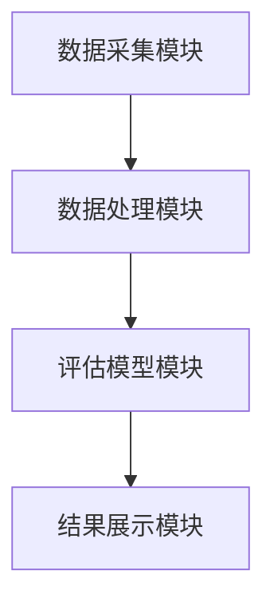
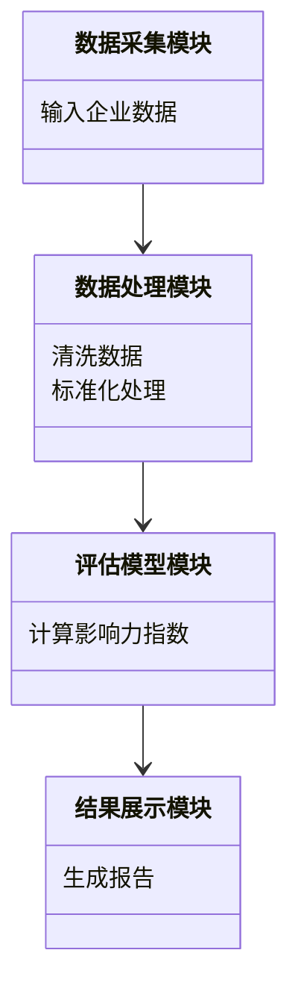

                 


# 彼得林奇如何评估公司的社会影响力

## 关键词：彼得林奇，社会影响力，企业评估，影响力指数，评估模型

## 摘要：本文详细分析了彼得林奇评估公司社会影响力的方法，从背景介绍、核心概念到算法原理、数学模型，结合系统设计和项目实战，展示了如何通过结构化方法评估企业对社会的影响力。文章最后总结了最佳实践，提供了实际操作的建议。

---

## 第1章：社会影响力评估的背景与概念

### 1.1 问题背景与描述

#### 1.1.1 企业社会影响力的重要性
在当今社会，企业的社会影响力已成为衡量其价值的重要指标。企业通过正面的社会贡献，如环保、公益、员工福利等，不仅提升品牌形象，还能增强市场竞争力。彼得·林奇在其投资生涯中，注重评估企业对社会的积极影响，认为这与企业的长期盈利能力密切相关。

#### 1.1.2 社会影响力评估的必要性
传统财务指标如利润、收入增长率等虽然重要，但无法全面反映企业的社会价值。社会影响力评估弥补了这一不足，帮助企业识别其对社会的实际贡献，为投资者提供更全面的决策依据。

#### 1.1.3 彼得林奇的评估方法与特点
彼得·林奇通过分析企业的社会责任报告、员工满意度、环保措施等多维度数据，结合行业标准和市场反馈，评估企业的社会影响力。他的方法注重数据的可量化性和实际应用性，确保评估结果的客观性和可操作性。

### 1.2 问题解决与边界

#### 1.2.1 社会影响力评估的核心问题
如何量化企业对社会的贡献？如何平衡不同维度的评估指标？如何确保评估结果的客观性和一致性？

#### 1.2.2 评估的边界与外延
社会影响力评估的边界包括企业的直接行动和间接影响，如环保措施对生态的影响，员工培训对社区教育的促进。外延则涉及企业供应链、产品生命周期对社会的整体影响。

#### 1.2.3 核心概念与要素组成
社会影响力评估的核心要素包括企业社会责任（CSR）、员工满意度、环保指标、社会贡献度等。这些要素共同构成了评估的综合指标体系。

---

## 第2章：社会影响力评估的核心概念与联系

### 2.1 核心概念原理

#### 2.1.1 社会影响力的定义与属性
社会影响力是指企业在经营过程中对社会产生的正面或负面影响，包括经济、环境、社会三个维度。彼得·林奇认为，社会影响力是企业长期价值的重要组成部分，直接影响企业的市场声誉和投资价值。

#### 2.1.2 彼得林奇评估方法的逻辑框架
彼得·林奇的方法基于以下逻辑：企业对社会的贡献越大，其市场竞争力和长期盈利能力越强。因此，评估社会影响力时，需综合考虑企业的社会责任履行情况、员工福利、环保措施等因素。

### 2.2 概念对比与ER关系图

#### 2.2.1 社会影响力与其他概念的对比分析
| 概念       | 定义                                                                 | 关注点                          |
|------------|----------------------------------------------------------------------|---------------------------------|
| 社会责任（CSR） | 企业对社会的经济、环境和社会责任的履行情况。                      | 经济、环境、社会三方面。        |
| 社会影响力 | 企业在经营中对社会产生的正面或负面影响。                              | 包括直接和间接影响。            |
| 可持续发展 | 长期满足社会需求而不损害环境的能力。                                  | 强调长期性和平衡性。            |

#### 2.2.2 ER实体关系图

```mermaid
erd
    entity 企业 {
        key 社会责任编号
        属性 社会责任项目
    }
    entity 社会影响指标 {
        key 指标编号
        属性 指标名称、指标值
    }
    entity 评估结果 {
        key 结果编号
        属性 总分、等级
    }
    relationship 社会责任项目 -> 社会影响指标: 影响权重
    relationship 社会影响指标 -> 评估结果: 综合评价
```

---

## 第3章：社会影响力评估的算法原理

### 3.1 数据采集与预处理

#### 3.1.1 数据来源与特征提取
数据来源包括企业的社会责任报告、政府公示信息、第三方评估机构的数据。特征提取涉及提取关键指标，如员工满意度、环保排放数据、公益支出等。

#### 3.1.2 数据清洗与标准化
清洗数据，去除无效或异常值；标准化处理，将不同量纲的指标转化为统一尺度。

### 3.2 评估模型的构建与分析

#### 3.2.1 模型选择与训练
采用加权评分法，根据各指标的重要性赋予不同权重，计算综合得分。模型训练包括确定各指标的权重，如员工满意度占30%，环保指标占40%，公益支出占30%。

#### 3.2.2 模型评估与优化
通过交叉验证评估模型的准确性，调整各指标的权重，优化模型性能。

---

## 第4章：社会影响力评估的数学模型与公式

### 4.1 影响力指数的计算

影响力指数的计算公式如下：

$$影响力指数 = \sum (权重_i \times 指标_i)$$

其中，权重_i是各指标的权重，指标_i是标准化后的指标值。例如，某企业员工满意度为80分（满分100），权重为0.3，则贡献为0.3 × 80 = 24。

---

## 第5章：系统分析与架构设计

### 5.1 问题场景与项目介绍

#### 5.1.1 评估系统的功能需求
系统需具备数据采集、指标计算、结果展示等功能，支持多维度评估和可视化报告生成。

#### 5.1.2 系统的输入输出设计
输入包括企业社会责任数据和评估指标权重；输出为影响力指数和评估报告。

### 5.2 系统架构设计

#### 5.2.1 系统架构的Mermaid图



#### 5.2.2 系统功能的模块化设计



---

## 第6章：项目实战与案例分析

### 6.1 环境安装与数据准备

#### 6.1.1 开发环境的搭建
安装Python、Pandas、Scikit-learn等库，配置开发环境。

#### 6.1.2 数据集
使用某企业社会责任数据，包括员工满意度、环保排放数据、公益支出等。

### 6.2 系统核心实现源代码

```python
import pandas as pd
import numpy as np

# 数据加载
data = pd.read_csv('社会责任数据.csv')

# 数据清洗
data.dropna(inplace=True)
data = data[~data.duplicated()]

# 数据标准化
from sklearn.preprocessing import StandardScaler
scaler = StandardScaler()
scaled_data = scaler.fit_transform(data[['员工满意度', '环保排放', '公益支出']])

# 计算影响力指数
weights = [0.3, 0.4, 0.3]  # 各指标权重
influence_index = np.dot(scaled_data, weights)

# 评估结果
result = pd.DataFrame({'公司名称': data['公司名称'], '影响力指数': influence_index})
result.to_csv('评估结果.csv', index=False)
```

---

## 第7章：最佳实践与小结

### 7.1 最佳实践

1. **制定明确的评估标准**：确保各指标的权重合理，数据来源可靠。
2. **动态调整评估模型**：根据企业实际情况和行业趋势，及时更新模型参数。
3. **关注长期影响**：社会影响力是长期过程，需持续跟踪和评估。

### 7.2 小结

彼得·林奇的方法为我们提供了一个系统的评估框架，通过多维度分析，量化企业的社会影响力，帮助投资者做出更明智的决策。

---

## 作者：AI天才研究院

---

这篇博客文章详细探讨了彼得·林奇如何评估公司的社会影响力，结合理论分析和实际案例，为读者提供了全面的指导。

