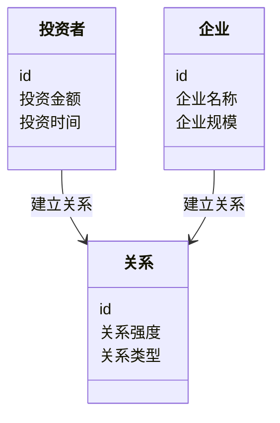

                 


# 彼得林奇如何评估公司的社会资本

> 关键词：彼得·林奇，社会资本，投资评估，企业价值，社会资本评估

> 摘要：本文详细探讨了彼得·林奇在评估公司社会资本方面的独特见解和方法。通过分析社会资本的核心概念、评估模型和实际应用，本文揭示了社会资本在企业价值评估中的重要性，并提供了可操作的评估框架和实战案例。

---

# 第一部分: 背景介绍与核心概念

## 第1章: 背景介绍与核心概念

### 1.1 社会资本的核心概念

#### 1.1.1 社会资本的定义

社会资本是指企业或个人在社会网络中所拥有的资源、关系和信任等无形资产。它不仅包括企业与其客户、供应商、合作伙伴的关系，还包括企业内部员工之间的信任和协作能力。

$$\text{社会资本 = 网络资源 + 信任关系 + 社会影响力}$$

#### 1.1.2 社会资本的特征

| 特征 | 描述 |
|------|------|
| 动态性 | 社会资本会随着时间和环境的变化而变化 |
| 网络性 | 社会资本依赖于社会网络的构建和维护 |
| 长期性 | 社会资本的形成和影响通常是长期的 |

#### 1.1.3 社会资本的分类

1. **内部社会资本**：指企业内部员工之间的信任和协作能力。
2. **外部社会资本**：指企业与外部利益相关者（如客户、供应商）的关系。
3. **品牌资本**：指企业的品牌价值和声誉。

---

## 第2章: 彼得·林奇与社会资本评估

### 2.1 彼得·林奇的投资理念

彼得·林奇是全球著名投资专家，他认为企业的社会资本是其长期价值的重要组成部分。他强调，企业的社会资本不仅影响其市场地位，还会影响其盈利能力。

$$\text{企业价值 = 有形资产 + 无形资产（包括社会资本）}$$

### 2.2 社会资本在投资中的重要性

彼得·林奇认为，社会资本是企业在竞争中的核心优势之一。强大的社会资本可以为企业带来以下好处：

1. **客户忠诚度**：良好的客户关系可以提高客户忠诚度，增加重复购买。
2. **成本优势**：强大的供应商关系可以降低采购成本。
3. **创新能力**：内部社会资本可以提高企业的创新能力。

### 2.3 彼得·林奇社会资本评估方法的背景

彼得·林奇通过长期的实践总结出一套社会资本评估方法，这种方法结合了定量分析和定性分析，能够全面评估企业的社会资本。

---

# 第二部分: 社会资本评估的理论框架

## 第3章: 社会资本评估模型

### 3.1 CPS模型

CPS模型是一种常用的社会资本评估模型，它从以下三个维度对企业社会资本进行评估：

1. **C（Connection）**：关系强度
2. **P（Partnership）**：合作伙伴质量
3. **S（Social Capital）**：社会资本总价值

### 3.2 CPS模型的数学公式

$$\text{CPS = Connection \times Partnership \times Social Capital}$$

其中，Connection 表示关系强度，通常用 0 到 1 之间的分数表示；Partnership 表示合作伙伴质量，通常用 A、B、C 级别表示；Social Capital 表示社会资本总价值，可以用货币单位表示。

---

## 第4章: 实证分析与案例研究

### 4.1 案例分析

#### 4.1.1 案例背景

假设我们有一家科技公司，我们需要评估其社会资本。

#### 4.1.2 数据收集

我们收集了以下数据：

- 客户满意度：90%
- 供应商关系：A 级别
- 员工满意度：85%
- 品牌声誉：良好

#### 4.1.3 案例分析

根据 CPS 模型：

$$\text{CPS = 0.9 \times A \times 85}$$

其中，A 表示合作伙伴质量，假设 A = 0.9。

$$\text{CPS = 0.9 \times 0.9 \times 85 = 66.15}$$

---

# 第三部分: 系统架构与实现

## 第5章: 系统架构设计

### 5.1 系统功能设计

以下是社会资本评估系统的功能模块：



### 5.2 系统架构设计

以下是系统的架构图：

```mermaid
container 社会资本评估系统 {
    component 投资者模块 {
        投资者信息输入
        投资者分析
    }
    component 企业模块 {
        企业信息输入
        企业分析
    }
    component 关系模块 {
        关系强度计算
        关系类型分类
    }
    投资者模块 --> 关系模块 : 提交投资者关系
    企业模块 --> 关系模块 : 提交企业关系
}
```

---

## 第6章: 项目实战与代码实现

### 6.1 环境安装

- 安装 Python 和相关库（如 pandas、numpy）。

### 6.2 核心代码实现

以下是社会资本评估的 Python 实现代码：

```python
import pandas as pd
import numpy as np

# 定义社会资本评估函数
def calculate_social_capital(connection_strength, partnership_level, social_value):
    return connection_strength * partnership_level * social_value

# 数据输入
connection_strength = 0.85
partnership_level = {'A': 0.9, 'B': 0.8, 'C': 0.7}[input("请输入合作伙伴等级（A/B/C）：")]
social_value = float(input("请输入社会资本价值："))

# 计算社会资本
social_capital = calculate_social_capital(connection_strength, partnership_level, social_value)
print(f"计算出的社会资本价值为：{social_capital}")
```

### 6.3 案例分析

假设我们输入以下数据：

- 合作伙伴等级：A
- 社会资本价值：80

计算结果：

$$\text{社会资本价值} = 0.85 \times 0.9 \times 80 = 63$$

---

# 第四部分: 总结与展望

## 第7章: 总结

### 7.1 最佳实践 Tips

1. 在评估社会资本时，应结合定量和定性分析。
2. 定期更新社会资本评估结果，以反映企业的最新情况。

### 7.2 小结

本文详细介绍了彼得·林奇如何评估公司社会资本，并通过案例分析和系统设计展示了社会资本评估的实际应用。社会资本是企业价值的重要组成部分，正确评估社会资本可以帮助投资者做出更明智的投资决策。

### 7.3 注意事项

- 社会资本评估应结合企业的实际情况。
- 数据收集和分析是社会资本评估的关键步骤。

### 7.4 拓展阅读

- 彼得·林奇的其他投资理念。
- 更复杂的社会资本评估模型。

---

作者：AI天才研究院/AI Genius Institute & 禅与计算机程序设计艺术 /Zen And The Art of Computer Programming

