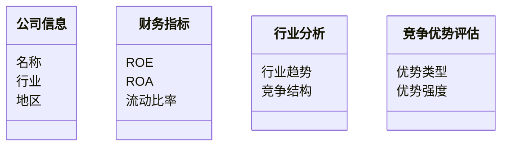
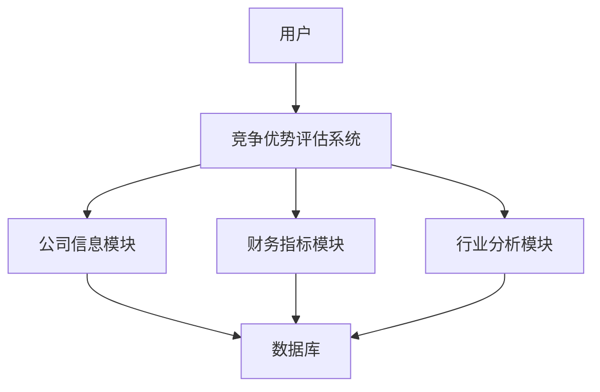

                 

# 彼得林奇如何评估公司的竞争优势

## 关键词：彼得林奇、竞争优势、投资策略、基本面分析、行业分析、财务报表

## 摘要：  
彼得·林奇是全球著名基金经理，以其独特的优势评估方法闻名。本文深入分析了他的竞争优势评估策略，包括基本面分析、行业分析、财务比率和现金流分析，通过实际案例和系统架构设计，帮助投资者制定有效投资策略。

---

## 第1章: 彼得林奇投资理念概述

### 1.1 彼得林奇的生平简介

- 彼得·林奇是富达投资的传奇经理，管理过麦哲伦基金，创造了卓越的投资业绩。
- 他强调长期投资和深入的基本面分析，避免短期市场波动的影响。

### 1.2 彼得林奇的投资哲学

- **长期投资**：林奇认为市场短期波动无法预测，长期投资更可靠。
- **深入研究**：他主张对公司进行彻底的研究，包括财务报表、行业地位和竞争优势。
- **分散投资**：避免过度集中，降低风险。

### 1.3 成功案例

- **麦哲伦基金**：通过深入研究，投资于具有强大竞争优势的公司，取得了显著的回报。

---

## 第2章: 什么是竞争优势

### 2.1 竞争优势的定义

- 竞争优势是公司在市场中胜过竞争对手的能力，确保持续盈利。

### 2.2 竞争优势的类型

| 类型       | 描述                                       |
|------------|--------------------------------------------|
| 成本优势   | 公司在生产或运营成本上低于竞争对手。       |
| 差异化优势 | 提供独特的产品或服务，满足特定客户需求。   |
| 专有权优势 | 拥有专利、商标或独特的资源。               |

### 2.3 竞争优势的重要性

- **市场地位**：巩固公司在市场中的地位。
- **盈利能力**：提高利润，增强股东回报。
- **风险抵抗**：强大的竞争优势使公司更具抗风险能力。

---

## 第3章: 竞争优势的动态变化

### 3.1 行业变化的影响

- 行业技术进步、政策变化和市场需求变化都会影响竞争优势。

### 3.2 公司内部因素

- 管理层决策、研发投入和运营效率影响竞争优势的持续性。

### 3.3 外部环境挑战

- 经济周期、竞争加剧和原材料价格波动可能削弱竞争优势。

---

## 第4章: 公司基本面分析

### 4.1 财务报表分析

#### 4.1.1 利润表分析

- **收入与利润**：分析收入增长和利润水平，判断公司盈利能力。
  - 例如，苹果公司通过不断创新，保持了稳定的收入增长和高利润率。

#### 4.1.2 资产负债表分析

- **资产与负债**：评估公司资产结构和偿债能力。
  - 苹果公司拥有健康的资产负债表，低负债率和高流动资产。

#### 4.1.3 现金流量表分析

- **现金流健康**：分析经营活动、投资活动和筹资活动的现金流。
  - 苹果公司自由现金流强劲，支持其研发投入和股息支付。

### 4.2 财务比率分析

#### 4.2.1 收益能力

- **ROE（净资产收益率）**：衡量公司使用股东资产的效率。
  - 公式：$$ROE = \frac{\text{净利润}}{\text{平均股东权益}}$$
- **ROA（资产净利率）**：衡量资产的盈利能力。
  - 公式：$$ROA = \frac{\text{净利润}}{\text{平均总资产}}$$

#### 4.2.2 偿债能力

- **负债率**：衡量公司债务负担。
  - 公式：$$负债率 = \frac{\text{总负债}}{\text{总资产}}$$
- **流动比率**：衡量公司短期偿债能力。
  - 公式：$$流动比率 = \frac{\text{流动资产}}{\text{流动负债}}$$

#### 4.2.3 运营效率

- **存货周转率**：衡量公司存货管理效率。
  - 公式：$$存货周转率 = \frac{\text{成本 of goods sold}}{\text{平均存货}}$$
- **应收账款周转率**：衡量公司应收账款管理效率。
  - 公式：$$应收账款周转率 = \frac{\text{营业收入}}{\text{平均应收账款}}$$

### 4.3 现金流分析

#### 4.3.1 自由现金流

- 公式：$$自由现金流 = \text{净利润} - \text{资本 expenditures}$$
- 自由现金流是公司用于再投资或返还股东的重要资金来源。

#### 4.3.2 现金流与企业价值

- 现金流健康是企业价值评估的重要指标，影响公司估值。

---

## 第5章: 行业分析与竞争优势

### 5.1 行业分析的重要性

- 行业分析帮助识别行业趋势和竞争优势，评估公司未来增长潜力。

### 5.2 行业竞争结构分析

- 使用波特的五力模型：潜在进入者、替代品威胁、供应商议价能力、买家议价能力和现有竞争者。

### 5.3 行业中的竞争优势

- 行业龙头企业的竞争优势，如技术领先、成本优势和品牌影响力。

---

## 第6章: 竞争优势的数学模型与算法

### 6.1 竞争优势评估模型

- 结合定量和定性因素，构建竞争优势评估模型。

#### 6.1.1 定量指标

- ROE、ROA、流动比率等财务指标。

#### 6.1.2 定性因素

- 品牌价值、管理团队、研发能力等。

### 6.2 竞争优势评分系统

- 使用加权评分法，将各项指标进行量化评估。

#### 6.2.1 加权评分法

- 公式：$$总分 = \sum (\text{指标权重} \times \text{指标得分})$$

---

## 第7章: 项目实战与案例分析

### 7.1 案例分析：苹果公司的竞争优势

#### 7.1.1 基本面分析

- 高收益、高ROE、强劲现金流。

#### 7.1.2 行业分析

- 苹果公司在科技行业具有强大的技术优势和品牌影响力。

#### 7.1.3 风险管理

- 分析苹果公司的潜在风险，如技术更新和市场竞争。

---

## 第8章: 系统分析与架构设计

### 8.1 问题场景介绍

- 竞争优势评估系统的构建，帮助投资者快速评估公司竞争优势。

### 8.2 系统功能设计

- 领域模型：包括公司信息、财务指标、行业分析和竞争优势评估。

#### 领域模型 Mermaid 类图

### 8.3 系统架构设计

#### 竞争优势评估系统架构图

---

## 第9章: 数学模型与公式

### 9.1 竞争优势评分模型

- 使用加权平均法，将各项指标进行综合评分。

#### 竞争优势评分公式

$$ \text{竞争优势评分} = \sum (\text{指标权重}_i \times \text{指标得分}_i) $$

---

## 第10章: 结论与投资建议

### 10.1 总结

- 彼得·林奇的竞争优势评估方法强调基本面分析和长期投资，帮助投资者识别具有强大竞争优势的公司。

### 10.2 投资建议

- 深入研究公司基本面，关注行业趋势，分散投资以降低风险。
- 长期持有优质股票，避免频繁交易。

### 10.3 最佳实践 tips

- 持续学习和更新知识，保持对市场的敏感性。
- 定期复盘投资组合，评估竞争优势的变化。

---

## 作者：AI天才研究院/AI Genius Institute & 禅与计算机程序设计艺术 /Zen And The Art of Computer Programming

---

**附录：工具与表格**

- 财务指标计算工具
- 优势评估表格模板

---

通过以上结构，文章详细讲解了彼得·林奇的竞争优势评估方法，结合理论、案例和系统设计，为读者提供了全面的指导。

