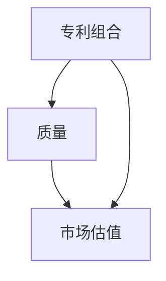
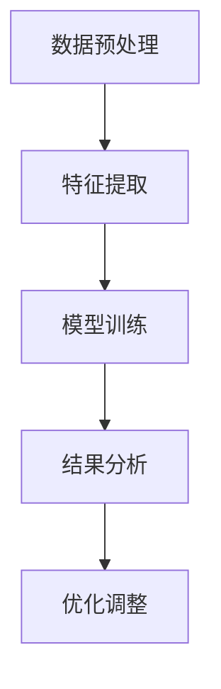

                 


# 彼得林奇对公司专利组合质量与市场估值关系的研究

> 关键词：公司专利组合、质量评估、市场估值、彼得林奇、投资策略、知识产权管理  
> 摘要：本文探讨了彼得林奇在其投资策略中对公司专利组合质量与市场估值关系的深入研究。通过分析专利组合的质量评估指标，结合市场估值的核心要素，本文揭示了专利组合质量对市场估值的影响路径，并提出了基于统计和机器学习的评估算法。最后，本文通过实际案例展示了如何将理论应用于实践，并提出了在实际操作中需要注意的关键点。

---

## 第一部分: 公司专利组合质量与市场估值关系的背景与核心概念

### 第1章: 背景介绍

#### 1.1 问题背景

##### 1.1.1 专利在企业价值中的作用  
专利是企业知识产权的重要组成部分，它不仅体现了企业的技术创新能力，还为企业在市场竞争中提供了重要的法律保护。专利的价值往往体现在其技术先进性、市场应用性以及潜在的经济收益上。对于投资者而言，专利组合的质量是评估企业长期价值的重要指标之一。

##### 1.1.2 市场估值的核心要素  
市场估值是企业在市场上的价值体现，通常包括企业当前的财务状况、未来盈利能力、市场地位以及知识产权等无形资产。其中，专利作为企业核心竞争力的一部分，对市场估值的影响尤为重要。

##### 1.1.3 专利组合质量与市场估值的关联性  
专利组合质量指的是专利资产的整体价值和结构优化程度。高质量的专利组合能够为企业提供更强的市场竞争力和抗风险能力，从而直接影响企业的市场估值。因此，研究专利组合质量与市场估值的关系对企业投资决策具有重要意义。

#### 1.2 问题描述

##### 1.2.1 专利组合的定义与特征  
专利组合是指一组具有互补性或协同效应的专利资产，通常包括多个专利或专利申请。其特征包括技术相关性、法律有效性、市场覆盖范围等。

##### 1.2.2 市场估值的定义与影响因素  
市场估值是指企业在市场上的公允价值，通常由资产重估、收益能力、行业地位等因素决定。专利作为重要的无形资产，是影响市场估值的关键因素之一。

##### 1.2.3 专利组合质量对市场估值的影响路径  
高质量的专利组合能够提升企业的技术创新能力，增强市场竞争力，从而提高企业的盈利能力，最终影响市场估值。此外，专利组合的质量还可能通过法律风险的降低和市场壁垒的构建，间接影响企业的市场估值。

#### 1.3 问题解决

##### 1.3.1 专利组合质量评估的必要性  
评估专利组合质量可以帮助企业优化知识产权管理，提升专利资产的利用效率，从而增强企业的市场竞争力。

##### 1.3.2 市场估值与专利组合质量的关系  
市场估值与专利组合质量之间存在密切关系。高质量的专利组合能够显著提升企业的市场估值，尤其是在技术密集型行业。

##### 1.3.3 研究目标与意义  
本研究旨在通过分析专利组合质量对市场估值的影响，为企业投资决策提供理论支持和实践指导。通过揭示两者的内在关系，可以帮助投资者更好地评估企业的长期价值。

#### 1.4 边界与外延

##### 1.4.1 专利组合质量的边界条件  
专利组合质量的评估需要考虑技术领域、专利的有效性、市场覆盖范围等因素，但不包括企业的其他无形资产，如品牌价值。

##### 1.4.2 市场估值的边界条件  
市场估值受多种因素影响，包括宏观经济环境、行业竞争状况等，但本研究主要关注专利组合质量对市场估值的影响。

##### 1.4.3 两者关系的外延与限制  
专利组合质量与市场估值的关系并非线性关系，而是受到多种因素的综合影响。因此，本研究仅探讨两者之间的主要影响路径，不考虑其他次要因素。

#### 1.5 概念结构与核心要素

##### 1.5.1 专利组合质量的核心要素  
- **技术相关性**：专利之间的技术关联性。  
- **法律有效性**：专利的法律保护力度。  
- **市场覆盖范围**：专利的市场应用范围。  

##### 1.5.2 市场估值的核心要素  
- **企业盈利能力**：企业的财务状况。  
- **市场地位**：企业的行业地位。  
- **知识产权价值**：专利组合的质量。  

##### 1.5.3 两者关系的核心要素  
- **技术创新能力**：专利组合对企业技术创新的促进作用。  
- **市场竞争力**：专利组合对企业市场地位的影响。  
- **经济收益**：专利组合对企业盈利能力的贡献。  

---

### 第2章: 核心概念与联系

#### 2.1 核心概念原理

##### 2.1.1 专利组合质量的评估指标  
- **专利数量**：专利组合的规模。  
- **专利质量**：专利的技术先进性和法律保护力度。  
- **专利布局**：专利在不同技术领域和市场的分布情况。  

##### 2.1.2 市场估值的评估指标  
- **市盈率（P/E）**：市价与收益的比率。  
- **市净率（P/B）**：市价与资产净值的比率。  
- **企业价值（EV）**：企业的整体估值。  

##### 2.1.3 两者关系的理论基础  
专利组合质量通过影响企业的技术创新能力和市场竞争力，进而影响企业的盈利能力，最终影响市场估值。

#### 2.2 概念属性特征对比

##### 2.2.1 专利组合质量的属性特征  
| 属性 | 特征描述 |
|------|----------|
| 技术相关性 | 专利之间的技术关联性较高，能够形成协同效应。 |
| 法律有效性 | 专利的法律保护力度强，不易被无效化。 |
| 市场覆盖范围 | 专利覆盖的主要市场与企业目标市场一致。 |

##### 2.2.2 市场估值的属性特征  
| 属性 | 特征描述 |
|------|----------|
| 盈利能力 | 企业具有持续的盈利能力。 |
| 市场地位 | 企业在行业中具有较高的市场份额。 |
| 知识产权价值 | 企业拥有高质量的专利组合。 |

##### 2.2.3 对比分析与总结  
专利组合质量与市场估值在技术相关性、法律有效性和市场覆盖范围等方面存在显著差异，但两者在企业技术创新能力和市场竞争力方面具有共同点。

#### 2.3 ER实体关系图



---

## 第二部分: 专利组合质量与市场估值关系的算法原理

### 第3章: 算法原理讲解

#### 3.1 算法原理概述

##### 3.1.1 统计分析方法  
统计分析方法包括回归分析、方差分析等，用于揭示专利组合质量与市场估值之间的相关性。

##### 3.1.2 机器学习方法  
机器学习方法包括支持向量机（SVM）、随机森林（Random Forest）等，用于预测市场估值的变化趋势。

##### 3.1.3 深度学习方法  
深度学习方法包括神经网络（Neural Networks）等，用于复杂的非线性关系建模。

#### 3.2 算法流程图



#### 3.3 算法实现代码

##### 3.3.1 数据预处理

```python
import pandas as pd

# 加载数据
data = pd.read_csv('patent_value.csv')

# 删除缺失值
data.dropna(inplace=True)

# 标准化处理
from sklearn.preprocessing import StandardScaler
scaler = StandardScaler()
data[['专利数量', '专利质量', '市场估值']] = scaler.fit_transform(data[['专利数量', '专利质量', '市场估值']])
```

##### 3.3.2 特征提取

```python
from sklearn.feature_selection import SelectKBest, f_regression

# 特征选择
selector = SelectKBest(score_func=f_regression, k=2)
selected_features = selector.fit_transform(data[['专利数量', '专利质量']], data['市场估值'])
```

##### 3.3.3 模型训练

```python
from sklearn.linear_model import LinearRegression
from sklearn.metrics import mean_squared_error

# 训练模型
model = LinearRegression()
model.fit(selected_features, data['市场估值'])

# 预测结果
predicted = model.predict(selected_features)
print(mean_squared_error(data['市场估值'], predicted))
```

##### 3.3.4 数学模型

$$ \text{市场估值} = \beta_0 + \beta_1 \times \text{专利数量} + \beta_2 \times \text{专利质量} + \epsilon $$

其中，$\beta_0$ 是截距，$\beta_1$ 和 $\beta_2$ 是回归系数，$\epsilon$ 是误差项。

---

接下来，我会继续完成第二部分的内容，包括算法原理的详细讲解、数学模型的分析、系统架构设计、项目实战以及最佳实践等内容。如果您对当前部分的内容有任何疑问或需要调整，请随时告诉我。

