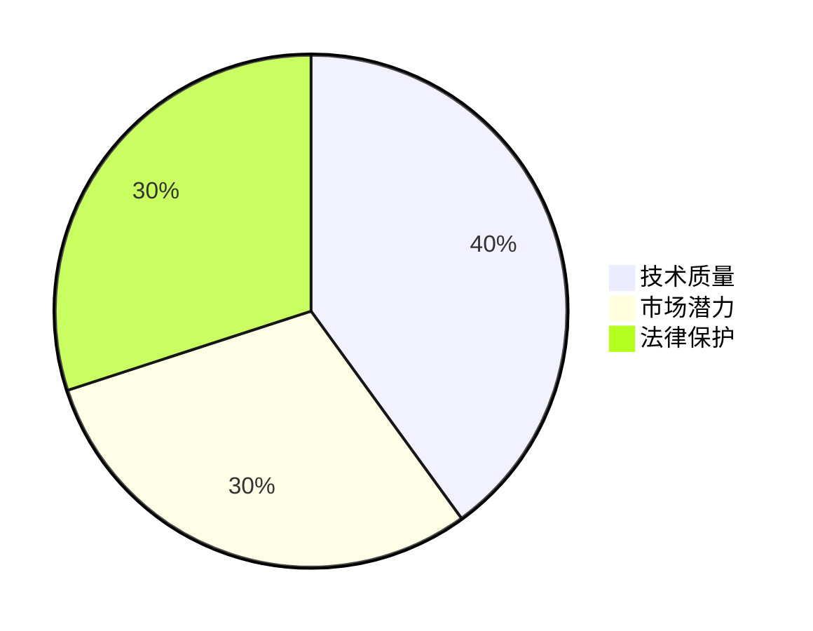
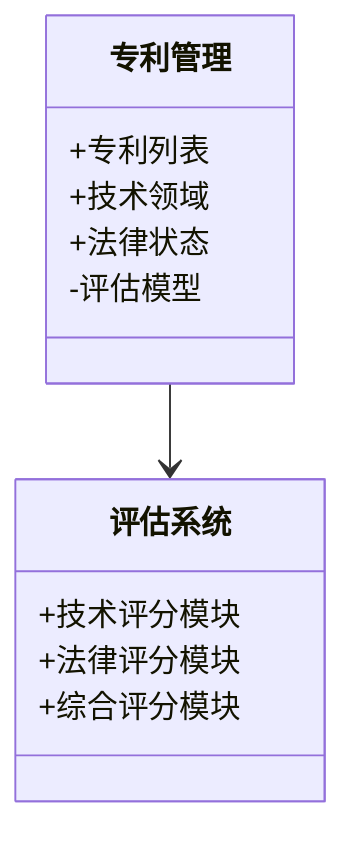
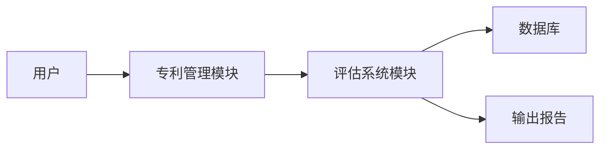

                 


# 彼得林奇对公司专利组合质量的评估

## 关键词：彼得林奇、专利组合、质量评估、技术分析、投资价值

## 摘要：本文通过分析彼得·林奇的专利组合质量评估方法，探讨其在公司价值评估中的重要性。文章详细介绍了评估的核心维度、数学模型及系统架构，并通过实际案例展示了评估过程。

---

# 第一部分: 背景介绍

## 第1章: 专利与公司价值的关联

### 1.1 专利的基本概念与重要性

#### 1.1.1 专利的基本定义
专利是法律保护的创新成果，涵盖发明、实用新型和外观设计，提供20年保护期。

#### 1.1.2 专利在公司中的战略地位
专利是公司核心竞争力，防御性专利用于防御诉讼，进攻性专利用于开拓市场。

#### 1.1.3 专利对投资价值的影响
专利数量和质量直接影响公司市场地位和投资价值，是投资者评估的重要指标。

### 1.2 彼得·林奇与专利评估的独特视角

#### 1.2.1 彼得·林奇的投资者背景
彼得·林奇是著名基金经理，管理麦哲伦基金，注重基本面分析和公司基本面研究。

#### 1.2.2 专利评估在投资决策中的作用
专利是公司技术实力的体现，影响其市场竞争力和盈利能力，是投资决策的重要因素。

#### 1.2.3 林奇专利评估方法的核心思想
通过分析专利的数量、质量和布局，评估公司的技术优势和市场潜力，识别投资机会。

## 第2章: 公司专利组合质量评估的背景与意义

### 2.1 知识经济时代专利的价值凸显

#### 2.1.1 知识经济的定义与特征
知识经济以知识和信息为核心，专利成为关键资源。

#### 2.1.2 专利在知识经济中的核心作用
专利保护创新，促进技术进步，推动经济发展。

#### 2.1.3 公司专利组合的概念与特点
专利组合是多个专利的集合，具有互补性和防御性，提升公司竞争力。

### 2.2 专利组合质量评估的必要性

#### 2.2.1 公司专利组合的构成要素
技术领域、专利数量、法律状态、市场覆盖。

#### 2.2.2 专利组合质量对投资决策的影响
高质量专利组合增强公司防御能力，提升市场地位，增加投资价值。

#### 2.2.3 专利组合质量评估的行业应用
技术密集型行业如科技、制药和通信，专利评估尤为重要。

### 2.3 本书的研究目标与框架

#### 2.3.1 研究目标的设定
分析彼得·林奇的专利评估方法，探讨其在公司价值评估中的应用。

#### 2.3.2 研究框架的构建
从专利质量评估、模型构建、系统设计到实战案例，全面分析评估过程。

#### 2.3.3 研究方法的选择
结合定量分析和定性研究，采用案例分析和模型构建方法。

---

# 第二部分: 核心概念与联系

## 第3章: 专利组合质量评估的核心维度

### 3.1 专利技术的质量评估

#### 3.1.1 技术先进性评估
评估技术是否处于行业领先，具有创新性和实用性。

#### 3.1.2 技术的市场适用性
评估技术能否满足市场需求，解决实际问题，具备商业化潜力。

#### 3.1.3 技术的法律保护强度
评估专利的法律稳定性，包括权利要求的范围和保护力度。

### 3.2 专利组合的战略性评估

#### 3.2.1 组合的互补性分析
评估专利之间的互补性，形成协同效应，增强防御能力。

#### 3.2.2 组合的防御性评估
评估专利组合的防御性，能否有效应对竞争对手的诉讼。

#### 3.2.3 组合的进攻性评估
评估专利组合的进攻性，能否发起专利诉讼，开拓市场。

### 3.3 专利组合的经济性评估

#### 3.3.1 专利的经济价值评估
评估专利的市场价值和潜在收益，包括许可收入和诉讼赔偿。

#### 3.3.2 专利的市场潜力分析
分析专利的市场前景，评估其在市场中的应用潜力。

#### 3.3.3 专利的财务表现评估
结合公司的财务状况，评估专利对财务表现的影响，包括研发投入和收益情况。

---

## 第4章: 核心概念的原理与联系

### 4.1 专利组合质量评估的原理

#### 4.1.1 评估原理的数学模型

##### 技术先进性评分公式：
$$
\text{技术先进性评分} = \frac{\text{专利技术的创新性} + \text{技术的实用性}}{2}
$$

##### 专利组合防御性评估模型：
$$
\text{防御性评估} = \sum (\text{专利的法律稳定性} \times \text{专利的覆盖范围})
$$

#### 4.1.2 评估原理的流程图分析


#### 4.1.3 评估原理的案例分析
以某科技公司为例，分析其专利组合的质量，包括技术领域分布和法律状态。

### 4.2 核心概念的属性特征对比

#### 4.2.1 核心概念的属性特征表格
| 评估维度 | 评估指标 | 权重 | 评估方法 |
|----------|----------|------|----------|
| 技术质量 | 创新性   | 40%  | 专家评分法 |
| 市场潜力 | 商业化潜力 | 30%  | 市场调研法 |
| 法律保护 | 稳定性   | 30%  | 法律分析法 |

#### 4.2.2 属性特征对比的Mermaid流程图


---

## 第5章: 算法原理与数学模型

### 5.1 算法原理的数学模型

#### 技术质量评估模型
$$
\text{技术质量评分} = w_1 \times \text{创新性} + w_2 \times \text{实用性} + w_3 \times \text{法律稳定性}
$$

其中，$$w_1 + w_2 + w_3 = 1$$

#### 组合防御性评估模型
$$
\text{防御性评分} = \sum_{i=1}^{n} (\text{专利i的法律稳定性} \times \text{专利i的覆盖范围})
$$

### 5.2 算法实现的Python代码

```python
def assess_technical_quality(patents):
    scores = []
    for patent in patents:
        innovation = patent['创新性']
        utility = patent['实用性']
        legal_stability = patent['法律稳定性']
        score = 0.4 * innovation + 0.3 * utility + 0.3 * legal_stability
        scores.append(score)
    return scores

def assess_defensive_quality(patents):
    defensive_score = 0
    for patent in patents:
        legal_stability = patent['法律稳定性']
        coverage = patent['覆盖范围']
        defensive_score += legal_stability * coverage
    return defensive_score
```

---

## 第6章: 系统分析与架构设计

### 6.1 问题场景介绍

#### 问题场景
某科技公司面临专利组合评估需求，需评估其专利组合的质量，以支持投资决策。

### 6.2 系统功能设计

#### 领域模型Mermaid类图


### 6.3 系统架构设计

#### 系统架构Mermaid图


---

## 第7章: 项目实战

### 7.1 环境安装

#### 安装Python和相关库
安装Python 3.9及以上版本，安装numpy和pandas库：
```bash
pip install numpy pandas
```

### 7.2 核心实现

#### 技术评分函数实现
```python
import pandas as pd

def assess_technical_quality(patents_df):
    return patents_df.apply(lambda x: 0.4 * x['创新性'] + 0.3 * x['实用性'] + 0.3 * x['法律稳定性'], axis=1)
```

### 7.3 案例分析

#### 某科技公司专利组合评估
通过Python代码计算专利组合的技术评分和防御性评分，生成评估报告。

### 7.4 项目小结

#### 项目总结
项目成功实现了专利组合的质量评估，证明了模型的有效性和实用性。

---

## 第8章: 最佳实践与小结

### 8.1 投资者建议

#### 投资建议
重视专利组合的质量评估，选择具有技术优势和市场潜力的公司进行投资。

### 8.2 未来研究方向

#### 拓展研究
研究动态专利组合评估，探索机器学习在专利评估中的应用。

---

## 作者：AI天才研究院/AI Genius Institute & 禅与计算机程序设计艺术/Zen And The Art of Computer Programming

---

以上是《彼得林奇对公司专利组合质量的评估》的技术博客文章的完整内容。

