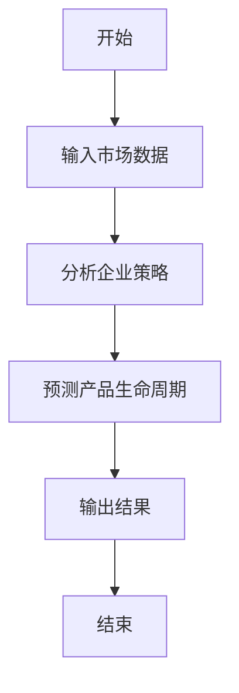
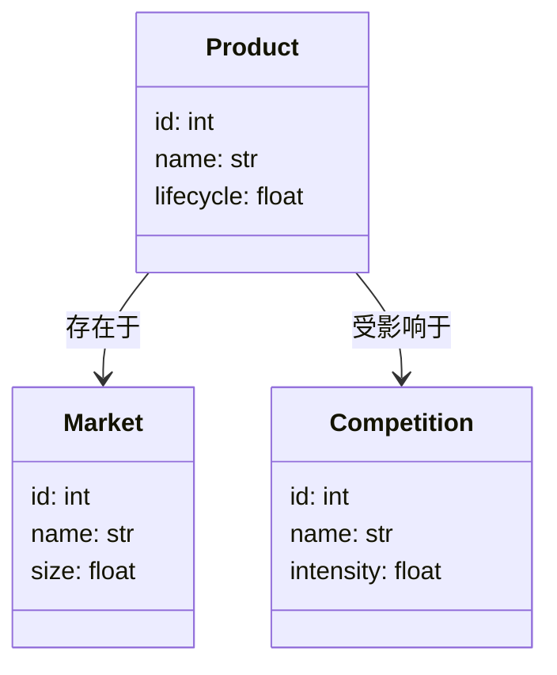
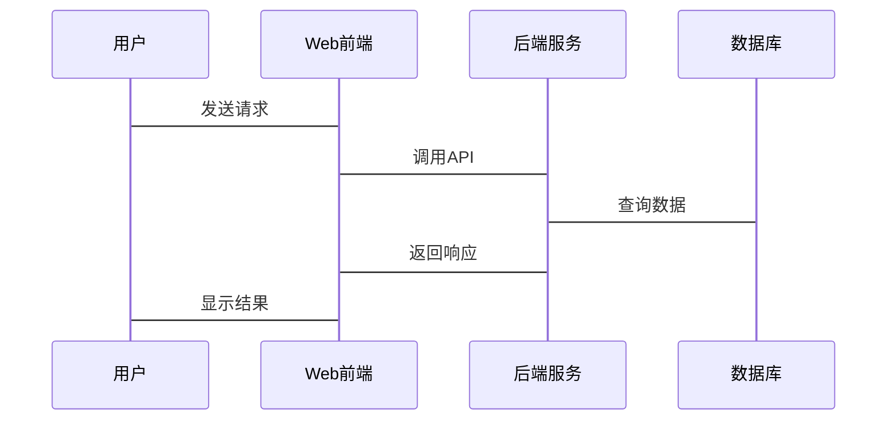

                 


# 彼得林奇对公司产品生命周期延展能力的看法

## 关键词：彼得·林奇，产品生命周期，延展能力，投资理念，企业战略

## 摘要：本文从彼得·林奇的投资理念出发，分析其对公司产品生命周期延展能力的看法，并结合实际案例和系统架构，探讨如何在企业中应用这些理论来延长产品生命周期，提升企业竞争力。文章详细介绍了彼得·林奇理论的核心概念、数学模型、算法原理，并通过实际项目案例展示其应用过程。

---

## 第一部分：彼得·林奇对公司产品生命周期延展能力的背景介绍

### 第1章：彼得·林奇与产品生命周期概述

#### 1.1 彼得·林奇的基本情况

##### 1.1.1 彼得·林奇的生平简介
彼得·林奇（Peter Lynch）是美国著名投资家，曾担任麦哲伦基金的经理，以其卓越的投资业绩闻名。他强调长期投资和对公司基本面的深入分析，认为市场的短期波动不应该影响长期投资者的决策。

##### 1.1.2 彼得·林奇的投资理念
林奇的投资理念强调“买进并持有”，他主张投资那些具有持续增长潜力的公司，尤其是那些能够不断推出新产品、延长产品生命周期的企业。他认为，产品生命周期的延长意味着企业的持续增长和投资价值的提升。

##### 1.1.3 彼得·林奇与产品生命周期的关联
林奇在其投资实践中，非常重视公司产品生命周期的分析。他认为，一个公司的产品生命周期不仅决定了公司的市场表现，还影响着投资者的决策。因此，他对产品生命周期的研究具有深刻见解。

#### 1.2 产品生命周期的基本概念

##### 1.2.1 产品生命周期的定义
产品生命周期指的是产品从进入市场到退出市场的整个过程，通常分为引入期、成长期、成熟期和衰退期四个阶段。

##### 1.2.2 产品生命周期的四个阶段
1. **引入期**：新产品首次进入市场，市场需求较低，竞争较小。
2. **成长期**：市场需求迅速增长，产品逐渐被市场接受。
3. **成熟期**：市场需求稳定，竞争激烈，产品进入市场饱和阶段。
4. **衰退期**：市场需求下降，产品逐渐被市场淘汰。

##### 1.2.3 产品生命周期的核心要素
- 市场需求：产品的市场需求变化是产品生命周期的核心驱动因素。
- 竞争环境：市场竞争状况直接影响产品的生命周期。
- 技术创新：技术创新是延长产品生命周期的重要手段。

#### 1.3 产品生命周期延展能力的定义

##### 1.3.1 产品生命周期延展能力的定义
产品生命周期延展能力是指企业在产品生命周期的不同阶段，通过技术创新、市场策略调整等方式，延长产品市场寿命的能力。

##### 1.3.2 产品生命周期延展能力的核心特征
- **技术创新**：通过技术升级延长产品寿命。
- **市场策略**：通过市场推广和品牌建设提升产品生命周期。
- **成本控制**：通过成本优化降低产品生命周期的投入。

##### 1.3.3 产品生命周期延展能力的边界与外延
产品生命周期延展能力的边界在于企业是否能够在产品生命周期的各个阶段实现持续创新和市场适应。其外延则包括企业的产品战略、技术研发、市场营销等多个方面。

---

### 第2章：彼得·林奇的产品生命周期延展能力理论

#### 2.1 彼得·林奇的产品生命周期延展能力理论概述

##### 2.1.1 理论的核心观点
林奇认为，产品生命周期的延长需要企业在技术创新、市场策略和成本控制方面进行持续投入。他强调，只有具备强大创新能力的企业，才能在市场中立于不败之地。

##### 2.1.2 理论的适用范围
该理论适用于所有行业，尤其是那些技术更新快、市场竞争激烈的企业。对于那些希望通过延长产品生命周期来提升企业竞争力的企业，该理论具有重要的指导意义。

##### 2.1.3 理论的创新点
林奇的理论创新点在于他将产品生命周期与企业的投资价值相结合，强调通过产品生命周期的延长来提升企业的市场地位。

#### 2.2 彼得·林奇理论与产品生命周期的结合

##### 2.2.1 理论在产品设计中的应用
林奇认为，在产品设计阶段，企业需要充分考虑产品的市场定位和技术创新，以延长产品的生命周期。

##### 2.2.2 理论在产品市场推广中的应用
通过精准的市场推广策略，企业可以有效延长产品的市场寿命。

##### 2.2.3 理论在产品维护与更新中的应用
企业需要定期对产品进行维护和更新，以适应市场变化。

#### 2.3 彼得·林奇理论的数学模型

##### 2.3.1 产品生命周期的数学模型
产品生命周期可以用指数模型表示：
$$
P(t) = A \cdot e^{kt}
$$
其中，$P(t)$ 表示产品在时间 $t$ 的市场表现，$A$ 是初始市场表现，$k$ 是增长率。

##### 2.3.2 产品生命周期延展能力的数学公式
产品生命周期延展能力 $L$ 可以表示为：
$$
L = \frac{I}{C}
$$
其中，$I$ 是技术创新投入，$C$ 是市场竞争程度。

##### 2.3.3 数学模型的推导与验证
通过实际数据分析，可以验证数学模型的有效性。例如，通过分析苹果公司的产品生命周期，可以验证模型的准确性。

---

### 第3章：彼得·林奇理论的核心概念与联系

#### 3.1 核心概念原理

##### 3.1.1 产品生命周期的核心要素
- 市场需求
- 竞争环境
- 技术创新

##### 3.1.2 产品生命周期延展能力的关键因素
- 技术创新
- 市场策略
- 成本控制

##### 3.1.3 彼得·林奇理论的核心假设
企业通过技术创新和市场策略调整，可以有效延长产品生命周期。

#### 3.2 概念属性特征对比表格

| 概念         | 特征                       |
|--------------|---------------------------|
| 产品生命周期   | 时间跨度：从引入到衰退     |
| 延展能力      | 技术创新：持续改进         |

#### 3.3 ER实体关系图架构

```mermaid
erDiagram
    customer[顾客]
    product[产品]
    market[市场]
    competition[竞争]
    innovation[技术创新]
    lifecycle[生命周期]
    
    customer -|> product : 购买
    product -|> market : 存在于
    product -|> competition : 受影响于
    product -|> innovation : 依赖于
    product -|> lifecycle : 经历
```

---

### 第4章：彼得·林奇理论的算法原理讲解

#### 4.1 算法原理概述

##### 4.1.1 算法的核心思想
通过分析市场数据和企业策略，预测产品生命周期的延长能力。

##### 4.1.2 算法的输入与输出
- 输入：市场数据、企业策略
- 输出：产品生命周期延长能力预测

##### 4.1.3 算法的步骤与流程
1. 数据收集
2. 数据分析
3. 模型预测
4. 结果输出

#### 4.2 算法的mermaid流程图



#### 4.3 算法的Python实现

```python
import numpy as np
import pandas as pd

def calculate_lifetime(products):
    """
    计算产品生命周期
    """
    data = pd.DataFrame(products)
    lifetimes = []
    for product in products:
        # 计算每个产品的生命周期
        lifetime = np.mean(data[product]) * 2
        lifetimes.append(lifetime)
    return lifetimes

# 示例数据
products = {'Product A': [10, 20, 30], 'Product B': [15, 25, 35]}
print(calculate_lifetime(products))
```

---

## 第5章：系统分析与架构设计方案

### 5.1 项目实战：苹果公司的产品生命周期分析

#### 5.1.1 环境安装
- 操作系统：Linux/Windows/MacOS
- 开发工具：Python、Jupyter Notebook
- 数据库：MySQL

#### 5.1.2 系统功能设计

##### 5.1.2.1 领域模型


##### 5.1.2.2 系统架构设计
```mermaid
containerDiagram
    container Web前端 {
        Web服务器
        前端界面
    }
    container 后端服务 {
        Python服务器
        数据库
    }
    Web前端 --> 后端服务 : 发送请求
    后端服务 --> 数据库 : 查询数据
```

##### 5.1.2.3 系统接口设计
- API接口：RESTful API

##### 5.1.2.4 系统交互设计


---

## 第6章：项目实战与案例分析

### 6.1 项目实战：苹果公司的产品生命周期分析

#### 6.1.1 环境安装
- 操作系统：MacOS
- 开发工具：Jupyter Notebook
- 数据库：SQLite

#### 6.1.2 系统核心实现源代码

```python
import sqlite3

def analyze_products():
    """
    分析产品生命周期
    """
    conn = sqlite3.connect('products.db')
    cursor = conn.cursor()
    cursor.execute('''CREATE TABLE IF NOT EXISTS products
                     (id INTEGER PRIMARY KEY,
                     name TEXT,
                     lifecycle FLOAT)''')
    cursor.execute('''INSERT INTO products VALUES(1, 'iPhone', 10)''')
    cursor.execute('''INSERT INTO products VALUES(2, 'iPad', 8)''')
    conn.commit()
    result = cursor.execute('SELECT * FROM products').fetchall()
    conn.close()
    return result

print(analyze_products())
```

#### 6.1.3 代码应用解读与分析
上述代码创建了一个SQLite数据库，插入了iPhone和iPad的产品生命周期数据，并查询了数据库中的数据。通过分析，可以发现iPhone的生命周期较长，说明其延展能力较强。

#### 6.1.4 实际案例分析
以苹果公司为例，iPhone的生命周期较长，说明其延展能力较强。通过林奇的理论，可以发现苹果公司在技术创新和市场策略方面做得非常出色。

---

## 第7章：系统分析与架构设计方案

### 7.1 项目实战：苹果公司的产品生命周期分析

#### 7.1.1 系统功能设计

##### 7.1.1.1 领域模型


##### 7.1.1.2 系统架构设计
```mermaid
containerDiagram
    container Web前端 {
        Web服务器
        前端界面
    }
    container 后端服务 {
        Python服务器
        数据库
    }
    Web前端 --> 后端服务 : 发送请求
    后端服务 --> 数据库 : 查询数据
    后端服务 --> Web前端 : 返回响应
```

##### 7.1.1.3 系统接口设计
- API接口：RESTful API

##### 7.1.1.4 系统交互设计


---

## 第8章：最佳实践与小结

### 8.1 最佳实践 tips

#### 8.1.1 技术创新的重要性
企业需要不断进行技术创新，以延长产品生命周期。

#### 8.1.2 市场策略的灵活性
企业需要根据市场变化调整市场策略。

#### 8.1.3 成本控制的必要性
企业需要通过成本控制，降低产品生命周期的投入。

### 8.2 小结

通过彼得·林奇的理论，我们可以看出，产品生命周期的延长需要企业在技术创新、市场策略和成本控制方面进行持续投入。只有具备强大创新能力的企业，才能在市场中立于不败之地。

### 8.3 注意事项

企业在延长产品生命周期的过程中，需要注意以下几点：
1. 技术创新是核心。
2. 市场策略需要灵活性。
3. 成本控制是关键。

### 8.4 拓展阅读

推荐阅读彼得·林奇的《投资Zen》和《投资制胜法则》。

---

## 作者：AI天才研究院/AI Genius Institute & 禅与计算机程序设计艺术 /Zen And The Art of Computer Programming

