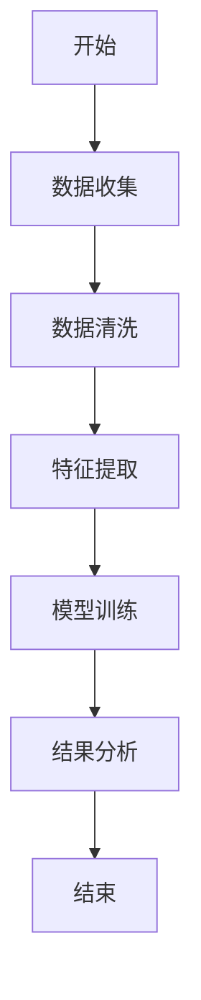
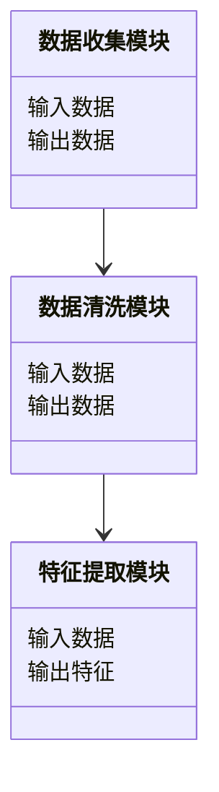
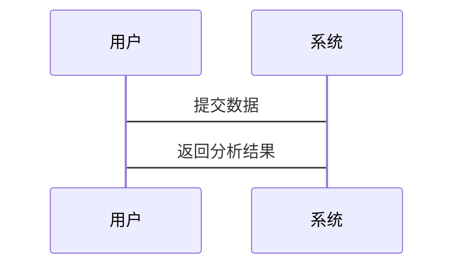

                 


# 彼得林奇对公司产品线的分析

> 关键词：彼得林奇，产品线分析，投资分析，企业价值评估，财务分析

> 摘要：本文通过分析彼得林奇的产品线分析方法，探讨其在投资决策中的应用。从产品线分析的背景、核心概念、数学模型、系统架构到项目实战，详细阐述了如何通过产品线分析评估公司价值，并提供了具体的案例分析和代码实现。

---

## 第1章：彼得林奇与产品线分析概述

### 1.1 彼得林奇投资理念的核心思想

#### 1.1.1 彼得林奇的投资者背景与成就

彼得·林奇（Peter Lynch）是美国著名的共同基金经理，以其在富达投资管理公司管理麦哲伦基金的经历而闻名。他在任职期间创造了卓越的投资业绩，将麦哲伦基金的资产规模从1.7亿美元增长至140亿美元。林奇的投资理念强调长期投资、深入研究和对公司基本面的分析，尤其是对公司产品线的分析，成为其投资决策的核心方法之一。

#### 1.1.2 产品线分析在投资中的重要性

产品线分析是彼得林奇评估公司价值的重要工具。他认为，一个公司的产品线是其核心竞争力的体现，通过分析产品线的生命周期、市场地位和盈利能力，可以准确评估公司的未来增长潜力和投资价值。

#### 1.1.3 产品线分析的核心概念与目标

产品线分析的核心概念是通过对公司产品线的全面评估，识别其优势和劣势，进而判断公司的投资价值。其目标是通过分析产品线的市场表现、财务数据和竞争优势，为投资者提供科学的投资决策依据。

---

### 1.2 产品线分析的基本概念

#### 1.2.1 产品线的定义与分类

产品线是指公司提供的各种产品或服务的组合。根据市场、功能和目标客户的不同，产品线可以分为多种类型。例如，消费产品、工业产品和技术产品等。每种产品线都有其独特的生命周期和市场表现。

#### 1.2.2 产品线分析的步骤与方法

产品线分析的步骤通常包括数据收集、数据清洗、特征提取、模型训练和结果分析。常见的分析方法包括财务指标分析、竞争优势分析和产品生命周期分析。

#### 1.2.3 产品线分析与企业价值的关系

产品线分析是连接公司产品与企业价值的桥梁。通过分析产品线的市场表现和盈利能力，可以评估公司的整体价值，为投资决策提供依据。

---

### 1.3 产品线分析的背景与应用

#### 1.3.1 当前市场环境下的产品线分析

在当前复杂多变的市场环境中，产品线分析变得更加重要。通过分析产品线的市场反应，可以及时调整投资策略，应对市场变化。

#### 1.3.2 产品线分析在投资决策中的应用

彼得林奇通过产品线分析，识别具有竞争优势的公司，从而实现超额收益。这种方法在实践中被广泛应用于股票筛选和投资组合优化。

#### 1.3.3 产品线分析的边界与外延

产品线分析的边界在于其适用范围和数据来源。通过明确分析的边界，可以避免分析的偏差，提高分析的准确性。

---

## 第2章：产品线分析的核心要素与框架

### 2.1 产品线分析的核心要素

#### 2.1.1 产品生命周期

产品生命周期是产品从引入市场到退出市场的全过程。通过分析产品的生命周期阶段，可以评估其市场潜力和投资价值。

#### 2.1.2 市场地位与竞争优势

市场地位和竞争优势是评估产品线价值的关键因素。通过分析公司的市场份额和竞争优势，可以判断其产品线的市场地位。

#### 2.1.3 财务表现与盈利能力

财务表现和盈利能力是评估产品线价值的重要指标。通过分析公司的财务数据，可以评估其产品线的盈利能力。

---

### 2.2 产品线分析的框架体系

#### 2.2.1 产品线分析的四维度模型

四维度模型包括市场地位、产品生命周期、竞争优势和财务表现四个维度。通过综合分析这四个维度，可以全面评估产品线的价值。

#### 2.2.2 产品线分析的矩阵模型

矩阵模型通过将产品线的市场地位和竞争优势进行交叉分析，形成一个矩阵图。通过矩阵图可以直观判断产品线的市场地位和竞争优势。

#### 2.2.3 产品线分析的流程图

产品线分析的流程图包括数据收集、数据清洗、特征提取、模型训练和结果分析五个步骤。

---

## 第3章：产品线分析的数学模型与算法原理

### 3.1 产品线分析的数学模型

#### 3.1.1 产品线价值评估的公式

产品线价值评估公式：
$$
\text{产品线价值} = \sum (\text{收入} - \text{成本}) \times \text{数量}
$$

#### 3.1.2 市盈率与市净率的计算

市盈率（P/E）公式：
$$
\text{市盈率} = \frac{\text{股价}}{\text{每股收益}}
$$

市净率（P/B）公式：
$$
\text{市净率} = \frac{\text{股价}}{\text{每股净资产}}
$$

#### 3.1.3 股东权益回报率（ROE）的分析

ROE公式：
$$
\text{ROE} = \frac{\text{净利润}}{\text{股东权益}}
$$

---

### 3.2 算法原理与流程图

#### 3.2.1 产品线分析的算法流程

算法流程包括数据收集、数据清洗、特征提取、模型训练和结果分析。

#### 3.2.2 产品线分析的 mermaid 流程图



---

## 第4章：产品线分析的系统架构与实现

### 4.1 系统架构设计

#### 4.1.1 系统功能模块划分

系统功能模块包括数据收集模块、数据清洗模块、特征提取模块、模型训练模块和结果分析模块。

#### 4.1.2 系统架构的 mermaid 类图



---

### 4.2 系统接口与交互设计

#### 4.2.1 系统接口设计

系统接口包括数据输入接口和结果输出接口。

#### 4.2.2 系统交互的 mermaid 序列图



---

## 第5章：产品线分析的项目实战

### 5.1 项目环境与工具安装

#### 5.1.1 环境搭建

需要安装Python、Pandas、NumPy和Matplotlib等工具。

---

### 5.2 产品线分析的核心实现

#### 5.2.1 数据收集与清洗

```python
import pandas as pd

# 数据收集
data = pd.read_csv('product_line.csv')

# 数据清洗
data.dropna(inplace=True)
data = data[~data['收入'].isnull()]
```

#### 5.2.2 特征提取与建模

```python
import numpy as np
from sklearn import linear_model

# 特征提取
features = data[['收入', '成本', '数量']]
target = data['利润']

# 模型训练
model = linear_model.LinearRegression()
model.fit(features, target)
```

#### 5.2.3 结果分析与可视化

```python
import matplotlib.pyplot as plt

# 可视化
plt.scatter(features['数量'], target)
plt.xlabel('数量')
plt.ylabel('利润')
plt.title('产品线利润分析')
plt.show()
```

---

## 第6章：总结与展望

### 6.1 总结

产品线分析是彼得林奇投资决策的核心方法之一。通过深入分析产品线的生命周期、市场地位和财务表现，可以准确评估公司的投资价值。

### 6.2 展望

未来，随着人工智能和大数据技术的发展，产品线分析将更加精准和高效。投资者可以通过更复杂的模型和算法，进一步提升投资决策的准确性。

---

## 作者：AI天才研究院/AI Genius Institute & 禅与计算机程序设计艺术 /Zen And The Art of Computer Programming

