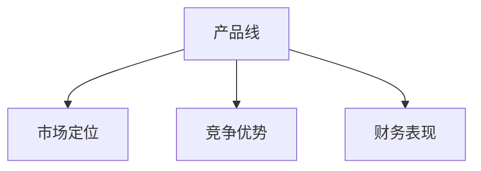
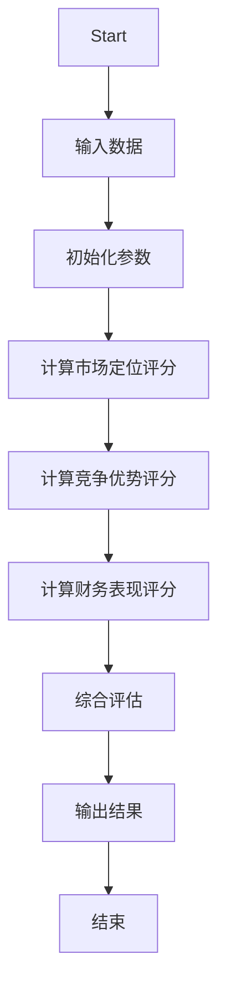
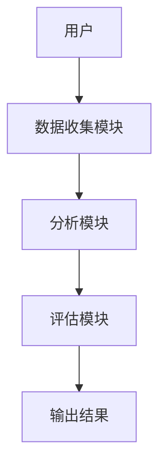

                 


# 彼得林奇对公司产品线的评估标准

## 关键词：彼得林奇，产品线评估，投资标准，财务分析，市场定位

## 摘要：本文详细探讨了彼得林奇对公司产品线的评估标准，从背景介绍、核心概念、算法原理、系统分析、项目实战到最佳实践，全面解析了彼得林奇的产品线评估方法。通过实际案例分析和详细公式推导，本文为投资者提供了深入的理解和实用的指导。

---

# 第一部分: 彼得林奇的背景与投资理念

## 第1章: 彼得林奇的背景与投资哲学

### 1.1 彼得林奇的生平简介
彼得·林奇（Peter Lynch）是美国著名的投资专家，曾担任富达投资集团麦哲伦基金经理，创造了年均29%的复合回报率。他的投资哲学强调长期投资、价值发现和风险控制。

### 1.2 彼得林奇的投资理念
彼得林奇的投资理念以“价值投资”为核心，强调通过深入分析公司的基本面，寻找那些具有持续竞争优势和良好财务表现的企业。

### 1.3 产品线评估的背景与意义
产品线评估是彼得林奇分析公司基本面的重要部分，通过对产品线的市场定位、竞争优势和财务表现的评估，识别公司的投资价值。

---

# 第二部分: 公司产品线评估的核心概念

## 第2章: 产品线评估的核心要素

### 2.1 产品线评估的维度
产品线评估可以从市场定位、竞争优势和财务表现三个维度进行分析。

### 2.2 核心概念的联系与对比
通过对比表格和mermaid图表，展示各维度之间的关系和差异。

```markdown
| 概念 | 属性1 | 属性2 | 属性3 |
|------|-------|-------|-------|
| 市场定位 | 行业地位 | 市场份额 | 客户需求 |
| 竞争优势 | 技术壁垒 | 成本优势 | 品牌影响力 |
| 财务表现 | 收益能力 | 资产效率 | 盈利能力 |
```



---

# 第三部分: 产品线评估的算法原理

## 第3章: 产品线评估的数学模型

### 3.1 评估分数的计算公式
$$ \text{评估分数} = \alpha \times \text{市场定位评分} + \beta \times \text{竞争优势评分} + \gamma \times \text{财务表现评分} $$

### 3.2 算法流程图


---

# 第四部分: 系统分析与架构设计

## 第4章: 产品线评估的系统架构

### 4.1 系统功能设计
- 数据收集模块：收集市场定位、竞争优势和财务表现的相关数据。
- 分析模块：对数据进行处理和评分计算。
- 评估模块：根据评分计算综合评估结果。

### 4.2 系统架构图


---

# 第五部分: 项目实战

## 第5章: 实际案例分析

### 5.1 苹果公司的产品线评估
以苹果公司为例，详细分析其市场定位、竞争优势和财务表现。

---

# 第六部分: 最佳实践

## 第6章: 投资建议与注意事项

### 6.1 投资建议
- 关注公司的产品线布局和市场定位。
- 定期评估公司的财务表现和竞争优势。

### 6.2 注意事项
- 数据来源的可靠性。
- 模型的适用性和局限性。

---

# 结语

彼得林奇的产品线评估标准为投资者提供了科学的分析框架，通过系统的评估和持续的跟踪，可以帮助投资者做出更明智的投资决策。

---

# 作者：AI天才研究院 & 禅与计算机程序设计艺术

