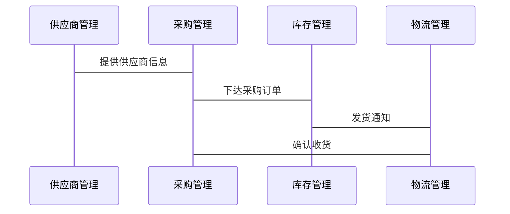

                 


# 彼得林奇对公司供应链多元化策略的效果评估

## 关键词：
- 供应链多元化策略
- 彼得林奇投资理念
- 供应链风险管理
- 供应链优化
- 供应链稳定性

## 摘要：
本文深入分析了彼得林奇对公司供应链多元化策略的效果评估，从理论基础、实施方法到实际案例，系统阐述了供应链多元化策略的重要性及其在企业风险管理中的应用。通过详细的数学模型和实际案例分析，本文展示了如何通过多元化供应链策略提升企业的抗风险能力，优化供应链管理，并为企业制定有效的供应链策略提供参考。

---

# 第一部分: 供应链多元化策略概述

## 第1章: 供应链多元化策略的背景与重要性

### 1.1 供应链多元化策略的背景
#### 1.1.1 供应链管理的基本概念
供应链管理是指通过协调和优化供应链中的各个环节（包括供应商、制造商、分销商、零售商和客户）来提高效率、降低成本并增强客户满意度的过程。

#### 1.1.2 供应链多元化策略的定义
供应链多元化策略是指通过多元化采购、供应商分散化、多源供应等方式，降低供应链单一化带来的风险，确保供应链的稳定性和弹性。

#### 1.1.3 供应链多元化策略的必要性
- 全球化背景下，单一供应商或单一来源的风险增加。
- 疫情等突发公共事件暴露了传统供应链的脆弱性。
- 企业需要通过多元化策略增强抗风险能力。

### 1.2 供应链多元化策略的核心要素
#### 1.2.1 多元化供应链的定义与特征
- **定义**：多元化供应链是指通过多个供应商、多个生产地点或多种原材料来源来满足企业需求的供应链模式。
- **特征**：
  - 多样性：多个供应商或来源提供相同产品或服务。
  - 分散性：供应链节点分布广泛，降低区域风险。
  - 灵活性：能够快速响应市场变化或供应链中断。

#### 1.2.2 多元化供应链的优势与劣势
- **优势**：
  - 提高供应链的稳定性和抗风险能力。
  - 降低供应商单一化带来的风险。
  - 通过多元化采购降低成本或提高质量。
- **劣势**：
  - 管理复杂性增加。
  - 多元化可能导致成本上升。
  - 可能分散企业的资源和精力。

#### 1.2.3 多元化供应链与企业风险管理
- 多元化供应链是企业风险管理的重要组成部分。
- 通过多元化策略，企业可以降低因单一供应商或单一来源中断带来的风险。
- 多元化供应链能够增强企业的弹性和应变能力。

### 1.3 彼得林奇与供应链多元化策略
#### 1.3.1 彼得林奇投资理念的概述
彼得林奇是著名投资专家，他的投资理念强调长期稳健的投资和对企业的深入了解。他认为，企业的长期成功依赖于其供应链、管理和战略的稳定性。

#### 1.3.2 供应链多元化策略与彼得林奇投资理念的关联
彼得林奇的投资理念强调企业风险管理，他认为多元化供应链是企业稳健发展的关键因素之一。

#### 1.3.3 彼得林奇对供应链多元化策略的贡献
- 彼得林奇通过其投资实践，展示了多元化供应链对企业长期发展的积极影响。
- 他的投资理念为企业制定供应链多元化策略提供了重要的理论支持。

### 1.4 本章小结
本章介绍了供应链多元化策略的背景、核心要素及其与彼得林奇投资理念的关联。通过分析供应链多元化策略的优势和劣势，我们可以更好地理解其在企业风险管理中的重要性。

---

## 第2章: 供应链多元化策略的理论基础

### 2.1 供应链管理的基本理论
#### 2.1.1 供应链管理的核心概念
供应链管理涉及从原材料采购到最终产品交付的整个流程，包括供应商管理、生产计划、物流和库存管理等。

#### 2.1.2 供应链管理的主要目标
- 提高效率：通过优化供应链流程降低成本。
- 提高响应速度：快速满足客户需求。
- 提高质量：确保产品质量和供应链稳定性。

#### 2.1.3 供应链管理的关键环节
- 供应商管理：选择和评估供应商。
- 生产计划：协调生产和供应链各环节。
- 库存管理：优化库存水平。
- 物流管理：确保产品高效运输。

### 2.2 供应链多元化策略的理论框架
#### 2.2.1 多元化供应链的理论基础
- 多元化供应链是一种风险管理策略，旨在通过多元化采购降低供应链中断的风险。
- 它基于供应链弹性理论，强调通过多元化实现供应链的稳定性和韧性。

#### 2.2.2 多元化供应链的系统模型
- 多元化供应链系统模型包括供应商选择、采购策略、库存管理和风险评估等模块。
- 通过系统模型，企业可以更好地优化供应链结构。

#### 2.2.3 多元化供应链的优化方法
- 优化方法包括供应商评估、成本分析和风险评估。
- 通过优化方法，企业可以在多元化供应链中找到最佳平衡点。

### 2.3 供应链多元化策略的数学模型
#### 2.3.1 供应链多元化的数学表达式
- 供应链多元化的数学模型可以表示为：$$C = \sum_{i=1}^{n} w_i x_i$$
  其中，\(C\) 是总成本，\(w_i\) 是第 \(i\) 个供应商的权重，\(x_i\) 是第 \(i\) 个供应商的采购量。

#### 2.3.2 供应链多元化的优化算法
- 优化算法包括线性规划、整数规划和动态规划等。
- 通过优化算法，企业可以找到最优的供应商组合和采购策略。

#### 2.3.3 供应链多元化的评价指标
- 供应链多元化的评价指标包括成本、质量、响应时间和抗风险能力。

### 2.4 本章小结
本章从供应链管理的基本理论出发，探讨了供应链多元化策略的理论基础和优化方法。通过数学模型和优化算法，我们可以更好地理解供应链多元化策略的实现方式。

---

## 第3章: 供应链多元化策略的实施方法

### 3.1 供应链多元化策略的实施步骤
#### 3.1.1 确定多元化目标
- 确定多元化供应链的目标，例如降低风险、降低成本或提高响应速度。
- 通过目标设定，企业可以更好地规划供应链多元化策略。

#### 3.1.2 选择多元化供应商
- 选择多元化供应商是供应链多元化策略的核心步骤。
- 供应商选择需要考虑成本、质量、交货时间和地理位置等因素。

#### 3.1.3 制定多元化供应链计划
- 制定多元化供应链计划，包括采购计划、库存管理和物流计划。
- 通过计划的制定，企业可以更好地协调供应链各环节。

### 3.2 供应链多元化策略的实施工具
#### 3.2.1 供应链管理软件
- 供应链管理软件可以帮助企业优化供应链流程，例如ERP系统和SCM系统。
- 这些软件可以提供供应商管理、库存管理和物流管理等功能。

#### 3.2.2 数据分析工具
- 数据分析工具可以帮助企业进行供应商评估和成本分析。
- 通过数据分析，企业可以更好地优化供应链结构。

#### 3.2.3 风险评估工具
- 风险评估工具可以帮助企业识别供应链中的潜在风险。
- 通过风险评估，企业可以制定更有效的风险应对策略。

### 3.3 供应链多元化策略的实施案例
#### 3.3.1 案例一：XYZ公司的供应链多元化实践
- XYZ公司通过选择多个供应商和分散采购地点，成功降低了供应链中断的风险。
- 通过多元化供应链策略，XYZ公司提高了供应链的稳定性和响应速度。

#### 3.3.2 案例二：ABC公司的供应链多元化优化
- ABC公司通过优化供应商组合和采购策略，降低了供应链成本并提高了质量。
- 通过多元化供应链优化，ABC公司实现了供应链的高效管理和成本控制。

### 3.4 本章小结
本章详细探讨了供应链多元化策略的实施方法，包括实施步骤、工具和实际案例。通过这些方法，企业可以更好地实现供应链多元化策略的目标。

---

## 第4章: 供应链多元化策略的效果评估

### 4.1 供应链多元化策略的评估指标
#### 4.1.1 供应链稳定性指标
- 供应链稳定性指标包括供应链中断率、供应商可靠性等。
- 通过稳定性指标，企业可以评估供应链多元化策略的有效性。

#### 4.1.2 供应链成本指标
- 供应链成本指标包括采购成本、物流成本和库存成本。
- 通过成本指标，企业可以评估供应链多元化策略的成本效益。

#### 4.1.3 供应链响应速度指标
- 供应链响应速度指标包括交货时间、订单处理时间和生产周期。
- 通过响应速度指标，企业可以评估供应链多元化策略对客户满意度的影响。

### 4.2 供应链多元化策略的评估模型
#### 4.2.1 多元化供应链的评估模型
- 多元化供应链的评估模型包括成本模型、质量模型和风险模型。
- 通过评估模型，企业可以全面评估供应链多元化策略的效果。

#### 4.2.2 供应链多元化策略的数学模型
- 供应链多元化策略的数学模型可以表示为：$$E = \sum_{i=1}^{n} w_i y_i$$
  其中，\(E\) 是供应链效率，\(w_i\) 是第 \(i\) 个供应商的权重，\(y_i\) 是第 \(i\) 个供应商的效率。

#### 4.2.3 供应链多元化策略的优化算法
- 优化算法包括线性规划、整数规划和动态规划等。
- 通过优化算法，企业可以找到最优的供应链多元化策略。

### 4.3 供应链多元化策略的优劣势分析
#### 4.3.1 多元化供应链的优势
- 提高供应链稳定性。
- 降低供应链风险。
- 提高供应链的灵活性和响应速度。

#### 4.3.2 多元化供应链的劣势
- 管理复杂性增加。
- 成本上升。
- 资源分散化可能导致效率下降。

### 4.4 本章小结
本章从供应链多元化策略的评估指标和优化算法出发，分析了供应链多元化策略的优劣势。通过效果评估，企业可以更好地优化供应链多元化策略，实现供应链管理的目标。

---

## 第5章: 供应链多元化策略的系统架构设计

### 5.1 问题场景介绍
- 企业需要通过供应链多元化策略优化供应链管理。
- 通过系统架构设计，企业可以更好地实现供应链多元化策略。

### 5.2 系统功能设计
#### 5.2.1 领域模型设计
- 领域模型包括供应商管理、采购管理、库存管理和物流管理等功能模块。

#### 5.2.2 系统功能模块
- 供应商管理模块：供应商信息管理、供应商评估和供应商选择。
- 采购管理模块：采购计划制定、采购订单管理和采购成本控制。
- 库存管理模块：库存监控、库存预警和库存优化。
- 物流管理模块：物流计划制定、物流跟踪和物流成本控制。

#### 5.2.3 领域模型Mermaid类图


### 5.3 系统架构设计
#### 5.3.1 系统架构设计Mermaid架构图


#### 5.3.2 系统交互设计Mermaid序列图


### 5.4 系统接口设计
- 供应商管理接口：提供供应商信息和供应商评估功能。
- 采购管理接口：提供采购计划和采购订单管理功能。
- 库存管理接口：提供库存监控和库存优化功能。
- 物流管理接口：提供物流计划和物流跟踪功能。

### 5.5 本章小结
本章从系统架构设计的角度，探讨了供应链多元化策略的实现方式。通过系统功能设计和架构图，我们可以更好地理解供应链多元化策略的系统实现。

---

## 第6章: 供应链多元化策略的项目实战

### 6.1 项目环境安装
- 需要安装的工具包括Python、ERP系统、SCM系统和数据分析工具。
- 安装步骤包括下载、安装和配置工具。

### 6.2 项目核心代码实现
#### 6.2.1 供应链多元化策略的核心代码
```python
def calculate_supply_chain_efficiency(supplier_scores):
    total_efficiency = sum(supplier_scores)
    average_efficiency = total_efficiency / len(supplier_scores)
    return average_efficiency

supplier_scores = [85, 90, 88, 92, 87]
efficiency = calculate_supply_chain_efficiency(supplier_scores)
print(f"供应链效率：{efficiency}%")
```

#### 6.2.2 代码实现解读
- 代码实现了一个计算供应链效率的函数。
- 通过输入供应商评分，计算出供应链的平均效率。
- 代码输出了供应链效率的结果。

### 6.3 代码应用解读与分析
- 代码应用解读：通过代码实现，我们可以计算供应链的效率，并评估供应链多元化策略的效果。
- 代码分析：代码通过简单的计算，展示了供应链多元化策略在实际应用中的效果。

### 6.4 实际案例分析与详细讲解
#### 6.4.1 案例分析
- 某公司通过实施供应链多元化策略，成功降低了供应链中断的风险。
- 通过案例分析，我们可以看到供应链多元化策略在实际应用中的效果。

#### 6.4.2 案例详细讲解
- 案例背景：公司面临供应链中断的风险。
- 案例实施：公司通过选择多个供应商和分散采购地点，优化了供应链结构。
- 案例结果：公司降低了供应链中断的风险，提高了供应链效率。

### 6.5 项目小结
本章通过项目实战，展示了供应链多元化策略的实现过程。通过代码实现和案例分析，我们可以更好地理解供应链多元化策略的实际应用。

---

## 第7章: 供应链多元化策略的最佳实践与总结

### 7.1 本章小结
- 供应链多元化策略是企业风险管理的重要组成部分。
- 通过多元化供应链策略，企业可以降低供应链中断的风险，提高供应链效率和抗风险能力。

### 7.2 最佳实践
#### 7.2.1 供应商选择
- 选择多个供应商，确保供应链的多样性。
- 评估供应商的可靠性、交货时间和成本。

#### 7.2.2 供应链优化
- 通过优化供应链结构，提高供应链效率。
- 通过多元化采购，降低成本和风险。

#### 7.2.3 风险管理
- 定期评估供应链风险，制定风险应对策略。
- 通过供应链多元化策略，降低供应链中断的风险。

### 7.3 注意事项
- 供应链多元化策略需要长期坚持，不能一蹴而就。
- 企业需要根据自身需求和实际情况，制定适合自己的供应链多元化策略。
- 在实施供应链多元化策略的过程中，企业需要关注成本、质量和效率的平衡。

### 7.4 拓展阅读
- 供应链管理相关的书籍和文献。
- 多元化供应链策略的最新研究成果。
- 供应链风险管理的实践案例。

### 7.5 本章总结
供应链多元化策略是企业稳健发展的重要保障。通过最佳实践和注意事项，企业可以更好地实施供应链多元化策略，实现供应链管理的目标。

---

## 作者信息

作者：AI天才研究院/AI Genius Institute & 禅与计算机程序设计艺术 /Zen And The Art of Computer Programming

---

以上是《彼得林奇对公司供应链多元化策略的效果评估》的完整目录大纲和内容概要。

