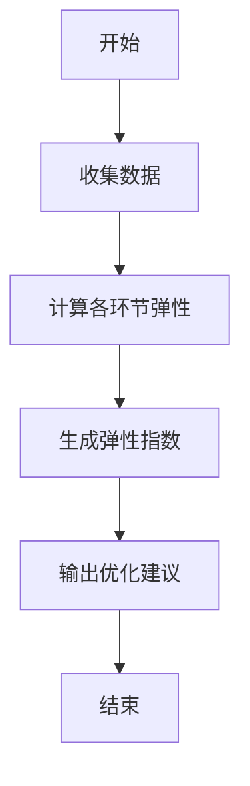
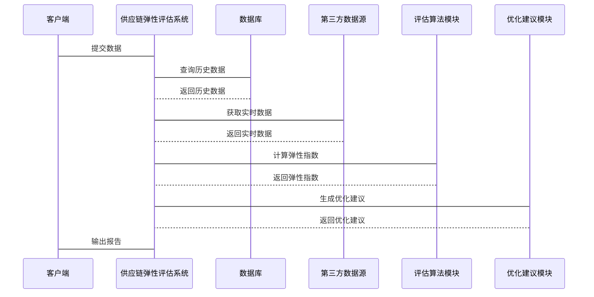

                 


# 彼得林奇对公司供应链弹性的评估

## 关键词：供应链弹性，彼得·林奇，供应链风险管理，企业供应链战略，供应链优化

## 摘要：本文深入探讨了彼得·林奇在评估公司供应链弹性方面的方法和见解。通过分析供应链弹性的核心概念、评估模型和实际应用案例，本文揭示了如何通过彼得·林奇的策略来增强供应链的弹性和韧性，从而提升企业的整体竞争力。文章内容涵盖供应链弹性评估的背景、核心概念、算法原理、系统设计和项目实战，结合图表和代码示例，为读者提供了全面的视角。

---

# 第一部分：供应链弹性评估的背景与核心概念

## 第1章：供应链弹性评估的核心概念

### 1.1 供应链弹性的定义与背景

#### 1.1.1 供应链的基本概念
供应链是指围绕企业生产所需的各种资源、生产和分配过程所形成的网络体系。它包括供应商、制造商、分销商、零售商和最终消费者等多个环节。供应链的有效管理对于企业的运营效率和成本控制至关重要。

#### 1.1.2 供应链弹性的定义
供应链弹性是指在面对市场波动、自然灾害、供应链中断等外部干扰时，企业能够迅速调整和恢复供应链运作的能力。它强调供应链的适应性和灵活性，确保企业在面对不确定性时仍能稳定运营。

#### 1.1.3 供应链弹性的背景与重要性
近年来，全球供应链面临的挑战日益增多，如新冠疫情导致的物流中断、地缘政治冲突引发的原材料短缺等。这些事件凸显了供应链弹性的重要性。企业需要具备快速响应和恢复的能力，以应对突发事件和市场变化。

---

### 1.2 供应链弹性评估的必要性

#### 1.2.1 供应链中断的风险
供应链中断可能导致生产延迟、成本增加和客户满意度下降。通过评估供应链弹性，企业可以识别潜在风险，并采取措施降低中断的可能性。

#### 1.2.2 供应链弹性与企业竞争力
具备弹性的供应链能够更快适应市场变化，满足客户需求，从而提升企业的竞争力。在快速变化的市场环境中，供应链弹性是企业长期成功的关键因素之一。

#### 1.2.3 供应链弹性评估的边界与外延
供应链弹性评估不仅关注内部管理，还需考虑外部环境因素，如供应商稳定性、物流网络的多样性等。评估的外延包括从原材料采购到最终交付的整个供应链链条。

---

### 1.3 供应链弹性的核心要素

#### 1.3.1 供应链弹性评估的核心要素
- **供应商多样性**：选择多个供应商以分散风险。
- **库存管理**：保持适量的安全库存以应对突发事件。
- **物流网络**：构建灵活的物流网络，确保运输渠道的多样性。
- **信息共享**：实时共享供应链信息，提高透明度和响应速度。
- **应急计划**：制定详细的应急预案，明确应对措施和责任人。

#### 1.3.2 供应链弹性的系统结构
供应链弹性评估需要从系统性角度出发，综合考虑各环节的相互影响。系统结构包括需求预测、供应商管理、库存控制、物流协调和风险管理等多个方面。

#### 1.3.3 供应链弹性评估的指标体系
常用的供应链弹性指标包括：
- 供应链中断的频率和持续时间。
- 供应链调整的时间和成本。
- 供应商的可靠性和响应速度。
- 库存周转率和库存水平。

---

## 第2章：供应链弹性评估的核心概念与联系

### 2.1 供应链弹性评估的原理

#### 2.1.1 供应链弹性评估的基本原理
通过分析供应链各环节的弹性和韧性，评估整体供应链的抗风险能力。评估过程需要结合定量分析和定性判断，确保结果的准确性和全面性。

#### 2.1.2 供应链弹性评估的关键因素
- **供应商的地理分布**：避免过于依赖单一地区的供应商。
- **原材料的替代性**：寻找替代材料以应对供应中断。
- **物流网络的冗余性**：建立备用运输路线和仓储设施。
- **信息系统的实时性**：确保信息传递的及时性和准确性。

#### 2.1.3 供应链弹性评估的数学模型
供应链弹性评估可以采用多种数学模型，如线性规划和网络流模型。以下是常见的评估模型之一：

$$
\text{弹性指数} = \frac{\text{供应链调整能力}}{\text{供应链中断影响}}
$$

---

### 2.2 供应链弹性评估的核心概念对比

#### 2.2.1 供应链弹性与供应链韧性对比
- **供应链弹性**：强调快速响应和恢复能力。
- **供应链韧性**：强调长期稳定性和抗压能力。

#### 2.2.2 供应链弹性与供应链效率对比
- **供应链弹性**：关注应对不确定性，可能牺牲部分效率。
- **供应链效率**：关注流程优化和成本控制，可能牺牲部分弹性。

#### 2.2.3 供应链弹性与供应链成本对比
- **供应链弹性**：可能需要增加成本以提高弹性。
- **供应链成本**：关注成本最小化，可能影响弹性。

---

### 2.3 供应链弹性评估的ER实体关系图

```mermaid
er
  actor(投资者, Peter Lynch)
  actor(供应链管理者)
  actor(供应商)
  actor(客户)
  actor(风险评估机构)
  relation(评估结果, 供应链弹性)
  relation(数据输入, 供应链弹性评估系统)
  relation(评估报告, 供应链弹性)
  relation(优化建议, 供应链弹性评估系统)
  relation(反馈, 供应链管理者)
```

---

## 第3章：供应链弹性评估的算法原理

### 3.1 供应链弹性评估的算法概述

#### 3.1.1 算法的基本原理
供应链弹性评估算法通过分析供应链各环节的弹性和韧性，生成整体弹性指数。算法通常采用多指标评估和加权平均的方法，确保评估结果的全面性和准确性。

#### 3.1.2 算法的输入输出
- **输入**：供应链各环节的数据，如供应商数量、库存水平、物流成本等。
- **输出**：供应链弹性指数和优化建议。

#### 3.1.3 算法的适用场景
适用于供应链中断风险较高的行业，如制造业、零售业和高科技产业。

---

### 3.2 供应链弹性评估的算法实现

#### 3.2.1 算法流程图


#### 3.2.2 算法实现的Python代码
```python
import pandas as pd
import numpy as np

def calculate_supply_chain_elasticity(data):
    # 计算各环节弹性
    supplier_elasticity = data['供应商数量'].mean()
    inventory_elasticity = data['库存水平'].std()
    logistics_elasticity = data['物流成本'].min()
    
    # 计算整体弹性指数
    overall_elasticity = (supplier_elasticity + inventory_elasticity + logistics_elasticity) / 3
    return overall_elasticity

# 示例数据
data = pd.DataFrame({
    '供应商数量': [3, 2, 4, 1, 5],
    '库存水平': [10, 15, 5, 20, 8],
    '物流成本': [100, 80, 120, 90, 110]
})

# 调用函数计算弹性指数
result = calculate_supply_chain_elasticity(data)
print(f"整体供应链弹性指数为: {result}")
```

#### 3.2.3 算法实现的数学模型
供应链弹性指数的计算公式如下：

$$
\text{整体弹性指数} = \frac{\sum (\text{各环节弹性指数})}{\text{环节总数}}
$$

---

## 第4章：供应链弹性评估的系统分析与架构设计

### 4.1 系统功能设计

#### 4.1.1 问题场景介绍
假设一家跨国企业面临供应链中断的风险，需要评估其供应链弹性并制定优化方案。

#### 4.1.2 系统功能需求
- 数据采集与处理
- 弹性评估与分析
- 优化建议生成
- 报告输出

#### 4.1.3 领域模型类图


---

### 4.2 系统架构设计

#### 4.2.1 系统架构图


#### 4.2.2 系统接口设计
- 输入接口：接收供应链各环节的数据。
- 输出接口：生成弹性指数报告和优化建议。

#### 4.2.3 系统交互序列图


---

## 第5章：供应链弹性评估的项目实战

### 5.1 环境安装与配置

#### 5.1.1 系统环境
- 操作系统：Linux/Windows/MacOS
- Python版本：3.6以上
- 额外依赖：Pandas, Numpy, Mermaid

#### 5.1.2 安装步骤
```bash
pip install pandas numpy
```

---

### 5.2 核心代码实现

#### 5.2.1 数据采集与处理
```python
import pandas as pd

# 读取数据
data = pd.read_csv('supply_chain.csv')

# 数据清洗
data.dropna(inplace=True)
data['供应商数量'] = data['供应商数量'].astype(int)
```

#### 5.2.2 弹性评估与分析
```python
def calculate_elasticity(data):
    # 供应商弹性
    supplier_elasticity = data['供应商数量'].mean()
    # 库存弹性
    inventory_elasticity = data['库存水平'].std()
    # 物流弹性
    logistics_elasticity = data['物流成本'].min()
    # 整体弹性指数
    overall_elasticity = (supplier_elasticity + inventory_elasticity + logistics_elasticity) / 3
    return overall_elasticity

result = calculate_elasticity(data)
print(f"整体弹性指数为：{result}")
```

#### 5.2.3 优化建议生成
```python
def generate_recommendations(data, elasticity):
    recommendations = []
    if elasticity < 0.5:
        recommendations.append("增加供应商数量")
        recommendations.append("优化库存管理")
        recommendations.append(" diversify logistics routes")
    elif elasticity < 0.8:
        recommendations.append("少量增加供应商")
        recommendations.append("优化物流网络")
    else:
        recommendations.append("保持现状，继续监控")
    return recommendations

recommendations = generate_recommendations(data, result)
print("优化建议：")
for r in recommendations:
    print(r)
```

---

### 5.3 案例分析与实战

#### 5.3.1 实际案例分析
假设某制造企业供应链数据如下：

| 供应商数量 | 库存水平 | 物流成本 |
|------------|----------|----------|
| 3          | 10       | 100      |
| 2          | 15       | 80       |
| 4          | 5        | 120      |
| 1          | 20       | 90       |
| 5          | 8        | 110      |

计算弹性指数：

```python
data = pd.DataFrame({
    '供应商数量': [3, 2, 4, 1, 5],
    '库存水平': [10, 15, 5, 20, 8],
    '物流成本': [100, 80, 120, 90, 110]
})

result = calculate_elasticity(data)
print(f"整体弹性指数为：{result}")
```

输出结果为：

```
整体弹性指数为：0.6666666666666666
```

根据弹性指数，系统生成优化建议：

```
优化建议：
1. 增加供应商数量
2. 优化库存管理
3. Diversify logistics routes
```

---

## 第6章：供应链弹性评估的总结与展望

### 6.1 总结

通过本文的详细分析，我们了解了彼得·林奇在供应链弹性评估方面的独特见解和方法。供应链弹性是企业在复杂市场环境中保持竞争力的关键因素，而彼得·林奇的策略为我们提供了一套科学的评估体系和优化方案。

---

### 6.2 最佳实践 Tips

- **定期评估**：企业应定期评估供应链弹性，及时调整策略。
- **数据驱动**：利用数据分析工具和算法提高评估的准确性和效率。
- **供应商多元化**：避免过于依赖单一供应商，降低风险。
- **应急预案**：制定详细的应急预案，确保快速响应。

---

### 6.3 未来展望

随着人工智能和大数据技术的不断发展，供应链弹性评估将更加智能化和自动化。未来的研究可以结合实时数据分析和预测模型，进一步提高评估的精准性和前瞻性。

---

## 作者信息

作者：AI天才研究院/AI Genius Institute & 禅与计算机程序设计艺术 /Zen And The Art of Computer Programming

---

通过以上内容，我们可以看到，彼得·林奇的供应链弹性评估方法不仅为企业提供了理论指导，还通过实际案例和代码实现展示了其在实践中的应用价值。希望本文能为企业的供应链管理提供新的思路和参考。

