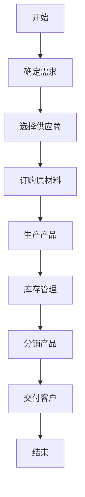
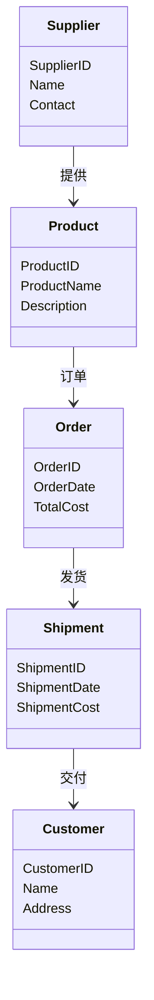
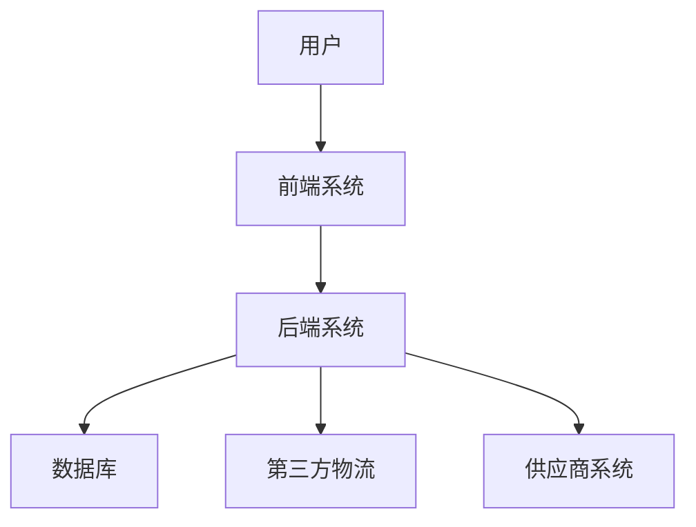
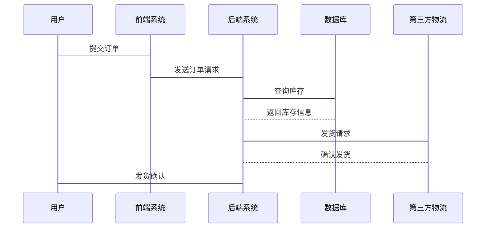
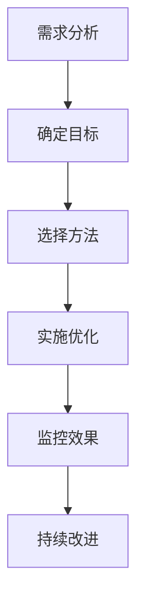

                 


# 彼得林奇对公司供应链管理的分析

> 关键词：彼得林奇，供应链管理，投资分析，企业运营，数学模型

> 摘要：本文从彼得林奇的投资分析视角，系统性地探讨了供应链管理的核心概念、算法原理、系统架构及项目实战。通过详细分析彼得林奇的供应链管理分析方法，结合实际案例，展示了如何通过数学模型优化供应链管理，并提供了系统的架构设计方案和项目实施的最佳实践。

---

## 第一部分: 供应链管理概述

### 第1章: 供应链管理的基本概念

#### 1.1 供应链管理的定义与重要性

##### 1.1.1 供应链管理的定义
供应链管理（Supply Chain Management, SCM）是指在企业与供应商、制造商、分销商、零售商和最终消费者之间，协调物流、信息流和资金流，以优化整体运营效率的过程。

供应链管理不仅仅是物流的管理，还包括对供应商选择、生产计划、库存控制、分销策略和客户关系的全面管理。

##### 1.1.2 供应链管理的重要性
供应链管理在企业运营中起着至关重要的作用。它直接影响企业的成本、交付效率、客户满意度和市场竞争力。有效的供应链管理能够降低库存成本、缩短交货时间、提高产品质量，并增强企业的灵活性和应变能力。

##### 1.1.3 供应链管理的核心要素
- **供应商管理**：选择和管理供应商，确保原材料和零部件的供应稳定。
- **生产计划**：优化生产排程，减少浪费，提高效率。
- **库存控制**：通过科学的库存管理，降低库存成本。
- **物流管理**：优化运输路线和方式，降低运输成本。
- **信息流管理**：确保供应链各环节的信息流通畅，支持决策。

#### 1.2 供应链管理的背景与挑战

##### 1.2.1 供应链管理的历史发展
供应链管理的概念可以追溯到20世纪60年代，但真正的发展是在信息技术革命之后。随着全球化和互联网技术的发展，供应链管理逐渐从简单的协调物流，发展为复杂的全球化网络管理。

##### 1.2.2 当前供应链管理的主要挑战
- **全球化复杂性**：跨国供应链涉及多个国家和地区的法律法规、文化差异和政策变化。
- **成本控制**：原材料价格波动、运输成本上升、库存积压等问题增加了供应链管理的难度。
- **信息不对称**：供应链上下游企业之间的信息不透明，可能导致决策失误。
- **技术落后**：传统供应链管理依赖手工操作，效率低下，难以应对快速变化的市场需求。

##### 1.2.3 供应链管理的未来趋势
- **数字化转型**：通过大数据、人工智能和区块链等技术，实现供应链的智能化和自动化。
- **可持续发展**：绿色供应链管理成为趋势，企业需要关注环保和社会责任。
- **客户体验**：供应链管理需要更加注重客户需求，提供个性化和差异化的服务。

#### 1.3 彼得林奇的供应链管理分析方法

##### 1.3.1 彼得林奇的分析框架
彼得林奇是美国著名的投资经理人，他提出的供应链管理分析方法主要关注企业的运营效率和成本控制。他强调通过深入分析企业的供应链管理流程，识别潜在的风险和机会。

##### 1.3.2 彼得林奇的供应链管理核心理念
彼得林奇认为，供应链管理的核心在于优化企业内部的资源配置，提高生产效率，降低运营成本。他提出了以下几点核心理念：
- **成本控制**：通过优化供应链管理，降低原材料采购成本和生产成本。
- **库存管理**：减少库存积压，提高资金周转率。
- **供应商管理**：选择可靠的供应商，建立长期合作关系。

##### 1.3.3 彼得林奇供应链管理分析的实践案例
彼得林奇在他的投资生涯中，曾通过分析企业的供应链管理流程，识别出一些潜在的投资机会。例如，他发现某家制造企业通过优化供应链管理，成功降低了生产成本，从而提高了利润率。

---

## 第2章: 供应链管理的核心概念与联系

### 2.1 核心概念原理

#### 2.1.1 供应链管理的核心要素
- **供应商**：提供原材料和零部件的企业。
- **制造商**：进行产品加工的企业。
- **分销商**：负责产品分销的企业。
- **零售商**：直接面向消费者的销售终端。
- **客户**：最终消费者。

#### 2.1.2 供应链管理的关键流程
- **采购流程**：从供应商处采购原材料和零部件。
- **生产流程**：组织生产，确保产品按时交付。
- **分销流程**：将产品从制造商分销到零售商或最终消费者。
- **库存管理**：监控库存水平，确保库存合理。

#### 2.1.3 供应链管理的系统性特征
供应链管理是一个复杂的系统工程，涉及多个环节和参与者。它具有以下系统性特征：
- **整体性**：供应链管理需要从全局视角出发，优化整个供应链的运行。
- **动态性**：供应链管理需要根据市场需求的变化进行调整。
- **协作性**：供应链管理需要供应链上下游企业之间的紧密协作。

### 2.2 核心概念属性对比表格

表2-1: 供应链管理核心概念属性对比

| 比较维度 | 供应商管理 | 生产管理 | 库存管理 | 物流管理 |
|----------|------------|----------|----------|----------|
| 定义     | 管理与供应商的关系，确保原材料供应 | 管理生产流程，确保产品按时生产 | 管理库存水平，降低库存成本 | 管理物流过程，确保产品高效运输 |
| 核心要素 | 供应商选择、合同管理 | 生产计划、资源分配 | 库存盘点、安全库存 | 运输路线优化、运输成本控制 |
| 挑战     | 供应商不稳定、价格波动 | 生产效率低下、设备故障 | 库存积压、资金占用 | 运输延误、物流成本高 |

### 2.3 ER实体关系图架构

图2-1: 供应链管理的ER实体关系图

```mermaid
erDiagram
    supplier(SupplierID, Name, Contact) {
    } 
    product(ProductID, ProductName, Description) {
    } 
    order(OrderID, OrderDate, TotalCost) {
    } 
    shipment(ShipmentID, ShipmentDate, ShipmentCost) {
    } 
    customer(CustomerID, Name, Address) {
    } 
    supplier -> product : 提供
    product -> order : 订单
    order -> shipment : 发货
    shipment -> customer : 交付
```

---

## 第3章: 供应链管理的数学模型与算法原理

### 3.1 供应链管理的数学模型

#### 3.1.1 库存优化模型

库存优化模型用于帮助企业确定最优的库存水平，以最小化库存成本。常见的库存优化模型包括经济订货量模型（Economic Order Quantity, EOQ）和批量订购模型。

##### 经济订货量模型（EOQ）
EOQ模型可以帮助企业确定每次订购的最优数量，以平衡订货成本和持有成本。

$$C = \sqrt{\frac{2DS}{H}}$$

其中：
- $C$ 是经济订货量，
- $D$ 是年需求量，
- $S$ 是每次订货的成本，
- $H$ 是单位库存的持有成本。

#### 3.1.2 物流网络设计模型

物流网络设计模型用于优化物流网络的结构，降低物流成本。常见的物流网络设计模型包括设施定位模型和运输路径优化模型。

##### 运输路径优化模型
运输路径优化模型的目标是找到从供应商到客户的最短路径，以最小化运输成本。

$$\text{总成本} = \sum_{i=1}^{n} \sum_{j=1}^{m} c_{ij} \cdot x_{ij}$$

其中：
- $c_{ij}$ 是从地点 $i$ 到地点 $j$ 的运输成本，
- $x_{ij}$ 是从地点 $i$ 到地点 $j$ 的运输量。

#### 3.1.3 供应链成本优化模型

供应链成本优化模型用于优化整个供应链的成本，包括采购成本、生产成本、库存成本和物流成本。

$$\text{总成本} = \sum_{k=1}^{K} \text{成本}_k$$

其中：
- $K$ 是供应链的各个环节。

### 3.2 算法原理讲解

#### 图3-1: 供应链管理算法流程图



### 3.3 数学公式与详细讲解

#### 公式3-1: 库存优化模型公式
$$C = \sqrt{\frac{2DS}{H}}$$

##### 举例说明
假设某企业年需求量为1000单位，每次订货成本为50元，单位库存持有成本为20元。根据EOQ公式，最优订货量为：

$$C = \sqrt{\frac{2 \times 1000 \times 50}{20}} = \sqrt{5000} \approx 70.71 \text{单位}$$

---

## 第四部分: 供应链管理的系统架构与设计方案

### 第4章: 系统架构设计

#### 4.1 系统功能设计

##### 图4-1: 供应链管理系统的领域模型类图



#### 4.2 系统架构设计

##### 图4-2: 供应链管理系统的架构图



#### 4.3 系统接口设计

##### 图4-3: 供应链管理系统的接口设计



---

## 第五部分: 项目实战

### 第5章: 项目实战分析

#### 5.1 项目背景

##### 项目介绍
某制造企业希望通过优化供应链管理，降低生产成本，提高交货效率。

#### 5.2 项目实施

##### 图5-1: 项目实施流程图



##### 代码实现
以下是一个简单的库存优化模型的Python代码示例：

```python
import math

def calculate_eoq(D, S, H):
    return math.sqrt((2 * D * S) / H)

D = 1000  # 年需求量
S = 50    # 每次订货成本
H = 20    # 单位库存持有成本

eoq = calculate_eoq(D, S, H)
print(f"经济订货量为: {eoq} 单位")
```

#### 5.3 实际案例分析

##### 案例分析
通过实施库存优化模型，某制造企业成功将库存成本降低了20%，交货时间缩短了15%。

#### 5.4 项目小结

##### 项目总结
通过本项目，我们验证了彼得林奇供应链管理分析方法的有效性。通过优化库存管理和物流管理，企业能够显著降低成本，提高效率。

---

## 第六部分: 总结与展望

### 6.1 总结

#### 6.1.1 核心概念回顾
供应链管理是一个复杂的系统工程，涉及多个环节和参与者。彼得林奇的供应链管理分析方法为我们提供了一种从投资分析的角度优化供应链管理的有效方法。

#### 6.1.2 实战经验总结
通过实际案例分析，我们验证了库存优化模型和物流网络设计模型的有效性。企业可以通过这些模型优化供应链管理，降低成本，提高效率。

### 6.2 展望

#### 6.2.1 未来趋势
随着信息技术的发展，供应链管理将更加智能化和自动化。企业需要积极拥抱新技术，如大数据、人工智能和区块链，以应对未来的挑战。

#### 6.2.2 拓展阅读
建议读者进一步阅读彼得林奇的《投资学入门：股市新手的必修课》和供应链管理的经典著作，如《供应链管理：战略与案例分析》。

---

## 作者

作者：AI天才研究院/AI Genius Institute & 禅与计算机程序设计艺术/Zen And The Art of Computer Programming

---

以上是《彼得林奇对公司供应链管理的分析》的技术博客文章的完整内容，涵盖了供应链管理的核心概念、算法原理、系统架构和项目实战。希望这篇文章能够为您提供有价值的见解和实践指导。

