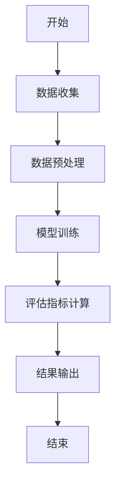
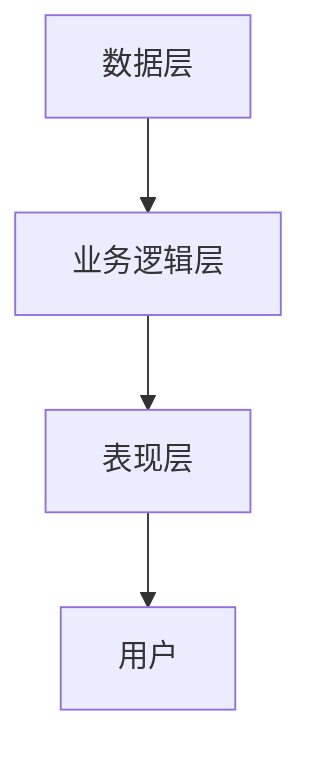
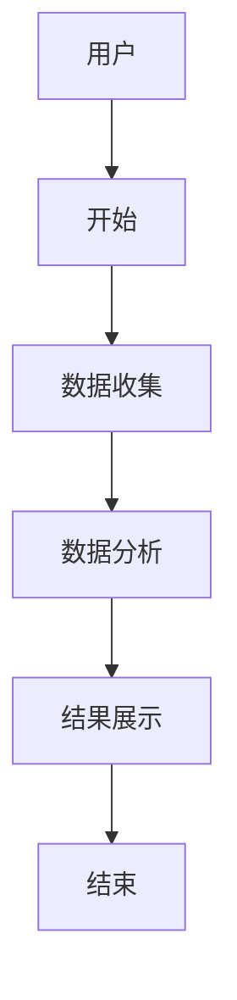

                 


# 彼得林奇对公司供应链韧性的定量评估方法

**关键词**：供应链韧性、定量评估、彼得林奇、投资哲学、风险管理

**摘要**：本文探讨了彼得林奇的投资哲学在供应链韧性评估中的应用，详细介绍了供应链韧性的概念、定量评估的方法，以及如何通过数学模型和算法进行系统分析。文章结合实际案例，展示了如何在企业中应用这些方法，以提升供应链的弹性和恢复能力。

---

## 第1章 供应链韧性与定量评估的背景介绍

### 1.1 供应链韧性的概念与重要性

#### 1.1.1 供应链韧性的定义
供应链韧性是指供应链在面对 disruptions（中断）时，能够维持或恢复正常运作的能力。它包括了弹性、恢复力和冗余度等多个方面。

#### 1.1.2 供应链韧性的重要性
供应链是企业运营的核心，其韧性直接影响企业的成本、效率和市场响应能力。在当今全球化和不确定性的环境下，供应链韧性尤为重要。

#### 1.1.3 供应链韧性与企业绩效的关系
研究表明，具有强韧性的供应链能够帮助企业更快地从危机中恢复，并抓住市场机会。

---

### 1.2 彼得林奇视角下的供应链分析

#### 1.2.1 彼得林奇的投资哲学与供应链管理
彼得林奇以长期投资和基本面分析闻名，他强调对企业运营的理解，尤其是供应链管理，是企业价值的重要组成部分。

#### 1.2.2 供应链韧性对企业价值的影响
供应链韧性直接影响企业的抗风险能力和长期盈利能力。彼得林奇认为，供应链的稳定性是企业长期投资价值的关键因素之一。

#### 1.2.3 供应链风险管理的彼得林奇方法
彼得林奇强调通过 diversification（多元化）和 redundancy（冗余）来降低供应链风险。

---

### 1.3 供应链韧性定量评估的必要性

#### 1.3.1 定量评估的意义
定量评估能够帮助企业量化供应链的弹性、恢复力和冗余度，从而制定更科学的供应链管理策略。

#### 1.3.2 定量评估的挑战
数据收集的复杂性、模型的准确性以及如何平衡成本与收益是主要挑战。

#### 1.3.3 定量评估的边界与外延
供应链韧性评估不仅关注内部流程，还包括外部合作伙伴和市场环境。

---

## 第2章 供应链韧性定量评估的核心模型

### 2.1 供应链韧性评估的数学模型

#### 2.1.1 波动性分析模型
波动性是衡量供应链弹性的重要指标。公式为：
$$ \text{波动性} = \sqrt{\frac{1}{n}\sum_{i=1}^{n}(x_i - \mu)^2} $$
其中，\( x_i \) 是数据点，\( \mu \) 是平均值。

#### 2.1.2 恢复力指数模型
恢复力指数衡量供应链在中断后的恢复速度：
$$ \text{恢复力指数} = \frac{\text{恢复时间}}{\text{中断时间}} $$

#### 2.1.3 冗余度评估模型
冗余度通过备用供应商和库存水平来衡量。

---

### 2.2 供应链韧性评估的算法原理

#### 2.2.1 算法流程图（Mermaid）



#### 2.2.2 算法实现的Python代码

```python
import numpy as np

def calculate_fluctuation(data):
    mu = np.mean(data)
    variance = np.mean((data - mu)**2)
    return np.sqrt(variance)

data = [10, 20, 30, 40, 50]
fluctuation = calculate_fluctuation(data)
print(fluctuation)
```

---

## 第3章 供应链韧性评估的系统分析与架构设计

### 3.1 问题场景介绍

#### 3.1.1 供应链韧性评估的典型问题
企业如何量化供应链的弹性、恢复力和冗余度？

#### 3.1.2 供应链韧性评估的项目目标
开发一个能够量化供应链韧性的评估系统。

#### 3.1.3 供应链韧性评估的项目范围
包括数据收集、模型开发和结果可视化。

---

### 3.2 系统功能设计

#### 3.2.1 数据收集模块
收集供应商、生产过程和物流的数据。

#### 3.2.2 数据分析模块
应用波动性分析和恢复力指数模型进行评估。

#### 3.2.3 可视化展示模块
以图表形式展示评估结果。

---

### 3.3 系统架构设计

#### 3.3.1 系统架构图（Mermaid）



#### 3.3.2 系统接口设计
API接口用于数据输入和输出。

#### 3.3.3 系统交互流程图（Mermaid）



---

## 第4章 供应链韧性定量评估的项目实战

### 4.1 环境安装与数据准备

#### 4.1.1 环境搭建
安装Python和必要的库（如numpy、pandas）。

#### 4.1.2 数据收集与预处理
从供应商和物流数据中提取关键指标。

#### 4.1.3 数据

---

### 4.2 核心代码实现

#### 4.2.1 核心代码

```python
import numpy as np

def calculate_fluctuation(data):
    mu = np.mean(data)
    variance = np.mean((data - mu)**2)
    return np.sqrt(variance)

data = [10, 20, 30, 40, 50]
fluctuation = calculate_fluctuation(data)
print(fluctuation)
```

---

### 4.3 案例分析

#### 4.3.1 案例介绍
分析某科技公司的供应链韧性。

#### 4.3.2 应用模型进行评估
计算波动性和恢复力指数，提出优化建议。

---

## 第5章 最佳实践、小结与拓展阅读

### 5.1 小结
本文介绍了彼得林奇的投资哲学在供应链韧性评估中的应用，详细讲解了数学模型和系统架构。

### 5.2 注意事项
数据质量和模型选择是关键。

### 5.3 拓展阅读
推荐相关书籍和资源。

---

## 作者

作者：AI天才研究院/AI Genius Institute & 禅与计算机程序设计艺术 /Zen And The Art of Computer Programming

