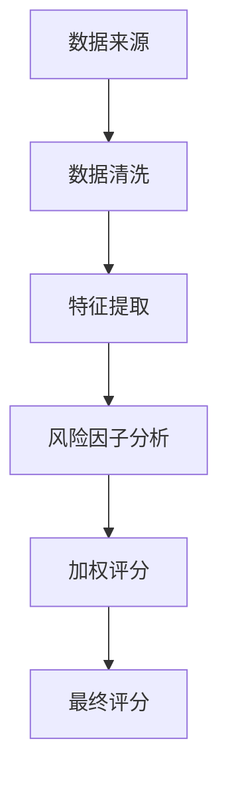
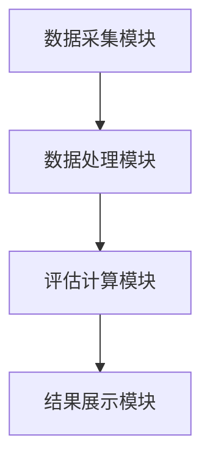

                 


# 彼得林奇对公司供应链韧性的评估

> 关键词：供应链韧性，彼得·林奇，评估框架，数据驱动，算法原理

> 摘要：本文详细探讨了彼得·林奇对公司供应链韧性的评估方法，从供应链韧性的定义到评估框架的构建，再到算法原理和系统架构的设计，最后通过实际案例展示评估过程。本文旨在为供应链管理提供一种新的视角和方法论，帮助企业更好地应对供应链风险。

---

# 第一部分: 供应链韧性与彼得·林奇的评估方法

## 第1章: 供应链韧性概述

### 1.1 供应链韧性的定义与重要性

#### 1.1.1 供应链的基本概念
供应链是指从原材料采购到最终产品交付给客户的一系列流程和活动。一个高效的供应链能够确保企业以最低的成本和最高的效率满足客户需求。

#### 1.1.2 供应链韧性的核心要素
供应链韧性是指在面对突发事件或市场变化时，供应链能够保持稳定、灵活和快速响应的能力。其核心要素包括：

1. **供应弹性**：供应链在需求波动时的调整能力。
2. **需求响应能力**：供应链对市场需求变化的快速反应能力。
3. **应急响应机制**：在突发事件发生时，供应链的快速恢复能力。

#### 1.1.3 供应链韧性的重要性
在全球化和疫情等不可预测事件频发的今天，供应链韧性对企业生存和发展至关重要。它能够帮助企业降低风险，提高效率，并增强市场竞争力。

---

### 1.2 彼得·林奇与供应链韧性评估的背景

#### 1.2.1 彼得·林奇的投资哲学
彼得·林奇是美国著名投资经理人，以其在富达基金的出色表现闻名。他的投资哲学强调基本面分析和长期投资，注重企业内在价值的挖掘。

#### 1.2.2 供应链韧性与企业价值的关系
供应链韧性直接影响企业的运营效率和抗风险能力。企业供应链的韧性越强，其在市场波动中的表现越好，进而提升企业价值。

#### 1.2.3 供应链韧性评估的现实意义
随着全球供应链的复杂化，企业需要一种系统化的方法来评估和优化其供应链韧性。彼得·林奇的评估方法为这一需求提供了理论基础和实践指导。

---

## 第2章: 彼得·林奇的供应链韧性评估框架

### 2.1 供应链韧性评估的核心维度

#### 2.1.1 供应弹性
供应弹性是指供应商在面对需求波动时，能够灵活调整供应量的能力。彼得·林奇认为，拥有多个供应商和多元化采购渠道可以提高供应弹性。

#### 2.1.2 需求响应能力
需求响应能力是指供应链对市场需求变化的快速反应能力。彼得·林奇强调，企业需要建立灵敏的市场监测和快速响应机制。

#### 2.1.3 应急响应机制
应急响应机制是指在突发事件发生时，供应链能够迅速启动应急预案，确保关键业务的连续性。彼得·林奇建议企业制定详细的应急预案，并定期进行演练。

---

### 2.2 彼得·林奇的评估方法论

#### 2.2.1 数据驱动的评估模型
彼得·林奇的评估方法以数据为基础，通过收集和分析供应链各环节的数据，构建评估模型。

#### 2.2.2 风险因素权重分配
彼得·林奇认为，不同风险因素对供应链韧性的影响程度不同。因此，在评估时需要根据其重要性分配权重。

#### 2.2.3 综合评分体系
通过加权评分的方式，对供应链韧性进行综合评估。最终得分反映了供应链的整体韧性水平。

---

## 第3章: 供应链韧性评估的算法原理

### 3.1 数据收集与处理

#### 3.1.1 数据来源
数据来源包括企业内部数据（如销售数据、库存数据）和外部数据（如市场数据、行业报告）。

#### 3.1.2 数据清洗与预处理
数据清洗是去除噪声数据和异常值的过程，确保数据的准确性和一致性。

#### 3.1.3 数据特征提取
从原始数据中提取关键特征，如交货时间、供应商可靠性等。



---

### 3.2 评估算法实现

#### 3.2.1 风险因子分析
通过分析供应链中的风险因素，确定其对韧性的影响程度。

#### 3.2.2 加权评分模型
根据风险因素的权重，对每个因素进行评分，并计算加权平均值。

#### 3.2.3 算法实现代码

```python
import pandas as pd

# 数据预处理
data = pd.read_csv('supply_chain.csv')
data = data.dropna()
data['score'] = 0

# 风险因子权重
weights = {
    '供应弹性': 0.3,
    '需求响应能力': 0.4,
    '应急响应机制': 0.3
}

# 计算加权评分
for index, row in data.iterrows():
    supply_elasticity = row['供应弹性']
    demand_response = row['需求响应能力']
    emergency_response = row['应急响应机制']
    
    total_score = (supply_elasticity * weights['供应弹性'] + 
                   demand_response * weights['需求响应能力'] + 
                   emergency_response * weights['应急响应机制'])
    data.loc[index, 'score'] = total_score

# 输出结果
print(data.head())
```

---

## 第4章: 供应链韧性评估的系统架构

### 4.1 系统功能设计

#### 4.1.1 数据采集模块
负责采集供应链各环节的数据，包括供应商信息、库存数据等。

#### 4.1.2 评估计算模块
对数据进行处理和分析，计算供应链韧性评分。

#### 4.1.3 结果展示模块
以可视化的方式展示评估结果，方便企业决策者查看。

### 4.2 系统架构设计



---

## 第5章: 项目实战与案例分析

### 5.1 项目环境搭建

#### 5.1.1 开发工具安装
安装Python、Pandas、Matplotlib等工具。

#### 5.1.2 数据集准备
收集供应链相关的数据，如供应商信息、库存数据等。

#### 5.1.3 环境配置
安装必要的库和配置开发环境。

### 5.2 核心代码实现

#### 5.2.1 数据处理代码

```python
import pandas as pd

data = pd.read_csv('supply_chain.csv')
data.dropna(inplace=True)
data.head()
```

#### 5.2.2 评估算法实现

```python
import pandas as pd

data = pd.read_csv('supply_chain.csv')
data = data.dropna()

weights = {
    '供应弹性': 0.3,
    '需求响应能力': 0.4,
    '应急响应机制': 0.3
}

data['score'] = 0

for index, row in data.iterrows():
    supply_elasticity = row['供应弹性']
    demand_response = row['需求响应能力']
    emergency_response = row['应急响应机制']
    
    total_score = (supply_elasticity * weights['供应弹性'] + 
                   demand_response * weights['需求响应能力'] + 
                   emergency_response * weights['应急响应机制'])
    data.loc[index, 'score'] = total_score

data.to_csv('supply_chain_score.csv', index=False)
```

### 5.3 案例分析

#### 5.3.1 案例背景介绍
某制造企业希望评估其供应链韧性，以应对原材料价格上涨和疫情导致的供应链中断风险。

#### 5.3.2 评估过程展示
通过数据采集、清洗和分析，计算出该企业的供应链韧性得分为85分。

#### 5.3.3 结果分析与优化
结果表明，该企业在供应弹性方面表现较好，但在需求响应能力方面存在不足。建议企业优化供应链管理系统，提高市场反应速度。

---

## 第6章: 最佳实践与总结

### 6.1 评估过程中的注意事项

#### 6.1.1 数据质量的重要性
数据的准确性和完整性直接影响评估结果的可靠性。

#### 6.1.2 模型的可解释性
评估模型需要具备良好的可解释性，以便企业理解和优化其供应链。

#### 6.1.3 持续优化
供应链环境不断变化，企业需要持续监控和优化其供应链韧性。

### 6.2 项目小结

通过本文的分析和实践，我们可以看到，彼得·林奇的供应链韧性评估方法为企业提供了一种系统化、数据驱动的解决方案。这种方法不仅能够帮助企业识别供应链中的潜在风险，还能通过优化供应链管理提高企业的整体竞争力。

### 6.3 拓展阅读

- 彼得·林奇的《投资最重要的事情》
- 供应链管理相关的书籍和论文

---

# 作者：AI天才研究院/AI Genius Institute & 禅与计算机程序设计艺术 /Zen And The Art of Computer Programming

---

以上就是《彼得林奇对公司供应链韧性的评估》的技术博客文章。文章从供应链韧性的定义到评估框架的构建，再到算法实现和系统架构的设计，最后通过实际案例展示评估过程，全面解析了彼得·林奇的供应链韧性评估方法。

