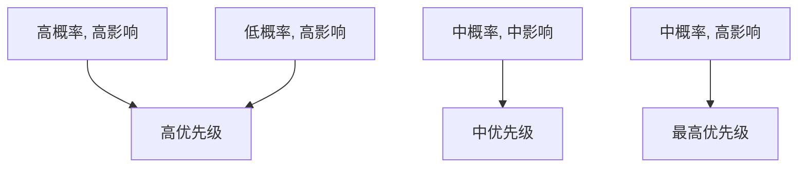
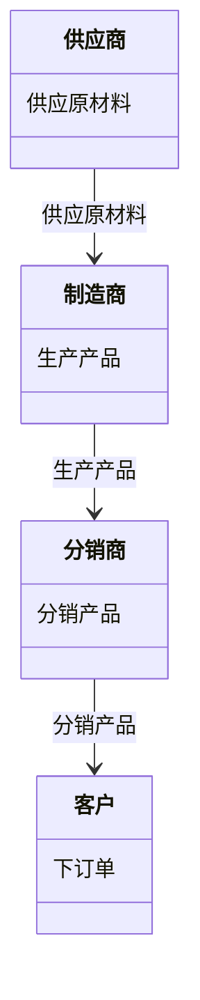
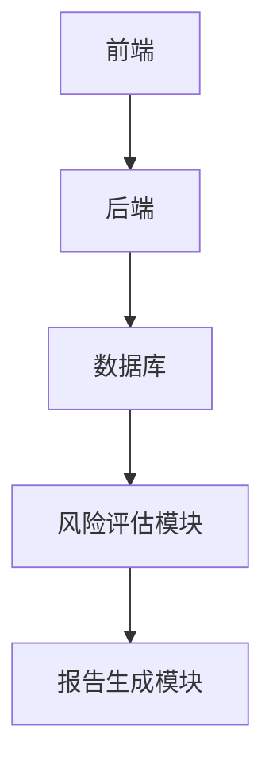

                 


# 彼得林奇对公司供应链风险的评估

> 关键词：彼得·林奇，供应链风险管理，风险评估模型，企业运营，供应链优化

> 摘要：本文将深入探讨彼得·林奇对公司供应链风险的评估方法。通过分析供应链的基本概念、风险类型以及彼得·林奇的理论基础，结合实际案例和系统架构设计，详细介绍如何运用彼得·林奇的供应链风险管理方法进行风险评估和优化。文章内容涵盖供应链风险评估的背景、核心概念、算法原理、系统架构设计、项目实战及最佳实践，旨在为企业提供一套完整的供应链风险管理解决方案。

---

## 第一部分: 供应链风险评估的背景与基础

### 第1章: 供应链的基本概念与风险类型

#### 1.1 供应链的基本概念
##### 1.1.1 供应链的定义与组成部分
供应链是指从供应商到消费者的整个流程，包括原材料采购、生产、物流、分销和最终交付给客户。供应链的核心组成部分包括供应商、制造商、分销商、零售商和客户。

##### 1.1.2 供应链的运作模式
供应链的运作模式可以分为推动式和拉动式两种。推动式供应链是基于预测进行生产，而拉动式供应链则是根据实际需求进行生产和分销。

##### 1.1.3 供应链的重要性与挑战
供应链是企业运营的核心，直接影响企业的成本、效率和客户满意度。然而，供应链也面临诸多挑战，如原材料价格波动、物流延迟、供应商风险等。

#### 1.2 供应链风险的类型
##### 1.2.1 供应风险
供应风险是指由于供应商的问题导致供应链中断的风险，例如供应商无法按时交付或原材料短缺。

##### 1.2.2 需求风险
需求风险是指由于市场需求波动导致供应链无法满足需求的风险，例如需求预测不准确或市场需求突然下降。

##### 1.2.3 运营风险
运营风险是指由于内部运营管理不当导致的供应链问题，例如生产效率低下或库存管理不善。

##### 1.2.4 市场风险
市场风险是指由于市场环境变化导致的供应链风险，例如市场价格波动或政策变化。

##### 1.2.5 政治与法律风险
政治与法律风险是指由于政治不稳定或法律法规变化导致的供应链风险，例如国际贸易摩擦或环保法规的加强。

---

### 第2章: 彼得·林奇的供应链风险评估理论基础

#### 2.1 彼得·林奇的供应链管理思想
##### 2.1.1 彼得·林奇的供应链管理理念
彼得·林奇在其著作中提出，供应链管理的核心是通过优化供应链的各个环节，降低风险并提高效率。他强调，供应链管理不仅仅是采购和物流的问题，而是涉及整个企业运营的战略问题。

##### 2.1.2 彼得·林奇的供应链风险评估方法
彼得·林奇提出了一个基于概率和影响的供应链风险评估方法。他认为，风险评估的核心是识别潜在风险，并通过量化风险的概率和影响来确定风险的优先级。

##### 2.1.3 彼得·林奇理论的适用性与局限性
彼得·林奇的理论适用于大多数行业，但由于其理论主要基于传统的供应链管理模式，可能不完全适用于数字化和全球化的现代供应链。

---

### 第3章: 供应链风险评估的背景与应用

#### 3.1 供应链风险评估的背景
##### 3.1.1 供应链风险的全球化背景
随着全球化的发展，供应链的复杂性增加，风险来源也变得更加多样。企业需要更加关注供应链的风险管理。

##### 3.1.2 数字化时代对供应链的影响
数字化技术（如大数据、人工智能）的应用使得供应链管理更加智能化，同时也带来了新的风险，例如数据安全风险。

##### 3.1.3 供应链风险管理的必要性
供应链风险管理是企业降低运营成本、提高效率和增强竞争力的重要手段。通过有效的风险管理，企业可以更好地应对市场波动和突发事件。

#### 3.2 供应链风险评估的应用领域
##### 3.2.1 制造业供应链
制造业供应链的风险管理尤为重要，因为制造业的生产过程涉及多个环节，任何一个环节出现问题都会影响整个生产流程。

##### 3.2.2 零售业供应链
零售业供应链的风险管理主要集中在库存管理和需求预测上。通过有效的风险管理，零售企业可以更好地满足客户需求并减少库存积压。

##### 3.2.3 信息技术供应链
信息技术供应链的风险管理主要关注供应链的安全性和稳定性。例如，芯片制造业的供应链中断可能会影响整个信息技术产业。

##### 3.2.4 金融供应链
金融供应链的风险管理涉及金融市场的波动和金融产品的风险评估。有效的风险管理可以帮助金融机构更好地应对市场风险。

---

## 第二部分: 供应链风险评估的核心概念与联系

### 第4章: 供应链风险评估的核心概念

#### 4.1 风险评估的核心要素
##### 4.1.1 风险来源
供应链风险的来源可以分为内部风险和外部风险。内部风险包括生产效率低下、库存管理不善等；外部风险包括原材料价格上涨、物流延迟等。

##### 4.1.2 风险概率
风险概率是指某个风险发生的可能性。通过分析历史数据和市场趋势，可以量化风险概率。

##### 4.1.3 风险影响
风险影响是指某个风险发生后对企业的影响程度。影响程度可以通过对企业成本、效率和客户满意度的综合评估来确定。

##### 4.1.4 风险应对策略
根据风险的概率和影响，可以制定不同的应对策略，例如风险规避、风险降低、风险转移和风险接受。

#### 4.2 风险评估的核心概念对比

| 风险类型 | 风险概率 | 风险影响 | 应对策略 |
|----------|----------|----------|----------|
| 供应风险 | 高       | 高       | 多元化供应商 |
| 需求风险 | 中       | 中       | 灵活生产计划 |
| 运营风险 | 低       | 高       | 提高生产效率 |
| 市场风险 | 中       | 中       | 多元化市场 |
| 政治风险 | 低       | 高       | 政策合规 |

#### 4.3 风险评估的ER实体关系图

```mermaid
erDiagram
    actor 顾客
    actor 供应商
    actor 制造商
    actor 分销商
    node 产品
    node 订单
    node 交付
    node 风险
    顾客 --> 订单 : 下订单
    订单 --> 产品 : 订单产品
    产品 --> 交付 : 发货
    交付 --> 顾客 : 收到货物
    供应商 --> 制造商 : 供应原材料
    制造商 --> 分销商 : 发货
    分销商 --> 顾客 : 分销产品
    风险 --> 供应商 : 供应风险
    风险 --> 制造商 : 运营风险
    风险 --> 分销商 : 分销风险
```

---

### 第5章: 供应链风险评估的算法原理

#### 5.1 风险评估的定量分析方法
##### 5.1.1 风险概率计算
风险概率可以通过历史数据分析和市场趋势预测来计算。例如，使用贝叶斯定理进行概率计算：

$$ P(A|B) = \frac{P(B|A)P(A)}{P(B)} $$

其中，$P(A|B)$ 是在事件 $B$ 发生的情况下，事件 $A$ 发生的概率。

##### 5.1.2 风险影响分析
风险影响可以通过对企业成本、效率和客户满意度的影响程度来评估。例如，使用层次分析法（AHP）进行影响分析：

$$ w_i = \frac{w_i}{\sum w_i} \times 100 $$

其中，$w_i$ 是各个影响因素的权重。

##### 5.1.3 风险优先级排序
根据风险概率和影响，可以将风险进行优先级排序。例如，使用风险矩阵进行排序：



#### 5.2 优化模型与算法
##### 5.2.1 线性规划模型
线性规划模型可以用于优化供应链的成本和效率。例如，使用线性规划模型进行库存优化：

$$ \text{Minimize } Z = \sum c_i x_i $$
$$ \text{Subject to } \sum a_i x_i = b $$
$$ x_i \geq 0 $$

其中，$c_i$ 是库存成本，$x_i$ 是库存量，$a_i$ 是约束条件系数，$b$ 是约束条件常数。

##### 5.2.2 风险评估的数学模型
风险评估的数学模型可以表示为：

$$ R = \sum (P_i \times I_i) $$

其中，$R$ 是总风险，$P_i$ 是风险 $i$ 的概率，$I_i$ 是风险 $i$ 的影响。

---

## 第三部分: 供应链风险评估的系统分析与架构设计

### 第6章: 供应链风险评估的系统架构设计

#### 6.1 系统功能设计
##### 6.1.1 风险评估模块
风险评估模块负责对供应链的各个环节进行风险评估，包括供应风险、需求风险和运营风险。

##### 6.1.2 数据采集模块
数据采集模块负责收集供应链各个环节的数据，包括供应商信息、生产数据和物流数据。

##### 6.1.3 数据分析模块
数据分析模块负责对收集到的数据进行分析，生成风险评估报告。

##### 6.1.4 报告生成模块
报告生成模块负责生成风险评估报告，并提供风险应对策略。

#### 6.2 系统架构设计
##### 6.2.1 领域模型
领域模型展示了供应链系统的主要组成部分，包括供应商、制造商、分销商和客户。



##### 6.2.2 系统架构图
系统架构图展示了供应链系统的整体架构，包括前端、后端和数据库。



---

## 第四部分: 供应链风险评估的项目实战

### 第7章: 项目实战

#### 7.1 项目环境与工具安装
##### 7.1.1 开发环境
推荐使用PyCharm作为开发环境，安装Python 3.8及以上版本。

##### 7.1.2 工具安装
安装必要的库，例如numpy、pandas、scikit-learn和matplotlib。

#### 7.2 核心代码实现
##### 7.2.1 风险概率计算
```python
import numpy as np
import pandas as pd

# 假设我们有历史数据
data = {
    '事件': ['供应中断', '需求下降', '生产延迟'],
    '概率': [0.2, 0.3, 0.1]
}
df = pd.DataFrame(data)

# 计算期望风险
expected_risk = np.sum(df['概率'] * df['事件'])
print("期望风险:", expected_risk)
```

##### 7.2.2 风险影响分析
```python
from sklearn.metrics import pairwise_distances
import matplotlib.pyplot as plt

# 假设我们有影响因素的数据
X = np.array([[2, 3], [4, 5], [6, 7]])

# 计算影响分析
distances = pairwise_distances(X)
plt.imshow(distances, cmap='hot')
plt.colorbar()
plt.show()
```

##### 7.2.3 风险优先级排序
```python
data = {
    '风险': ['供应中断', '需求下降', '生产延迟'],
    '概率': [0.2, 0.3, 0.1],
    '影响': [3, 2, 4]
}

df = pd.DataFrame(data)
df['优先级'] = df['概率'] * df['影响']
df.sort_values('优先级', ascending=False, inplace=True)
print(df)
```

#### 7.3 案例分析与结果解读
##### 7.3.1 案例分析
以某制造企业为例，分析其供应链风险。通过数据采集和分析，发现其主要风险是供应中断和生产延迟。

##### 7.3.2 结果解读
根据风险优先级排序，供应中断的风险最高，其次是需求下降，最后是生产延迟。企业需要优先解决供应中断的问题。

---

## 第五部分: 供应链风险评估的最佳实践

### 第8章: 最佳实践与小结

#### 8.1 最佳实践
##### 8.1.1 定期进行风险评估
企业应定期进行供应链风险评估，及时发现潜在风险。

##### 8.1.2 建立应急预案
针对高优先级的风险，企业应建立应急预案，以快速应对突发事件。

##### 8.1.3 优化供应链结构
通过优化供应链结构，例如多元化供应商和灵活的生产计划，可以降低供应链风险。

#### 8.2 小结
供应链风险管理是企业运营的重要组成部分。通过彼得·林奇的供应链风险管理方法，企业可以更好地识别和应对供应链风险，提高企业的竞争力和抗风险能力。

---

## 第六部分: 注意事项与拓展阅读

### 第9章: 注意事项与拓展阅读

#### 9.1 注意事项
##### 9.1.1 数据准确性
风险评估的结果依赖于数据的准确性，企业需要确保数据的来源可靠。

##### 9.1.2 方法适用性
彼得·林奇的方法适用于大多数行业，但在某些特殊情况下可能需要进行调整。

#### 9.2 拓展阅读
##### 9.2.1 供应链管理经典书籍
推荐阅读《供应链管理：战略、规划与操作》和《彼得·林奇的投资哲学》。

##### 9.2.2 相关学术论文
推荐查阅供应链风险管理领域的最新学术论文，以获取更多的理论支持。

---

## 作者

作者：AI天才研究院/AI Genius Institute & 禅与计算机程序设计艺术/Zen And The Art of Computer Programming

