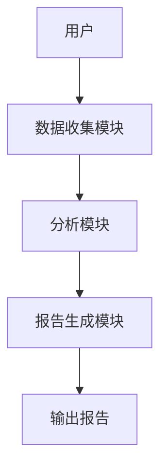

                 


# 彼得林奇对公司债务结构的分析

> 关键词：彼得林奇，公司债务，债务结构，财务分析，投资策略

> 摘要：本文详细分析了彼得·林奇在公司债务结构分析中的独特方法和见解，探讨了债务结构的核心概念、数学模型、系统设计以及实际案例分析，帮助读者深入了解如何通过债务结构分析优化投资决策。

---

# 第1章：公司债务结构分析的背景与重要性

## 1.1 什么是公司债务结构

### 1.1.1 公司债务的定义与分类

公司债务是指企业为维持运营或扩展业务而借入的资金，通常以债券、贷款或其他金融工具的形式存在。公司债务可以分为以下几类：

- **短期债务**：期限通常在一年以内，如短期贷款和应付账款。
- **长期债务**：期限通常超过一年，如长期债券和抵押贷款。
- **无息债务**：如某些政府债券，不产生利息支出。
- **有息债务**：如商业贷款，需要定期支付利息。

### 1.1.2 债务结构在公司财务中的地位

债务结构是公司资本结构的重要组成部分，直接影响企业的财务健康和信用评级。合理的债务结构能够优化资本成本，提高企业抗风险能力，而过高的债务负担可能导致企业陷入财务危机。

### 1.1.3 债务与企业价值的关系

债务与企业价值的关系可以通过**杠杆效应**来解释。适度的杠杆能够放大企业收益，但过高杠杆会增加财务风险，降低企业价值。

---

## 1.2 彼得林奇与公司债务分析

### 1.2.1 彼得林奇的投资者背景与投资理念

彼得·林奇是美国著名投资经理，以其在富达投资管理公司的长期任职中创造了卓越的投资业绩而闻名。他强调基本面分析，注重企业的财务健康和管理层质量。

### 1.2.2 彼得林奇对公司债务分析的独特视角

彼得林奇认为，债务结构是评估企业财务健康的重要指标。他特别关注企业的**债务规模**、**期限结构**和**利率水平**，以判断企业在不同经济周期中的偿债能力。

### 1.2.3 债务分析在彼得林奇投资策略中的作用

在彼得林奇的投资策略中，债务分析是筛选优质企业的关键步骤。他通过分析企业的债务结构，识别那些能够稳定偿还债务、具有强大现金流的企业。

---

## 1.3 债务结构分析的现实意义

### 1.3.1 债务结构对企业财务健康的影响

合理的债务结构能够优化资本成本，提高企业抗风险能力。例如，短期债务适合用于日常运营资金，而长期债务适合用于固定资产投资。

### 1.3.2 债务结构对投资者决策的价值

通过分析公司的债务结构，投资者可以更好地评估企业的财务风险和偿债能力，从而做出更明智的投资决策。

### 1.3.3 债务结构分析在经济周期中的应用

在经济衰退期间，债务负担过重的企业可能面临破产风险。因此，分析债务结构在经济周期中的适应性至关重要。

---

# 第2章：公司债务结构的核心要素

## 2.1 债务的构成要素

### 2.1.1 债务的种类：短期债务与长期债务

- **短期债务**：如流动资金贷款，通常用于支付日常运营费用。
- **长期债务**：如长期债券，通常用于固定资产投资。

### 2.1.2 债务的利率：固定利率与浮动利率

- **固定利率债务**：利息固定，不受市场利率波动影响。
- **浮动利率债务**：利息随市场利率变化，适合对利率变动敏感的企业。

### 2.1.3 债务的期限：短期、中期与长期债务

- **短期债务**：期限通常在一年以内，流动性高。
- **中期债务**：期限通常为1-5年，适合用于特定项目投资。
- **长期债务**：期限通常超过5年，适合用于长期资产投资。

---

## 2.2 债务结构的衡量指标

### 2.2.1 债务比率

债务比率是衡量企业债务负担的重要指标，常用的债务比率包括：

- **负债总额**：企业所有负债的总和。
- **资产总额**：企业所有资产的总和。

公式：
$$
\text{债务比率} = \frac{\text{负债总额}}{\text{资产总额}}
$$

### 2.2.2 利息覆盖率

利息覆盖率是衡量企业偿债能力的重要指标，计算公式为：

$$
\text{利息覆盖率} = \frac{\text{EBITDA}}{\text{利息支出}}
$$

其中，EBITDA是息税折旧及摊销前利润，利息支出是企业需要支付的债务利息。

---

## 2.3 彼得林奇的债务结构分析框架

### 2.3.1 债务规模与企业规模的匹配

彼得林奇认为，债务规模应与企业规模和现金流相匹配，避免过度杠杆化。

### 2.3.2 债务期限与企业现金流的匹配

短期债务适合用于日常运营，长期债务适合用于固定资产投资。

### 2.3.3 债务利率与市场利率的对比

彼得林奇关注债务利率与市场利率的对比，寻找具有息差优势的企业。

---

# 第3章：公司债务结构分析的核心模型与工具

## 3.1 债务结构分析的基本模型

### 3.1.1 债务比率分析模型

通过计算债务比率和利息覆盖率，评估企业的偿债能力。

### 3.1.2 利息覆盖率分析模型

通过分析利息覆盖率，判断企业偿还债务利息的能力。

### 3.1.3 偿债能力综合评价模型

结合债务比率和利息覆盖率，综合评价企业的偿债能力。

---

## 3.2 彼得林奇的债务风险评估模型

### 3.2.1 债务风险的定义与衡量

债务风险是指企业在偿还债务时可能面临的困难，通常通过债务规模、期限和利率等指标衡量。

### 3.2.2 彼得林奇债务风险评分系统

彼得林奇通过对企业债务规模、期限和利率的综合分析，制定债务风险评分系统。

### 3.2.3 债务风险与企业信用评级的关系

债务风险评分与企业信用评级密切相关，信用评级越高，债务成本越低。

---

## 3.3 债务结构分析的可视化工具

### 3.3.1 债务结构饼图分析

通过饼图展示企业债务的构成比例。

### 3.3.2 债务期限分布柱状图

通过柱状图展示债务的期限分布情况。

### 3.3.3 债务成本与市场利率的对比曲线图

通过曲线图展示债务成本与市场利率的对比情况。

---

# 第4章：彼得林奇债务结构分析的算法与数学模型

## 4.1 债务比率计算公式

### 4.1.1 负债总额计算公式

$$
\text{负债总额} = \text{流动负债} + \text{非流动负债}
$$

### 4.1.2 债务比率计算公式

$$
\text{债务比率} = \frac{\text{负债总额}}{\text{资产总额}}
$$

### 4.1.3 利息覆盖率计算公式

$$
\text{利息覆盖率} = \frac{\text{EBITDA}}{\text{利息支出}}
$$

---

## 4.2 彼得林奇债务风险评估算法

### 4.2.1 算法步骤

1. 收集企业财务数据，包括负债总额、资产总额、EBITDA和利息支出。
2. 计算债务比率和利息覆盖率。
3. 根据彼得林奇的评分系统，评估债务风险。

### 4.2.2 Python代码实现

```python
# 示例代码：计算债务比率和利息覆盖率
def calculate_debt_ratio(liabilities, assets):
    return liabilities / assets

def calculate_interest_coverage(ebitda, interest_expense):
    return ebitda / interest_expense

# 示例数据
liabilities = 100000000  # 负债总额
assets = 200000000       # 资产总额
ebitda = 50000000        # 息税折旧及摊销前利润
interest_expense = 10000000  # 利息支出

# 计算债务比率和利息覆盖率
debt_ratio = calculate_debt_ratio(liabilities, assets)
interest_coverage = calculate_interest_coverage(ebitda, interest_expense)

print(f"债务比率: {debt_ratio}")
print(f"利息覆盖率: {interest_coverage}")
```

---

# 第5章：系统设计与实现

## 5.1 系统功能设计

### 5.1.1 数据收集模块

负责收集企业的财务数据，包括负债总额、资产总额、EBITDA和利息支出。

### 5.1.2 分析模块

根据彼得林奇的债务结构分析方法，计算债务比率和利息覆盖率，评估债务风险。

### 5.1.3 报告生成模块

生成债务结构分析报告，包括图表和评分。

---

## 5.2 系统架构设计



---

## 5.3 系统接口设计

### 5.3.1 数据输入接口

接收企业的财务数据，包括负债总额、资产总额、EBITDA和利息支出。

### 5.3.2 数据分析接口

调用分析模块，计算债务比率和利息覆盖率。

### 5.3.3 报告生成接口

生成债务结构分析报告，包括图表和评分。

---

# 第6章：项目实战

## 6.1 实战背景

以苹果公司为例，分析其债务结构，评估其财务健康状况。

---

## 6.2 数据收集

收集苹果公司的财务数据，包括负债总额、资产总额、EBITDA和利息支出。

---

## 6.3 数据分析

使用彼得林奇的债务结构分析方法，计算债务比率和利息覆盖率。

---

## 6.4 结果解读

分析苹果公司的债务结构，评估其财务健康状况。

---

## 6.5 代码实现

```python
# 示例代码：苹果公司债务结构分析
liabilities = 12000000000  # 负债总额
assets = 30000000000      # 资产总额
ebitda = 10000000000       # 息税折旧及摊销前利润
interest_expense = 500000000  # 利息支出

debt_ratio = liabilities / assets
interest_coverage = ebitda / interest_expense

print(f"债务比率: {debt_ratio}")
print(f"利息覆盖率: {interest_coverage}")
```

---

## 6.6 结果分析

通过计算，苹果公司的债务比率为0.4，利息覆盖率为20。这表明苹果公司财务健康，债务风险较低。

---

# 第7章：最佳实践、小结与注意事项

## 7.1 最佳实践

- 定期监控企业的债务结构，及时调整。
- 结合经济周期，合理配置债务期限。
- 选择合适的债务工具，优化资本成本。

## 7.2 小结

彼得林奇的债务结构分析方法为我们提供了一套科学的投资决策工具。通过分析企业的债务结构，投资者可以更好地评估企业的财务健康和投资价值。

## 7.3 注意事项

- 债务结构分析需要结合企业的具体情况。
- 债务分析是投资决策的重要参考，但不是唯一因素。
- 注意市场环境的变化，及时调整债务结构。

---

# 附录：拓展阅读

## 附录A：相关书籍推荐

1. 《彼得林奇选股艺术》
2. 《财务报表分析》
3. 《投资学》

## 附录B：常用财务指标公式

- **负债总额** = 流动负债 + 非流动负债
- **资产总额** = 流动资产 + 非流动资产
- **EBITDA** = 息税折旧及摊销前利润
- **利息支出** = 债务利息支出

---

# 作者信息

作者：AI天才研究院/AI Genius Institute & 禅与计算机程序设计艺术 /Zen And The Art of Computer Programming

---

# END

